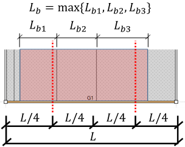
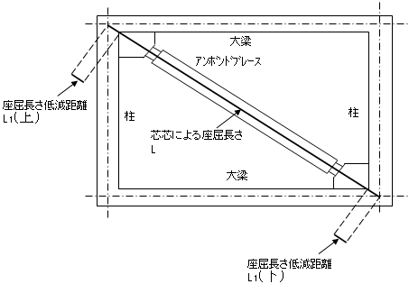

## 準拠する基準等

準拠する基準等は以下の通りです。
-   建築基準法・同施行令・告示等

-   建築物の構造規定（日本建築センター編）（1997年版）

-   鉄筋コンクリート構造計算規準・同解説（1999年,2010年版）

-   鉄骨鉄筋コンクリート構造計算規準・同解説（1987年版）

-   鋼構造設計規準（1973年版）

-   建築耐震設計における保有耐力と変形性能（1990年版）

-   鋼構造塑性設計指針（1975年版）

## 荷重の組合せ

 断面検討は、2007年版建築物の構造関係技術基準解説書（以下、構造規定と記します）により、以下の荷重組合せについて行います。

| 力の種類 | 想定する荷重状態 | 一般の場合 | 多雪区域        |
|:----------:|:------------------:|:------------:|:-----------------:|
| 長期     | 常時             | G＋P       | G＋P            |
|         | 積雪時           |           | G＋P＋δ1・S    |
| 短期     | 積雪時           | G＋P＋S    | G＋P＋S         |
|         | 暴風時           | G＋P＋W    | G＋P＋W         |
|         |                 |           | G＋P＋δ2・S＋W |
|         | 地震時           | G＋P＋E    | G＋P＋δ3・S＋E |

$G$：固定荷重によって生じる応力

$P$：積載荷重によって生じる応力

$S$：雪荷重によって生じる応力

$W$：風圧力によって生じる応力

$E$：地震力によって生じる応力

$δ1$：多雪区域における長期積雪荷重の低減係数で、直接入力することも可能です注1）。デフォルトは0.7とします。

$δ2，δ3$：多雪区域における暴風時および地震時の短期積雪荷重の低減係数で、直接入力できます注1）。デフォルトは0.35とします。

注1)　メインメニュー「荷重・材料」→「積雪荷重」参照。

## 採用応力

 ■モーメント分布

 曲げモーメントの分布は２次曲線と仮定して以下の式で計算します。

$M = M_1+ \frac{(-M_1-M_2+4M_0) \cdot x}{L}- \frac{4M_0x^2}{L^2}$

$M_{1},M_{2}$ ：端部モーメント

$M_{0}$ ：単純梁の中央モーメント

$x$ ：応力採用位置

$L$ ：材長

 

 ■一本部材指定時の採用応力

 大梁において一本部材指定を行った場合のM0は、端部のせん断力と釣り合う荷重が等分布として単純梁に作用したものと仮定した場合のA式もしくは,一本部材とした場合の中央位置におけるモーメントを中央に位置する分割部材の端部モーメントおよびM0から算出した場合のB式のうち、大きい数値を採用します。

 A. $ M_0 = \frac{(Q_1+Q_2) \cdot L}{8} $

 $Q_1,Q_2$ ：端部せん断力

 L ：材長

 $M_1,M_2$ ：一本部材の端部モーメント

 $M_0$ ：一本部材の単純梁中央モーメント

 $M_{c1},M_{c2}$ ：中央部分割部材の端部モーメント

 $M_{c0}$ ：中央部分割部材の単純梁中央モーメント

 $x$ ：中央部分割部材の応力採用位置

 $L$ ：中央部分割部材の材長

 $M_c$ ：一本部材の中央モーメント

 ■大梁直交方向加力時採用応力

 　大梁の採用応力は、<u>各水平荷重加力ケースにおいて最大せん断力が発生するケースを採用応力とします</u>。したがって、加力方向を0°方向・90°方向としていない場合もしくは大梁がX軸、Y軸に平行でない場合には、大梁の方向と異なる加力ケースの応力が採用される場合があります。その場合、計算書出力の断面検定表においてその旨が出力されます。

 　

## 材料強度・許容応力度

### コンクリート

 コンクリートの使用材料は、各階で柱・壁、梁・床ごとに指定できます。コンクリートの材料定数および許容応力度は2010年版RC規準によります。

コンクリートの許容応力度 （N/mm2）

| 種類                     | 長期                                            ||| 短期                                             |||
|--------------------------|:---------:|:------:|:----------------------------------:|:---------------------:|:------:|:-----------------------:|
|                         | 圧縮    | 引張 | せん断                           | 圧縮                | 引張 | せん断                |
| 普通コンクリート         | 1/3・Fc | －   | 1/30・Fcかつ (0.49+1/100・Fc)以下 | 長期に対する 値の2倍 | －   | 長期に対する値の1.5倍 |
| 軽量コンクリート 1種・2種 |        |     | 普通コンクリートに 対する値の0.9倍|                    |     |                      |

コンクリートの付着許容応力度 （N/mm2）

| 種類     | 長期                                                            || 短期                  |
|----------|:--------------------------------:|:---------------------------------:|:-----------------------:|
|         | 上端筋                         | その他の鉄筋                    |                      |
| 異形鉄筋 | 1/15・Fcかつ (0.9+2/75・Fc)以下 | 1/10・Fcかつ (1.35+1/25・Fc)以下 | 長期に対する値の1.5倍 |
| 丸鋼     | 4/100・Fcかつ 0.9以下           | 6/100・Fcかつ 1.35以下           |                      |

RC規準1999付着検討時のコンクリートの付着許容応力度 （N/mm2）

| 種類     | 長期                              || 短期                  |
|----------|:---------------------:|:--------------:|:-----------------------:|
|         | 上端筋              | その他の鉄筋 |                      |
| 異形鉄筋 | 0.8×(1/60・Fc+0.6) | 1/60・Fc+0.6 | 長期に対する値の1.5倍 |
| 丸鋼     |                    |             |                      |

 ・コンクリートの引張応力は無視します。

 ・コンクリートのヤング係数（Ec）、せん断弾性係数（G）は下式によります。

$E_c = 3.35 \cdot10^4 \cdot \left( \frac{\gamma}{24} \right) ^2  \cdot \left( \frac{F_c}{60} \right) ^\frac{1}{3}$

$G = \frac{E_c}{2(1+v)}$

 $E_c$：コンクリートの設計基準強度（N/mm2）

 $G$：コンクリートのせん断弾性係数（N/mm2）

 $γ$：コンクリートの気乾単位体積重量で、鉄筋コンクリートの単位体積重量の数値から1.0を減じた値とする（kN/m3）

 $ν$：ポアソン比（＝0.2）

 ・断面算定においてコンクリートに対する鉄筋のヤング係数比（n）は下表の値とします。なお、非線形解析に用いるnについては各材料の実際のヤング係数から計算されます。

| Fc（N/mm2) | ヤング係数比n |
|--------------|:---------------:|
| Fc≦27       |     15        |
| 27＜Fc≦36   |     13        |
| 36＜Fc≦48   |     11        |
| 48＜Fc≦60   |      9        |
| 60＜Fc≦120  |      7        |

### 鉄筋

 鉄筋の使用材料は階と部位による指定、または鉄筋径ごとの指定が可能です。各指定の優先順位は、鉄筋径ごとの指定が優先となります。したがって、鉄筋径の範囲に定義されていない径についてのみ階と部位による指定が適用されます。

 鉄筋の許容応力度は構造規定によります。高強度せん断補強筋の許容応力度については、メーカーの公称値とします。

鉄筋の許容応力度 （N/mm2）

|             | 長期                       || 短期                     ||
|-------------|:---------------:|:-------------:|:-------------:|:-------------:|
|            | 引張・圧縮    | せん断      | 引張・圧縮  | せん断      |
| SR235       | 155           | 155         | 235         | 235         |
| SR295       | 155           | 195         | 295         | 295         |
| SD295A,B    | 195           | 195         | 295         | 295         |
| SD345       | 215(195\*1) | 195         | 345         | 345         |
| SD390       | 215(195\*1) | 195         | 390         | 390         |
| SD490       | 215(195\*1) | 195         | 490         | 390（ｷｮｳｴｲﾘﾝｸﾞは適用範囲内であれば490） |
| USD685      | 215           | 195         | 685         | 590         |

\*1：D29以上の太さの鉄筋に対しては( )内の数値とします。

高強度せん断補強筋の許容せん断応力度 （N/mm2）

| 製品                                  | 長期 | 短期 | 終局            |
|---------------------------------------|:------:|:------:|:-----------------:|
| ﾘﾊﾞｰﾎﾞﾝ1275【SBPD1275/1420】          | 195  | 585  | 1275（785\*1）|
| ｳﾙﾎﾞﾝ785【UB785】                     | 195  | 590  |  785            |
| ﾘﾊﾞｰﾎﾞﾝ785【KW785】                   | 195  | 590  |  785            |
| ｽﾐﾌｰﾌﾟ，ｽﾄﾛﾝｸﾞﾌｰﾌﾟ，ﾃﾞｰﾌｰﾌﾟ【KSS785】 | 195  | 590  |  785            |
| UHYﾌｰﾌﾟ【SHD685】                     | 195  | 590  |  685            |
| ｴﾇｴｽﾊｲﾃﾞｯｸ685H【HDC685】              | 195  | 590  |  685            |
| ｽｰﾊﾟｰﾌｰﾌﾟ【KH785】                    | 195  | 590  |  785            |

\*1：()内は柱のせん断補強筋として単独で外周ﾌｰﾌﾟに135°ﾌｯｸ閉鎖形を使用する場合の数値です。

高強度せん断補強筋の呼び名の公称直径、最外径、公称断面積、公称周長の対応一覧

| 製品名                                             | 呼び名 | 公称直径\(mm) |  最外径\(mm) | 公称断面積\(cm2) | 公称周長\(cm) |
|----------------------------------------------------|:--------:|:---------------:|:--------------:|:--------------------:|:---------------:|
| スミフープ、ストロングフープ、デーフープ【KSS785】 エヌエスハイデック685H【HDC685】 UHYフープ【SHD685】  |  6     |  6            |  6           |    0.3167          |    2.000      |
|                                                    |  8     |  8            |  8           |    0.4951          |    2.500      |
|                                                    | 10     |  9.53         |  9.53        |    0.7133          |    3.000      |
|                                                    | 13     | 12.7          | 12.7         |    1.267           |    4.000      |
|                                                    | 16     | 15.9          | 15.9         |    1.986           |    5.000      |
| ウルボン1275【SBPD】 ウルボン785【UB785】        |  7     |  7.1          |  7.3         |    0.4             |               |
|                                                    |  9     |  9.0          |  9.15        |    0.64            |              |
|                                                    | 10     | 10.7          | 11.10        |    0.90            |              |
|                                                    | 11     | 10.7          | 11.10        |    0.90            |              |
|                                                    | 12     | 12.6          | 13.10        |    1.25            |              |
|                                                    | 13     | 12.6          | 13.10        |    1.25            |              |
|                                                    | 15     | 14.7          | 14.7         |    1.697           |              |
|                                                    | 16     | 16.5          | 16.5         |    1.697           |              |
|                                                    | 17     | 16.5          | 16.5         |    2.138           |              |
| リバーボン1275【SBPDN】 リバーボン785【KW785】   |  7     |  7.1          |  7.1         |    0.40            |    2.28       |
|                                                    |  9     |  9.0          |  9.0         |    0.64            |    2.87       |
|                                                    | 10     | 10.7          | 10.7         |    0.90            |    3.49       |
|                                                    | 12     | 12.6          | 12.6         |    1.25            |    4.12       |
|                                                    | 13     | 12.6          | 12.6         |    1.25            |    4.12       |
|                                                    | 16     | 15.9          | 15.9         |    1.986           |    5.0        |
| スーパーフープ【KH785】                             | 10     |  9.53         |  9.53        |    0.7133          |    3.000      |
|                                                    | 13     | 12.7          | 12.7         |    1.267           |    4.000      |
|                                                    | 16     | 15.9          | 15.9         |    1.986           |    5.000      |
| パワーリング785【SPR785】                           | 10     |  9.53         |  9.53        |    0.7133          |    3.000      |
|                                                    | 13     | 12.7          | 12.7         |    1.267           |    4.000      |
|                                                    | 16     | 15.9          | 15.9         |    1.986           |    5.000      |

### 鉄骨

 鉄骨の使用材料は、階と部位により設定します。柱・梁については、フランジ・ウェブごとの指定が可能です。また、梁については左端・中央・右端、柱については柱頭・柱脚に分けて設定できます。なお、鋼材の許容応力度は構造規定に基づきます。

 鋼材の許容応力度 （N/mm2）

|         種別       |                長期      ||||           短期           ||||
|--------------------|:------:|:------:|:------:|:--------:|:------:|:------:|:------:|:--------:|
|                   | 圧縮 | 引張 | 曲げ | せん断 | 圧縮 | 引張 | 曲げ | せん断 |
| 一般構造用圧延鋼材 | $ \frac{F}{1.5} $ ||| $ \frac{F}{1.5 \sqrt 3} $ | 長期に対する値の1.5倍 |||| 
| 溶接構造用圧延鋼材 |                  |||                        |                 ||||
| 建築構造用圧延鋼材 |                  |||                        |                 |||| 

鋼材の基準強度 （N/mm2）

|                            ||  一般構造用  ||         溶接構造用     |||
|---|-------------------------|:-------:|:-------:|:-------:|:-------:|:----------:|
|  |                        | SS400 | SS490 | SM400 | SM490 |  SM520   |
| F | 厚さ40mm以下            | 235   | 275   | 235   | 325   | 355      |
|  | 厚さ40mmを超え100mm以下 | 215   | 255   | 215   | 295   | 335\*1 |
|  | 厚さ75mmを超え100mm以下 | ―    |  ―   |   ―  |    ― | 325      |

\*1：SM520については、厚さ40mmを超え75mm以下のF値を示します。

|                            ||        建築構造用      || 建築構造用高性能590\[N/mm2\]鋼材 |
|---|-------------------------|:------------:|:------------:|:----------:|
|  |                        |   SN400    |   SN490    |   SA440  |
| F | 厚さ40mm以下            |   235      |   325      |    440   |
|  | 厚さ40mmを超え100mm以下 |   215      |   295      |         |

|                            || 一般構造用角形鋼  ||    冷間成形角形鋼管    |||
|---|-------------------------|:---------:|:----------:|:--------:|:--------:|:--------:|
|  |                        | STKR400 | STKR490  | BCR295 | BCP235 | BCP325 |
| F | 厚さ40mm以下            |   235   |   325    |  295   |  235   |  325   |
|  | 厚さ40mmを超え100mm以下 |   215   |   295    |  －    |  －    |  －    |

 注）冷間成形角形鋼管を使用する場合、「冷間成形角形鋼管設計・施工マニュアル」（財団法人日本建築センター）に基づく計算は行っておりませんので予めご了承ください。

#### 圧縮材の座屈の許容応力度

 圧縮材の座屈の長期許容応力度（fcL）は次式で算定します。なお、圧縮材の座屈の短期許容応力度（fcS）は長期許容応力度（fcL）の1.5倍とします。

　　　　　　　　　$ fc_L = \frac{F}{v} \left( 1-0.4 \cdot \left( \frac{\lambda}{\Lambda} \right) ^2 \right) $ （λ≦Λの場合）

　　　　　　　　　　　　　　$ fc_L = \frac{ \frac{18}{65} \cdot F}{ \left( \frac{\lambda}{\Lambda} \right) ^2 } $ （λ＞Λの場合））

 $f_{cL}$：圧縮材の座屈の長期許容応力度

 $F$：鋼材の規準強度（N/mm2）

 $λ$：有効細長比（＝$l_k$／i）

 $i$：座屈軸についての断面2次半径（mm）

 $l_k$：有効座屈長さ（mm）

 $Λ$：限界細長比

 $ν$：安全率

${\Lambda} = \frac{1500}{ \sqrt{ \frac{F}{1.5}} }$

$v = \frac{3}{2}+\frac{2}{3} \left( \frac{\lambda}{\Lambda} \right) ^2 $

#### 曲げ材の座屈の許容応力度

 曲げ材の座屈の長期許容応力度（$f_{bL}$）は下式で求めます。なお、曲げ材の座屈の短期許容応力度（$f_{bS}$）は長期許容応力度（$f_{bL}$）の1.5倍とします。

$f_{bL} = \max (f_{b1}, \quad f_{b2})$

$fb_1 = F \cdot \left( \frac{2}{3}- \frac{4}{15} \cdot \frac{\left( \frac{l_b}{i} \right) ^2}{C \cdot \Lambda^2} \right)$

$fb_2 = \frac{89000}{ \left( \frac{l_b \cdot h}{A_f} \right)}$

$f_{bL}$：曲げ材の座屈の長期許容応力度

$l_b$：圧縮フランジの支点間距離（mm）

$i$：圧縮フランジと曲げ材のせいの6分の1とからなるT形断面のウェブ軸周りの断面2次半径（mm）

$h$：曲げ材のせい（mm）

 $Λ$：限界細長比

$A_{f}$：圧縮フランジの断面積（mm2）

$C $：修正係数

$C = 1.75+1.05 \cdot \left( \frac{M_2}{M_1} \right)+0.3 \cdot \left( \frac{M_2}{M_1} \right)^2$

 $M_{1}$、$M_{2}$については、座屈区間端部における強軸まわりの曲げモーメントの大きい方を$M_1$、小さいほうを$M_2$とします。$M_2$／$M_1$においては、当該曲げモーメントが複曲率となる場合は正、単曲率となる場合は負とします。また、座屈区間端部より中央部の曲げモーメントが大きい場合はC＝1.0とします。

## 鉄筋コンクリート造梁の断面検定

### 記号説明

 $B$ ：T形断面部材の有効幅（mm）

 $b$ ：長方形梁の幅（mm）

 $D$ ：梁せい（mm）

 $d_t$ ：引張縁から引張鉄筋重心までの距離（mm）

 $d$ ：圧縮縁から引張鉄筋重心までの距離（有効せい）（＝D－dt）（mm）

 $j$ ：梁の応力中心間距離（＝7／8・d）（mm）

 $a_t$ ：引張鉄筋の断面積（mm2）

 $a_c$ ：圧縮鉄筋の断面積（mm2）

 $p_w$ ：せん断補強筋比（\%）

 $α_L$ ：長期のせん断スパン比M/(Qd)による割増係数

 $α_{S1}$ ：短期正加力時のせん断スパン比M/($Q_d$)による割増係数

 $α_{S2}$ ：短期負加力時のせん断スパン比M/($Q_d$)による割増係数

 $l$ ：梁の内法スパン長さ（mm）

 $t$ ：スラブ厚（mm）

［梁の曲げに対する断面算定］

 $M_L$ ：長期曲げモーメント

 $M_{sn}$ ：積雪荷重曲げモーメント

 $M_{E1}$ ：正加力時の地震荷重による曲げモーメント

 $M_{E2}$ ：負加力時の地震荷重による曲げモーメント

 $M_{w1}$ ：正加力時の風圧力による曲げモーメント

 $M_{w2}$ ：負加力時の風圧力による曲げモーメント

 $M_S$ ：短期設計用曲げモーメント注1）

 $M_{AL}$ ：長期許容曲げモーメント

 $M_{AS}$ ：短期許容曲げモーメント

 $M_y$ ：終局曲げ強度

 $M_L/M_{AL}$ ：長期曲げモーメントに対する検定値

 $M_S/M_{AS}$ ：短期曲げモーメントに対する検定値

 ［梁のせん断に対する断面算定］

 $Q_L$ ：長期せん断力

 $Q_{sn}$ ：積雪荷重によるせん断力

 $Q_E$ ：地震荷重によるせん断力

 $Q_w$ ：風圧力によるせん断力

 $Q_D$ ：短期設計用せん断力

 $Q_{AL}$ ：長期許容せん断力

 $Q_{AS}$ ：短期許容せん断力

 $Q_L/Q_{AL}$ ：長期せん断力に対する検定値

 $Q_D/Q_{AS}$ ：短期せん断力に対する検定値

### 曲げモーメントに対する検討

 梁の長期および短期の許容曲げモーメントが設計用曲げモーメント以上であることを以下の検定式により確認します。

 $ M_L/M_{AL} \verb|≦|1.0 $　　　　　　　　　長期曲げモーメントに対する検定

 $ M_S/M_{AS} \verb|≦|1.0 $　　　　　　　　　短期曲げモーメントに対する検定

 

 スラブ付き梁であるT形梁の有効幅（B）は、長方形梁の幅（b）に両側または片側の協力幅（$b_a$）を加えたものとします。協力幅（ba）の算定については、"断面性能の計算式"を参照してください

a)  梁の許容曲げモーメント（$M_A$）

 長方形梁の許容曲げモーメント（$M_A$）は、RC規準13条により次式で算定します。また、T形梁で上端引張になる場合においても、スラブを無視した長方形梁として次式で算定します。

$M_A = C \cdot b \cdot d^2$

$M_A$：許容曲げモーメント

Cは以下に求める$C_1，C_2$のうち小さいほうの数値とします。

$C_1 = \frac{p_t \cdot f_c}{3 \cdot x_n} (n \cdot (1-x_{n1})(3-x_{n1})-\gamma \cdot (n-1)(x_{n1}-d_{c1})(3 \cdot d_{c1}-x_{n1}) )$

$C_2 = \frac{p_t \cdot f_c}{3 \cdot n \cdot (1-x_{n1}} (n \cdot (1-x_{n1})(3-x_{n1})-\gamma \cdot (n-1)(x_{n1}-d_{c1})(3 \cdot d_{c1}-x_{n1}) )$

 $d_c$：圧縮縁から圧縮鉄筋重心までの距離（＝dt）（mm）

 $d_{c1}$＝dc／d

 $f_c$：コンクリートの設計基準強度（N/mm2）

 $n$：ヤング係数比

 $γ$：複筋比（＝ac／at）

 $p_t$：引張鉄筋比（＝at／(b・d)）

 $x_n$：圧縮縁より中立軸までの距離（mm）

$x_{n1} = p_t \cdot \left[ \sqrt({ n \cdot (1+\gamma)-\gamma )^2+ \frac{2}{p_t} ( n \cdot (1+\gamma \cdot d_{c1})-\gamma \cdot d_{c1} ) } - ( n \cdot (1+\gamma)-\gamma ) \right]$

 $p_{tb}$：釣合鉄筋比

$P_{tb} = \frac{1}{ 2 \cdot \left( 1+ \frac{f_t}{n \cdot f_c} \right) \cdot \left[ \frac{f_t}{n \cdot f_c} ( n+(n-1) \cdot \gamma \cdot d_{c1}-(n-1) \cdot \gamma \cdot(1-d_{c1}) \right]}$

 引張鉄筋比（$p_t$）が釣合鉄筋比（$p_{tb}$）以下の場合は、許容曲げモーメント（$M_A$）を次式により算定します。T形梁で下端引張になる場合においても、一般に有効幅（B）が大きいためにほとんどが釣合鉄筋比以下となることから、次式により算定します。また、釣合鉄筋比が負の場合においても次式により算定します。

$M_A = \alpha_t \cdot f_t \cdot j$

 $f_t$：引張鉄筋の許容引張応力度（N/mm2）

b)  梁主筋の2段筋重心位置

 梁主筋の2段筋重心位置は、ユーザーによる入力がない場合、鉄筋コンクリート造配筋指針・同解説（以下、RC配筋指針と記します）により次式で算定します。

$k_2 = k_1+ \frac{D_1}{2}+k'+ \frac{D_2}{2}$

 $k_1$：1段筋重心位置（mm）

 $k_2$：2段筋重心位置（mm）

 $D_1$：1段筋最外径（mm）

 $D_2$：2段筋最外径（mm）

 $k'$：鉄筋のあき（mm）

$k' = \max (25, \quad 1.5 \cdot d')$

$d' = (d_1+d_2)/2$

 $d_1$：1段筋径（呼び名の数値）

 $d_2$：2段筋径（呼び名の数値）

 

 ■ 重心位置の入力について

 1段筋重心位置（$k_1$）は、①と②の2通りの入力方法があります。両方を入力した場合は、②による入力値が優先されます。

 2段筋重心位置（$k_2$）は②による個別入力のみに対応しています。未入力の場合は内部計算値を採用します。

 ①メインメニュー「使用材料」→「鉄筋」→「鉄筋重心位置」で、方向および階ごとに一括で入力できます。デフォルト値は75mmです。

 ②メインメニュー「RC大梁リスト」→「詳細」で、符号ごとに個別に入力できます。

c) 異種強度梁の場合

異種強度梁の曲げに対する許容応力度検定は、圧縮側のコンクリート強度（上端引張の場合$F_{cd}$, 下端引張の場合$F_{cu}$）を用いて既存の方法で行います。  
なお、T形梁による耐力計算を選択した場合、長方形梁とT形梁で耐力が大きくなる方を採用します。

### せん断力に対する検討

 梁の長期および短期の許容せん断力が設計用せん断力以上であることを、以下の検定式により確認します。

 $ Q_L/Q_{AL} \verb|≦| 1.0 $　　　　　　　　　長期せん断力に対する検定

 $ Q_D/Q_{AS} \verb|≦| 1.0 $　　　　　　　　　短期せん断力に対する検定

a)  梁の許容せん断力（$Q_A$）

 ■ 長期許容せん断力（$Q_{AL}$）

 梁の長期許容せん断力（$Q_{AL}$）は、長期荷重によるせん断ひび割れの発生を前提とした下式により算定します。

$Q_{AL} = b \cdot j (\alpha \cdot f_s+0.5 \cdot {_w}f_s(p_w-0.002) )$

$α = \frac{4}{\frac{M}{Q \cdot d}+1}$

かつ

$1.0 \verb|≦| \alpha \verb|≦| 2.0$

とする。

 $Q_{AL}$：長期許容せん断力

 $f_s$：コンクリートの長期許容せん断応力度（N/mm2）

 $_{w}f _{t}$：せん断補強筋の長期許容引張応力度（N/mm2）

 $p_w$：せん断補強筋比(＝$a_w/(b・ｘ)$)

 &emsp;$p_w$の値が0.6\%を超える場合は0.6\%とする。

 $a_w$：1組のせん断補強筋の断面積（mm2）

 x：せん断補強筋の間隔（mm）

 ■ 短期許容せん断力（$Q_{AS}$）

 梁の短期許容せん断力（$Q_{AS}$）は下式により算定します。

 $Q_{AS} = b \cdot j ((2/3) \cdot \alpha \cdot f_s+0.5 \cdot {_w}f_s(p_w-0.002) )$　　　　　　　　　（損傷制御のための検討）

 $Q_{AS} = b \cdot j (\alpha \cdot f_s+0.5 \cdot {_w}f_s(p_w-0.002) )$　　　　　　　　　（安全確保のための検討）

$\alpha = \frac{4}{\frac{M}{Q \cdot d}+1}$

かつ

$1.0 \verb|≦| \alpha \verb|≦| 2.0$

とする。

 $Q_{AS}$：短期許容せん断力

 $f_s$：コンクリートの短期許容せん断応力度（N/mm2）

 $_wf _s $：せん断補強筋の短期許容引張応力度（N/mm2）

 $p_w$：せん断補強筋比(＝$a_w／（b・ｘ)$)

 1.2\%を超える場合は1.2\%とする。

 ・$α$の算定に用いるせん断スパン比（$M／Q_d$）は、各検定位置のうちモーメントが最大となる位置の値を採用します。このとき、せん断力（$Q$）に水平荷重時割増係数（$n$）は考慮しません。

b)  梁の設計用せん断力（$Q_D$）

 梁の短期設計用せん断力（$Q_D$）は、ユーザー選択注2）により$Q_{D1}$と$Q_{D2}$のいずれか、または小さいほうとします。

$Q_D = \min (Q_{D1}, Q_{D2})$

$Q_{D1} = Q_0+ \frac{\sum {_B}M_y}{l}$

（MK785の場合）

$Q_{D1} = Q_L+ \frac{\sum {_B}M_y}{l}$

（上記以外の鉄筋の場合）

$Q_{D2} = Q_L+ n \cdot Q_E$

$Q_D$：短期設計用せん断力

$Q_L$：長期設計用せん断力

$Q_0$：単純梁の長期せん断力

$Q_E$：地震荷重によるせん断力

$n$：水平荷重時せん断力の割増係数

$Σ_BM _y $：梁両端の降伏曲げモーメントの絶対値の和（＝$ΣM_u $）

 梁の曲げ終局強度（$M_u$）は5.1.1(2)を参照してください。このとき、$M_u$にスラブ筋は考慮しません。

※積雪時、暴風時の短期設計用せん断力は以下とします。

・積雪時：$Q_D＝Q_L＋Q_{sn}$

・暴風時：$Q_D＝Q_L＋Q_w$

c)  高強度せん断補強筋を使用する場合について

 ■せん断補強筋比（$p_w$）

 高強度せん断補強筋を使用する場合は、許容せん断力（$Q_A$）算定時に用いるせん断補強筋比（$p_w$）の制限値を以下とします。

| 製品名                                           | 長期pw | 短期pw           |
|--------------------------------------------------|:--------:|:------------------:|
| ｳﾙﾎﾞﾝ1275【SBPD1275】BCJ評定-RC0220-05 MSRB-9009 | 0.6%   | 1.2%(損傷制御)  1.0%(安全性確保) |
| ﾘﾊﾞｰﾎﾞﾝ1275【SBPDN1275/1420】                    | 0.6%   | 0.8%             |
| ｳﾙﾎﾞﾝ785【UB785】                                | 0.6%   | 1.2%(損傷制御)  1.0%(安全性確保)   |
| ﾘﾊﾞｰﾎﾞﾝ785【KW785】                              | 0.6%   | 0.8%             |
| ｽﾐﾌｰﾌﾟ，ｽﾄﾛﾝｸﾞﾌｰﾌﾟ，ﾃﾞｰﾌｰﾌﾟ【KSS785】            | 0.6%   | 0.8%             |
| UHYﾌｰﾌﾟ【SHD685】                                | 0.6%   | 1.2%             |
| ｴﾇｴｽﾊｲﾃﾞｯｸ685H【HDC685】                         | 0.6%   | 0.8%             |
| ｽｰﾊﾟｰﾌｰﾌﾟ【KH785】 GBRC評定 第10-10号改 平成23年9月27日 MSRB-0061 | 0.6%   | 1.2% もしくは 1.0%×(Fc/27)の小さい方    |
| ｽｰﾊﾟｰﾌｰﾌﾟ【KH685】 SABTEC評価 15-02 MSRB-0087                     | 0.6%   | 1.2% もしくは 1.2%×(Fc/27)の小さい方    |
| ﾊﾟﾜｰﾘﾝｸﾞ785【SPR785】 BCJ評定-RC0395-02 MSRB-0066                 | 0.6%   | 1.2%(損傷制御) 1.0%(安全性確保)   |
| ﾊﾟﾜｰﾘﾝｸﾞ685【SPR685】 SABTEC評価15-03 MSRB-0094                   | 0.6%   | 1.2% もしくは 1.2%×(Fc/27)の小さい方    |
| ｴﾑｹｰﾌｰﾌﾟ785【MK785】 BCJ評定-RC0419-03 MSRB-0067                  | 0.6%   | 1.2%             |

 ■許容せん断力（$Q_A$）

 高強度せん断補強筋を使用する場合の許容せん断力（$Q_A$）は下式で算定します。

 【ウルボン1275の場合】

$Q_{AS} = \phi \cdot b \cdot D \cdot \left( 850 \cdot \sqrt{\frac{W_0}{D} \cdot \frac{p_W}{_L\sigma_0+3} }\cdot \frac{M}{Q \cdot D}+1 \right) \cdot _L\tau_{SC}$

$W_0 = \frac{W_a}{3 \cdot Q_L/(Q_L+Q_E)+1}$

$_L\tau_S$$_C$ = $\sqrt{\sigma_T{^2}+\sigma_T \cdot {_L\sigma}_0}/\kappa$

 （損傷制御のための検討）

 ・$M/(Q・D)$が2.0を超える場合は2.0とします。

 ・$_Lσ_0$が0以下の場合、$_Lτ _{SC} $の算定では負として扱い、$ Q _{AS}  $算定では0として扱います。

 ・$_Lσ_0$が18N/mm2を超える場合、$_Lσ_0$が18N/mm2とします。

 また、損傷制御のための検討を選択していた場合でも、基礎梁および軽量コンクリートは対象外のため、安全性確保として検討します。

 （安全性確保のための検討）

$Q_{AS} = b \cdot j( \alpha \cdot f_s+0.5 \cdot {_w}f_t(p_w-0.001))$

 $f_s$は軽量コンクリートの場合、0.75倍とします。

 【スーパーフープKH785,KH685の場合】

$Q_{AL} = b \cdot j ( \alpha \cdot f_s+0.5 \cdot {_w}f_t(p_w-0.002))$

$Q_{AS} = b \cdot j (\beta_c \cdot \alpha \cdot f_s+0.5 \cdot {_w}f_t(p_w-0.002))$　　　　　　　　　（損傷制御のための検討）

$Q_{AS} = b \cdot j ( \alpha \cdot f_s+0.5 \cdot {_w}f_t(p_w-0.002))$　　　　　　　　　（安全確保のための検討）

$β_c：1-(100pw-0.2)/3$

$Q_{AL}$：長期許容せん断力

$Q_{AS}$：短期許容せん断力

 【パワーリング785の場合】

SPR785の損傷制御のための検討、安全性確保のための検討は下式で算定します。

$Q_{AS} = b \cdot j (2/3 \cdot \alpha \cdot f_s+0.5 \cdot {_w}f_t(p_w-0.001) )$　　　　　　　　　（損傷制御のための検討）

$Q_{AS} = b \cdot j (\alpha \cdot f_s+0.5 \cdot {_w}f_t(p_w-0.001) )$　　　　　　　　　（安全確保のための検討）

 また、損傷制御のための検討を選択していた場合でも、梁せいが1000mmを超える梁部材、基礎梁については安全性確保のための検討で算定します。

 【パワーリング685の場合】

 SPR685の損傷制御のための検討、安全性確保のための検討は下式で算定します。

$Q_{AS} = b \cdot j (\beta_c \cdot \alpha \cdot f_s+0.5 \cdot {_w}f_t(p_w-0.001))$　　　　　　　　　（損傷制御のための検討）

 $ Q_{AS} = b \cdot j (\alpha \cdot f_s+0.5 \cdot {_w}f_t(p_w-0.001) ) $　　　　　　　　　（安全確保のための検討）

 $β_c$は以下の式を用いるか、2/3とするか選択できます。ただし、梁内法スパン長比が3.0未満の場合、$β_c$=2/3とします。

$\beta_c = 1-(100p_w-0.2)/3$

 【エムケーフープの場合】

MK785の損傷制御のための検討、安全性確保のための検討は下式で算定します。

$Q_{AS} = b \cdot j (2/3 \cdot \alpha \cdot f_s+0.5 \cdot {_w}f_t(p_w-0.001) )$　　　　　　　　　（損傷制御のための検討）

$Q_{AS} = b \cdot j (\alpha \cdot f_s+0.5 \cdot {_w}f_t(p_w-0.001) )$　　　　　　　　　（安全確保のための検討）

 また、損傷制御のための検討を選択していた場合でも、梁せいが1000mmを超える梁部材については安全性確保のための検討で算定します。

 【上記以外の高強度せん断補強筋の場合】

$Q_{AS} = b \cdot j (2/3 \cdot \alpha \cdot f_s+0.5 \cdot {_w}f_t(p_w-0.001) )$　　　　　　　　　（損傷制御のための検討）

$Q_{AS} = b \cdot j (\alpha \cdot f_s+0.5 \cdot {_w}f_t(p_w-0.001) )$　　　　　　　　　（安全確保のための検討）

 <u>※上式は暫定対応による計算となっています。メーカーの設計指針と計算内容が異なる場合があります。</u>

注2)　メインメニュー「設計・計算条件」→「断面算定条件」→「RC造」参照。

d) 異種強度梁の場合  

異種強度梁のせん断に対する許容応力度検定は、等価平均強度$F_{ce}$による許容せん断応力度を用います。  
等価平均強度は以下のように計算されます。
ただし、等価平均強度は梁下部のコンクリート強度を上限とします。  

$F_{ce} = \frac{F_{cd} ・ A_d + F_{cu} * A_u}{A_d + A_u}$

$A_u$ : 梁上部の断面積(スラブの協力幅含む)
$A_d$ : 梁下部の断面積
$F_{cu}$ : 梁上部のFc
$F_{cd}$ : 梁下部のFc

## 鉄筋コンクリート造柱の断面検定

### 記号説明

 $b$ ：柱幅（mm）

 $D$ ：柱せい（mm）

 $d_t$ ：引張縁から引張鉄筋重心までの距離（mm）

 $d$ ：圧縮縁から引張鉄筋重心までの距離（有効せい）（＝$D－d_t$）（mm）

 $j$ ：柱の応力中心間距離（＝7／8・d）（mm）

 $a_t$ ：引張鉄筋の断面積（mm2）

 $a_c$ ：圧縮鉄筋の断面積（mm2）

 $p_w$ ：せん断補強筋比（%）

 $p_g$ ：主筋全断面積のコンクリート全断面積に対する比

 $α$ ：せん断スパン比$M/(Q_d)$による割増係数

［柱の軸方向と曲げに対する断面算定］

 $N_L$ ：長期軸力

 $N_{sn}$ ：積雪荷重による軸力

 $N_{E1}$ ：正加加力時の地震荷重による軸力

 $N_{E2}$ ：負加加力時の地震荷重による軸力

 $N_{w1}$ ：正加加力時の風圧力による軸力

 $N_{w2}$ ：負加加力時の風圧力による軸力

 $N_{S1}$ ：短期設計用軸力（柱脚モーメント負側最大時）

 $N_{S2}$ ：短期設計用軸力（柱脚モーメント正側最大時）

 $M_L$ ：長期曲げモーメント

 $M_{sn}$ ：積雪荷重曲げモーメント

 $M_{E1}$ ：正加力時の地震荷重による曲げモーメント

 $M_{E2}$ ：負加力時の地震荷重による曲げモーメント

 $M_{w1}$ ：正加力時の風圧力による曲げモーメント

 $M_{w2}$ ：負加力時の風圧力による曲げモーメント

 $M_{S1}$ ：短期設計用曲げモーメント（負側）注1）

 $M_{S2}$ ：短期設計用曲げモーメント（正側）注1）

 $_cM_y$ ：柱の終局曲げモーメント

 $M_{AL}$ ：長期許容曲げモーメント

 $M_{AS1}$ ：短期許容曲げモーメント（負側）

 $M_{AS2}$ ：短期許容曲げモーメント（正側）

 $M_L/M_{AL}$ ：長期曲げモーメントに対する検定値

 $M_{S1}/M_{AS1}$ ：短期曲げモーメントに対する検定値

 $M_{S2}/M_{AS2}$ ：短期曲げモーメントに対する検定値

 ［柱のせん断に対する断面算定］

 $Q_L$ ：長期せん断力

 $Q_{sn}$ ：積雪荷重によるせん断力

 $Q_E$ ：地震荷重によるせん断力

 $Q_w$ ：風圧力によるせん断力

 $Q_D$ ：短期設計用せん断力

 $Q_{AL}$ ：長期許容せん断力

 $Q_{AS}$ ：短期許容せん断力

 注1)　長期は節点位置、水平荷重時はフェイス位置の応力を採用します。

### 軸方向力と曲げに対する検討

 柱の長期および短期許容軸力（モーメント0を仮定した場合）は以下で計算されます。

 $N_A = min( f_c・A_e, _rf_c・A_e / n )$

 $A_e$ : 等価断面積(=$A+(n-1)$・$A_s$)

 $A $ : 柱の断面積

 $E_s$ : 鉄筋のヤング係数

 $E_c$ : コンクリートのヤング係数

 $f_c$ : コンクリート許容応力度

 $_rf_c$ : 鉄筋許容応力度

 $n$ : ヤング係数比 (RC基準による)

 柱の長期および短期の許容曲げモーメントが設計用曲げモーメント以上であることを以下の検定式により確認します。

 $M_L/M_{AL} \verb|≦| 1.0$　　　　　　　　　長期曲げモーメントに対する検定

 $M_S/M_{AS} \verb|≦| 1.0$　　　　　　　　　短期曲げモーメントに対する検定

 指定により2軸曲げを考慮した場合以下のように計算します。

 ・矩形断面の場合

$M_{SX}/M_{ASX}+M_{SY}/M_{ASY} \verb|≦| 1.0$

 　・円形断面の場合

$(M_{SX}/M_{ASX})^2+(M_{SY}/M_{ASY})^2 \verb|≦| 1.0$

 許容曲げモーメント（$M_A$）

 RC規準14条により、軸力（$N$）と曲げモーメントを同時に受ける柱において、軸力（$N$）を受ける状態で以下の1～3に対して求めたそれぞれの曲げモーメントのうち最小値を許容曲げモーメント（$M_A$）とします。

1.  圧縮縁がコンクリートの許容圧縮応力度（$f_c$）に達したとき

2.  圧縮側鉄筋が鉄筋の許容圧縮応力度（$_rf_c$）に達したとき

3.  引張側鉄筋が鉄筋の許容引張応力度（$f_t$）に達したとき

 ・寄筋が存在する場合、<u>寄筋も許容曲げモーメント算定に考慮されます</u>。寄筋の位置は、隅角部の鉄筋とのあきを25mmもしくは主筋最外径の1.5倍の大きい方の間隔として計算します。  

 ・<u>直交鉄筋は断面中央に集約して考慮</u>されます。

 

### せん断力に対する検討

 柱の長期および短期の許容せん断力が設計用せん断力以上であることを、以下により確認します。

 $Q_{AL} \verb|≧| Q_L$　　　　　　　　長期せん断力に対する検定

 $Q_{AS} \verb|≧| Q_D$　　　　　　　　短期せん断力に対する検定

a)  柱の許容せん断力（$Q_A$）

 ■長期許容せん断力（$Q_{AL}$）

 柱の長期許容せん断力（$Q_{AL}$)は下式により算定します。

$Q_{AL} =b \cdot j \cdot \alpha \cdot f_s$

$\alpha = \frac{4}{\frac{M}{Q \cdot d}+1}$

かつ

$1.0 \verb|≦| \alpha \verb|≦| 1.5$

とする。

 $Q_{AL}$：長期許容せん断力（N）

 $f_s$：コンクリートの長期許容せん断応力度（N/mm2）

 ■短期許容せん断力（$Q_{As}$）

 柱の短期許容せん断力（$Q_{AS}$）は下式により算定します。

 $Q_{AS} = b \cdot j ((2/3) \cdot \alpha \cdot f_s+0.5 \cdot {_w}f_t(p_w-0.002) )$　　　　（損傷制御のための検討）

 $Q_{AS} = b \cdot j ( f_s+0.5 \cdot {_w}f_t(p_w-0.002) )$　　　　　　　　　（安全確保のための検討）

$\alpha = \frac{4}{\frac{M}{Q \cdot d}+1}$

かつ

$1.0 \verb|≦| \alpha \verb|≦| 1.5$

とする。

 $Q_{AS}$：短期許容せん断力

 $f_s$：コンクリートの短期許容せん断応力度（N/mm2）

 $_wf_t$：せん断補強筋の短期許容引張応力度（N/mm2）

 $p_w$：せん断補強筋比（＝$p_w/(b・x)$）

 1.2\%を超える場合は1.2\%とする。

$a_w$：1組のせん断補強筋の断面積（mm2）

$x$：せん断補強筋の間隔（mm）

 円形柱の場合、各寸法は以下のように扱います。

 $D$ : 円形柱直径

 $b$ = $D/2×√π$

せん断補強筋比 $p_w = a_w / (b・x)$

引張主筋本数 $n_t = n_g / 4 + 1 n_g$ : 全主筋本数

b)  柱の短期設計用せん断力（$Q_D$）

 柱の短期設計用せん断力（$Q_D$）は、ユーザー選択注2）により$Q_{D1}$および$Q_{D2}$のいずれか、または小さいほうとします。

$Q_D = \min (Q_{D1},Q_{D2})$

$Q_{D1} = \frac{\sum {_c}M_y}{h}$

$Q_{D2} =Q_L+n \cdot Q_E$

$Q_D$：短期設計用せん断力

$Q_L$：長期設計用せん断力

$Q_E$：地震荷重によるせん断力

$n$：水平荷重時せん断力の割増係数で、1.5以上とする。

Σ$_cM_y$：柱頭・柱脚の降伏曲げモーメントの絶対値の和（＝Σ$M_u$）

柱の曲げ終局強度（$M_u$）は"「[鉄筋コンクリート造梁の終局耐力](../ultimate-judge/#鉄筋コンクリート造梁の終局耐力)」"を参照してください。

$h$：柱の内法高さ

※積雪時、暴風時の短期設計用せん断力は以下とします。

・積雪時：$Q_D＝Q_L＋Q_{sn}$

・暴風時：$Q_D＝Q_L＋Q_w$

c)  高強度せん断補強筋を使用する場合について

 ■せん断補強筋比（$p_w$）

 高強度せん断補強筋を使用する場合の、柱の許容せん断力（$Q_A$）算定に用いるせん断補強筋比（$p_w$）の制限値は梁と同じとします。

 ■許容せん断力（$Q_A$）

 高強度せん断補強筋を使用する場合の許容せん断力（$Q_A$）は下式により算定します。

$Q_{AL} =\alpha \cdot f_s \cdot b \cdot j$

$Q_{AS} = b \cdot j ( \alpha \cdot f_s+0.5 \cdot {_w}f_t(p_w-0.001) )$

　　　　　　　　　　　　　　　　　　　

$Q_{AL}$：長期許容せん断力

$Q_{AS}$：短期許容せん断力

 【ウルボン1275の場合】

 （損傷制御のための検討）

$Q_{AS} = \phi \cdot b \cdot D \cdot \left( 850 \cdot \sqrt{\frac{W_0}{D} \cdot \frac{p_W}{_L\sigma_0+3} }\cdot \frac{M}{Q \cdot D}+1 \right) \cdot _L\tau_{SC}$

$W_0 = \frac{W_a}{3 \cdot Q_L/(Q_L+Q_E)+1}$

$_Lτ_S$$_C$ = $\sqrt{\sigma_T^2+\sigma_T \cdot {_L\sigma}_0}/κ$

 ・大梁の場合、$Lσ_0=0$とします。

 ・$M/(Q・D)$が2.0を超える場合は2.0とします。

 ・$_Lσ_0$が0以下の場合、$_Lτ _{SC}$ の算定では負として扱い、$Q _{AS}$算定では0として扱います。

 ・$_Lσ_0$が18N/mm2を超える場合、$_Lσ_0$が18N/mm2とします。

 また、損傷制御のための検討を選択していた場合でも、軽量コンクリートは対象外のため、安全性確保のための検討とします。

$Q_{AS} = b \cdot j ( \alpha \cdot f_s+0.5 \cdot {_w}f_t(p_w-0.001))$　　　（安全性確保のための検討）

 $f_s$は軽量コンクリートの場合、0.75倍とします。

 【スーパーフープKH785,KH685の場合】

 $Q_{AL}=b・j(a・f_s+0.5・_wf_t(p_w-0.002))$

 $Q_{AS}=b・j(β_c・a・f_s+0.5・_wf_t(p_w-0.002))$　　　(損傷抑制のため検討)

 $Q_{AS}=b・j(a・f_s+0.5・_wf_t(p_w-0.002))$　　　(安全確保のための検討)

 $β_c：1-(100p_w-0.2)/3$

 $Q_{AL}$長期許容せん断力

 $Q_{AS}$：短期許容せん断力

 【パワーリング785の場合】

 SPR785の損傷制御のための検討、安全性確保のための検討は下式で算定します。

 $Q_{AS} = b \cdot j ( 2/3 \cdot \alpha_{s1} \cdot f_s+0.5 \cdot {_w}f_t(p_w-0.001))$　　　　  （損傷制御のための検討）

$Q_{AS} = b \cdot j ( f_s+0.5 \cdot {_w}f_t(p_w-0.001))$　　　　　　　　　（安全性確保のための検討）

 また、損傷制御のための検討を選択していた場合でも、長期荷重時に引張軸力が作用する柱部材については安全性確保のための検討で算定します。

 【パワーリング685の場合】

 SPR685の"損傷制御のための検討"、"安全性確保のための検討"は下式で算定します。

$Q_{AS} = b \cdot j ( \beta_{co} \cdot f_s+0.5 \cdot {_w}f_t(p_w-0.001))$　　　　　　　（損傷制御のための検討）

$Q_{AS} = b \cdot j ( f_s+0.5 \cdot {_w}f_t(p_w-0.001))$　　　　　　　　　（安全性確保のための検討）

 $β_{co}$は以下の式を用いるか、2/3αとするか選択できます。ただし、柱内法高さ比が2.5未満の場合、$β_{co}=2/3α$とします。

$\beta_{co} = 1- ( 1-(2/3)\alpha ) (100p_w-0.2)$

 【エムケーフープの場合】

 MK785の"損傷制御のための検討"、"安全性確保のための検討"は下式で算定します。

$Q_{AS} = b \cdot j (2/3 \cdot \alpha_{s1} \cdot f_s+0.5 \cdot {_w}f_t(p_w-0.001) )$　　　　  （損傷制御のための検討）

$Q_{AS} = b \cdot j ( f_s+0.5 \cdot {_w}f_t(p_w-0.001) )$　　　　　　　　　（安全性確保のための検討）

 また、損傷制御のための検討を選択していた場合でも、長期荷重時に引張軸力が作用する柱部材については"安全性確保のための検討"で算定します。

 【上記以外の高強度せん断補強筋の場合】

$Q_{AS} = b \cdot j (2/3 \cdot \alpha_{s1} \cdot f_s+0.5 \cdot {_w}f_t(p_w-0.001) )$　　　　  （損傷制御のための検討）

$Q_{AS} = b \cdot j ( f_s+0.5 \cdot {_w}f_t(p_w-0.001) )$　　　　　　　　　（安全性確保のための検討）

 　

 <u>※上式は暫定対応による計算となっています。メーカーの設計指針と計算内容が異なる場合があります。</u>

注2)　メインメニュー「設計・計算条件」→「断面算定条件」→「RC造」参照。

## 鉄筋コンクリート造 耐震壁の断面検定

### 記号説明

 $t$ ：壁板の厚さ

 $l$ ：柱を含む壁部材の全せい

 $h$ ：壁板周辺の梁中心間距離

 $l_0$ ：開口部の長さ

 $h_0$ ：開口部の高さ

 $l'$ ：壁板の内法長さ
 
 $l_e$ ：壁の有効長さ  
   両側に柱がある場合、$l_e$ = l'  
   片側に柱がある場合、$l_e$ = 0.9 * l'   
   柱がない場合、     $l_e$ = 0.8 * l' 

 $h'$ ：壁板の内法高さ

 $p_s$ ：壁板の直交する各方向のせん断補強筋比のうち小さい方の値

 $f_s$ ：コンクリートの短期許容せん断応力度

 $p_w$ ：帯筋比

 $_wf_t$ ：壁筋のせん断補強用短期許容引張応力度

 $b$：柱幅

 $d$ ：柱の有効せい

 $j$ ：柱の応力中心間距離（＝7/8dとする）

 ［壁のせん断に対する断面算定］

 $Q_w$ ：無開口壁板の壁筋が負担できる許容水平せん断力

 $Q_c$ ：壁板周辺の柱(1本)が負担できる許容水平せん断力

 $r_1$ ：$ 1-l_0/l $

 $r_2$ ：$ 1- \sqrt{h_0 \cdot l_0/h \cdot l} $

 $r_3$ ：$ 1-h_0/h $

 $r$ ：開口低減率

 $Q_E$ ：地震荷重によるせん断力

 $Q_{DW}$ ：風荷重によるせん断力

 $Q_D$ ：短期設計用せん断力

 $Q_D/Q_a$ ：短期水平せん断力に対する検定値

### せん断力に対する検討

長期許容せん断力は $Q_1$、短期許容せん断力は $Q_1$ と $Q_2$ の大きい方とします。

 $Q_w=p_s・t・l_e・_wf_t$

 $Q_c=b・j・(1.5f_s+0.5_wf_t(p_w-0.002))$

 $r=Min(r_1,r_2,r_3)$

 $Q_D=Max(Q_E,Q_{DW})$

 $Q_1=r・t・l・f_s$

 $Q_2=r(Q_w+ΣQ_c)$

 $Q_a=Max(Q_1,Q_2)$

 $Q_D$／$Q_a$≦1.0

## 鉄筋コンクリート造柱梁接合部の断面検定

### 記号説明

 $κ_A$ ：形状係数

 $f_s$ ：コンクリートの短期許容せん断応力度(N/mm<sup2</sup)

 $_cD$ ：柱せい　(mm)

 $_gB$ ：梁幅　(mm)

 $b_{a1},b_{a2}$：幅方向柱フェイスから梁フェイスまでの距離　(mm)

 $b_j$ ：大梁幅と有効幅の和　(mm)

 $Q_{Aj}$ ：許容せん断力（kN）

 $g_{j1}$ ：左側大梁の応力中心間距離　(mm)

 $g_{j2}$ ：右側大梁の応力中心間距離　(mm)

 $_gL$ ：大梁の平均スパン間距離　(mm)

 $_cH$ ：柱の平均階高　(mm)

 $ξ$ ：架構の形状に関する係数

 $Q_{dj1}$ ：大梁の降伏モーメントから算出されるせん断力（kN）

 $Q_{dj2}$ ：柱の設計用せん断力から算出されるせん断力（kN）

 $Q_{dj} ：min(Q_{dj1}, Q_{dj2})$ （kN）

### せん断力に対する検討

 柱梁接合部の許容せん断力は以下の式により計算します。

 $Q_{Aj} = κ_A・(f_s － 0.5)・b_j・D$

 $κ_A$は柱梁接合部の形状による係数で以下とします。

 $κ_A$ =10 (十字形接合部)

 $κ_A$ = 7 (Ｔ字形接合部)

 $κ_A$ = 5 (ト字形接合部)

 $κ_A$ = 3 (Ｌ字形接合部)

 $b_j$は柱梁接合部の有効幅で次式によります。

 $b_j = b_b + b_{a1} + b_{a2}$

 $b_b$ ：梁幅

 $b_{ai}$ ：$b_i$ / 2 またはD / 4の大きい方

 $b_i$ ：梁両側面から平行する柱側面までの長さ

$D$ ：柱せい

設計用せん断力は下記のうち小さい方を採用します。

$Q_{dj1} = ΣM_y/j・(1 － ξ)$

$Q_{dj2} = Q_D・(1 － ξ) /ξ$

ξは架構の形状に関する係数で下記によります。

$ξ= j / ( c_H・(1 － D / L_b) )$

## 鉄筋コンクリート造梁付着の断面検定

### 記号説明　

 ＜鉄筋コンクリート構造計算規準・解説　1991＞

 $b$ ：長方形梁の幅（mm）

 $D$ ：梁せい（mm）

 $d_t$上 ：鉄筋重心位置（上端引張）（mm）

 $d_t$下 ：鉄筋重心位置（下端引張）（mm）

 $j$上 ：応力中心間距離（上端引張）（mm）

 $j$下 ：応力中心間距離（下端引張）（mm）

 $f_aL$ ：長期許容付着応力度（N/mm2）

 $f_aS$ ：長期許容付着応力度（N/mm2）

 $τ_a$ ：設計用せん断応力度（N/mm2）

 $σ_t$ ：引張鉄筋継手部分の応力度（フックを設ける場合には2/3倍した値、N/mm2）

 $l_d$ ：付着検定断面からの付着長さ(mm)

 必要長 ：必要延長長さ

 ＜鉄筋コンクリート構造計算規準・解説　1999＞

 $b$ ：長方形梁の幅（mm）

 $D$ ：梁せい（mm）

 d上 ：有効せい（上端引張）（mm）

 d下 ：有効せい（下端引張）（mm）

 $σ_t$ ：引張鉄筋継手部分の応力度（フックを設ける場合には2/3倍した値、N/mm2）

 $l_d$ ：付着検定断面からの付着長さ(mm)

 $l_{db}$ ：必要付着長さ

### 検討方法（鉄筋コンクリート構造計算規準・解説　1991）

 ・検定断面位置は左端、左端カットオフ位置、右端カットオフ位置、右端とします。

 ・カットオフ位置は柱面間距離の1/4から15d（指定により変更可能）中央側の位置とします。

 ・付着応力度の検定は以下の式により行います。

 　$τ_a=Q/φ_j≦f_a$

 $Q$ ：長期、短期荷重時の設計用せん断力

 $j$ ：曲げ材の応力中心間距離

 $d$ ：梁の有効せい

 $φ$ ：引張鉄筋の周長の総和

 $f_a$ ：許容付着応力度
 
 

 ・スパン途中の鉄筋端までの距離の検定は以下の式により行います。

 $l_d≧σ_t・a/(0.8f_a・φ)+j$

 $l_d$ ：算定位置から鉄筋端までの長さ（通し筋では反対側の柱面までの長さ）

 $a$ ：鉄筋断面積

 $φ$ ：鉄筋周長

 $f_a$ ：許容付着応力度

 $j$ ：曲げ材の応力中心間距離

### 検討方法（鉄筋コンクリート構造計算規準・解説　1999）

 ・検定断面位置は左端、左端カットオフ位置、中央、右端カットオフ位置、右端とします。

 ・カットオフ位置は以下のように設定します。

 １．端部鉄筋が中央鉄筋より多い場合、柱面間距離の1/4から15d中央側の位置とします。

 ２．中央鉄筋が端部鉄筋より多い場合、柱面間距離の1/4から20d端部側の位置とします。

 ・付着長さldは以下のように設定します。

 
|                                      | 左端             | 1/4位置                                            | 中央                          | 3/4位置                                         | 右端             |
|:--------------------------------------:|:------------------:|:----------------------------------------------------:|:-------------------------------:|:-------------------------------------------------:|:------------------:|
| カットオフ無し                       | (通し筋長さ+d)/2 | 算定しない                                         | 通し筋長さ/2                  | 算定しない                                      | (通し筋長さ+d)/2 |
| カットオフ有り （端部が多い場合） | CL               | 残りが通し筋： (Lo-CL+d)/2 それ以外：Lo-CL-CR+d | 算定しない                    | 残りが通し筋：(Lo-CR+d)/2 それ以外：Lo-CL-CR+d | CR               |
| カットオフ有り （中央が多い場合） | 算定しない       | CL+d （Cは中央断面からの距離）                  | (Lo/2-CL),(Lo/2-CR) の小さい方 | CR+d （Cは中央断面からの距離）           | 算定しない       |

 $L_o$ ：柱面間距離

 $C$ ：カットオフ位置（添え字L,Rはそれぞれ左端・右端）

 $d$ ：有効せい

 ・必要付着長さldbは以下のように計算します。

 　　$l_{db}=σ_t・A_s/(K・f_b・φ)$

 $σ_t$ ：付着検定断面位置における鉄筋引張応力度

 フックを設ける場合には2/3倍とする

 $A_s$ ：当該鉄筋の断面積

 $φ$ ：当該鉄筋の周長

 $f_b$ ：許容付着応力度（１段筋以外は0.6を乗じる）

 $K$ ：鉄筋配置と横補強筋による以下の修正係数

 （長期荷重時）$0.3・C/d_b+0.4$

 （短期荷重時）$0.3・(C+W)/d_b+0.4$

 $d_b$ ：曲げ補強鉄筋径

 ただし、2.5を超える場合2.5とする

 $C$ ：鉄筋間のあき、最小かぶり厚さの3倍、鉄筋径の5倍のいずれか小さい値

 $W$ ：付着割裂面を横切る横補強筋効果を表す換算長さ

 鉄筋径の2.5倍を超える場合は鉄筋径の2.5倍

 $A_{st}$ ：当該鉄筋列の想定される付着割裂面を横切る１組の横補強筋全断面積

 $N$ ：当該鉄筋列の想定される付着割裂面における鉄筋本数

 $s$ ：１組の横補強筋（$A_{st}$）の間隔

## 鉄筋コンクリート造水平接合面の検討

計算条件＞断面算定計算条件＞RC造条件2＞水平接合面の検討にて「検討する」を選択した場合、「PCa」を選択した部材のみ水平接合面の検討を行います。  
材軸平行接合部のせん断強度が、設計用せん断応力度を上回ることを確認します。  
<b>水平接合面で検定対象とする位置は、鉛直荷重時：両端上端、地震荷重時：上端引張となる端部のみとします（通常の応力状態では上端引張で決まるため）。</b>  
T形梁のスラブは、以下の条件とします。

* 鉛直荷重時使用限界状態検討における$S_y$算定時のスラブ幅は、異種強度梁の協力幅指定に従います（1-1.および1-2.参照）。
* スラブ厚は、計算条件＞剛性計算条件＞剛性条件1＞各層スラブ厚の設定の値に従います。ただし、構造スラブがある場合は、構造スラブの厚さが優先されます。
* スラブ鉄筋は、計算条件＞部材復元力特性計算条件＞終局耐力条件2の「略算式スラブの設定」または「平面保持スラブの設定」にあるスラブ筋断面積を、T形梁の片側スラブ有効幅内にあるスラブ鉄筋とします。

### 使用限界状態における設計用せん断応力度

下式により求めます。

$\tau_{xy} = \frac{Q \cdot S_y}{b \cdot I}$

ここで、  
・$Q$：部材断面に作用するせん断力  
・$S_y$：水平接合面より外側（断面縁側）のコンクリートの、図心位置からの断面一次モーメント  
・$b$：接合面の幅（梁幅）  
・$I$：T型梁の図心まわりの断面二次モーメント（応力計算で用いる値と同じものとします。ファイル＞データ変換出力＞csv出力＞断面性能出力＞大梁断面性能で確認できます。）  

### 終局限界状態における設計用せん断応力度

下式により求めます。

$\tau_{xy} = \frac{\Delta T}{b \cdot \Delta l}$

ここで、  
・$\Delta T$：区間長さにおいて、水平接合面より外側（断面縁側）に含まれる引張鉄筋（T形梁ではスラブ鉄筋も含む）の応力変化量  
・$\Delta l$：区間長さ

区間長さ$\Delta l$（現場打ち同等型プレキャスト鉄筋コンクリート構造設計指針(案)・同解説(2002)より） 

$\Delta T$について、鉛直荷重に対する検討、地震時荷重に対する検討それぞれの算定方法を以下に示します。

* 鉛直荷重に対する検討：終局限界状態の設計用曲げモーメントを$M_d$, 梁の有効せいを$d$とすると、略算式より$\Delta T=M_d/(0.9d)$として求めます。  
* 地震時荷重に対する検討：引張鉄筋の降伏耐力とします。ただし、上端引張の場合はスラブ鉄筋を含め、強度倍率（荷重・材料＞材料強度＞鉄筋の強度倍率と、計算条件＞終局検定計算条件＞終局検定条件3の標準上限強度倍率の重ね掛け）を考慮します。  

ここで、  
・$M_d = \alpha \cdot M_{DL} + \beta \cdot M_{LL}$   
・$M_{DL}$：固定荷重に対する曲げモーメント  
・$M_{LL}$：積載荷重に対する曲げモーメント  
・$\alpha$, $\beta$：それぞれ$M_{DL}$, $M_{LL}$に対する荷重倍率  

$\Delta l$の算定方法は、端部から下式の2次曲線の$M=0$となる位置（近い方）までの距離とします。

$M = M_1 + \frac{-M_1 - M_2+4 \cdot M_0}{L} \cdot x - \cfrac{4 \cdot M_0}{L^2} \cdot x^2$

ここで、  
・$M_1$, $M_2$：端部モーメント, $M_1$は下側引張を正, $M_2$は上側引張を正とします（鉛直荷重時は、荷重倍率$\alpha$, $\beta=1.0$とした設計用モーメントとします。地震荷重時は、両端のヒンジ発生モーメントとします。）  
・$M_0$：単純梁の中央モーメント, 下側引張を正とします  
・$x$：採用応力位置  
・$L$：部材長

### 使用限界状態におけるせん断強度 

下式により求めます。

$\tau_u = 0.5 \cdot \mu \cdot ( p_w \cdot \sigma_y + _{r}p_w \cdot _{r}\sigma_y ) = 0.5 \cdot \mu \cdot p_w' \cdot \sigma_y$

ここで、  
・$\mu$：水平接合面の摩擦係数  
・$ p_w$：あばら筋の体積比  
・$ _{r}p_w $：補強筋の体積比  
・$\sigma_y$：あばら筋の降伏強度  
・$ _{r}\sigma_y$：補強筋の降伏強度  

### 終局限界状態におけるせん断強度 

下式により求めます。

$\tau_u = \mu \cdot ( p_w \cdot \sigma_y + _{r}p_w \cdot _{r}\sigma_y ) = \mu \cdot p_w' \cdot \sigma_y$

## 鉄骨造梁の断面検定

### 記号説明

 $A$ ：全断面積

 $A_w$ ：ウェブ有効断面積

 $Z$ ：断面係数

 $f_t$ ：許容引張応力度

 $f_b$ ：許容曲げ応力度

 $f_s$ ：許容せん断応力度

 $f_c$ ：許容圧縮応力度

 $σ_b$ ：曲げ応力度

 $σ_c$ ：圧縮応力度

 $τ$ ：せん断応力度

 $N$ ：設計用軸力

 $M$ ：設計用曲げモーメント

 $Q$ ：設計用せん断力

### 曲げモーメント、せん断に対する検討

a)  H形鋼全断面

#### 端部

 $σ_b=M/Z$

 $τ=Q/(t_1・H)$

 $σ_b/f_b≦1.0$ ：曲げ応力度比

$\frac{\sqrt{\sigma_b'^2+3\tau^2}}{f_t} \leq 1$ ：せん断検定比(1)　 ここで、$σ_{b'}=σ_{b×}(H - 2・t_2) / H$

$\frac{\tau}{f_s} \leq 1$ ：せん断検定比(2)

 max((1)式、(2)式) ：せん断検定比

 ※指定により(2)のみとすることが可能です。

 ※許容曲げモーメント算定時にウェブを考慮しない場合には(2)で検定します。

#### 中央

 $σ_b=M/Z$

 $σ_b／f_b≦1.0$ （長期）

$\frac{\sqrt{\sigma_b'^2+3\tau^2}}{f_t} \leq 1$ ：せん断検定比(1)　 ここで、$σ_{b'}=σ_{b×}(H - 2・t_2) / H$

$\frac{\tau}{f_s} \leq 1$ ：せん断検定比(2)

 max((1)式、(2)式) ：せん断検定比

 ※指定により(2)のみとすることが可能です。

 ※許容曲げモーメント算定時にウェブを考慮しない場合には(2)で検定します。
 

b)  H形鋼（ウェブ非考慮）

 曲げモーメント ・・・フランジ負担

 せん断 ・・・ウェブ負担

#### 端部

 $σ_b=M/(h・B・t_2)$

 $τ=Q/(t_1・H')$

 $σ_b／f_b≦1.0$

$\frac{\tau}{f_s} \leq 1$ ：せん断検定比

#### 中央

 端部に同じ

c)  大梁必要横補剛数の算定

 $n=(170-λ_y)/20$ （SS400級）

 $n=(130-λ_y)/20$ （SM490級）

 　　　ただし、$λ_y=L/i_y$ （梁の弱軸に関する細長比）

 　　　$i_y=√(l_y/A)$ （梁の弱軸に関する回転半径）

d)  たわみ量の検定

 梁中央部のたわみを次の仮定にしたがって計算します。

* 中央断面が部材全長にあると仮定します。

* 応力状態は元の荷重パターンに拘わらず等分布荷重を想定し、下図のようであると仮定します。中央のたわみSは下式により求めます。

$S = \frac{5M_o \cdot l^2}{48EI}-\frac{(M_L+M_R)}{16EI}l^2$

 

e)  横座屈長さLbの計算方法

 フランジの拘束条件を「横補剛材による拘束」としている場合、以下のように横座屈長さを計算します。

 (1)　横座屈長さを直接入力した場合

 * 始端：「始端横座屈長(mm)」の値
 * 始端側ジョイント位置：「中央座屈長(mm)」の値
 * 中央：「中央座屈長(mm)」の値
 * 終端側ジョイント位置：「中央座屈長(mm)」の値
 * 終端：「終端横座屈長(mm)」の値

 (2)　横座屈長さ自動計算の場合（直接入力していない場合）

 * 始端：始端からL/4位置までの横補剛間隔の内、最大のもの
 * 始端側ジョイント位置：始端からL/4位置の横補剛間隔
 * 中央：部材中心から両端にL/4位置までの補剛間隔の内、最大のもの
 * 終端側ジョイント位置：始端から3L/4位置の横補剛間隔
 * 終端：3L/4位置から終端までの横補剛間隔の内、最大のもの

 

 始端の横座屈長さ計算の例
 
 

 中央の横座屈長さ計算の例
 
 

 終端の横座屈長さ計算の例

## 鉄骨造柱の断面検定

### 記号説明

 $A$ ：全断面積

 $A_w$ ：ウェブ有効断面積

 $Z$ ：断面係数

 $f_t$ ：許容引張応力度

 $f_b$ ：許容曲げ応力度
 
 $f_s$ ：許容せん断応力度

 $f_c$ ：許容圧縮応力度

 $σ_b$ ：曲げ応力度

 $σ_c$ ：圧縮応力度

 $τ$ ：せん断応力度

 $N$ ：設計用軸力

 $M$ ：設計用曲げモーメント

 $Q$ ：設計用せん断力

### 軸力と曲げモーメントに対する検討

a)  H形鋼

 $σ_c=N/A$ ：圧縮応力度

 $σ_{bX}=M_X/Z_y$ ：曲げ応力度

 $σ_{bY}=M_Y/Z_x$

 $τ=Q/(t_1・H)≦f_s$ ：せん断応力度

 $σ_c/f _c＋σ _{bX}/f _b＋σ _{bY}/f _b≦1.0$
 
 強軸まわりは、必ず横座屈（$l_b$）を考慮したfb、弱軸まわりは$f_b=f_t$

 $l_b$は階高とします

b)  角形鋼管

 $σ_c=N/A$

 $σ_{bX}=M_X/Z_y$

 $σ_{bY}=M_Y/Z_x$

 $τ=2Q/A$

 $σ_c/f_c＋σ_{bX}/f_b＋σ_{bY}/f_b≦1.0$ 
 
 $f_b=f_t$とします。

c)  鋼管

 $σ_c=N/A$

 $cσ_b  = (M_{X}^2 ＋ M_{Y}^2)^{1/2} /Z_c$ 
 
 $tσ_b $ = $(M_{X}^2 ＋ M_{Y}^2)^{1/2} /Z_t$

 $τ=2(Q_{X^2}＋Q_{Y^2})^{1/2}/A$

 $σ_c/f_c＋σ_b/f_b≦1.0$

### せん断に対する検討

$\frac{\sqrt{\sigma^2+3\tau^2}}{f_t} \leq 1$ ...(1)

$\frac{\tau}{f_s} \leq 1$ ...(2)

a) Ｈ形断面の場合

 　・曲げ許容応力度にウェブを考慮する場合

　　 検定値は(1)または(2)の大きい方とします。

　　 その際、$σ=σ_c+σ_{b'}、σ_{b'}=σ_{b×}(H -- 2・t2) / H$とします。

 　・曲げ許容応力度にウェブを考慮しない場合

 　　検定値は(2)とします。

b) それ以外の断面の場合

   検定値は(1)または(2)の大きい方とします。

 　その際、$σ=σ_c+σ_{bx}+σ_{by}$とします。

 柱の座屈長さ係数は、「鋼構造塑性設計指針」（6.65）～（6.67）式により、水平移動が拘束されない場合の座屈長さ係数Kを求めます。

 座屈長さ係数は、以下の式より求めます。

$\frac{G_AG_B(\pi /K)^2-36}{6(G_A+G_B)} = \frac{\pi /K}{\tan (\pi /K)}$

G：節点に集まる柱と梁の剛度の比

$G = \frac{\sum (l_c/l_c)}{\sum (l_g/l_g)}$

添え字のA,Bは、柱の両端の節点を示します。

- 柱端がピン接合の場合は、G=10とします。

- 節点に接する梁が無い場合は、G=10とします。

- 混合構造の場合、節点に接する部材の構造種別がRC造またはSRC造のときは、その部材の剛性をヤング係数比により補正して計算します。

- 節点に接する部材の角度は考慮していません。

- 一本部材の指定は考慮していません。

- 梁の結合状態および支点の状態は考慮していません。

 $I$：断面2次モーメント　添え字cは柱、gは梁

 $l$：部材の長さ　添え字cは柱、gは梁

 特殊形状による材長を考慮します。

 $∑$：節点に集まる部材についての和

### 幅厚比の検討

a)  部材ランクの検討 **※部材ランク検討機能は現状では一部対応となります。**

 構造規定の幅厚比により、部材ランクを検討します。

| 部材 | 断面     | 部位     | 鋼種         | FA  | FB  | FC   | FD         |
|:------:|:----------:|:----------:|:--------------:|:-----:|:-----:|:------:|:------------:|
| 柱   | H型鋼    | フランジ | 400N/mm2級 490N/mm2級 | 9.5 8  | 12 10  | 15.5 13.2 |  左記以外 |
|     |         | ウェブ   | 400N/mm2級 490N/mm2級 | 43 37  | 45 39  | 48 41     |           |
|     | 円形鋼管 | －       | 400N/mm2級 490N/mm2級 | 50 36  | 70 50  | 100 73    |           |
| 梁   | H型鋼    | フランジ | 400N/mm2級 490N/mm2級 | 9 7.5  | 11 9.5 | 15.5 13.2 |           |
|     |         | ウェブ   | 400N/mm2級 490N/mm2級 | 60 51  | 65 55  | 71 61     |           |

| 部材 | 断面     | 部位 | 鋼種    | FA | FB | FC | FD         |
|:------:|:----------:|:------:|:---------:|:----:|:----:|:----:|:------------:|
| 柱   | 角形鋼管 | －   | STKR400 | 33 | 37 | 48 |  左記以外  |
|     |         |     | STKE490 | 27 | 32 | 41 |           |
|     |         |     | BCR295  | 30 | 34 | 43 |           |
|     |         |     | BCP235  | 33 | 37 | 48 |           |
|     |         |     | BCP325  | 27 | 32 | 41 |           |

b)  幅厚比

 幅厚比の検討式、およびb、dの取り方を以下に示します。

| 断面     | 部位     | 検討式          |                |
|:----------:|:----------:|:-----------------:|----------------|
| H形鋼    | フランジ | $\frac{b}{t_2}$ |$b=\frac{B}{2}$ |
|         | ウェブ   | $\frac{d}{t_1}$ |$d=H-2t_2$      |
| 角形鋼管 | －       | $\frac{d}{t}$   |$d=H$           |
| 鋼管     | －       | $\frac{d}{t}$   |$d=D$           |

 
                         

## 鉄骨造 パネルゾーンの断面検定

鉄骨造の柱梁接合部は「鋼構造接合部設計指針」を参考に接合部パネルの検討を行います。  

※ 検討結果はCSV出力のみ対応しています。メニュー「ファイル」→「データ変換出力」→「CSV出力」→「断面検定情報/断面検定表/柱梁接合部/S」から出力できます。  

### 設計用パネルモーメント

 接合部パネルモーメントは接合部に取り付く梁せいの差によって以下のように計算方法を切り替えます。

 ・梁せい差が150mm未満のときは標準形式として計算

 ・梁せい差が150mm以上のときは梁段違い形式として計算

 ［標準形式］

$_pM$ = ${_b}M_L+{_b}M_R-({_c}Q_U+{_c}Q_L) \cdot \frac{d_b}{2}$

 $_bM_L$ : 接合部パネルの左側大梁のフェイスモーメント

 $_bM_R$ : 接合部パネルの右側大梁のフェイスモーメント

 $_cQ_U$ : 接合部パネルの上側柱のせん断力

 $_cQ_L$ : 接合部パネルの下側柱のせん断力

 $d_b$ : 梁フランジの板厚中心間距離

 ［梁段違い形式］

$ _pM $ = $ _ bM_H \cdot \left( \frac{d_{bL}}{d_{bH}} \right) +{_b}M_L-({_c}Q_U+{_c}Q_L) \cdot \frac{d_{bL}}{2} $

 $_bM_H$ : 接合部パネルの梁せいが低い側の大梁のフェイスモーメント

 $_bM_L$ : 接合部パネルの梁せいが高い側のフェイスモーメント

 $_cQ_U$ : 接合部パネルの上側柱のせん断力

 $_cQ_L$ : 接合部パネルの下側柱のせん断力

 $d_{bH}$ : 梁せいが高い側の梁フランジの板厚中心間距離

 $d_{bL}$ : 梁せいが低い側の梁フランジの板厚中心間距離

### 接合部パネル降伏モーメント

$_pM_y = \frac{V_e}{\kappa} \sqrt{(1-n^2)}\frac{Fy}{\sqrt{3}}$

 $F_y$ : 接合部パネルの降伏強さ

 上下に柱が存在する場合は下側柱、存在しない場合は存在する柱の降伏強さを採用します。

 $n$ : 軸力比 $n = N / (F_y・A)$

 $N$ : 上下階の柱軸力の平均値＋ブレース軸力の鉛直方向成分

 $V_e$ : 接合部パネルの有効体積

 $κ$ : 形状係数

 $A$ : 接合部パネルの断面積

 ここで、$V_{e,κ}$は以下の数式により算出します。

|          | Ve | κ |
|:----------:|----|----|
| H        | $V_e=d_c \cdot d_b \cdot t_p$   |$\kappa =\frac{1}{\frac{2}{3}+\frac{4b_c \cdot t_f}{d_c \cdot t_p}}+\frac{1}{1+\frac{d_c \cdot t_p}{6b_c \cdot t_f}}$ |
| 角型鋼管 | $V_e=2d_c \cdot d_b \cdot t_p$  |$\kappa =\frac{1}{\frac{2}{3}+\frac{2b_c}{d_c}}+\frac{1}{1+\frac{d_c}{3b_c}}$    |
| 円形鋼管 | $V_e=2d_c \cdot d_b \cdot t_p$  |$\kappa =\frac{4}{\pi}$    |

## 冷間成形角型鋼管の断面検定

 冷間成形角型鋼管を用いた場合、「２００８年版冷間成形角型鋼管設計・施工マニュアル」に基づき、柱梁耐力比および柱パネル耐力比のチェックを行います。チェックでＮＧとなった場合でも耐力の低減は行いません。なお、２次設計時の軸力比の計算における存在軸力は，地震時軸力$N_E$に$D_s/C_o=1.5$
 を乗じて長期軸力$N_L$ に加算した値とします。

 ■耐力比のチェック

$\sum M_{pc} \verb|≧| \sum \min ( 1.5M_{pb},1.3M_{pp} )$

$\sum M_{pc} = M_{pcu}+M_{pcl} $

$\sum M_{pb} = M_{pbl}+M_{pbr}$

$\sum M_{pcu} = \nu_u \cdot F_{yu}+Z_{pcu} $

$\sum M_{pcl} = \nu_l \cdot F_{yl}+Z_{pcl} $

$\nu_u,\nu_l = (1-4n^2/3) \quad (n \leq 0.5)$

$\nu_u,\nu_l = 4(1-n)/3 \quad (n  0.5)$

$n$ ：軸力比

$F_{yu},F_{yl}$ ：上側、下側柱の材料基準強度

$Z_{yu},Z_{yl}$ ：上側、下側柱の塑性断面係数

 ■大梁耐力

$\sum M_{pbl} = F_{ybl} \cdot Z_{pbl}$

$\sum M_{pbu} = F_{ybu} \cdot Z_{pbu} $

$F_{ybu}, F_{ybl}$ ：左側、右側大梁の材料基準強度

$Z_{pbu}, Z_{pbl}$ ：左側、右側大梁の塑性断面係数

 ■パネル耐力

$M_{pp} = V_e \frac{F}{\sqrt{3}} \quad (n \leq 0.5)$

$M_{pp} = V_e \frac{F}{\sqrt{3}} 2 \sqrt{n(1-n)} \quad (n0.5)$

$Ve = 2 \cdot d_c \cdot d_b \cdot t_p$

 $F$：パネル材の材料基準強度

 $d_c$：パネル部フランジ板厚中心間距離

 $d_b$：梁フランジ板厚中心間距離

 $t_p$：パネル板厚

 $n$：パネル軸力比（上柱、下柱軸力の平均から計算する）

## CFT柱の断面検定

(1) 記号説明

　　　　　$L_k$ ：柱の座屈長さ(mm)

　　　　　$K$ ：柱の座屈長さ係数

　　　　　$λ$ ：鉄骨の細長比(=i/Lk)　　$i$：断面二次半径

　　　　　$_sZ$ ：鉄骨の断面係数(cm3)

　　　　　$_SA$ ：鉄骨部分の断面積(cm2)

　　　　　$_SA_W$ ：鉄骨部分のせん断有効断面積(cm2)

　　　　　$_CA$ ：コンクリート部分の断面積(cm2)

　　　　　$x_{n1}, x_{n2}$ ：曲げ材の圧縮縁から中立軸までの距離(mm)

　　　　　$_CA$ ：コンクリート部分の断面積(cm2)

　　　　　$F_C(_CF_C)$：コンクリートの設計基準強度(N/mm2)　

  相互拘束効果を考慮する場合は、拘束効果を考慮したコンクリートの設計基準強度($_CF_C$)を示します。

　　　　　$_Sf_C$ ：鉄骨の短期許容圧縮応力度(N/mm2)

　　　　　$_Sf_C'$ ：軸力制限検討時の鉄骨の短期許容圧縮応力度(N/mm2)

柱頭と柱脚の$_Sf_C$のうちで小さい方を採用します。

　　　　　内法/$D$ ：内法長さに対する柱せい($D$)の比

　　　　　$L_k/D$ ：柱の座屈長さ($L_k$)に対する柱せい(D)の比

[曲げに対する断面算定]

　　　　　$_CN$ ：コンクリート部分の短期許容圧縮力(kN)

　　　　　$_SN$ ：鉄骨部分の短期許容圧縮力(kN)

　　　　　$_CM_1,_CM_2$：コンクリート部分の短期許容曲げモーメント(kN・m)

　　　　　$_SM$ ：鉄骨部分の短期許容曲げモーメント(kN・m)

　　　　　$M_{aL}$ ：全体の長期許容曲げモーメント(kN・m)

　　　　　$M_{aS1},M_{aS2}$ ：全体の短期許容曲げモーメント(kN・m)

　　　　　$_SM/M$ ：鉄骨部分の曲げ負担率(＝SM/max(MaS1,MaS2) )

　　　　　$M_L/M_{aL}$ ：長期曲げ検定値\*1

　　　　　$M_{s1}/M_{aS1}, M_{S2}/M_{aS2}$ ：短期曲げ検定値\*1

[せん断力に対する断面算定]

　　　　　$Q_D$ ：設計用せん断力(kN)

　　　　　$_SQ _{aL}$ ：鉄骨部分の長期許容せん断力(kN)

　　　　　$_SQ _{aS}$ ：鉄骨部分の短期許容せん断力(kN)

　　　　　$Q_L/_SQ _{aL}$ ：長期せん断検定値\*1

　　　　　$Q_D/_SQ _{aS}$ ：短期曲げ検定値\*1

\*1：検定値は許容応力に対する設計用応力の比とします。

(2) CFT柱の断面検討

1.  CFT柱の$f_c$低減は行いません（相互拘束効果を考慮しません）。

2.  曲げモーメント$M_a$は単純累加強度式とします。

a)  軸力および曲げモーメントに対する検討

設計用軸力、曲げモーメントが許容耐力を下回ることを確認します。許容耐力は、SRC規準に基づいてコンクリート部分と鉄骨部分の累加（累加強度式）により算定します1)。

検定値は、二軸曲げを考慮して以下のように計算します。

$|_xM / _xM_a| + |_yM / _yM_a| ≦ 1.0$

$_xM$ : X方向曲げモーメント   
$_yM$ : Y方向曲げモーメント  
$_xM_a$ : X方向曲げ許容モーメント  
$_yM_a$ : Y方向曲げ許容モーメント  

■$0≦N≦_CN_C$または$M≧_SM_0$のとき

　　$N＝_CN$

　　$M≦_SM+_CM$

■$N＞_CN$または$M＜_SM_0$のとき

　　$N＝_CN+_SN$

　　$M＝_SM$

■N＜0のとき

　　$N≧_sN$

　　$M＝_SM$

ここで、

　　　$N$：設計用圧縮力

　　　$_CN_C$：コンクリート部分が圧縮力のみを受けたときの許容圧縮力

　　　$_CN_C＝_CA×f_c'$

　　　$f_c'$:コンクリートの許容圧縮応力度(相互拘束効果は考慮しません。)

　　　$_CN$：コンクリート部分の許容圧縮力

　　　$_SN$：鉄骨部分の許容圧縮力

　　　$M$：設計用曲げモーメント

　　　$_sM_0$：鉄骨部分が曲げモーメントのみ受けたときの許容曲げモーメント

　　　$_SM_0＝_SZ×_Sf_t$

　　　$_Sf_t$：鉄骨の短期許容引張応力度

　　　$_CM$：コンクリート部分の許容曲げモーメント

　　　$_SN$：鉄骨部分の許容曲げモーメント

■充填コンクリートの許容曲げモーメント

① 円形断面の場合

・中立軸が断面内の場合

$ \frac{_cN}{_cD^2 \times f_c} = \frac{1}{8X_n} \left(\frac{1}{3} \sin \theta(2+ \cos ^2\theta)-\theta \cos \theta \right)$

$ \frac{_cM}{_cD^3 \times f_c} = \frac{1}{64X_n} \left(\theta+ \frac{1}{3} \sin 2\theta \left( \cos ^2\theta-\frac{5}{2} \right) \right)$

$ \theta = \cos ^{-1}(1-2X_n)$

・中立軸が断面外の場合($e＝_CM/_CN，e≦D/8$の場合)

$ \frac{_cN}{_cD^2 \times f_c} = \frac{\pi}{4} \left(1-\frac{1}{2X_n} \right)$

$ \frac{_cM}{_cD^3 \times f_c} = \frac{\pi}{64} \times \frac{1}{X_n} $

② 矩形断面の場合

・中立軸が断面内の場合

$ \frac{_cN}{_cB \times _cD \times f_c} =  \frac{1}{2}X_n$

$ \frac{_cM}{_cB \times _cD^2 \times f_c} =  \frac{X_n}{12}(3-2X_n)$

・中立軸が断面外の場合(e＝CM/CN，e≦D/6の場合)

$ \frac{_cN}{_cB \times _cD \times f_c} = 1- \frac{1}{2X_n}$

$ \frac{_cM}{_cB \times _cD^2 \times f_c} = 1- \frac{1}{12X_n}$

ここで、

　　　$_CB$：コンクリート部分の柱幅

　　　$_CD$：コンクリート部分の柱せい

　　　$X_n$：柱のコンクリート部分の中立軸比(＝xn/CD)

　　　$x_n$：曲げ材の圧縮縁から中立軸までの距離

　　　$f_c$：コンクリートの許容圧縮応力度(相互拘束効果を考慮しない値)

■鋼管部分の許容曲げモーメント

① $_SN$が圧縮力の場合

$ \frac{_sN}{_sA}+ \frac{_sM}{_sZ} = {_s}f_c $

② $_SN$が引張力の場合

$ \frac{_sN}{_sA}- \frac{_sM}{_sZ} = {_s}f_t $

ここで、

　　　$_Sf_C$：鉄骨の許容圧縮応力度

　　　$_Sf_t$：鉄骨の許容引張応力度

b)  せん断力に対する検討

 設計用せん断力が許容耐力を下回ることを確認します。

■許容せん断力

$_sQ_a = {_s}A_w \times _sF_s$

$_SA_W$：せん断有効断面積 

$_Sf_S$：鉄骨の許容せん断応力度

## 鉄骨鉄筋コンクリート造梁の断面検定

### 記号説明

 $b$ ：コンクリート梁幅（mm）

 $D$　 ：コンクリート梁せい（mm）

 $d_t$ ：引張縁から引張鉄筋重心までの距離（mm）

 部材長、内法（mm）

 $M_L$ ：長期設計用曲げモーメント（kN・m）

 $M_{sn}$ ：積雪荷重による曲げモーメント（kN・m）

 $M_{E1}$ ：正加力時の地震荷重による曲げモーメント（kN・m）

 $M_{E2}$ ：負加力時の地震荷重による曲げモーメント（kN・m）

 $M_s$ ：短期設計用曲げモーメント（kN・m）

 $_sZ$ ：鉄骨の断面係数（mm3）

 $M_{E1}$：正加力時の地震荷重による曲げモーメント（kN・m）

 $M_{E2}$ ：負加力時の地震荷重による曲げモーメント（kN・m）

 $_sM_A$$_L$ ：鉄骨部分の長期許容曲げモーメント（kN・m）

 $sM_A$$_S$ ：鉄骨部分の短期許容曲げモーメント（kN・m）

 $_ra_t$ ：引張鉄筋の断面積（mm2）

 $rM_A$$_L$ ：鉄筋コンクリート部分の長期許容曲げモーメント（kN・m）

 $rM_A$$_S$ ：鉄筋コンクリート部分の短期許容曲げモーメント（kN・m）

 $M_A$$_L$ ：長期許容曲げモーメント（=sMAL+rMAL）（kN・m）

 $M_A$$_S$ ：短期許容曲げモーメント（=sMAS+rMAS）（kN・m）

 $M_L/M_A$$_L$ ：長期曲げモーメントの検定値

 $M_S/M_A$$_S$ ：短期曲げモーメントの検定値

 $Q_L$ ：長期荷重によるせん断力（kN）

 $Q_{sn}$ ：積雪荷重によるせん断力（kN）

 $Q_E$ ：地震荷重によるせん断力（kN）

 $Q_W$ ：風荷重によるせん断力（kN）

 $p_w$ ：せん断補強筋比（％）

 $α_L$ ：長期のせん断スパン比による割り増し係数

 $α_{S1}$ ：短期正加力時のせん断スパン比による割り増し係数

 $α_{S2}$ ：短期正加力時のせん断スパン比による割り増し係数

 $_rM_u$ ：鉄筋コンクリート部分の終局曲げ強度（kN・m）

 $_sZ_p$ ：鉄骨の塑性断面係数（mm3）

 $_sM/M$ ：鉄骨部分の曲げ負担率

$_sM$：鉄骨部分の許容曲げモーメント

（=$_sM _{AL}$ または $_sM _{AS}$）（kN・m）

 $M$：設計用曲げモーメント（kN・m）

 $_sQ_L$ ：鉄骨部分の長期設計用せん断力（kN）

 $_sQ_D$ ：鉄骨部分の短期設計用せん断力（kN）

 $_rQ_L$ ：鉄筋コンクリート部分の長期設計用せん断力（kN）

 $_rQ_D$ ：鉄筋コンクリート部分の短期設計用せん断力（kN）
 
 $_sQ _{AL}$ ：鉄骨部分の長期許容せん断力（kN）

 $_sQ _{AD}$ ：鉄骨部分の短期許容せん断力（kN）

 $_rQ _{AL}$ ：鉄筋コンクリート部分の長期許容せん断力（kN）

 $_rQ _{AD}$ ：鉄筋コンクリート部分の短期許容せん断力（kN）

### 曲げモーメントに対する検討

 設計用曲げモーメントが許容曲げモーメントを下回ることを、以下の検定式による確認します。

$ M_L/M_{AL} \verb|≦| 1.0 $ 　（長期曲げモーメントの検定）

$ M_S/M_{AS} \verb|≦| 1.0 $ 　（短期曲げモーメントの検定）

a)  許容曲げモーメント（単純累加式)

 許容曲げモーメントは、鉄筋コンクリート部分と鉄骨部分の累加（単純累加式）により算定します。

$M_A = {_s}M_o+{_r}M_A$

 $M_A$：許容曲げモーメント（N・mm）

 $_sM_0$：鉄骨部分の許容曲げモーメント（N・mm）

 　　　　${_s}M_o = {_s}Z \cdot {_s}f_t$

 　　　　$_sf_t$：鉄骨の許容引張応力度（N/mm2）

 $_rM_A$：鉄筋コンクリート部分の許容曲げモーメント（N・mm）

 　　　　${_r}M_A = a_t \cdot f_t \cdot j$

 　　　　$f_t$：主筋の許容引張応力度（N/mm2）

 　　　　j：応力中心間距離（=7/8・d）（mm）

 　　　　d：有効せい（=$D－d_t$）（mm）

### せん断力に対する検討

 設計用せん断力が許容せん断力を下回ることを、次式により確認します。

$_sQ_L$ $\verb|≦|$ $_sQ _{AL} $　および　$_rQ_L \verb|≦| _rQ _{AL} $　　（長期せん断力の検定）

$_sQ_D$  $\verb|≦|$ $_sQ _{AD} $　および　$_rQ_D$ $\verb|≦|$ $_rQ _{AD} $　　（短期せん断力の検定）

a)  許容せん断力【SRC規準】

 鉄骨および鉄筋コンクリート部分の許容せん断力はSRC規準により算定します1)。

 鉄骨部分の許容せん断力（$_sQ_A$）は下式により求めます。

  

${_s}Q_A = t_w \cdot d_w \cdot {_s}f_s$

 　$t_w$：鉄骨のウェブ厚さ（mm）

 　$d_w$：鉄骨ウェブのせい（$=H-2・t_f$）（mm）

 　$_sf_s$：鉄骨の許容せん断応力度（N/mm2）

 鉄筋コンクリート部分の許容せん断力（$_rQ_A$）は下式によります。

$_rQ_A$ = $min$ ($_rQ _{A1} $, $_rQ _{A2} $)

$_rQ _{A1} $ = $b \cdot {_r}j \cdot ({_r}a \cdot f_s+0.5 \cdot p_w \cdot {_w}f_t)$

$_{r}Q _{A2}$ = $b \cdot _rj \cdot \left( 2 \cdot \frac{b'}{b} \cdot f_s+p_w \cdot _wf_t \right)$

$_rj$：鉄筋コンクリート部分の圧縮側と引張側の応力中心間距離（=7/8・$_rd$）（mm）

$_rd$：有効せい（圧縮縁から引張主筋重心までの距離）（mm）

$_ra$： せん断スパン比による割増係数  

（$α_L$, $α_{S1}$, $α_{S2}$）

 　　　　$ _ra = \frac{4}{_rM/(_rQ \cdot _rd)+1} $　かつ　$ 1 \verb|≦| _ra \verb|≦| 2 $

 　$_rM$：鉄筋コンクリート部分の設計用曲げモーメント（N・mm）

 左端、中央、右端の設計用曲げモーメントのうちの最大値とする。

 　$_rQ$：鉄筋コンクリート部分の設計用せん断力（N）

 左端、右端の設計用せん断力のうちの大きいほうとする。

 　$f_s$：コンクリートの許容せん断応力度（N/mm2）

 　$p_w$：あばら筋比（$=a_w/(b・x)$）（小数）

 $p_w$が0.6\%を超える場合は0.6\%として算定する。

 　$a_w$：１組のあばら筋の断面積（mm2）

 　$x$：あばら筋の間隔（mm）

 　$_wf_t$：あばら筋のせん断補強用許容引張応力度（N/mm2）

 　$b'$：鉄骨フランジ位置でのコンクリートの有効幅（mm）

 　　　$b'$=コンクリート梁幅（b）－鉄骨フランジ幅（B）

b)  設計用せん断力

 【構造規定】

 ＳＲＣ大梁設計用せん断力決定方法を「構造規定」とした場合、鉄骨部分および鉄筋コンクリート部分の設計用せん断力は以下により算定します2)。

 ■長期設計用せん断力

 鉄骨部分の長期設計用せん断力（$_sQ_L$）、鉄筋コンクリート部分の長期設計用せん断力（$rQ_L$）は次式により算定します。

 $ _sQ_L = \frac{_sZ}{_sZ+_ra_t \cdot _r j} \cdot Q_L $ 　（鉄骨部分）

 $ _rQ_L = \frac{_ra_t \cdot _r j}{_sZ+_ra_t \cdot _r j} \cdot Q_L $ 　（鉄筋コンクリート部分）

 ■短期設計用せん断力

 鉄骨部分の短期設計用せん断力（$_sQ_D$）、鉄筋コンクリート部分の短期設計用せん断力（$rQ_D$）は次式により算定します。

 $_sQ_D$ = ${_s}Q_L$ + $\frac{_sM_1+_sM_2}{l'}$　（鉄骨部分）

 $_rQ_D$= $min$ ($_rQ _{D1}$, $_rQ _{D2}$) 　　（鉄筋コンクリート部分）

 $_rQ _{D1}$ = $_rQ_L$ + $ \frac{_rM_1+_rM_2}{l'}$ 

 $ _rQ _{D2}$ = $n \cdot (Q_L+Q_E-{_s}Q_D) $ 　　　　

 $_sM_1$：鉄骨部分の一端の短期許容曲げモーメント（N・mm）

 $_sM_2$：鉄骨部分の他端の短期許容曲げモーメント（N・mm）

 $l'$：梁の内法スパン（mm）

 $_rM_1$：鉄筋コンクリート部分の一端の終局曲げモーメント（N・mm）

 $_rM_2$：鉄筋コンクリート部分の他端の終局曲げモーメント（N・mm）

 $n$：割増係数

 積雪時、暴風時においては、長期および短期設計用せん断力算定式の$Q_L$を$Q_L+QSn、Q_L+Q_W$に置き換えて求めます。

 【ＳＲＣ規準】

 ＳＲＣ大梁設計用せん断力決定方法を「ＳＲＣ規準」とした場合、鉄骨部分および鉄筋コンクリート部分の設計用せん断力は以下により算定します2)。

 ■長期設計用せん断力

 鉄骨部分の長期設計用せん断力（$_sQ_L$）、鉄筋コンクリート部分の長期設計用せん断力（$_rQ_L$）は次式により算定します。

 $_sQ_L =  \frac{_sM_d}{M_L} \cdot Q_L$　（鉄骨部分）

 $_rQ_L =  \frac{_rM_d}{M_L} \cdot Q_L$　（鉄筋コンクリート部分）

 ここで、$ _sM_d = {_s}M_o $ 、$ _rM_d = M_L-{_s}M_d $

 ■短期設計用せん断力

 鉄骨部分の短期設計用せん断力（$_sQ_D$）、鉄筋コンクリート部分の短期設計用せん断力（$_rQ_D$）は次式により算定します。

 $ _sQ_D =  \frac{_sM_d}{M_S} \cdot (Q_L+Q_E) $　（鉄骨部分）

 　（鉄筋コンクリート部分）

 ここで、$ _sM_d = {_s}M_o $ 、$ _rM_d = M_S-{_s}M_d $

1）　日本建築学会：鉄骨鉄筋コンクリート構造計算規準・同解説；P.14-16，1987.6

2）　国土交通省：2007年版建築物の構造関係技術基準解説書；P.664-665，2007.8

## 鉄骨鉄筋コンクリート造柱の断面検定

### 記号説明

 $b$ ：柱の幅（mm）

 $D$  ：柱のせい（mm）

 $d_t$ ：引張縁から引張鉄筋重心までの距離（mm）

 部材長、内法（mm）

 位置 ：断面算定位置（mm）

 $_ra_t$ ：引張鉄筋の断面積（mm2）

 $β$ ：鉄骨ウェブ材の形式と寸法による係数

 $α'$ ：$α、b'/b$によって決まる係数

 $M_L$ ：長期設計用曲げモーメント（kN・m）

 $M_{sn}$ ：積雪荷重による曲げモーメント（kN・m）

 $M_{E1}$ ：正加力時の地震荷重による曲げモーメント（kN・m）

 $M_{E2}$ ：負加力時の地震荷重による曲げモーメント（kN・m）
 
 $M_{W1}$ ：正加力時の風荷重による曲げモーメント（kN・m）

 $M_{W2}$ ：負加力時の風荷重による曲げモーメント（kN・m)

 $M_{s1}$ ：正加力時の短期設計用曲げモーメント（kN・m）

 $M_{s2}$ ：負加力時の短期設計用曲げモーメント（kN・m）

 $_rM_A$$_L$ ：鉄筋コンクリート部分の長期許容曲げモーメント（kN・m）

 $_sM_A$$_L$ ：鉄骨部分の長期許容曲げモーメント（kN・m）

 $M_{AL}$ ：長期許容曲げモーメント（=$_{s}M_{AL}$+ $_rM _{AL}$）（kN・m）

 $_rM _{AS}$ ：鉄筋コンクリート部分の短期許容曲げモーメント（kN・m）

 $_sM _{AS}$ ：鉄骨部分の短期許容曲げモーメント（kN・m）

 $M_{AS}$ ：短期許容曲げモーメント（=$_sM_{AS}$+ $_rM_{AS}$）（kN・m）

 $_rM_u$ ：鉄筋コンクリート部分の終局曲げモーメント（kN・m）

 $M_L/M_{AL}$ ：長期曲げモーメントの検定値

 $M_S/M_{AS}$ ：短期曲げモーメントの検定値

 $N_L$ ：長期設計用圧縮力（kN）

 $N_{sn}$ ：積雪荷重による圧縮力（kN）

 $N_{E1}$ ：正加力時の地震荷重による圧縮力（kN）

 $N_{E2}$ ：負加力時の地震荷重による圧縮力（kN）

 $N_{w1}$ ：正加力時の風荷重による圧縮力（kN）

 $N_{w2}$ ：負加力時の風荷重による圧縮力（kN）

 $N_{s1}$ ：正加力時の短期設計用圧縮力（kN）

 $N_{s2}$ ：負加力時の短期設計用圧縮力（kN）

 $_rN_L$ ：鉄筋コンクリート部分の長期許容圧縮力（kN）

 $_sN_L$ ：鉄骨部分の長期許容圧縮力（kN）

 $_rN_s$ ：鉄筋コンクリート部分の短期許容圧縮力（kN）

 $_sN_s$ ：鉄骨部分の短期許容圧縮力（kN）

 $Q_L$ ：長期荷重によるせん断力（kN）

 $Q_{sn}$ ：積雪荷重によるせん断力（kN）

 $Q_E$ ：地震荷重によるせん断力（kN）

 $Q_W$ ：風荷重によるせん断力（kN）

 $Q_s$ ：短期設計用せん断力（kN）

 $_sQ_D$ ：鉄骨部分の短期設計用せん断力（kN）

 $_rQ_D$ ：鉄筋コンクリート部分の短期設計用せん断力（kN）

 $Q_{AL}$ ：長期許容せん断力（kN）

 $_sQ _{AD}$ ：鉄骨部分の短期許容せん断力（kN）

 $_rQ _{AD}$ ：鉄筋コンクリート部分の短期許容せん断力（kN）

###  軸力および曲げモーメントに対する検討

a)  軸力および曲げモーメントに対する検討

 設計用軸力および曲げモーメントが許容耐力を下回ることを、以下の検定式により確認します1)。許容耐力については、鉄筋コンクリート部分と鉄骨部分の累加（累加強度式）により算定します。

 ■$_rN_t≦N≦_rN_c$または$M≧_sM_0$のとき

 　　$N=_rN$

 　　$M≦_sM_0+_rM$

 ■$N＞_rN_cまたはM＜_sM_0$のとき

 　　$N=_rN_c+_sN$

 　　$M=_sM$

 ■$N＜_rN_c$または軸方向力が引張で$M＜_sM_0$のとき

 　　$N≧_rN_t+_sN$

 　　$M≦_sM$

 　　　$N$：設計用圧縮力

 　　　$_rN_t$：鉄筋コンクリート部分が引張力のみを受ける場合の許容引張力

 　　　$_rN_c$：鉄筋コンクリート部分が圧縮力のみを受ける場合の許容圧縮力

 　　　$_rN$：鉄筋コンクリート部分の許容圧縮力

 　　　$M$：設計用曲げモーメント

 　　　$_rM$：鉄筋コンクリート部分の許容曲げモーメント

 　　　$_sM_0$：鉄骨部分が曲げモーメントのみ受ける場合の許容曲げモーメント

 　　　$_sM$：鉄骨部分の許容曲げモーメント

 $_sN_c,_sN_t,_sM_0,_sN,_sM$は下式により算定します。

$_sN_c = {_s}A \cdot {_s}f_c$

$_sN_t = {_s}A_e \cdot {_s}f_t$

$_sM_o = {_s}Z \cdot {_s}f_t$

 ■$_sN$が圧縮力の場合

$\frac{_sN}{_sA} + \frac{_sM}{_sZ} = {_s}f_c$

 　　　

 ■$_sN$が引張力の場合

$\frac{_sN}{_sA} + \frac{_sM}{_sZ} = {_s}f_t$

 　　　

 　　　$_sA$：鉄骨部分の断面積

 　　　$_sA_e$：ボルト穴を控除した鉄骨部分の有効断面積（現在未考慮：sAe=sA）

 　　　$_sf_c$：鉄骨の許容圧縮応力度

 　　　$_sf_t$：鉄骨の許容引張応力度

 　　　$_sZ$：鉄骨の断面係数

1）　日本建築学会：鉄骨鉄筋コンクリート構造計算基準・同解説；P.11-14,86-97　1987.6

 rNc,rNtは下式により算定します。

$_rN_c$ = min ($_rN_{c1}$, $_rN_{c2}$)

　　$_rN_c$$_1$ = $A_e \cdot f_c'$

　　$_rN_c$$_2$ = $\frac{A_e \cdot {_m}f_c'}{n}$

 　　$_rN_t = - {_m}A \cdot {_m}f_t$

 　　　　$A_e$：コンクリートの等価断面積

 　　　　$_mA$：柱の全主筋断面積

 　　　　$_mf_c$：主筋の許容圧縮応力度

 　　　　$n$：ヤング係数比

 　　　　$f_c$'：柱の鉄筋コンクリート部分の算定に用いるコンクリート許容圧縮応力度

 　　　　　　$f_c' = f_c \cdot (1-15 \cdot {_s}p_c)$

 　　　　　　　　$f_c$：コンクリートの許容圧縮応力度

 　　　　　　　　$_sp_c$：圧縮側鉄骨比（=$_sa_c/(b・D)$）

 　　　　　　　　$_sa_c$：圧縮側鉄骨フランジの断面積

 ここで、$f_{c'}$算定用の圧縮側鉄骨フランジ断面積（$_sa_c$）のとり方の例を以下に示します。圧縮側鉄骨フランジとして、下図の太線で示す部分をとります。

 

 $f_{c'}$算定用の圧縮側鉄骨フランジ断面積（$_sa_c$）のとり方

 $_rN,_rM$は以下により求めます。

 ■コンクリートで決まる場合

$0 < x_{n1} \verb|≦| 1$のとき

$_rn$ = $\frac{_rN}{b \cdot D \cdot f_c'}$ = $\frac{x_n1}{2} + n \cdot _mp_t \cdot \left( 2- \frac{1}{x_n1} \right)$

$_rm = \frac{_rM}{b \cdot D^2 \cdot f_c'} = \frac{x_n1}{12} \cdot (3-2 \cdot x_n1) + \frac{n \cdot {_m}p_t}{2 \cdot x_n1} \cdot (1-2 \cdot _{r}d_t1)^2$

$0 < x_{n1} \verb|≦| 1$のとき

$_rn = \frac{_rN}{b \cdot D \cdot f_c'} = (1+2 \cdot n \cdot {_m}p_t) \cdot \left( 1- \frac{1}{2 \cdot x_n1} \right)$

$_rm = \frac{_rM}{b \cdot D^2 \cdot f_c'} = \frac{1}{2 \cdot x_n1} \cdot \left( \frac{1}{6} + n \cdot {_m}p_t \cdot (1-2 \cdot _{r}d_t1)^2 \right)$

 ■圧縮鉄筋で決まる場合

$\frac{_rN}{b \cdot D \cdot _mf_t} = \frac{x_n1}{ n \cdot (x_n1 - _rd_c1)} \cdot _rn$

$\frac{_rM}{b \cdot D^2 \cdot _mf_t} = \frac{x_n1}{ n \cdot (1-_rd_t1-x_n1)} \cdot _rm$

 ■引張鉄筋で決まる場合

$0 < x_{n1} \verb|≦| 1$のとき

$\frac{_rN}{b \cdot D \cdot _mf_t} = \frac{x_n1}{ n \cdot (1-_rd_t1-x_n1)} \cdot _rn$

$\frac{_rM}{b \cdot D^2 \cdot _mf_t} = \frac{x_n1}{ n \cdot (1-_rd_t1-x_n1)} \cdot _rm$

$x_{n1} < 0$のとき

$\frac{_rN}{b \cdot D \cdot _mf_t} = \frac{_mp_t \cdot (2 \cdot x_n1-1)}{1-_rd_t1-x_n1}$

$\frac{_rM}{b \cdot D^2 \cdot _mf_t} = \frac{_mp_t \cdot (1-2 \cdot _rd_t1)^2}{1-_rd_t1-x_n1}$

$x_{n1}$：柱の鉄筋コンクリート部分の中立軸比（＝$x_n／D$）

$x_n$：曲げ材の圧縮縁から中立軸までの距離

$_rd_t$$_1$：rdtの全せいに対する比（＝$_rd_t／D$）

$_rd_t$：引張縁から引張主筋重心までの距離

$_rd_c$$_1$：$_rd_c$の全せいに対する比（＝$_rd_c／D$）

$_rd_c$：圧縮縁から圧縮主筋重心までの距離

$r_n$：鉄筋コンクリート部分の許容軸方向力の無次元化量

$r_m$：鉄筋コンクリート部分の許容曲げモーメントの無次元化量

$n$：ヤング係数比

$_mp_t$：引張鉄筋比

$_mf_t$：主筋の許容引張応力度

$f_c'$：柱の鉄筋コンクリート部分の算定に用いるコンクリートの許容圧縮応力度

### せん断力に対する検討

 設計用せん断力が許容せん断力を下回ることを、次式により確認します。

 　$Q \verb|≦| Q_A$ 　　　　　　　　　　　　　　 （長期せん断力の検定）

 　$_sQ_D$ $\verb|≦|$ $_sQ _{AD}$　および　$_rQ_D$ $\verb|≦|$ $_rQ _{AD}$　　（短期せん断力の検定）

a)  許容せん断力【SRC規準】

 鉄骨および鉄筋コンクリート部分の許容せん断力はSRC規準により算定します1)。長期許容せん断力（$_sQ_A$）は下式により求めます。

$Q_A$ = $(1+\beta) \cdot _rQ _{AL}$

$_rQ _{AL}$ = $b \cdot _rj \cdot a' \cdot f_s$

$a' = \left( 
\begin{array}{rr}
_ra : \frac{b'}{b} \verb|≧| \frac{_ra}{3} \\
3 \frac{b'}{b} : \frac{b'}{b} < \frac{_ra}{3} \\
\end{array}
\right)$

1）　日本建築学会：鉄骨鉄筋コンクリート構造計算規準・同解説；96-97,　1987.6

$b$：柱幅

$_rj$：鉄筋コンクリート部分の圧縮側と引張側の応力中心間距離（=$7/8・_rd$）

$f_s$：コンクリートの許容せん断応力度

$ r_α $ ： せん断スパン比による割増係数

$_ra $ = $ \frac{4}{_rM/({_r}Q \cdot {_r}d)+1}$　かつ　$1 \verb|≦| _{r}a \verb|≦| 2$

$_rM$：鉄筋コンクリート部分の設計用曲げモーメント

　　 柱頭、柱脚の設計用曲げモーメントのうち大きい方とする。

$_rQ$：鉄筋コンクリート部分の設計用せん断力

　　 柱頭、柱脚の設計用せん断力のうち大きい方とする。

$b'$：鉄骨フランジ位置でのコンクリート有効幅

 

β：鉄骨ウェブの形式と寸法による係数

　
$β = \left(
\begin{array}{rr}
\frac{n \cdot t_w \cdot {_s}d }{b \cdot {_r}j}  \\
\frac{1.33n \cdot b_f \cdot t_f }{b \cdot {_r}j}  \\
\end{array}
\right)$

n：ヤング係数比

$t_w$：鉄骨のウェブ厚さ

$_sd$：鉄骨のフランジ重心間距離

$b_f$：鉄骨のフランジ幅

$t_f$：鉄骨のフランジ厚さ

 鉄骨部分の短期許容せん断力は下式によります。

$_sQ_A = \left(
\begin{array}{rr}
d_w \cdot t_w \cdot {_s}f_s \\
\frac{4}{3} \cdot b_f \cdot t_f \cdot {_s}f_s \\
\end{array}
\right)$

$d_w$：鉄骨ウェブ長さ（=H－2t2）

$_sd$：鉄骨のフランジ重心間距離

$_sf_s$：鉄骨の許容せん断応力度

 鉄筋コンクリート部分の短期許容せん断力は下式によります。

$_rQ _{AS}$ = min ($_rQ _{A1}$, $_rQ _{A2}$)

$_rQ _{AS1}$ = $b \cdot _rj \cdot$ $(f_s+0.5 \cdot p_w \cdot _wf_t)$

$_rQ _{AS2}$ = $b \cdot {_r}j \cdot \left(2 \frac{b'}{b} \cdot f_s+p_w \cdot _wf_t \right)$

$p_w$： 帯筋比

$_wf_t$：主筋の許容圧縮応力度

b)  設計用せん断力

 【構造規定】

 ＳＲＣ柱設計用せん断力決定方法を「構造規定」とした場合、鉄骨および鉄筋コンクリート部分の設計用せん断力は、構造規定により算定します2)。

 ■短期設計用せん断力

 鉄骨部分の短期設計用せん断力（$_sQ_D$）、鉄筋コンクリート部分の短期設計用せん断力（$_rQ_D$）は次式により算定します。

 $_sQ_D = \frac{_sZ}{_sZ+_ra_t \cdot _rj } \cdot Q_L+ \frac{_sM_1+_sM_2}{h'}$　　                              （鉄骨部分）
 
 $_rQ_D$= min ($_rQ _{D1}$,$_rQ _{D2}$)　　　　　　　（鉄筋コンクリート部分）

 　　　　$_sQ _{D1}$ = $\frac{_ra_t \cdot _rj}{_sZ+_ra_t \cdot _rj }Q_L+ \cdot Q_L+ \frac{_sM_1+_sM_2}{h'}$

 　　　　$_sQ _{D2}$ = $n \cdot (Q_L+Q_E-_sQ_D)$

 　　　　$_sM_1$：鉄骨部分の一端の短期許容曲げモーメント（N・mm）

 　　　　$_sM_2$：鉄骨部分の他端の短期許容曲げモーメント（N・mm）

 　　　　h'：柱の内法高さ（mm）

 　　　　$_rM_1$：鉄筋コンクリート部分の一端の終局曲げモーメント（N・mm）

 　　　　$rM_2$：鉄筋コンクリート部分の他端の終局曲げモーメント（N・mm）

 　　　　n：割増係数

 積雪時、暴風時においては、短期設計用せん断力算定式の$Q_L$を$Q_L+Q_S$$_n$、$Q_L+Q_W$に置き換えて求めます。

 【ＳＲＣ規準】

 ＳＲＣ柱設計用せん断力決定方法を「ＳＲＣ規準」とした場合、鉄骨部分および鉄筋コンクリート部分の設計用せん断力は以下により算定します2)。

 ■短期設計用せん断力

 鉄骨部分の短期設計用せん断力（$_sQ_D$）、鉄筋コンクリート部分の短期設計用せん断力（$_rQ_D$）は次式により算定します。

 　$_sQ_D = \frac{_sM_d}{M_s } (Q_L+Q_E)$　（鉄骨部分）

 　（鉄筋コンクリート部分）

 ここで、$_sM_d = {_s}M_o$、$_rM_d = M_s-{_s}M_d$

2）　国土交通省：2007年版建築物の構造関係技術基準解説書；P.664-665，2007.8

## 鉄骨鉄筋コンクリート造 耐震壁の断面検定

### 記号説明

鉄筋コンクリート造 耐震壁に準じます。  

加えて以下の記号を用います。  

$_rf_s$ : コンクリートのせん断許容応力度  
$_sf_s$ : 鉄骨のせん断許容応力度  
$A_s$ : 鉄骨のせん断断面積  

### せん断力に対する検討

長期許容せん断力は $Q_1$、短期許容せん断力は $Q_1$ と $Q_2$ の大きい方とします。

 $Q_w=p_s・t・l_e・_wf_t$

 $Q_c=b・j・(1.5_rf_s+0.5_wf_t・p_w) + (_sf_s・A_s)$

 $r=Min(r_1,r_2,r_3)$

 $Q_D=Max(Q_E,Q_{DW})$

 $Q_1=r・t・l・_rf_s$

 $Q_2=r(Q_w+ΣQ_c)$

 $Q_a=Max(Q_1,Q_2)$

 $Q_D$／$Q_a$≦1.0

## 鉄骨鉄筋コンクリート造パネルゾーンの断面検定

 鉄骨鉄筋コンクリート造接合部の検定は以下の式により行います。

※ 検討結果はCSV出力のみ対応しています。メニュー「ファイル」→「データ変換出力」→「CSV出力」→「断面検定情報/断面検定表/柱梁接合部/SRC」から出力できます。  

 長期荷重時：

 $_cV・3f_s・(1+ \beta)$ ≧ $ \frac{h'}{h}(_BM_1 + _BM_2)$

 短期荷重時：

 ここで、各諸元は以下とします。

|          | cV | cVe | sV | β|
|----------|----|-----|----|---|
| 梁SRC,RC |$_Cb \cdot _{mB}d \cdot _{mC}d$ |$\frac{_Cb+_Bb}{2} \cdot _{mB}d \cdot _{mC}d$ |$_Jt_w \cdot _{sB}d \cdot _{sC}d$ |$\frac{n \cdot _Jt_w \cdot _{sC}d}{_Cb \cdot _{mC}d}$ |
| 梁S      |$_Cb \cdot _{sB}d \cdot _{mC}d$ |$\frac{_Cb}{2} \cdot _{sB}d \cdot _{mC}d$     |    |   |

| 接合部の形状  | jδ |
|---------------|:-----:|
| 十字型        |  3  |
| ト字形、T字形 |  2  |
| L字形         |  1  |

$_cV$：柱梁接合部コンクリート部分の体積

$_cV_e$：柱梁接合部コンクリート部分の有効体積

$_sV$：柱梁接合部の鉄骨ウェブの体積

β：鉄骨ウェブ材の形式と寸法による係数

$C_b$：柱の幅

$B_b$：梁の幅

$_mB_d$：梁の上下の主筋間距離

$_mC_d$：柱の左右の主筋間距離

$_sB_d$：梁の鉄骨部分の上下弦材またはフランジの重心間距離

$_jt_w$：柱梁接合部の鉄骨のウェブの厚さ

$n$：ヤング係数比

接合部に集まる柱および梁における鉄骨部分と鉄筋コンクリート部分のそれぞれの曲げ耐力の和が、次式のいずれかを満たしている場合には、両部材間の鉄筋部分の応力伝達に対する安全性の検討を省略できます。

$0.4 \geq \frac{{_s}_CM_A}{{_s}_BM_A} \geq 2.5$

$0.4 \geq \frac{{_r}_CM_A}{{_r}_BM_A}$

## 鉄骨ブレースの断面検定

### 記号説明

 $A$ ：全断面積

 $f_t$ ：許容引張応力度

 $f_c$ ：許容圧縮応力度

 $σ_c$ ：圧縮応力度

 $N$ ：設計用軸力

### 軸力に対する検討

 $σ_c=N/A$ ：圧縮応力度

 $σ_c/f_c≦1.0$

 $σ_t=N/A$ ：引張応力度

 $σ_t/f_t≦1.0$

## 日鉄エンジニアリングアンボンドブレースの断面検定

### 軸力に対する検討

 短期許容軸力に対し、設計用軸力が下回っているか確認します。

### 座屈長さに対する検討

 座屈長さが限界座屈長に対し、下回っているかを確認します。

 座屈長さは（L－2×L1）とします。

 　　　　$L$：芯芯間長さ

 　　　　$L1$：座屈長さ低減距離（ L1 = ( L1(上) + L1(下) ）/ 2 ）

 座屈長さが限界座屈長さを超えた場合は、鋼管サイズ（板厚、径）を上げるか、座屈長さを低減してください。

 

## JFEシビル二重鋼管座屈補剛ブレースの断面検定

### 軸力に対する検討

 短期許容軸力に対し、設計用軸力が下回っているか確認します。

### 座屈長さに対する検討

 座屈長さが限界座屈長に対し、下回っているかを確認します。

 座屈長さの計算方法は「2.3.4JFEシビル　二重鋼管座屈補剛ブレースの剛性」によります。

## 鉄骨の断面検定における断面性能

 鉄骨部材の断面性能は、ユーザー設定により断面欠損を考慮して算定します注1）。組立品として寸法を直接入力した場合は、ロールHのr部分は無視して算定します。規格品の鋼材を選択した場合は、メーカーの公称値を採用します。

### H形鋼材

#### 断面係数（Z）

 組立品（BH）として入力した場合の断面係数（Z）の算定は以下によります。なお、下式では断面欠損を考慮しておりません。また、組立品（BH）のS造柱部材において、フランジとウェブの材料強度が異なる場合は、ウェブの規準強度（F値）により置換して算定します。

 ■強軸側の断面係数

$Z = \frac{I}{H/2}$

 $Z$：強軸側の断面係数（cm3）

 $I$：断面2次モーメント（cm4）

 ・曲げ設計でウェブを考慮しない場合

$I = I_f$

 ・曲げ設計でウェブを考慮する場合

$I = I_f+I_w$

$I_f = \frac{B \cdot H^3-B \cdot (H-2 \cdot t_f)^3}{12}$

$I_w = \frac{t_w \cdot (H-2 \cdot t_f)^3}{12} \times (F_w/F_f)$

 $H$：鉄骨はりせい（cm）

 $B$：フランジ幅（cm）

 $t_w$：ウェブ厚（cm）

 $t_f$：フランジ厚（cm）

 $F_w$：ウェブの規準強度（N/mm2）

 $F_f$：フランジの規準強度（N/mm2）

 

 ■弱軸側の断面係数

$Z = \frac{I}{B/2}$

 $Z$：弱軸側の断面係数（cm3）

 $I$：断面2次モーメント（cm4）

$I = I_f+I_w$

$I_f = 2 \cdot \frac{t_f \cdot B^3}{12}$

$I_w = \frac{(H-2 \cdot t_f) \cdot {t_w}^3}{12} \times (F_w/F_f)$

 

注1)　メインメニュー「設計・計算条件」→「断面算定条件」→「S造」参照。

#### 継手部の断面欠損の考慮

 鉄骨造梁の断面性能において、ボルト穴による継手部の断面欠損を欠損率（%）としてフランジ・ウェブの各断面に対して評価します。

$I{_f}' = \frac{B \cdot H^3-B \cdot (H-2 \cdot t_f)^3}{12} \cdot (1-\beta_f/100)$

$I{_w}' = \frac{t_w \cdot (H-2 \cdot t_f)^3}{12} \cdot (1-\beta_f/100)$

 $I_{f'}$：継手部の欠損を考慮したフランジの断面2次モーメント

 $β_f$：継手部のフランジの欠損率（%）

 $I_{w'}$：継手部の欠損を考慮したウェブの断面2次モーメント

 $β_w$：継手部のウェブの欠損率（%）

c)  スカラップによる断面欠損の考慮

 端部の断面性能において、スカラップによる欠損をウェブ断面に対する欠損率（%）として評価します。

$I{_w''} = \frac{t_w \cdot ( (H-2 \cdot t_f)(1-\alpha_w/100) ) ^3}{12}$

 $I_{w''}$：スカラップの欠損を考慮したウェブの断面2次モーメント

 $α_w$：スカラップによる欠損率（%）

### 角形鋼管

#### 断面係数（Z）

組立品として入力した場合、断面係数（Z）の断面係数の算定は以下によります。

$Z = \frac{I}{H/2}$

$I_f = \frac{B \cdot H^3-(B-2 \cdot t_1)(H-2 \cdot t_2)^3}{12}$

#### せん断変形用断面積（AS）

$A_s = 2 \cdot t_1 \cdot (H-2 \cdot t_2)$

 

※上図の着色部分がせん断変形用断面積にあたります。

### 鋼管

#### 断面係数（Z）

$Z = \frac{I}{D/2}$

$I = \frac{\pi}{64} \cdot ( D^4-(D-2 \cdot t)^4 )$

 

※上図の着色部分がせん断変形用断面積にあたります。

#### せん断変形用断面積（$A_S$）

鋼管のせん断変形用断面積（$A_S$）は全断面積の1/2とします。

$A_s = \frac{\pi \cdot t \cdot (D-t)}{2}$
