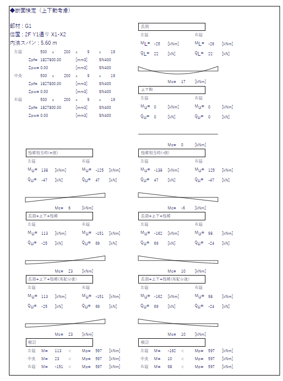
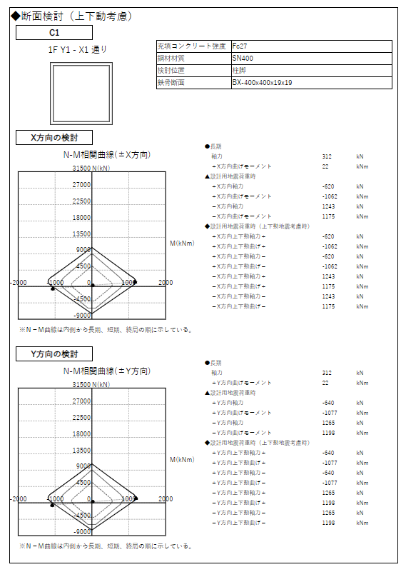
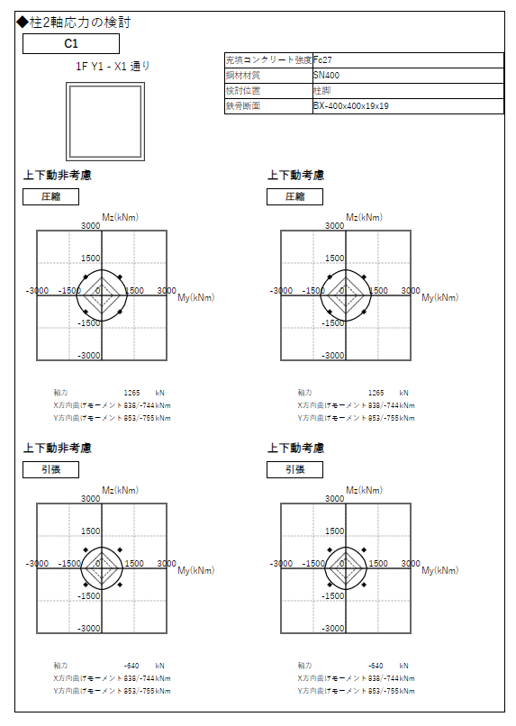
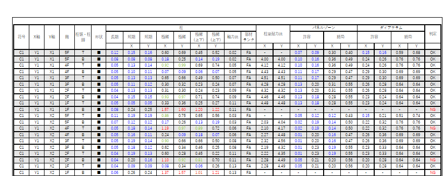
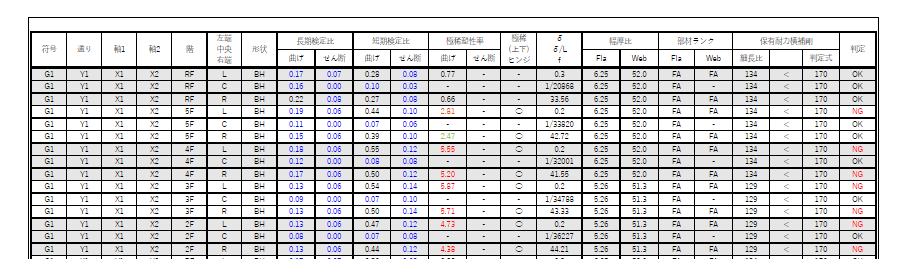

---
title: "10. その他計算機能"
draft: false
---

## ドキュメント出力 

### 鉄骨ロングスパン大梁の検討

鉄骨ロングスパン大梁の検討を行います。

弾性、弾塑性が選択できます。

### 柱MN相関の検討

柱のMN相関の検討を行います。
検討は1軸曲げをベースにした検討となります。
そのため、2軸曲げを考慮している一覧表と整合しない場合があります。  

### 柱2軸曲げの検討

柱の2軸曲げの検討を行います。

45°加力時の柱の評価を行う場合などの機能です。  

2つの検討方法があります。  

- a) X,Y方向加力を組み合わせ、45°加力時の応力を作る
- b) 解析された加力方向による応力をそのまま採用する

b) の場合は、解析時の加力方向を45°にした場合などに用いる検討になります。  
その他、通常のX,Y方向加力でも直交方向応力の確認をしたい場合などに使用する事ができます。

なお、**採用軸力は各方向加力の最大圧縮軸力、最大引張軸力を採用します**。  
そのため、実際には加力方向による応力と対応しない軸力によって耐力を定め、安全側として評価することになります。  

#### a) X,Y方向加力を組み合わせ、45°加力時の応力を作る

- X,Y方向加力時の長期を除いた水平荷重によるモーメントに対して1/√2倍したモーメントを合算します。
- 上下動係数を考慮した場合、上下動係数による増減倍率に応じて、長期モーメントも変動させます。

#### b) 解析された加力方向による応力をそのまま採用する

- 上下動係数を考慮した場合、上下動係数による増減倍率に応じて、長期モーメントも変動は行いません。

### 検討集計

#### 柱関係の検討集計

柱関係の検討集計を行います。  

#### 大梁関係の検討集計

大梁関係の検討集計を行います。  

#### ブレース関係の検討集計

ブレース関係の検討集計を行います。  

#### 耐震壁関係の検討集計

耐震壁関係の検討集計を行います。  

