## 柱梁自重の計算

### RC梁・SRC梁

(1) 単位長さ当りの重量

鉄筋コンクリート（RC）・鉄骨鉄筋コンクリート（SRC）造の大梁、小梁、片持ち梁の単位長さ当りの重量は、スラブの取付きにかかわらず下式により算定します。式中のコンクリートの単位体積重量（$γ$）は鉄筋、鉄骨重量を含みます。位置ごとに断面が異なる場合は中央断面を採用します。

 仕上げ荷重は、部材・階ごとに指定できます注1）。 仕上げ形式は、 下図に示す四面仕上げとします。

$$
w_c = γ \cdot b(D-t)+w_f(b+2D)
$$

 $γ$：コンクリートの単位体積重量（鉄筋・鉄骨重量を含む）（kN/m3）

 $b$：梁幅（m）

 wf：仕上げ重量（kN/m2）

 $D$：梁せい（m）

 $t$：スラブ厚

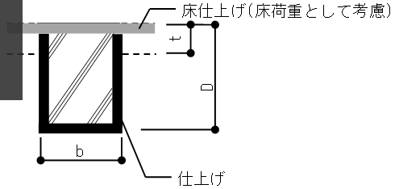

 上図の$t$はスラブ厚を指します。

|         種類        | 設計基準強度の範囲（N/mm2） | γC（kN/m3） | γRC（kN/m3） | γSRC（kN/m3） |
|:---------------------:|:--------------------------------:|:-------------------:|:--------------------:|:---------------------:|
|  普通コンクリート   |             Fc≦36           |        23.0       |        24.0        |        25.0         |
|                    |          36＜Fc≦48          |        23.5       |        24.5        |        25.5         |
|                    |          48＜Fc≦60          |        24.0       |        25.0        |        26.0         |
|                    |          60＜Fc≦80          |        24.0       |        25.0        |        26.0         |
|                    |          80＜Fc≦100         |        24.0       |        25.0        |        26.0         |
|                    |         100＜Fc≦120         |        24.0       |        25.0        |        26.0         |
|                    |         120＜Fc≦150         |        24.5       |        25.5        |        26.5         |
| 軽量コンクリート1種 |            Fc≦ 27           |        19.0       |        20.0        |        21.0         |
|                    |          27＜Fc≦ 36         |        20.0       |        22.0        |        23.0         |
| 軽量コンクリート2種 |          Fc≦ 27             |        17.0       |        18.0        |        19.0         |

 $γ_{C}$：コンクリートの気乾単位体積重量

 $γ_{RC}$：鉄筋コンクリートの単位体積重量

 $γ_{SRC}$：鉄骨鉄筋コンクリートの単位体積重量

注1)　メインメニュー「荷重・材料」→「柱・大梁仕上げ」→「RC造（仕上重量）」参照。

異種強度においても同種強度梁と同様の方法（使用材料で指定する「床スラブ・梁のFc」を用いて比重を計算する）で計算します。

 梁重量の算定に用いる梁の長さは以下のように計算します。

(2) 梁の長さ

**大梁**

 ・両端が柱の場合は柱面間距離とします。（大梁-1）

 ・片側が大梁の場合は梁面から柱面までの距離とします。（大梁-2）

 ・梁が斜めの場合は節点距離－両側の柱幅の合計／2とします。（大梁-3）

**小梁**

 ・両端の大梁面間距離とします。ただし、大梁と小梁が直交していない場合でも大梁と小梁の重複部分の長さは大梁幅の半分として計算します。

 ・小梁位置で大梁が分割されていて節点と小梁が接続している場合は、節点に接続する大梁の平均幅から重複部分を計算します。

**片持ち梁**

 ・柱面から片持ち梁先端までの距離とします。

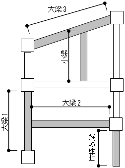

### RC・SRC柱

(1) 単位長さ当りの重量

 RC・SRC造の柱の単位長さ当りの重量は、下式によります。式中のコンクリートの単位体積重量（$γ$）には鉄筋、鉄骨重量を含みます。

 仕上げ荷重は部材・階ごとに指定できます（"RC梁・SRC梁"）。仕上げ形式は、下図に示す四面仕上げとします。柱頭・柱脚で断面が異なる場合は、柱脚の断面を採用します。

$w_c = \gamma \cdot A_c+w_f \cdot \phi$

 $γ$：コンクリートの単位体積重量（鉄筋・鉄骨重量を含む）（kN/m3）

 $A_C$：柱断面積（m2）

 $w_f$：仕上げ重量（kN/m2）

 $φ$：仕上げ周長（m）

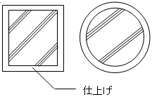

(2) 柱の長さ

 柱重量算定に用いる柱長さは床上面から床上面までとし、柱重量は階の中央で上下階に振り分けます。RC・SRC造の柱において、下階に柱がない場合は、柱脚に取付く梁の最大せいの長さ（下図のハッチ部分）を柱長さに付加します。

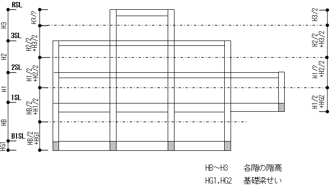 　　

### 鉄骨梁

(1) 単位長さ当りの重量

 S造の梁の単位長さ当りの重量は、下式により算定します。仕上げ荷重は部材・階ごとに指定、耐火被覆重量および被覆厚は階ごとに指定できます注1）。仕上げ形式は下図に示す四面形式とし、耐火被覆形式は部材ごとに指定が可能です注1）。位置ごとに断面が異なる場合は中央断面を採用します。

$ w_s = \alpha \cdot \gamma_s \cdot A_s+\gamma_f \cdot \phi+\gamma_c \cdot A_c$

 $α$：鉄骨重量割増率

 γ$_S$：鉄骨の単位体積重量（γS＝77kN/m3）

 $A_S$：鉄骨の断面積（m2）

 $φ$：仕上げ周長（m）

 $γ_f$：仕上げ重量（kN/m2）

 $γ_C$：耐火被覆重量（kN/m3）

 $A_C$：被覆材の断面積（m2）

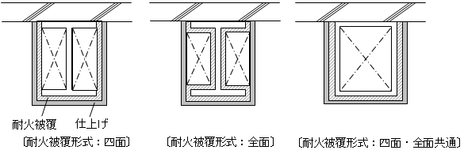 　　

(2) 梁の長さ

 梁重量の算定に用いる梁の長さは以下のように計算します。

**大梁**

 ・節点間距離とします。（大梁1,2,3）

**小梁**

 ・節点間距離とします。

**片持ち梁**

 ・柱節点から片持ち梁先端までの距離とします。

注1)　メインメニュー「荷重・材料」→「柱・大梁仕上げ」参照。

 　　

### 鉄骨柱

(1) 単位長さ当りの重量

 S造の柱の単位長さ当りの重量は、下式により算定します。仕上げ重量、仕上げ形式、および耐火被覆形式の指定については、鉄骨梁と同様です。柱頭・柱脚で断面が異なる場合は、柱脚の断面を採用します。

$ w_s = \alpha \cdot \gamma_s \cdot A_s+\gamma_f \cdot \phi+\gamma_c \cdot A_c$

 $α$：鉄骨重量割増率
 
 $γ_s$：鉄骨の単位体積重量（ γs=77kN/m3）

 $A_S$：鉄骨の断面積（m2）

 $φ$：仕上げ周長（m）

 $γ_f$：仕上げ重量（kN/m2）

 $γ_C$：耐火被覆重量（kN/m2）

 $A_C$：被覆材の断面積（m2）

 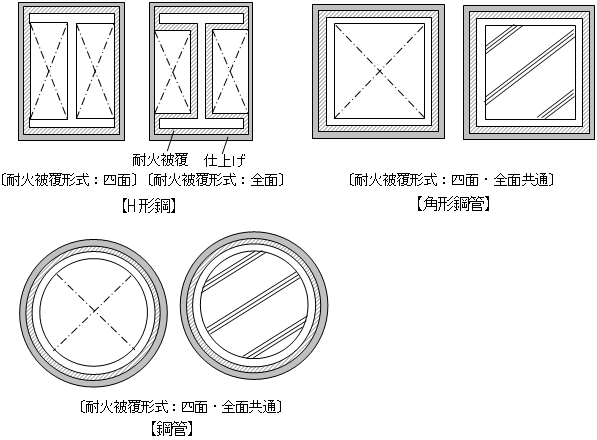 　　

(2) 柱の長さ

 柱重量の算定に用いる柱長さは、RC柱と同様です。("RC・SRC柱 柱の長さ")

### 間柱型ダンパー

 間柱型ダンパーの重量は上下節点に分配されます。ただし、画像右のダンパー(JFEシビル間柱型粘弾性ダンパー)は解析モデル上の中間節点にも重量が分配されます。

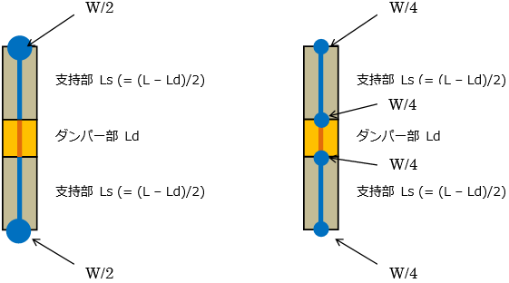 　　

#### スラブ、片持ちスラブの荷重伝達

 床荷重の伝達方向は、両方向、X方向、Y方向とします。荷重の伝達方向の指定は、床を配置する際に床ごとに行います。

 〔XY〕　：両方向に伝達する。

 〔X〕　：X方向に伝達する。

 〔Y〕　：Y方向に伝達する。

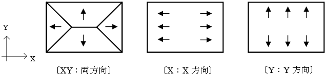 　　
 　

- 床の重量は構造芯間の面積について計算します。小梁で構成された床組の重量は、小梁芯により区分された床面積について求めます。
- 大梁のCM0Q0は、床の荷重伝達方向と小梁による分割を考慮して算定します。
- 小梁負担分の荷重については、小梁のQ0がその小梁を支持する小梁または大梁に作用するものとして計算します。小梁自重も同様に扱います。

### スラブ

(1) 両方向伝達の床割り

 四辺を梁で囲まれたスラブについては、荷重の伝達方向が両方向の場合、床スラブから梁に加わる鉛直荷重は、1999年版RC規準10条により下図のようになります。具体的には、スラブに取付く梁は、梁の交点から描いた2等分線および梁に平行な直線から作られる台形、または三角形の部分の荷重を受けるものと見なします。

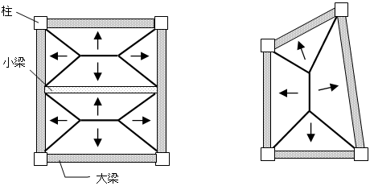 　　

(2) 多角形の床組の適応

本プログラムは、以下に示す多角形の床組に適用しています。

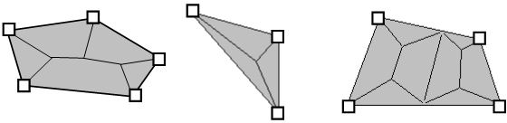 　　

  &emsp;&emsp;&emsp;〔五角形〕　&emsp;&emsp;&emsp;&emsp;&emsp;&emsp;　 〔三角形〕　　&emsp;&emsp;&emsp;&emsp;&emsp;&emsp;&emsp;&emsp;   〔台形〕　　　　　　　　
　

###  片持ちスラブ

(1) 片持ちスラブ

 片持ちスラブの重量は、構造芯から片持ち床先端までの面積について計算します。

　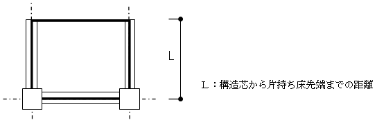 　 

 片持ちスラブの荷重は、片持ち梁の取り付きおよび先端リブ小梁の取り付きによって以下のように伝達されます。

 ・片持ち梁がない場合 : 全て大梁に伝達されます。

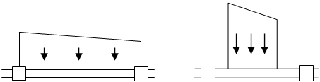 　  

　

 ・片持ち梁がある場合 : 片持ちスラブが接続する大梁、片持ち梁に対してスラブと同様のルールにより分割して荷重伝達されます。

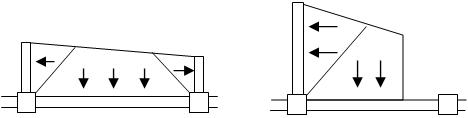 　  

　

 ・片持ち梁と先端リブ小梁がある場合 : 片持ちスラブが接続する大梁、片持ち梁先端リブ小梁に対して スラブと同様のルールにより分割して荷重伝達されます。  

 &emsp;&emsp;&emsp;&emsp;&emsp;&emsp;&emsp;&emsp;&emsp;&emsp;&emsp;&emsp;&emsp;&emsp;&emsp;&emsp;&ensp;&emsp; 先端リブ小梁がある場合はスラブ幅は片持ち梁の先端までと見なされます。

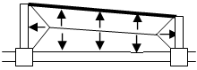 　   　  

(2) 出隅の片持ちスラブ

 スラブ荷重及び先端の線荷重の梁、柱への荷重伝達は以下のようになります。出隅の重量は、構造芯から出隅先端までの長方形について計算します。

 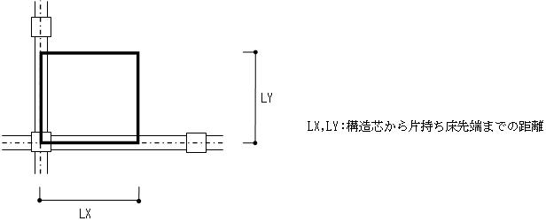 　　
　　　　　　　　　　　　　　　　　　　　　　　　　　　　　　　　　　　　　　　　　　　　　　　　　　　　　　　　　　　　　　　　　　　　　　　　　　　　

 出隅の片持ちスラブの荷重は、荷重伝達方向および片持ち梁の取付きに関わらず、節点荷重としてすべて柱に伝達します。

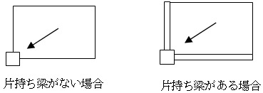 　　

(3) 入隅の片持ちスラブ

 本プログラムは、現状では入隅の片持ちスラブには対応しておりません。

## 壁の固定荷重

### 共通事項

 (1) 柱軸力算定時

 鉛直荷重における柱軸力を算定する場合、地震用重量における節点重量を算定する場合には、壁の重量を階高の中央で上下階の節点に分配するものとします。

 (2) 大梁CMoQo算定時

 壁の重量は階高の中央で上下階の節点に分配し、梁のCMoQoには考慮しません。　

 壁に三方スリットが指定されている場合、壁荷重は全て上部の大梁に伝達され、大梁のCMoQoに考慮されます。

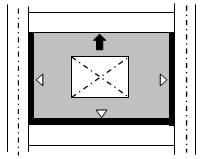 　　

### 壁

 (1) 耐震壁

 * 耐震壁の重量は周辺の柱梁の内法寸法で計算します。梁にハンチがある場合や、セットバック等で柱梁が斜めの場合は、それらを考慮して算定します。荷重は、階高の中央で上下階の節点に分配するものとします

 * 開口がある場合には形状・位置及び開口重量を考慮して計算します。

 * 壁の仕上げ荷重は、片面仕上げとして計算します。

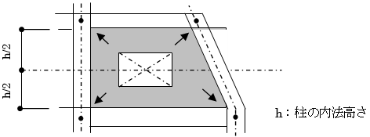 　　

 (2) 連スパン壁

 * 壁寸法、開口の扱い、仕上げについては一般壁と同様に計算します。

 * 壁重量は壁の上下左右の4節点に振り分けられ、連スパン壁における途中スパンの重量には考慮されません。

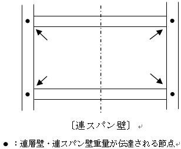 　　

 (3) 非耐震壁

 非耐震壁の重量の計算方法は、以下の指定によります。仕上げ壁のみの場合は、非耐震壁の自重伝達方法によります。

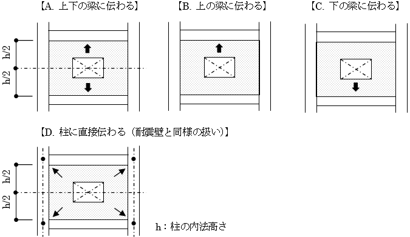 　　

## ダンパーの自重

### 座屈拘束ブレース（直接入力）

単位長さ当りの装置重量の入力に対して、節点間距離を乗じて自重とします。

### オイルダンパー

ダンパー部の装置重量（入力値）と、支持部断面積×（節点間距離 - 装置長さ）×鋼材単位体積重量の合計値を自重として計算します。

## 自重を考慮しない部材

以下の部材は自重を考慮しません。

 * 日鉄住金関西工業 SUB
 * 免制震ディバイス RDTダンパー
 * 免制震ディバイス iRDTダンパー
 * オイレス工業 粘性制振壁
 * 免制震ディバイス 粘性制振壁
 * 日鉄エンジニアリング ユニットゴムダンパー
 * 住友理工TRCダンパー
 * JFEシビル 間柱型粘弾性ダンパー
 * 各社 免震支承材
 * 各社 免震減衰材

## CMoQの計算

### 柱のCMoQ

土圧・水圧等による柱のCMoQについては考慮されません。

### 大梁のCMoQ

 大梁のCMoQには以下の①から④を考慮します。なお、ダミー梁を介して伝達される荷重はダミー梁が接続する節点に節点荷重として伝達します。

* 小梁、片持ち床などを含む床荷重によるCMoQo
*
* 壁荷重によるCMoQ
*
* 梁自重によるCMoQ
*
* パラペットや手すり等、特殊荷重によるCMoQ

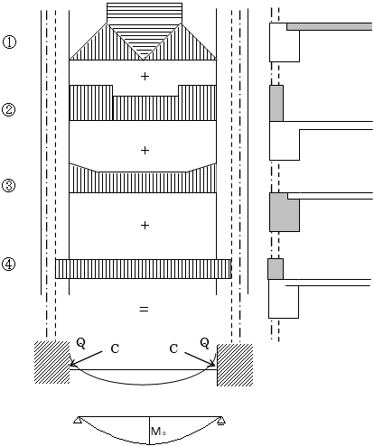 　　

###  剛域の考慮

 「荷重条件」の設定により、剛域部分を考慮して大梁のCMoQを計算することができます。剛域を考慮する場合には、まず可撓部分で固定端モーメントとせん断力を計算します。次に、可撓部分で計算された端部応力を外力として片持ち梁として仮定した剛域部分の先端に作用させます。結果として計算される剛域部片持ち梁の元端モーメントおよびせん断力を大梁全体の固定端モーメントおよびせん断力として考慮します。

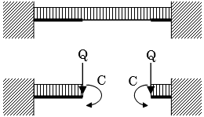 　　

また、剛域部分の荷重計算方法は下記から選択できます。

「剛域を考慮する（剛域部外力はCMoQに加算する）」

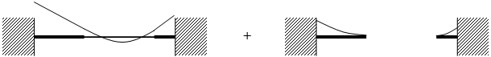 　　

「剛域を考慮する（剛域部外力は柱に伝達する）」

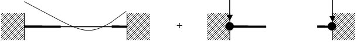 　　

## 地震荷重

### 地震用節点重量

 地震用節点重量は、下記の値を節点毎に集計して求めます。

・大梁のCMoQoの計算で求めた梁せん断力

床の積載荷重は地震用の値とします。

・直接入力による節点荷重

### 層せん断力

#### 全剛床の設計用せん断力

 地震用節点重量を層毎に集計し、建築基準法に基づき層せん断力を求めます。

(1) 一般階

$Q_i =c_i \sum_{j=i+1}^{n+1} W_j$

　　$Q_i$ ：i階の層せん断力

　　$W_j$ ：j層の層重量

　　$n$ ：階数

　　$C_i$ ：層せん断力係数

　　$C_i=Z･R_t･A_i･C_o$

ただし、

$C_i$ ：層せん断力係数

$Z$ ：地震地域係数

$R_t$ ：振動特性係数

$R_t=1$ ($T＜T_c$の場合)

$R_t= 1－0.2(T/T_c－1)^2$　　 
($T_c≦T＜2･T_c$の場合)

$R_t=1.6 T_c/T$　　 
($2･T_c≦T$の場合)

$T$ ：建築物の設計用1次固有周期

〔略算法〕

$T=h･(0.02+0.01･α)$

$h$ ：建築物の高さ

$α$：当該建築物のうち柱及び梁の大部分が鉄骨造である階†の高さの合計ｈに対する比

†「階・軸の設定」の階高設定部分における構造種別がS造になっている階

〔精算法〕

直接入力

$T_c$ ：地盤種別から決まる下表の係数

|           |     |
|-----------|-----|
| 第1種地盤 | 0.4 |
| 第2種地盤 | 0.6 |
| 第3種地盤 | 0.8 |

$A_i$ ：層せん断力係数の分布係数

$C_o$ ：標準せん断力係数

(2) PH階

$ Qi =k \sum_{j=i+1}^{n+1} Wj$

$ｋ$ ：震度（1.0～0.5を直接指定する。）

(3) 地下階

　　　　 $Q_i=Q_{i+1}+K_i･W_i$　　　$K_i=0.1･(1-H_i/40)･Z$

$H_i$ ：各部分の地盤面からの深さ（ｍ）（20ｍを超える場合は20ｍとする。）

$Z$ ：地震地域係数

#### 多剛床の設計用せん断力

多剛床の場合地震層せん断力は以下の方法により計算されます。

* 副剛床のCiを直接入力しない場合 : 階全体の総重量から層せん断力を算出し、それによって求まる水平力を剛床ごとの重量比で分配します。

* 副剛床のCiを直接入力した場合 : 主剛床は上記の全剛床の場合の$C_i$に従って層せん断力を計算します。副剛床は指定した$C_i$を用いて層せん断力を計算します。

### 水平力

(1) 建物設計用水平力

 水平力は各節点に作用させます。各層の等価震度を下の式で求め、それを各節点の地震用節点重量に乗じて、地震時水平力を求めます。

$K_i=(Q_i－Q_{i+1})/W_i$

 $K_i$ ： i層の等価震度

 $Q_i$ ： i階の層せん断力

 $W_i$ ： i層の層重量

(2) 床面積

 床面積は芯々で計算し、片持ちスラブ部分の床面積も算入します。また、床スラブを配置していない場合でも、小梁を入力している場合は吹き抜け部分の床面積を算入します。

## 風圧力

### 風用節点重量

 風圧力は、建築物の側面に対してＸ方向、Ｙ方向についてそれぞれ別に働くものとし、風圧力をうける側面に存在している各節点に、節点荷重として作用させ応力解析を行います。

(1) 風圧力

 速度圧と風力係数から、風圧力を計算します。

 $W = Cf･q･A$

 ここで　　　$W$ ：風圧力（Ｎ）

　　　　　　$Cf$ ：風力係数

　　　　　　$Cf = C_{pe}-C_{pi}$

 風圧力係数は各階ごとで直接入力することもできます。作用方向が、左→右加力では左側を風上壁面Cf、右側を風下壁面Cfとし、右→左加力では左側を風下壁面Cf、右側を風上壁面Cfを用います。

 $C_{pe}$ ：建築物の外圧係数

| 部位 | 風上壁面 | 風下壁面 |
|:------:|:----------:|:----------:|
|  Cpe |  0.8kz   |  －0.4   |

 ※係数"0.8"および"－0.4"は指定した数値を用います。

 $C_{pi}$ ：建築物の内圧係数（指定による）

 $k_z$ ：以下の表により、計算した数値

|      HがZb以下の場合          ||  1.0 |
|:---------------------:|:---------------------:|:-----:|
| HがZbを超える場合| ZがZb以下の場合   |  $\left( \frac{Zb}{H} \right)^{2\alpha}$   |
|                            | ZがZbを超える場合 |  $\frac{\int_{Zi}^{Zi+1}(\frac{Z}{H}) ^{2\alpha}dz}{Z_{i+1}-Z_i}$   |

 図中２階のように２つの式にまたがる場合も平均のKzを求めます。

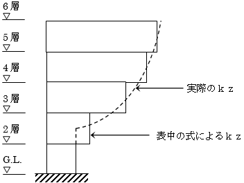 　　

 $Z$ ：地盤面から各層床位置までの高さ（m）

 $q$ ：速度圧（N/㎡）

 $q$ = 0.6･E･V02

 $V_0$ ：基準風速（m/s）（指定による。）

 $E$ ：建築物の屋根の高さ及び周辺の地域に存する建築物その他の工

 作物、樹木その他の風速に影響を与えるものの状況に応じた係数

 で、以下の方法により算出します。

 $E$ = $Er^2･Gf$

 $Er$ ：平均風速の高さ方向の分布を表す係数

 $H$が$Z_b$以下の場合： $Er$ = $1.7(Z_b/Z_G)^α$

 $H$が$Z_b$を超える場合： $Er$ = $1.7(H/Z_G)^α$

 $H$ ：建築物の高さと軒の高さとの平均（ｍ）

 GLからPH階を除く最上階の床高さ+パラペット高さの半分

 $A$ ：見付け面積（ｍ2）

 $Z_b$,$Z_G$,$α$ ：地表面粗度区分から求まる係数で、以下の表によります。

 表) 地表面粗度区分

| 地表面粗度区分                                                                                         ||    Zb\[ｍ\]      |    ZG\[ｍ\]      |   α  |
|:----------------:|:----------------------------------------------------------------------------------------:|:--------------------:|:---------------------:|:-------:|
|  Ⅰ            | 都市計画区域外にあって、極めて平坦で障害物が無いものとして特定行政庁が規則で定める区域 |         5          |         250         |  0.10 |
|  Ⅱ            | 都市計画区域外にあって地表面粗度区分Ⅰの区域以外の区域（建築物の高さが13ｍ以下の場合を除く。） 又は都市計画区域内にあって地表面粗度区分Ⅳの区域以外の区域のうち、海岸線又は湖岸線（対岸までの距離が1,500ｍ以上のものに限る。以下同じ。）までの距離が500ｍ以内の地域（ただし、建築物の高さが13ｍ以下である場合又は当該海岸線若しくは湖岸線からの距離が200ｍを超え、かつ、建築物の高さが31ｍ以下である場合を除く。）|   5   |   350 |  0.15  |
|  Ⅲ            | 地表面粗度区分Ⅰ、Ⅱ又はⅣ以外の区域                                                   |         5          |         450         |  0.20 |
|  Ⅳ            | 都市計画区域内にあって、都市化が極めて著しいものとして特定行政庁が規則で定める区域     |        10          |         550         |  0.27 |

 $Gf$ ：ガスト影響係数

 地表面粗度区分およびHに応じて、次の表に掲げる数値とします。

 表) 構造骨組用ガスト影響係数

| H               | （１）          | （２）          | （３）          |
|:-----------------:|:-----------------:|:-----------------:|:-----------------:|
|  地表面粗度区分 | 10m以下の場合   | 10mを超え、40m未満の場合 | 40m以上の場合    |
| Ⅰ              | 2.0             | (１)と(３)とに掲げる数値を 直線的に補間した数値 | 1.8  |
| Ⅱ              | 2.2             |                | 2.0             |
| Ⅲ              | 2.5             |                | 2.1             |
| Ⅳ              | 3.1             |                | 2.3             |

(2) 風圧力を受ける面と見付面積

* 風圧力を受ける面は、壁面(垂直面)とします。 屋根面および、地下階の壁、および外部袖壁、パラペットは考慮しません。

* 見付面積は、建物外周の通り芯間と梁天端間とからなる無開口壁が存在するものと仮定し、絶対座標系のX方向、Y方向それぞれについて、セットバックや軸振れなどの節点移動を無視した垂直面とします。

