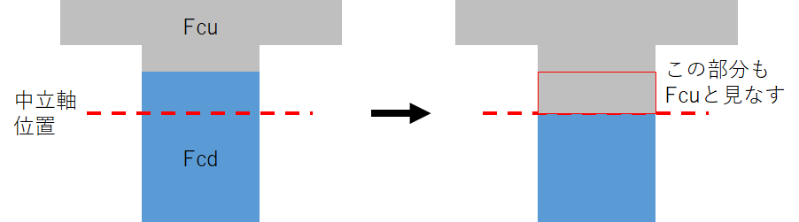
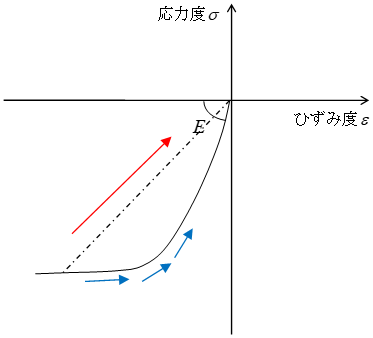

## 各部材モデルの非線形特性

各部材の非線形特性を部材、構造種別ごとに下表に示します。

| 部材種別 | 剛性   | 構造種別                           ||
|:----------:|:--------:|:------------------:|:------------------:|
|         |       | RC造・SRC造・CFT造 | S造              |
| 梁       | 曲げ   | トリリニア       | バイリニア       |
|         | 軸方向 | 弾性剛性\*       | 弾性剛性\*       |
|         | せん断 | 弾性剛性\*       | 弾性剛性\*       |
| 柱       | 曲げ   | ファイバーモデル | ファイバーモデル |
|         | 軸方向 | ファイバーモデル | ファイバーモデル |
|         | せん断 | 弾性剛性\*       | 弾性剛性\*       |
| 耐震壁   | 曲げ   | ファイバーモデル | ―               |
|         | 軸方向 | ファイバーモデル | ―               |
|         | せん断 | トリリニア       | ―               |
| ブレース | 曲げ   | ―               | ―               |
|         | 軸方向 | ―               | バイリニア       |
|         | せん断 | ―               | ―               |

　\* 指定により弾塑性考慮可能

## 梁


 梁部材は、同一階の2つの節点を端点として定義し、両端に剛塑性回転バネを有する線材としてモデル化します。モデルの仮定条件は以下のとおりです。

 ■曲げ剛性、せん断剛性（弾性）、軸剛性（弾性）を持ち、指定<sup>注1）</sup>によりねじれ剛性を考慮することが可能です。

 ■鉄筋コンクリート、鉄骨鉄筋コンクリート造梁の場合は、曲げひび割れを考慮します。

 ■梁の断面性能は中央の断面形状から算定します。鉄筋コンクリート造、鉄骨鉄筋コンクリート造梁の場合は、スラブを含めたコンクリート形状と鉄筋あるいは鉄骨の影響を考慮します。

 ■梁の曲げ・せん断耐力は、端部の断面より求めます。曲げ耐力には、下図に示す部材の両端で計算した正負応力を採用し、せん断耐力は両端の正負応力状態について求めた絶対値の最小値を用います。

 ■せん断スパン（$M/Q$）およびモーメント反曲点長さ（$a$）は可撓長さ（$l_0$）の1/2とし、他端ピンの場合はせん断スパン（$M/Q$）が可撓長さ（$l_0$）に一致するものとします。


　　　　　　　　　　　　　　　　　　　　　　　

$a_i$,$a_j$：i端、j端のモーメント反曲点高さ（=1/2・$l_0$）

$l_0$：内法スパン

### 共通 
#### 梁の曲げ非線形特性のモデル化

 梁の曲げ非線形特性は、部材の両端に取付く剛塑性回転バネにより評価します。なお、塑性率の計算はバイリニアの場合は第1折れ点、トリリニアの場合は第2折れ点を起点とします。

 部材の曲げ非線形特性（M－θ関係）は、曲げ降伏時剛性低下率（$α_y$）を用いて、トリリニア型のスケルトンカーブにモデル化します。


 ここで、反曲点位置をaとしたとき、長さ2aとなるような逆対称モーメント分布を持つ仮想部材を考えます。


注1) 「設計・計算条件」→「剛性条件」参照。

この部材の降伏変形角をθ<sub>y</sub>とすると、せん断変形を考慮して下式で表されます。

$\theta_y = \left( \frac{M_y \cdot a^2}{3 \cdot E \cdot I_e}+ \frac{M_y}{G \cdot A_s} \right) \cdot \frac{1}{a} \cdot \frac{1}{\alpha_y}$

 この弾塑性の復元力特性から弾性変形分を差引いて、剛塑性回転バネの特性を求めます。降伏変形角（θ<sub>y</sub>）は、曲げ降伏時変形角（<sub>y</sub>θ<sub>e</sub>）と塑性変形角（<sub>y</sub>θ<sub>p</sub>）の和により下式となります。

$\theta_y = {_y}\theta_e+{_y}\theta_p = \left( \frac{M_y \cdot a^2}{3 \cdot E \cdot I_e}+ \frac{M_y}{G \cdot A_s} \right) \cdot \frac{1}{a} \cdot {_y}\theta_p$

以上より、塑性変形（<sub>y</sub>θ<sub>p</sub>）は下式となります。

${_y}\theta_p = \left( \frac{1}{\alpha_y}-1 \right) \cdot \left( \frac{M_y \cdot a^2}{3 \cdot E \cdot I_e}+ \frac{M_y}{G \cdot A_s} \right) \cdot \frac{1}{a}$

したがって、曲げひび割れ後の材端回転バネのバネ定数（<sub>2</sub>K<sub>θ</sub>）は下式となります。

<sub>2</sub>$K_\theta = \frac{M_y-M_c}{{_y}\theta_p}$

$M_y$：曲げ降伏モーメント  
$α_y$：曲げ降伏時剛性低下率  
$a$：反曲点高さ  
$E$：ヤング係数  
$G$：せん断弾性係数  
$I_e$：断面2次モーメント  
$A_S$：せん断変形用断面積  

### 鉄筋コンクリート造

#### 鉄筋コンクリート造梁の曲げ復元力特性

 鉄筋コンクリート造梁の曲げ復元力特性の諸元値を以下に示します。なお、耐震壁付梁の場合は弾性とします（"[耐震壁](#耐震壁)"参照）。


   

 

 各耐力式に用いる主な記号は以下のとおりとします。

 $y_i$ ：梁下端からの各鉄筋重心までの距離  
 $a_i$：各鉄筋断面積  
 $i$=1 ：下端1段筋  
 $i$=2 ：下端2段筋  
 $i$=3 ：上端１段筋  
 $i$=4 ：上端２段筋  
 $i$=5 ：スラブ筋  
 $a_t$：引張鉄筋断面積  
 $a_s$：スラブ筋の断面積  
 $b$：T型梁の有効幅  
 $B$：梁幅  
 $D$：梁せい  
 $t$：スラブ厚  


※ 鉄筋の剛性を考慮しない場合は、「剛性条件」→「RC造」で"各断面の剛性計算時，鉄筋の剛性を考慮しない"にチェックを入れる必要があります。  

※ スラブ筋を考慮する場合は、「終局耐力条件」でスラブ筋の断面積を直接入力する必要があります。  

※ スラブ筋の重心位置はスラブ厚（t）の1/2とします。  

※ 初期設定では片持ち床のスラブ筋は考慮しません。考慮する場合は、「剛性計算条件」→「剛性条件1」で"協力幅の計算に片持ちスラブを含む"にチェックを入れる必要があります。  

※ 片持ち床のスラブ筋を考慮した場合、曲げ終局強度を計算する際の圧縮縁から引張鉄筋重心までの距離はスラブ筋を考慮したうえで計算したものになります。  

※ 引張鉄筋比（p<sub>t</sub>）へのスラブ筋の考慮は以下のとおりとします。  

 ■スラブ筋を考慮する場合　　　　　　　&emsp;&emsp;&emsp;&emsp;&emsp;&emsp;■スラブ筋を考慮しない場合

 上端引張：$p_t$ = $(a_s + a_{t{上}})/(B \cdot D)$　　　　　　　       &nbsp;&nbsp;上端引張：$p_t$ = $a_{t{上}}/(B \cdot D)$

 下端引張：$p_t$ = $a_{t{下}}/(b \cdot D)$　　　　　　　　　　　　&nbsp;&nbsp;下端引張：$p_t$ = $a_{t{下}}/(B \cdot D)$

 ・上端引張（スラブ引張）時は、梁幅Bと梁せいDからなる長方形梁を想定

 ・下端引張（スラブ圧縮）時は、Ｔ型梁の有効幅bと梁せいDからなる仮想の長方形梁を想定

※ 非線形解析においては、鉄筋およびコンクリートのヤング係数は下式によります<sup>1）</sup>。

&emsp;&emsp;&emsp;$E_c = 3.35 \cdot 10^4 \cdot \left( \frac{\gamma}{24} \right)^2 \cdot \left( \frac{F_c}{60} \right) ^\frac{1}{3}$


&emsp;&emsp;&emsp;$E_s = 2.05 \cdot 10^5$


$E_c$：コンクリートのヤング係数（N/mm<sup>2</sup>）  

$γ$：コンクリートの気乾単位体積重量（kN/m<sup>3</sup>）  
$F_c$：コンクリートの設計基準強度（N/mm<sup>2</sup>）  
$E_s$：鉄筋のヤング係数（N/mm<sup>2</sup>）  
 
 1)　日本建築学会：鉄筋コンクリート構造計算基準・同解説；P.50-51，2010.2

(1) 曲げひび割れ強度（$M_c$）

 鉄筋コンクリート造梁の曲げひび割れ強度（M<sub>c</sub>）は構造規定（略算式）により計算します<sup>2）</sup>。

$M_c = \kappa \sqrt{F_c} \cdot Z_e$

 $κ$：ひび割れモーメント算定用係数（＝0.56）  

 $Z_e$：鉄筋を考慮した断面係数（mm<sup>3</sup>）

 上端引張の場合　$I_e/(D-g)$

 下端引張の場合　$I_e/g$

 $I_e$：断面2次モーメント（mm<sup>4</sup>）


異種強度梁の場合、引張側のコンクリート強度（上端引張の場合$F_{cu}$, 下端引張の場合$F_{cd}$）を用います。  


(2) 曲げ降伏時剛性低下率（$α_y$）

 鉄筋コンクリート造梁の曲げ降伏時剛性低下率（$α_y$）は下式で算定します<sup>2）</sup>。

$\alpha_y = (0.043+1.635_n \cdot p_t+0.043a/D)(d/D)^2$　{10mm}　　$(2.0 \leq a/D \leq 5.0)$


$\alpha_y = (-0.0836+0.159a/D)(d/D)^2$　{10mm}　　$(1.0 \leq a/D < 2.0)$


 　　※a/D＜1.0または5.0\<a/Dの場合、a/Dはそれぞれ1.0, 5.0とします。

 $p_t$：引張鉄筋比（小数）
 
 $a/D$：シアスパン比
 
 $a$：せん断スパン（=$l_0/2$）（mm）
 
 $l_0$：可撓長さ（mm）
 
 $d$：有効せい（圧縮縁から引張鉄筋重心までの距離）（mm）
 
 $n$：ヤング係数比（＝$Es/Ec$）

 ・上端引張の場合　　　　　　　　

$p_t = \frac{\sum a_i}{B \cdot D} \quad d = \frac{\sum a_i \cdot y_i}{\sum a_i}$

・下端引張の場合（指定によりb=Bとすることも可能です）

$p_t = \frac{\sum a_i}{b \cdot D} \quad d = \frac{\sum a_i \cdot (D-y_i)}{\sum a_i}$


 $a_i$：各鉄筋断面積（mm<sup>2</sup>）
 
 $y_i$：梁下端からの各鉄筋重心位置（mm）

 ※
 スラブ筋断面積が入力されている場合は、上端引張側の$p_t$にスラブ筋の断面積を含めて算定します。

 ※
 T型梁または腰壁、垂壁付梁の場合は、求まった$α_y$を下式により補正します<sup>3）</sup>。指定により、補正しないこともできます。

 　・上端引張の場合

$α_y`=α_y \frac{I_{e0}+I_{wl}}{I_e+I_{wu}+I_{wl}}$   

※腰壁、垂壁が存在しない場合、$α_y`=α_y \frac{I_{e0}}{I_e}$と等価

 　・下端引張の場合

 $α_y`=α_y \frac{I_{e0}+I_{wl}}{I_e-I_{wu}+I_{wl}}$   
 
 ※腰壁、垂壁が存在しない場合、$α_y`=α_y$と等価

$I_e0$：矩形断面の断面2次モーメント（mm<sup>4</sup>）  
$I_e$：T型断面の断面2次モーメント（mm<sup>4</sup>）  
$I_wu$：腰壁断面の断面2次モーメント（mm<sup>4</sup>）  
$I_wl$：垂壁断面の断面2次モーメント（mm<sup>4</sup>）  


異種強度梁の場合、ヤング係数比の算定において、引張側のコンクリート強度（上端引張の場合$F_{cu}$, 下端引張の場合$F_{cd}$）を用います。  


2)　国土交通省：2007年版建築物の構造関係技術基準解説書；P.621-623，2007.8

3)　梅村魁；鉄筋コンクリート建物の動的耐震設計法；技報堂；P.106-108，1973.8

(3) 曲げ終局強度（$M_u$）

a) 大梁の曲げ終局強度

 鉄筋コンクリート造梁の曲げ終局強度（$M_u$）は構造規定による略算式もしくはACI規準に基づく平面保持仮定により算定します<sup>4）</sup>。

**略算式** 

$d = \frac{\sum \sigma_{yi} \cdot a_i \cdot d_i}{\sum \sigma_{yi} \cdot a_i}$


$M_u = 0.9 \cdot (\sum \sigma_{yi} \cdot a_i) \cdot d$

 $σ_{yi}$：各引張鉄筋の降伏強度（N/mm<sup>2</sup>）

$a_i$：各引張鉄筋の断面積（mm<sup>2</sup>）

$d$：梁有効せい（圧縮縁から引張鉄筋重心位置までの距離）（mm）

$d_i$：圧縮縁から各引張鉄筋重心位置までの距離（mm）

4)　国土交通省：2007年版建築物の構造関係技術基準解説書；P.623，2007.8

**平面保持**

「"鉄筋コンクリート造柱の終局耐力"」をご確認ください。


b) 腰（垂）壁付き大梁の曲げ終局強度

 腰（垂）壁付き鉄筋コンクリート造梁の曲げ終局強度（$M_u$）は構造規定により算定します<sup>4）</sup>。

 $M_u=a_{te} \cdot σ_y \cdot (d_e-0.5x_n)$

 ただし、$a_{te}=a_t+Σa_{t'}\left(\frac{σ_{y'}}{σ_y}\right)$　かつ　$a_{te}?(0.85F_c \cdot t \cdot x_{nb}/σ_y)-Σa_{t'}\left(\frac{σ_{}y'}{σ_y}\right)$

 $x_n=a_{te} \cdot σ_{y}/(0.85F_c \cdot t)$

 $x_{nb}=\frac{_cε_B}{_cε_B+_sε_y}$

 $F_c$:コンクリート圧縮強度

 $t$:圧縮側の壁厚(壁がない場合、ｔ=ｂ)

 $_cε_B$:コンクリートの圧縮強度歪み(0.002)

 $_sε_y$:梁主筋降伏点時の歪み($σ_y/_sE$)


c) 異種強度梁の曲げ終局強度


**略算式**   
異種強度梁特有の変更はありません。

**平面保持**  
終局曲げ耐力の算定における留意点は以下となります。

* $F_c$を圧縮側のコンクリート強度（上端引張の場合$F_{cd}$, 下端引張の場合$F_{cu}$）と置き換えて既存の式で算定します。
* 計算条件＞部材復元力特性計算条件＞終局耐力条件2＞平面保持スラブの設定の片側スラブ幅の値を採用します。
* 中立軸位置と水平接合面位置が異なる場合でも、中立軸位置より上は$F_{cu}$, 中立軸位置より下は$F_{cu}$とします（下図参照）。



平面保持を選択した場合の終局曲げ耐力の算定における留意点

#### 鉄筋コンクリート造梁のせん断復元力特性

 せん断復元力特性は指定により考慮できます。鉄筋コンクリート造梁のせん断復元力特性の諸元値を以下に示します。なお、壁付梁の場合は指定によらず弾性とします（"[耐震壁](#耐震壁)"参照）。

 せん断終局耐力は上端引張、下端引張の耐力の平均値を採用します。


(1) 大梁のせん断終局強度（ＲＣ）

 ＲＣ大梁のせん断終局強度は下記に式により計算されます。スラブについてはbe≦1.2bの範囲で考慮されます。

$Q_{su} = \left( \frac{k \cdot p_t^{0.23} (18+F_c)}{M/(Q \cdot d)+0.12}+0.85 \sqrt{p_w \cdot \sigma_{wy}} \right) \cdot b_e \cdot j_e$

k : 0.053または0.068

$p_{te}$ : $a_t/(b・d)$

$d$ : 大梁の引張鉄筋の中心から圧縮縁までの距離

$p_w・σ_wy$ : 大梁の帯筋比とその降伏強度の積

$σ_0$ : $N/(b・j)$

$j : 7d/8$

$M/Q・d$ : せん断スパン比　　(1.0≦$M/Q・d$≦3.0)

|                 |  $κ$   |   $σ_{wy}$                  |
|-----------------|-------|-------------------------|
| ウルボン1275    | 0.053 | 特になし                |
| パワーリング785 | 0.053 | $σ_{wy}$=25・Fc (Fc\<32)   |
| パワーリング685 | 0.068 | 特になし                |
| エムケーフープ  | 0.053 | $σ_{wy}$=25・Fc (Fc \< 31.4)|


(2) 腰（垂）壁付き大梁のせん断終局強度（ＲＣ）

 腰（垂）壁付きＲＣ大梁のせん断終局強度は下記に式により計算されます。


$Q_{su} = \left( \frac{k \cdot p_t^{0.23} (18+F_c)}{M/(Q \cdot d)+0.12}+0.85 \sqrt{p_we \cdot \sigma_{wy}} \right) \cdot b_e \cdot j_e$


$k$：0.053または0.068


$p_{te}:a_{t}/(b_{e} \cdot d_{e})$


$d_{e}$:大梁の引張鉄筋の中心から圧縮側壁の最外縁までの距離


$p_{we} \cdot \sigma_{wy}:p_w \cdot \sigma_{wy}(b/b_e)+p{_sh} \cdot \sigma_{sy}(t/b_e)$


$p_{w} \cdot \sigma_{wy}$:大梁の帯筋比とその降伏強度の積


$p_{sh} \cdot \sigma_{sy}$:腰（垂）壁の横筋比とその降伏強度の積


$\sigma_{0e}:N/(b_e \cdot j_e)$


$j_{e}:7d_{e}/8$


$b_{e} = \Sigma A/L'$


$M/Q \cdot d_{e} = \frac{h_{CW0}}{L'} \quad (0.5 \leq M/Q \cdot d \leq 2.0)$


$h_{CW0}$:反曲点の高さ　


$L'$：腰（垂）壁を含む全せい


 高強度せん断補強筋を用いた場合は以下が適用されます。

|                 |  $κ$    |   $σ_{wy}$                  |
|-----------------|--------|--------------------------|
| ウルボン1275    |  0.053 |  特になし                |
| パワーリング785 |  0.053 |  $σ_{wy}$=25・Fc (Fc\<32):   |
| パワーリング685 |  0.068 |  特になし                |
| エムケーフープ  |  0.053 |  $σ_{wy}$=25・Fc (Fc \< 31.4)|

 【大梁のせん断ひび割れ強度（ＲＣ）】

 指定により、ひび割れを考慮したトリリニアとしてモデル化します。ひび割れ耐力は以下のように計算します。せん断降伏時歪みは1/250としてトリリニアモデルを作成します。

 　　　$Q_c = \left( \frac{0.061 \cdot (Fc+49)}{\left( \frac{M}{Q \cdot d} \right)+1.7} \right) \cdot b \cdot j$


#### 鉄筋コンクリート造梁の軸復元力特性

 指定により、軸復元力特性を考慮する場合には以下の式により復元力特性を設定します。

(1) 引張ひび割れ軸力

$N_{ct} = \kappa \sqrt{F_c} \cdot A_c$

 $κ$：ひび割れ軸力算定用係数（＝0.56）

 $Ac$：コンクリート断面積（mm<sup>2</sup>）

 $Fc$：コンクリート強度（N/ mm<sup>2</sup>）

(2) 引張降伏軸力

$N_{ut} = at \cdot \sigma_y$

 $a_t$：鉄筋断面積（mm<sup>2</sup>）

 $σ_y$：鉄筋材料強度（N/mm<sup>2</sup>）

 圧縮降伏軸力:

$N_{uc} = at \cdot \sigma_y+F_c \cdot (A_c-at)$

### 鉄骨造

#### 鉄骨梁の曲げ復元力特性

 指定により、曲げ復元力特性を考慮する場合には以下の式により復元力特性を設定します。

 (1) 全塑性モーメント$M_p$

  $M_p=Z_p・σ_y$


 $Z_p$：塑性断面係数(mm<sup>3</sup>)  

 $σ_y$：鉄骨降伏強度(N/mm<sup>2</sup>)  

 (2) 横座屈モーメント$M_c$$_r$

 横座屈を考慮する場合、鋼構造塑性設計指針に基づき以下の式により計算します。鉄骨材料はフランジ部の材料を採用し、横座屈を考慮する断面形状はH型鋼のみとします。

 a) SN400, SS400,SM400材（$σ_y$=235N/mm<sup>2</sup>）

0 ≦ $\frac{l_b・H}{A_f}$ ≦300　　　$ \frac{M_{cγ}}{M}＝1.0$

   $300< \frac{l_b・H }{A_f}$ ≦ $835$　　　$ \frac{M_{cγ}}{M}=1-0.00075 \cdot ( \frac{l_b・H }{A_f}-300)$

   $ \frac{l_b・H }{A_f}>835$　　　$ \frac{M_{cγ}}{M}= \frac{500}{l_b・H/A_f}$ 

 b) SN490, SM490, SM490T材（$σ_y$=325N/mm<sup>2</sup>）

 0 ≦ $\frac{l_b・H}{A_f}$ ≦ $220$　　　$ \frac{M_{cγ}}{M}=1.0$

   $220< \frac{l_b・H}{A_f}$ ≦ $605$　　　$ \frac{M_{cγ}}{M}=1-0.0010 \cdot ( \frac{l_b・H}{A_f}-220)$　　　 

   $ \frac{l_b・H }{A_f}>605$　　　$ \frac{M_{cγ}}{M}= \frac{363}{l_b・H/A_f}$
 　 
 
 c) その他

0 ≦ $\frac{l_b}{A_f}$ ≦ $\frac{70500}{α}$　　　$ \frac{M_cγ}{M}=1.0$ 

   $ \frac{70500}{σ_y}< \frac{l_b}{A_f}≦ \frac{117000}{0.6σ_y}$　　　$ \frac{M_{cγ}}{M}=1- \frac{0.4}{117000/0.6σ_y-70500/σ_y} \cdot ( \frac{l_b・H}{A_f}- \frac{70500}{σ_y})$

   $ \frac{l_b・H }{A_f}> \frac{117000}{0.6σ_y}$　　　$ \frac{M_{cγ}}{M}= \frac{117000/σ_y}{{l_b}{A_f}}$ 

  &ensp;&emsp;$l_b$：横方向補剛材の間隔(mm)

  &emsp;$H$：梁のせい(mm)

  &emsp;$A_f$：圧縮フランジの断面積(mm<sup>2</sup>)

#### 鉄骨梁の軸復元力特性

 指定により、軸復元力特性を考慮する場合には以下の式により復元力特性を設定します。

(1) 引張降伏軸力・圧縮降伏軸力

$N_u = A_f \cdot \sigma_{fy}+A_w \cdot \sigma_{wy}$

 $A_f$：フランジ断面積（mm<sup>2</sup>）

 $A_w$：ウェブ断面積（mm<sup>2</sup>）

 $σ_{fy}$：鉄筋材料強度（N/mm<sup>2</sup>）

 $σ_{wy}$：鉄骨材料強度（N/mm<sup>2</sup>）

### 鉄骨鉄筋コンクリート造

#### 鉄骨鉄筋コンクリート造梁の曲げ復元力特性

 鉄骨鉄筋コンクリート造梁の曲げ復元力特性は、RC部分をトリリニア、S部分をバイリニアとして累加し、エネルギー吸収能力において等価なトリリニア型スケルトンカーブを求めます。


#### 鉄骨鉄筋コンクリート造梁のせん断復元力特性

(1) 大梁のせん断終局強度（ＳＲＣ）

ＳＲＣ大梁のせん断終局強度は下記の３式からの選択により計算されます。

a) ＳＲＣ規準

$Q_u = ({_r}Q_u+{_s}Q_u)$

$_rQ_u$ = min($_rQ_u$$_1$,$_rQ_u$$_2$)  

$_sQ_u$ = min($_sQ_u$$_1$,$_sQ_u$$_2$)


$_rQ_u$$_1$ = $b \cdot {_r}j(0.5 \times \alpha \cdot f_s+0.5 \cdot {_r}p_w \cdot _{rw}\sigma_y)$


$_rQ_u$$_2$ = $b \cdot {_r}j(b'/bf_s+{_r}p_w \cdot _{rw}\sigma_y)$


$_{s}Q_u$$_1$ = ${_s}A_w \cdot {_s}\sigma_y/ \sqrt{3}$


$_{s}Q_u$$_2$ = $\Sigma{_s}M_u/l'$


$f_s = \min (0.15 \times Fc,22.5+ \frac{4.5 \times Fc}{100})$


$a = 4/ (M/(Q \cdot rd)+1 )$かつ$1 \leq a \leq 2$


$b$:梁幅


$b`$:鉄筋フランジ位置のコンクリート有効幅


$rj$:鉄筋コンクリート部分の応力中心間距離


$rd$:梁の有効せい


$_rp_w$:せん断補強筋比


$_r$$_w$$\sigma_y$:せん断補強筋の材料強度


$_sA_w$:せん断力が作用する方向の鉄骨ウェブ断面積


$_s\sigma_y$:鉄骨ウェブの材料強度


$F_c$:コンクリートの設計基準強度


$_sMu$:鉄骨部分の一端あるいは他端における全塑性モーメント


$l`$:内法スパン

b) SRC診断式

 スラブについてはbe≦1.2bの範囲で考慮されています。

$Q_{su} = \left( \frac{k \cdot p_t^{0.23} \cdot k_{cs}(18+F_c)}{M/(Q \cdot d)+0.12}+0.85 \sqrt{p_w \cdot \sigma_{wy}} \right) \cdot b_e \cdot j_e+{_s}Q_u$


$_sQ_u$ = min ( $\frac{2 \cdot _sM_0}{h_0}$,  $t_w \cdot h_w \cdot$ $_s\sigma_w$$_y / \sqrt{3}$ )


$k$:0.053または0.068


$p_{w}:a_{t}/(b \cdot d)$


$k_{cs}:(0.5+b`/b)$かつ1.0以下


$d$:大梁の引張鉄筋の中心から圧縮縁までの距離


$p_{w} \cdot \sigma_{wy}$:大梁の帯筋比とその降伏強度の積


$\sigma_{0}:N/(b \cdot j)$


$j$:7d/8


$M/Q \cdot d$:せん断スパン比$(1.0≤M/Q \cdot d≤3.0)$


c) 構造関係技術基準解説書

$Q_u = (_{r}Q_u+{_s}Q_u)$


$_rQ_u$ = min($_rQ_u$$_1$, $_rQ_u$$_2$)


$_sQ_u$ = min($_sQ_u$$_1$, $_sQ_u$$_2$)


$_rQ_u$$_1$ = $b \cdot _rj$ ( $\alpha \cdot f_s+0.5 \cdot$ $_rp_w \cdot$ $_r$$_w$$\sigma_y$)


$_rQ_u$$_2$ = $b \cdot _rj$ ( $2b'/bf_s+_rp_w \cdot$ $_r$$_w\sigma_y$)


$_sQ_u$$_1$ = $_sA_w \cdot _s\sigma_y/\sqrt{3}$


$_sQ_u$$_2$ = $\sigma_sM_u/l'$


$f_s = \min ( Fc/20,(5+Fc/100) \times 1.5 )$


$α = 4/ (M/(Q \cdot rd)+1 )$


$b$:梁幅


$b`$:鉄骨フランジ位置のコンクリート有効幅


$rj$:鉄骨コンクリート部分の応力中心間距離


$rd$:梁の有効せい


$_rP_w$:せん断補強筋比


$_r$$_w$$\sigma_y$:せん断補強筋の材料強度


$_rA_w$:せん断力が作用する方向の鉄骨ウェブ断面積


$_s\sigma_y$:鉄骨ウェブの材料強度


$F_{c}$:コンクリートの設計基準強度


$_sMu$:鉄骨部分の一端あるいは他端における全塑性モーメント


$l`$:内法スパン


(2) 大梁のせん断終局強度（非充腹ＳＲＣ）

a) 格子材

 　　非充腹ＳＲＣ（格子材）のせん断耐力式は以下によります。

$Q_{su} = \left( \frac{k \cdot p_t^{0.23} \cdot k_{cs}(18+F_c)}{M/(Q \cdot d)+0.12}+0.85 \sqrt{{_r}p_w \cdot {_r}\sigma_{wy}+ \frac{1}{2}{_s}p_w \cdot {_s}\sigma_{wy}} \right) \cdot b_e \cdot j$

 $κ$ ：0.053または0.068

 $b$ ：梁の断面幅

 $be$ ：梁の有効幅で以下の式による

 $be=ΣAg/D$

 $Ag$ ：スラブの断面積を加算した梁の全断面積

 $d$ ：梁の有効せい

 $j$ ：応力中心間距離（=0.8D）

 $p_t$ ：引張鋼材比（$_rp_t+_sp_t$）(%)

 $_rp_t$ ：引張鉄筋比(%)

 $_sp_t$ ：引張鉄骨比(%)

 $_rp_w$ ：せん断補強筋比（=<sub>r</sub>a<sub>w</sub>/(b・<sub>r</sub>s)）

 $_sp_w$ ：帯板比（=$_sa_w/(b・_ss$)）

 $_ra_w$ ：1組のせん断補強筋断面積

 $_sa_w$ ：1組の帯板の断面積

 $_rs$, $_ss$ ：それぞれせん断補強筋および帯板の間隔

 $_rσ_{wy}$, $_sσ_{wy}$ ：それぞれせん断補強筋および帯板の降伏点強度

 $M/Q$ ：せん断スパン、弾性水平荷重解析結果より計算

 $M/Q・d$ 　：せん断スパン比（1.0≦$M/Q・d$ ≦3.0）

b) ラチス材


 　　非充腹ＳＲＣ（ラチス材）のせん断耐力式は以下によります。　　


$Q_{su} = \left( \frac{k \cdot {_r}p_t^{0.23} \cdot k_{cs}(18+F_c)}{M/(Q \cdot d)+0.12}+0.85 \sqrt{{_r}p_w \cdot {_r}\sigma_{wy}} \right) \cdot b_e \cdot {_r}j+{_s}Q_u$

 非充腹ＳＲＣ（ラチス材）のせん断耐力式は以下によります。  

 $Q_{su} = \left( \frac{k \cdot {_r}p_t^{0.23} \cdot k_{cs}(18+F_c)}{M/(Q \cdot d)+0.12}+0.85 \sqrt{{_r}p_w \cdot {_r}\sigma_{wy}} \right) \cdot b_e \cdot {_r}j+{_s}Q_u$


 $κ$ ：0.053または0.068

 $b$ ：梁の断面幅

 $be$ ：梁の有効幅で以下の式による

 $be=ΣAg/D$

 $Ag$ ：スラブの断面積を加算した梁の全断面積

 $d$ ：梁の有効せい

 $j$ ：応力中心間距離（=0.8D）

  $p_t$ ：引張鋼材比（$_rp_t+_sp_t$）(%)

 $_rp_t$ ：引張鉄筋比(%)

 $_sp_t$ ：引張鉄骨比(%)

 $_rp_w$ ：せん断補強筋比（=$_ra_w/(b・_rs$)）

 $_sp_w$ ：帯板比（=$_sa_w/(b・_ss$)）

 $_ra_w$ ：1組のせん断補強筋断面積

 $_sa_w$ ：1組の帯板の断面積

 $_rs$, $_ss$ ：それぞれせん断補強筋および帯板の間隔

 $ _rσ _{wy} $ , $ _sσ _{wy} $ ：それぞれせん断補強筋および帯板の降伏点強度

 $M/Q$ ：せん断スパン、弾性水平荷重解析結果より計算

 $M/Q・d$ 　：せん断スパン比（1.0≦$M/Q・d$ ≦3.0）

 $h_o$ ：内法長さ

 $D_A$ ：ラチス材の断面積

 $θ$ ：ラチス材と材軸のなす角

(3) 腰（垂）壁付き大梁のせん断終局強度（ＳＲＣ）

 腰（垂）壁付きＳＲＣ大梁のせん断終局強度は下記に式により計算されます。

$Q_{su} = \left( \frac{k \cdot p_t^{0.23} \cdot k_{cs}(18+F_c)}{M/(Q \cdot d)+0.12}+0.85 \sqrt{p_{we} \cdot \sigma_{wy}} \right) \cdot b_e \cdot j_e$


#### 鉄骨鉄筋コンクリート造梁の軸復元力特性

 指定により、軸復元力特性を考慮する場合には以下の式により復元力特性を設定します。

(1) 引張ひび割れ軸力

$N_{ct} = \kappa \sqrt{F_c} \cdot A_c$


 $κ$：ひび割れ軸力算定用係数（＝0.56）

 $Ac$：コンクリート断面積（mm<sup>2</sup>）

 $Fc$：コンクリート強度（N/ mm<sup>2</sup>）

(2) 引張降伏軸力

$N_{ut} = at \cdot \sigma_{yr}+A_{st} \cdot \sigma_{ys}$


 $at$：鉄筋断面積（mm<sup>2</sup>）

 $σ_{yr}$：鉄筋材料強度（N/mm<sup>2</sup>）

 $σ_{ys}$：鉄骨材料強度（N/mm<sup>2</sup>）

 圧縮降伏軸力:


$N_{uc} = at \cdot \sigma_{yr}+A_{st} \cdot \sigma_{ys}+F_c \cdot (A_c-A_{st}-at)$

## 柱

### ファイバーモデル

 柱部材は両端ファイバー梁要素にモデル化します。モデルの仮定条件を以下に示します。

 ■部材は複数の微小断面（以降、セグメントと称します）の集合とし、平面保持の仮定が成立するものとします。

 ■各セグメントは一軸の構成則（応力－ひずみ関係）を持ち、セグメント間に相互作用はないものとします。

 ■せん断剛性は通常の部材要素と同様に決定し、モーメント・軸力との相関は考慮しません。

 ■部材フェイスを危険断面位置（塑性ヒンジ発生位置）として応力を評価します。

 ■指定により弾性解析を行うことが可能です<sup>注1）</sup>。

#### ファイバーモデル計算方法（軸、曲げ）

 断面内のひずみは軸方向ひずみ、y軸周り曲率、ｚ軸周り曲率の3次元（3成分）で表されます。説明を簡略化するために、2次元（2成分）で図示すると下図のようになります。各セグメント位置でのひずみは、平面保持の仮定に従って軸ひずみ（ε）と曲率（φ）から求められます。


$N$：危険断面位置の軸力

$M$：危険断面位置の曲げモーメント

$ε$：軸ひずみ

$φ$：曲率

$ε_s$：鉄筋ひずみ

$ε_c$：コンクリートひずみ

 各セグメント位置のひずみが決定されれば、上図のように各セグメントの構成則からひずみに対応するヤング係数が求められます。各セグメントのヤング係数と断面積を、下式のように積分して断面性能を求めます。

 $EA$：断面全体に関するヤング係数×断面積

 $ES$：断面全体に関するヤング係数×断面1次モーメント

 $EI$：断面全体に関するヤング係数×断面2次モーメント

 $_sE$：各セグメントのヤング係数

 $_sA$：各セグメントの断面積

 $_sL$：各セグメントの断面内原点位置（図心）からの距離

 上式によって求めた危険断面位置での断面性能を用いて、部材全体の剛性を求めます。

 部材は、軸方向に2つのファイバー領域に分割、もしくは塑性化領域を指定した場合には中央に弾性要素を含んだ３つのファイバー領域に分割してモデル化します。下図は２分割の場合の例です。両端の非線形のファイバー領域では、危険断面位置で求めた断面性能が均等に分布すると仮定します。各ファイバーの領域中の剛性は一定とし、材全体の剛性は各領域の剛性が直列に連結したものとして求めます。


 RESP-Dでは塑性化領域長さを指定しない場合は、各ファイバーの領域の長さは両端ファイバー領域だけからなる状態（中間の弾性領域が無い2領域の状態）となります。

 両端の塑性化領域の１領域分の剛性マトリクスを下式のように作成します。説明の簡略化のため、2次元要素としてのマトリクスを示します。＜＞括弧は、領域端回転角と軸力の相関性を表す項を示しています。


$_xF$：軸力

$_zF$：せん断力

$_yM$：曲げモーメント

$l$：部材長

$_xδ$：軸方向変位

$_zδ$：せん断方向変位

$_yθ$：回転角


 上記のマトリクスを2領域分求め、弾性領域がある場合はさらに弾性領域を結合した要素内全体剛性マトリクスから、うち点2点に関する自由度を方程式から消去（マトリクスの縮約）し、両端変形を未知数とする梁要素としての剛性マトリクスを求めます。この後、通常の梁要素と同様に剛域変換・材端ばね変換を行い、最終的な要素剛性とします。各ファイバー断面の例を以下に示します。


#### ファイバー断面の設定

ファイバー断面における分割数は、以下のように設定されます。

##### RC断面

歪が大きくなる縁に対して分割を細かくする対数分割により、9分割します。

対数分割は以下のようなロジックとなります。  

```
* 基準となる位置から、log(2), log(3), log(4), … と対数の引数を+1ずつした距離離れた位置を分割位置とする。
* 基準となる位置は、偶数分割の場合は断面中心（座標0)、奇数分割の場合は断面中心 ± log(2) / 2 が基準となる。

【偶数分割の場合】

断面分割位置は、0, log(2), log(3), log(4), …

【奇数分割の場合】

+方向の断面分割位置は、- log(2) / 2, - log(2) / 2 + log(3), -log(2) / 2 + log(4), …
-方向の断面分割位置は、 log(2) / 2, log(2) / 2 - log(3), log(2) / 2 - log(4), … 

```


<div style="text-align:center">

  

矩形断面

</div>


<div style="text-align:center">

  

円形断面

</div>


##### 鉄骨断面

パイプ型は等分割で16分割します。パイプ型以外は等分割で7分割します。


<div style="text-align:center">

  

H型断面

</div>


<div style="text-align:center">  

  

CFT 角型断面

</div>

<div style="text-align:center">


CFT 円形断面

</div>


分割要素の復元力特性については、鉄筋および鉄骨はバイリニアモデル、コンクリートはNewRcモデルとして評価します(**ただし、NewRCの適用範囲であるFc60を超える強度、もしくはユーザー定義コンクリートの場合はBilinearの骨格曲線に対となります。適用範囲外のため、関数の形状が異常となるためです**)。非充腹ＳＲＣ柱については鉄骨弦材を分割断面としてモデル化し、ウェブ材はモデル化しません。第1折点においては、鉄筋および鉄骨の場合は圧縮・引張側ともに材料強度を1.1倍して断面積を乗じた値、コンクリートの場合は圧縮側で設計基準強度（F<sub>c</sub>）に断面積を乗じた値を採用します。また、剛性低下率（α）はいずれも1/1000とします。


コンクリートの応力-ひずみ関係にはNewRCモデルを用います。  
なお、コンクリート強度の計算にはコンファインド効果は考慮せず、以下の計算によりAおよびDを求めます。以下の数式において、応力度、ヤング係数の単位系は $kg/cm^2$ を用いています。  


コンクリートの応力-ひずみ関係 : 
$\frac{σ_c}{_ cσ _{cB}}$ = $\frac{AX+(D-1)X^2}{1+(A-2)X+DX^2}$


$_ cσ _{cB}$ = $σ_p$ 
  

$ σ_p = 1.0_cσ_B$  

&emsp;&emsp;$X = \frac{ε_c}{ε_c0} 、 A = \frac{E_cε{co}}{_ cσ _{cB}} 、 K = \frac{_ cσ _{cB}}{σ_p}$

$ ε_{co} =  ε_o$

&emsp;&emsp;$ε_o = 0.5243(_cσ_B)^{1/4} × 10^{-3}$

$E_c = 4k(_cσ_B/1000)^{1/3} × 10^5 × (γ/2.4)^2$

&emsp;&emsp;$ k =  1.0$

$D = α + β_cσ_B$

&emsp;&emsp;$α = 1.50$

&emsp;&emsp;$β = 1.68 × 10^{-3}$


$σ_c,ε_c$：コンクリートの軸方向応力およびひずみ

$_cσ_B$：コンクリートのシリンダー強度

$σ_p$：プレーンコンクリートの強度

$ _cσ _{cB}$：コンファインドコンクリートの強度(=$_cσ_B$)

$ε_{co}$：コンファインドコンクリートの強度時のひずみ


<div style="text-align:center">  


  

鉄筋・鉄骨の要素の復元力特性（バイリニアモデル） 


</div>

<div style="text-align:center">  

 

コンクリートの要素の復元力特性（NewRcモデル、静的）
  
</div>


 静的解析時には各分割断面の履歴は逆行型とし、動的解析時には鋼材は標準型、コンクリートは原点指向型としてモデル化します。

<div style="text-align:center">


鉄筋・鉄骨分割断面の除荷剛性  

</div>

<div style="text-align:center">



コンクリート分割断面の除荷剛性
</div>


 M－N相関耐力曲線を以下に例示します。本例は下図のファイバーモデルの断面解析結果を図化したもので、引張側を正、圧縮側を負として表示しています。

<div style="text-align:center">


部材断面図                         ファイバーモデル図


M－N相関耐力曲線の例

</div>

##### ファイバーモデルの塑性率について

 本プログラムでは、塑性率の計算方法を以下の３つから選択できます。

<b>(1) 塑性率基点歪みにより計算する方法</b>

本手法ではセグメント（分割断面）の最大ひずみが塑性率基点ひずみを超えた時点を部材としての塑性率基点と見なします。いずれかのセグメントのひずみが塑性率基点ひずみを超えた時点の曲率を、断面全体の塑性率基点曲率として設定します。塑性率基点ひずみのデフォルト値は、RC部材の場合では引張0.01、圧縮0.005、鉄骨部材の場合では引張・圧縮ともに0.01としています。また、図心位置（初期剛性において、1点を加力した場合に断面に曲率が発生せず、軸ひずみのみが発生する点）に軸力が作用するものとして計算します。

塑性率は、最大応答曲率/塑性率基点曲率で計算されます。
この計算方法の場合、曲げ塑性率と軸塑性率は同じ値になります。
また、塑性率が1を下回る場合は評価されません。  

この方法は、十分大きな縁歪みを設定することで、<b>塑性率基点1の時点を最大耐力として定義したい場合に有用です</b>。  

一方、塑性化を許容し、塑性率をクライテリアとして評価する場合には、一律の縁歪みであらゆる軸力状態の降伏点を共通に設定することは難しいため不向きです。その場合は、(2)または(3)を選択するほうが適切です。  


<b>(2) 重み付け平均塑性率による計算方法</b>

 ファイバー断面における各分割断面の塑性率に対し、モーメントに対する寄与率によって重み付した値を用いて塑性率基点を設定します。下式によるJmが1.0以上となった時点の回転角を塑性率基点として塑性率を計算します。  

この方法では、中立軸から遠い断面ほど歪が増加したときの全体のモーメント上昇に与える寄与が大きいことから、寄与が大きい断面の多くが塑性化する状況に至ったタイミングを部材が塑性化したタイミングとみなす、ということを意図しています。
本計算法法では、二軸曲げであったとしても縁のある一定領域が塑性化したタイミングが塑性率基点になり説明性の高い評価方法となること、曲げ塑性率と軸塑性率が別々の値として算出されることが利点として挙げられます。

曲げ剛性に与える寄与により重みづけしていることで、あらゆる軸力状態で顕著に剛性低下が生じた時点が塑性率基点となることから、<b>1より大きな塑性率をクライテリアとする場合に向いています</b>。


 また、この方法の場合、塑性率基点となるステップの曲率に対する最大応答曲率を用いるか、塑性率基点たわみ角に対する最大応答たわみ角を用いるか選択することが可能です。  
 一般に、曲率は変位の2階微分、たわみ角は変位の1階微分のような関係になるため、曲率のほうが局所的に大きな応答が生じやすく、塑性率が大きくなりやすい傾向にあります。一方たわみ角は、層間変形角と比較的近いオーダーとなるため、曲率に比べて極端な塑性率が発生しにくくなります。

$Jm = \frac{\Sigma\sigma_y \cdot A \cdot \varepsilon_x \cdot \mu_i}{\Sigma\sigma_y \cdot A \cdot \varepsilon_x}, \frac{\Sigma\sigma_y \cdot A \cdot \varepsilon_y \cdot \mu_i}{\Sigma\sigma_y \cdot A \cdot \varepsilon_y}$

$J_m$:曲げ塑性率基点評価式

$A$:分割断面断面積

$x$:分割断面断面内座標

$x_n$:中立軸位置

$σ_y$:分割断面降伏応力度

$ε_x,ε_y$:分割断面歪み

$μ$:分割断面の塑性率


軸力の違いによる塑性率基点時断面塑性化状況の例

<b>(3) 降伏発生時を塑性率基点にする方法</b>

いずれかの分割断面が塑性率1を超えた時点を塑性率基点として塑性率を計算します。
__鉄筋降伏やコンクリート圧壊、鉄骨の縁降伏発生時が塑性率1となるため、弾性限耐力をクライテリアとする場合に向いています__。  


塑性率は、最大応答曲率/塑性率基点曲率で計算されます。
この計算方法の場合、曲げ塑性率と軸塑性率は同じ値になります。
また、塑性率が1を下回る場合は評価されません。  


## 間柱ダンパー

 　間柱ダンパーは支持部とダンパー部からなる３分割要素としてモデル化されます。ダンパー部は制震部材の特性により、履歴型の非線形ばねや速度依存型のダッシュポットとしてモデル化されます。支持部については部材非線形性が考慮されます。その際、軸力は０と仮定して算出します。


## 耐震壁

耐震壁は、壁エレメントモデルの間柱部分にファイバー梁要素を適用した、ファイバー型壁エレメントモデルにより行います。軸・曲げについてはファイバー断面により非線形特性を評価し、せん断については各せん断耐力式に基づいた非線形性を採用します。


### 鉄筋コンクリート造耐震壁

#### 鉄筋コンクリート造耐震壁の非線形特性（軸、曲げ）

 壁柱部分は両端ファイバー梁要素とし、求めた断面性能は梁要素全体に均等に分布していると仮定します。両端ファイバー要素の非線形特性については、柱の項（[ファイバーモデル](#ファイバーモデル)）を参照してください。


#### 鉄筋コンクリート造耐震壁の非線形特性（せん断）

 鉄筋コンクリート造耐震壁のせん断非線形特性は、下図に示すトリリニアモデルで評価します。


(1)せん断ひび割れ強度（Q<sub>c</sub>）

鉄筋コンクリート造耐震壁のせん断ひび割れ強度（Q<sub>c</sub>）は下式で算定します<sup>1）</sup>。

$Q_c = (0.043 \cdot p_g+0.051) \cdot F_c \cdot A_w$

$A_w$：壁体断面積（cm<sup>2</sup>）

$p_g$：引張側最端の柱1本の主筋量（cm<sup>2</sup>）/$A_w$（%）

$F$c$：コンクリートの設計基準強度（kg/cm<sup>2</sup>）

(2)せん断降伏時剛性低下率（$β_u$）

鉄筋コンクリート造耐震壁のせん断降伏時剛性低下率（$β_u$）は下式により求めます<sup>1）</sup>。

$\beta_u = 0.46  \cdot p_w  \cdot \sigma_y/F_c+0.14$

$p_w$：壁の縦筋比

$σ_y$：壁筋の降伏強度（kg/cm<sup>2</sup>）

$F_c$：コンクリートの設計基準強度（kg/cm<sup>2</sup>）

(3)終局せん断強度（$Q_u$）


 RC造耐震壁の終局せん断降伏強度（$Q_u$）は、付帯柱の主筋を考慮して次のいずれかの式で算定します<sup>2）</sup>。開口に対してはせん断耐力の低減率（$r$）を考慮します。

$Q_u = \left( \frac{0.053 p_{te}^{0.23}(F_c+18)}{M/(Q \cdot D)+0.12}+0.85 \sqrt{\sigma_{wh} \cdot p_{wh}} +0.1\sigma_0 \right) t_e \cdot j \cdot r$


$Q_u = \left( \frac{0.068 p_{te}^{0.23}(F_c+18)}{ \sqrt{M/(Q \cdot D)+0.12}}+0.85 \sqrt{\sigma_{wh} \cdot p_{wh}} +0.1\sigma_0 \right) t_e \cdot j \cdot r$

1)　国土交通省：2007年版建築物の構造関係技術基準解説書；P.635-637，2007.8

2)　国土交通省：2007年版建築物の構造関係技術基準解説書；P.281-282,638-639，2007.8

 $t_e$：耐震壁のI形断面を長さと断面積とが等しい等価断面に置き換えたときの幅（t<sub>e</sub>）で、壁厚（t）の1.5倍以下とする。

 $M/(Q・D)$：シアスパン比

 $M/(Q・D)$＜1の場合は1、$M/(Q・D)$＞3の場合は3とする。

 $D$：付帯柱を含めた耐震壁の全長（mm）

 $j$：応力中心間距離（＝$7/8・d$）（mm）

 $p_{te}$：等価引張鉄筋比（＝$a_t/(t_e・d)・100$）（%）

 $a_t$：引張側柱の主筋断面積（mm<sup>2</sup>）

 d：D－Dc/2（Dc：圧縮側柱のせい）（mm）


 $σ_{wh}$：水平せん断補強筋の材料強度（N/mm<sup>2</sup>）

 $p_{wh}：t_e$を厚さと考えた場合の水平せん断補強筋比

 （小数、1.2%を超える場合は1.2%とする）

$p_{wh} = P_{wh} \cdot t/t_e/100$


$P_{wh}$：横筋比

$t$：壁厚（mm）

$r$：せん断耐力の低減率

$r = 1- \max  \left( r_0, \frac{l_0}{l_w}, \frac{h_0}{h} \right)$

$h_0$：開口部の高さ（m）

$l_0$：開口部の幅（m）

$l_w$：付帯柱の中心間距離（m）

$h$：壁の上下梁の中心間距離（m）

$r_0$：開口周比

$r_0 = \sqrt{ \frac{h_0 \cdot l_0}{h \cdot l_w}}$


$σ_0$：全断面積に対する平均軸方向応力度（＝N/A）（N/mm<sup>2</sup>）

$N$：軸力（N）

$A$：側柱および壁板の軸断面積（mm<sup>2</sup>）

3)　日本建築学会；鉄筋コンクリート終局強度設計に関する資料；P.132，1987.9

 耐震壁がスパン方向で連続する場合、それらを一枚としてせん断耐力の計算を行います。ただし、耐震壁は同一直線状に並んでいることを条件とします。


連スパンの壁は以下のように取り扱います。

* 連スパンの壁が一体とみなして耐力を計算し、せん断断面積の比率で耐力を分配します。  
* 横筋比は、各壁の横筋比×横筋強度をせん断断面積で重み付け平均して用います。
* 開口がある場合、各壁の開口率を各壁のせん断断面積で重み付け平均した開口率を連スパンの開口率とみなします。
  

### 鉄骨鉄筋コンクリート造耐震壁

#### 鉄骨鉄筋コンクリート造耐震壁の非線形特性（せん断）

 SRC造耐震壁の終局せん断降伏強度（Q<sub>u</sub>）は以下の3式のいずれかまたは鉄骨部分を無視してRC造耐震壁として計算します。SRC造耐震壁として計算する場合には、耐震壁が連続する場合でもそれぞれ単独の耐震壁として計算されます。

(1) せん断ひび割れ強度（$Q_c$）

鉄筋コンクリート造耐震壁と同様に計算します。

(2) せん断降伏時剛性低下率（$β_u$）

鉄筋コンクリート造耐震壁と同様に計算します。

(3) 終局せん断強度（$Q_u$）

a) SRC規準

 各スパンの耐震壁を内部耐震壁、外部耐震壁に大別します。

 内部耐震壁の判定は下記のルールで行い、下記のいずれにも該当しない場合は外部耐震壁とします。

 ・上下左右を耐震壁で囲まれている。

 ・上及び左右を耐震壁で囲まれており、下側節点のいずれかの節点がフリー以外の状態となっている。

 せん断耐力は下記により計算します。


$_wQ_u$ = max ($_wQ_u$$_1$, $_wQ_u$$_2$)


$_wQ_u$$_1$ = $r \cdot t \cdot l \cdot _wf_s$


$_wf_s = \min (0.067Fc,1.0+Fc/50)$


$_wQ_u$$_2$ = $r  \cdot _wp \cdot _w\sigma_y \cdot t \cdot l'$


$_wQ_u$$_2$ = $r  \cdot _wf \cdot s' \cdot t \cdot l'$


$_wf \cdot s' = \min (0.25Fc,1.13 \sqrt{Fc})$


b) SRC診断規準式

 せん断耐力は下記により計算します。

$Q_u = \left( \frac{0.053 p_{ge}^{0.23}(F_c+18)}{\frac{hw}{2l}+0.12}+0.85 \sqrt{\sigma_{wh} \cdot _{r}p_{se}} +0.1\sigma_{0e} \right) b_e \cdot l_w \cdot r$

 ただし、

$1 \leq \frac{hw}{2l} \leq 3$

 $p_{ge}$：引張側柱の等価引張鋼材比（%）。ただし、0.1%以下の場合0.1%とする。

 $_rp _{se}$ = $a _w/(b _e・s)$ + $Σ{a _ {tg}/(b_e・h')・(_rbσ _y/_wσ _y)}$　ただし、$_rp _{se}$≦$2a_w/(be・s)$

 $a_{w,s}$ ：1組の横筋の断面積および間隔

 $a_{tg}$：計算している壁の床位置から高さが$l_{w0}$以内にある梁断面の鉄骨及び主筋の全断面積

 $h_w$：検討階より連層耐震壁最上階までの高さ。検討階が最上階なら2倍とする。

 $σ_{0e}$ ：$N/(b_e・l)$

 $l_w$ ：柱芯間距離

 hw計算時の連層耐震壁は下階から上階に耐震壁配置基準節点番号が連続する場合に連層とみなします。連スパン耐震壁の場合は連スパン耐震壁を一体とみなし、基準節点番号が連続するかどうかで判定します。


c) 構造関係技術基準解説書

 せん断耐力は下記により計算します。

$_wQ_u = _wQ+\Sigma{_c}Q_u$


$_wQ = \min (_wp \cdot  _w\sigma_y,Fc/4 ) \cdot t \cdot l'$


$_cQ_u = b \cdot  _rj (1.5fs+0.5_rp_w  \cdot _r\sigma_w$$_y$) + $_sA_w  \cdot _s\sigma_y/  \sqrt{3}$


$f_s = \min ( Fc/20,(0.5+Fc/100) \cdot 1.5 ) $


 耐震壁の中間に柱が存在する場合、cQu/2としてそれぞれの壁耐力に加算します。

### 鋼板耐震壁

鋼板耐震壁は弾性としてモデル化されます。
付帯柱をピンとするか剛接とするか、計算条件で指定できます。

## ブレース

 ブレースは、隣接する階の異なる2つの節点を端点として定義し、軸バネにモデル化します。ブレースに関する基本事項を以下に示します。

 ■ブレース断面は一様として断面性能および耐力を算定します。

 ■端部はピン接合とし、軸力のみを負担するものとします。ただし、「面内に拘束する」とした場合には面外方向には剛接合となります。

### 鉄骨ブレース
#### 鉄骨造ブレースの軸非線形特性

 鉄骨造ブレースの軸非線形特性は、下図に示すバイリニアモデルで評価します。


 引張耐力および圧縮耐力は指定により下記から選択可能です。

 ■終局耐力（N<sub>u</sub>）

$N_u = \sigma_y \cdot A_n$

 $σ_y$：降伏点強度（N/mm<sup>2</sup>）

 $A_n$：全断面積（mm<sup>2</sup>）

 ■許容応力度（$N_a$）

 鉄骨ブレースの許容応力度は、鋼構造設計指針により次式で算定します<sup>2）</sup>。

 （引張）

$N_a = \sigma_{as} \cdot A_n$

 $σ_{as}$：短期許容応力度（N/mm<sup>2</sup>）

 $A_n$：全断面積（mm<sup>2</sup>）

 （圧縮）

$N_a = f_{cS} \cdot A_n$

 　

 圧縮材の座屈の長期許容応力度（$fc_L$）は次式で算定します。なお、圧縮材の座屈の短期許容応力度（$fc_S$）は長期許容応力度（$fc_L$）の1.5倍とします。

 　　　　　　　　　　　　　　$fc_L = \frac{F}{\nu} \left( 1-0.4 \cdot \left( \frac{\lambda}{\Lambda} \right)^2 \right)$（λ≦Λの場合）

 　　　　　　　　　　　　　　$fc_L = \frac{\frac{18}{65} \cdot F}{ \left( \frac{\lambda}{\Lambda} \right)^2}$（λ＞Λの場合）

 $fc_L$：圧縮材の座屈の長期許容応力度

 $F$：鋼材の規準強度（N/mm<sup>2</sup>）

 $λ$：有効細長比（＝$l_k/i$）

 $i$：座屈軸についての断面2次半径（mm）

 $l_k$：有効座屈長さ（mm）

 $Λ$：限界細長比

 $ν$：安全率


$\Lambda =  \frac{1500}{\sqrt{\frac{F}{1.5}}}$


$\nu = \frac{3}{2}+\frac{2}{3} \left( \frac{\lambda}{\Lambda} \right)^2$


 ■安定座屈耐力（N_{sb}）

 鉄骨ブレースの安定座屈耐力は次式で算定します。

$K_b$ = 0.75


$\lambda_B = \frac{K_b \cdot L}{i} \cdot \sqrt{\frac{\sigma_y}{\pi^2E}}$


$N_{sb} = \sigma_y \cdot A_n \quad (\lambda_B \leq 0.15)$


$N_{sb} = \frac{\sigma_y \cdot A_n}{11\lambda_B-0.65} \quad (0.15<\lambda_B \leq 0.3)$


$N_{sb} = \frac{\sigma_y \cdot A_n}{6\lambda_B-0.85} \quad (0.35<\lambda_B)$


 　

#### 座屈拘束ブレース（直接入力）の軸非線形特性

 座屈拘束ブレース（直接入力）の軸非線形特性は、下図に示すバイリニアモデルで評価します。


 座屈拘束ブレースの場合、引張および圧縮耐力は次式によります。

$N_{y} = A_{n} \cdot \sigma_{y}$

#### メーカー製品ダンパーブレースの軸非線形特性

 "制振要素"をご参照ください。

 「[制振要素](../nonlinear-analysis/#制振要素)」

 1)　日本建築学会：鋼構造限界状態設計指針・同解説；P.20,　2010.2

 2)　日本建築学会：鋼構造設計基準；1999.4

## 免震支承材

### マルチシアスプリング要素

 弾性すべり支承を除いた免震部材はマルチシアスプリング要素でモデル化します。（ただし、静的解析時は弾性すべり支承もマルチシアスプリングでモデル化されます。）

 「剛性条件」「免震部材のモデル化」で「せん断力によって発生するモーメントを考慮する」とした場合には剛域付きせん断ばねとしてモデル化し、「せん断力によって発生するモーメントを考慮しない」とした場合には剛域なしのせん断ばねとしてモデル化します。


剛梁付きせん断ばね                      マルチシアスプリング要素

 マルチシアスプリングは各方向の特性を同一にするためのモデル化であり、バネ本数を増やすとその分各ばねの剛性および耐力の低減率が変化します。RESP-Dにおけるマルチシアスプリングは常に8本としてモデル化されます（ただし、弾性でばねを分散させる必要がない天然ゴム系積層ゴムは2本としてモデル化されます。）

 剛性低減率：$\frac{2}{n}$

 耐力低減率：$\frac{1}{ \sum_{i=1}^{n/2} \left( \cos \left( \frac{\pi}{n} \cdot (i-1) \right)+ \sin \left( \frac{\pi}{n} \cdot (i-1) \right) \right)}$

 参考までに各ばね本数と低減率を示します。

| 本数       |  2       |  4       |   6       |  8       |  16      |
|------------|----------|----------|-----------|----------|----------|
| 剛性低減率 |  1.00000 |  0.50000 |   0.33333 |  0.25000 |  0.12500 |
| 耐力低減率 |  1.00000 |  0.41421 |   0.26795 |  0.19891 |  0.09849 |

### 摩擦ばね要素

 弾性すべり支承は摩擦ばねによりモデル化します。摩擦ばねはバイリニアばねでモデル化された擬似的な摩擦要素です。摩擦によって変位が固定されたり、滑ったりする状況を擬似的に表現します。マルチシアスプリングとの違いは、以下になります。

 ・剛性低下（滑り出し）の判定がベクトルとしての合力で評価されます。

 ・発生するせん断力による曲げを伝達しません。

 例えば、マルチシアスプリングで摩擦を表現した場合、純粋なX方向加力で滑り出したとしてもY方向に対してはまだ剛性を有した状態になります。一方で摩擦ばねではベクトルの合力により滑りを判定するため、滑り状態に達していればどの方向に対しても剛性低下した状態として評価できます。

 発生する水平力は下記のようになります。

 $Q_{max} = μ×N$

 $Q = K1 × δ$（$K1 × δ＜ Q_{max}$）

 $Q = Q_{max}$ （$K1 × δ＞= Q_{max}$）

 $Q_{max}$ ：最大摩擦力

 $μ$ ：摩擦係数

 $N$ ：長期軸力

指定により、変動軸力を考慮可能です。
考慮した場合、計算安定性が損なわれる場合があります。

 $K1$ ：弾性剛性

 $δ$ ：水平変位

