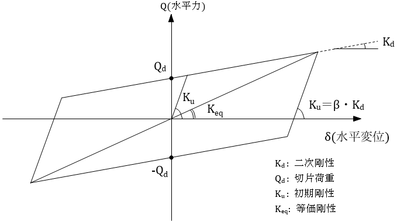
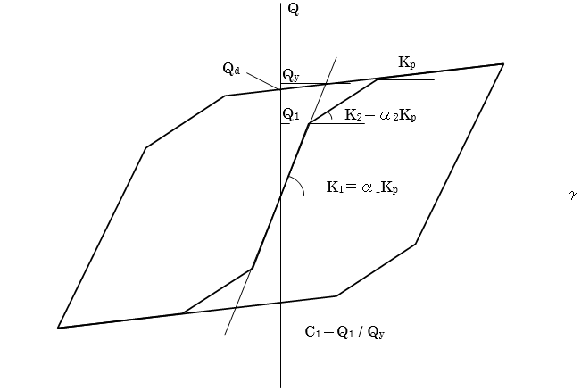
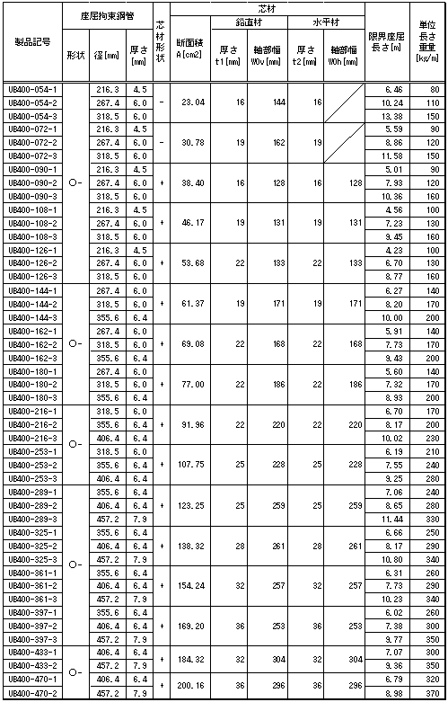
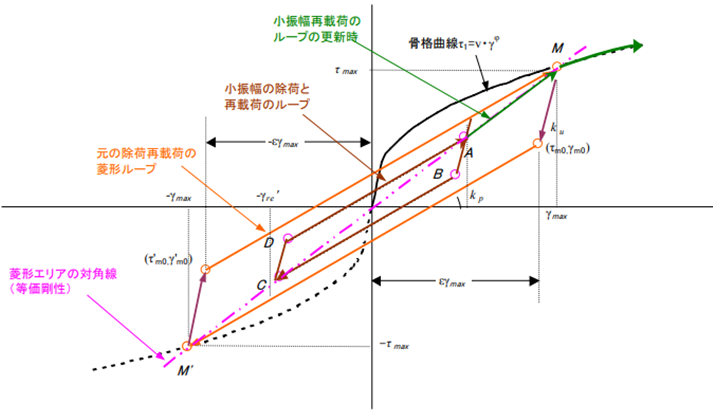

## 立体解析モデルの非線形特性

立体解析モデルの動的解析のための既定の非線形特性を部材、構造種別ごとに下表に示します。

|  部材種別  | 剛性   |  構造種別                                             ||
|:------------:|:--------:|:---------------------------:|:----------------------------:|
|           |       |  RC造・SRC造・CFT造          |  S造                       |
|  梁        | 曲げ   |  武田型（トリリニア）     |  標準型（バイリニア）      |
|           | 方向 |  弾性                     |  弾性                      |
|           | せん断 |  弾性                     |  弾性                      |
|  柱        | 曲げ   |  ファイバーモデル＊1    |  ファイバーモデル＊1     |
|           | 軸方向 |  ファイバーモデル＊1    |  ファイバーモデル＊1     |
|           | せん断 |  弾性                     |  弾性                      |
|  耐震壁    | 曲げ   |  ファイバーモデル         |  ―                        |
|           | 軸方向 |  ファイバーモデル         |  ―                        |
|           | せん断 |  原点指向型（トリリニア） |  ―                        |
|  ブレース  | 曲げ   |  ―                       |   ―                       |
|           | 軸方向 |  ―                       |   標準型（バイリニア）＊2|
|           | せん断 |  ―                       |   ―                       |

 *1：ファイバーモデルでは、鉄筋・鉄骨：標準型バイリニア、コンクリート：NewRCモデル（原点指向型）としてモデル化しています（**ただし、NewRCの適用範囲であるFc60を超える強度、もしくはユーザー定義コンクリートの場合はBilinearの骨格曲線に対する原点指向型となります。適用範囲外のため、関数の形状が異常となるためです。**）。また、指定により弾性とすることが可能です。

 *2：指定により、非線形特性を個別に設定することが可能です。

### 鉄骨大梁の座屈を考慮した履歴

指定により、鉄骨大梁の座屈を考慮した履歴則を採用する事ができます。  
座屈形式に応じて、以下の履歴則を採用します。  

#### 局部座屈

文献「加藤・秋山・帯: 局部座屈を伴うH形断面部材の変形, 日本建築学会論文報告集 第257号・昭和52年7月」を元に履歴則を設定します。    

除荷特性は文献「孟・大井・高梨: 鉄骨骨組地震応答解析のための耐力劣化を伴う簡易部材モデル, 日本建築学会構造系論文報告集 第437号・1992年7月」によるROモデルを用います。  
ROモデルの諸元は、γ=5, Φ=0.5とします。

#### 横座屈

文献「井戸田・中田・吉田・小野: 横座屈で耐力が決まるＨ形鋼梁の繰返し履歴モデル, 日本建築学会構造系論文集 第80巻 第711号 819-829 2015年5月」を元に履歴則を設定します。  

最大曲げ耐力 $M_u$ は以下のように計算します。  

$\frac{\mu_{Mu}}{M_p}=\frac{2h_0}{1+c_{def}\lambda_b+(1+c_{res})\lambda_b^2+\sqrt{(1+c_{def}\lambda_b+(1+c_{res})\lambda_b^2)^2-4\lambda_b^2(1+c_{res}\lambda_b^2)}}$  

ここで、

$c_{res}$ : 残留応力度の大きさを考慮する係数(=0.0)     
$c_{def}$ : 初期たわみ量の大きさを考慮する係数(=$q_{\kappa}k_{def}^r$)  
$h_0$ : 塑性化後の歪み硬化による耐力上昇率  
$f$ : 形状係数(=1.0)    
$k_{res}$ : 降伏応力度に対する最大残留応力度の大きさの比率(=0.3)    
$k_{def}$ : 部材初期たわみ量の正弦波成分の最大振幅を $k_{def}・l_b/1000$ で表したときの係数(=1.0)  
$\Lambda_c'$ : 基準化幅厚比と弾性限界細長比を用いて定義される変形性能指標(=$( \lambda_b / _e\lambda_b + WF^3)^{1/3}$)    

$h_0=\alpha_{\Lambda_c'}(\Lambda_c'-1.25)+1.0$ ... $(\Lambda_c'\leq1.25)$   
$h_0=1.0$ ... $(\Lambda_c'\gt1.25)$  
  
$q_{\kappa}=-0.1\kappa+0.065$ ... $(-1.0\leq\kappa\leq0.0)$   
$q_{\kappa}=0.065$ ... $(0.0<\kappa)$   
  

$r=0.5\kappa+1.0$ ... $(-1.0\leq\kappa\leq0.0)$   
$r=1.0$ ... $(0.0<\kappa)$   
  

$\alpha_{\Lambda}=-0.2\kappa-0.25$   

#### 連成座屈

文献「大谷・井戸田: 局部座屈と横座屈を考慮したH形鋼梁の繰返し履歴モデル, 日本建築学会構造系論文集 第84巻 第765号 1475-1484 2019年11月」を元に履歴則を設定します。  
最大耐力 $M_u$ は、横座屈と同様に算出します。  
耐力劣化の開始点は、論文中の $\theta_{static}$ を採用します。  

##  質点系解析モデルの非線形特性

### 復元力特性のモデル化（上部構造）

#### 初期剛性

 本プログラムでは、増分解析の最初のポイント（第１ステップ）の荷重－変形関係から初期剛性（K1）を計算します。従って、荷重増分解析の第１ステップの状態で非線形領域に入ってしまう解析結果からは、初期剛性を正しく計算できません。特に、初期応力が過大なことによって発生する第１ステップでの剛性変更などには注意してください。

#### 接線勾配

 指定した位置（荷重ステップ間は線形補間）とその直前のポイント（荷重ステップ）を結ぶ勾配とします。

#### 等価せん断型モデル・等価曲げせん断型モデル

 地震時の構造物の変形は、せん断的な変形（下左図）と曲げ的な変形（下右図）の組み合わさったものであると考えることができます。本プログラムでは、「等価せん断型モデル（全て非線形のせん断型成分であると仮定するモデル）」と、「等価曲げせん断型モデル（弾性の曲げ成分と非線形のせん断成分の組み合わせであると仮定するモデル）」の２つの考え方によるモデル化を行うことができます。

 節点の鉛直変位から曲げ剛性を計算（曲げ剛性の直接入力では入力値を使用）し、曲げ変形成分を計算し、これを全体の層間変位から差し引いた残りをせん断変形成分とします。

ここで、

$K_1$：初期剛性

$α_2$・$K_1$：第２剛性

$α_3$・$K_1$：第３剛性

$Q_1,δ_1$：第1折点のせん断力，変位

$Q_2$,$δ_2$：第2折点のせん断力，変位

$Q_3$,$δ_3$：第3折点のせん断力，変位

 本プログラムでは、第１折点および第３折点を指定し、第２折点を自動計算する方法（ルール１、２）と、第２折点および第３折点を指定し第１点を自動計算する方法（ルール３）があります。

 ルール１、２による自動計算では、第３折点までの包絡面積がスケルトンカーブの包絡面積と等しくなるように、第２折点を設定します。また、第３勾配は第３折点の接線勾配とします。

 ルール１では、第１折点はQ-δ曲線において割線剛性が初期剛性に対して指定値以下となった時点の変位により第１折点を決定します。

 ルール２では、各階において最初に降伏部材が発生した時点の変位に対する比率を指定します。指定値に相当する変位を超えた時点の変位により第１折点を決定します。

 ルール３による自動計算では、第２折点までの包絡面積がスケルトンカーブの包絡面積と等しくなるように、第１折点を設定します。また、第３勾配は第３折点の接線勾配とします。降伏ヒンジが発生した大梁端部の比率が指定値を超えた時点の変位により第２折点を決定します。

#### 等価曲げ剛性の計算方法

 第１ステップに関する柱の鉛直方向変位と柱軸力からひずみエネルギーの和が等しくなるような平面保持型の$_eθ_i$を求め、これに対応する等価曲げ剛性$_eEI_i$を計算します。

i階での増分回転角を$_eθ_i$とすると、下式が成立するものとします。

$\sum_{j=1}^{n} \left( {}_{j}N_i・{}_j \Delta V_{i} \right) =  \sum_{j=1}^n \left( {}_jN_i\left({}_e \Delta \theta_i・{}_jL_i \right) \right)$

したがって、

$e\Delta \theta_i = \frac{\sum_{j=1}^{n} N_i (_{j}N_i \cdot _j\Delta V_i )}{\sum_{j=1}^{n} (_{j}N_i \cdot _jL_{i} )}$

ここで、

$_jN_i$ : i階j軸の鉛直部材（柱、ブレース、壁、支持バネ）軸力 &emsp;※ブレースは指定により除外可。

$_jΔV_i$ : i層j軸の柱の鉛直方向変形

$_jL_i$ : i階j軸の柱の中立軸位置からの距離

等価曲げ剛性$_eEI_i$は、モールの定理より

${}_e \Delta \theta _i = \int _{xi}^{xi+1} \frac{M_x}{EI_x} dx$

したがって、等価曲げ剛性$_eEI_i$は次式で求められます。

$e EI_i = h_i \frac{M_{i+1}+M_i}{2・{}_e \Delta \theta _i}$

曲げ変形成分$_bδ_i$は、下式で求められます。

$b \delta_i = {h_i}^2 \frac{2 \cdot M_i+M_{i+1}}{6 \cdot {}_e EI_i}$

せん断変形成分$_Sδ_i$は、下式で求められます（$δ_i$はi層の全体変形）。

${}_S \delta _i = \delta _i - {}_b \delta _i - \sum _{j=1}^{i-1} h_i・{}_e \Delta \theta _j$

よって等価せん断剛性は次式で求められます。

${}_eGA_i = Q_i・\frac{h_i}{{}_s \delta _i}$

#### 中立軸位置の自動計算方法

 下図に示した各層軸力jNiを用いて、軸力分布回帰直線の回転角と中立軸位置を求めています。

下式が最小となる直線を最小二乗法によって求め、軸力分布回帰直線としています。

$\sum _{j=1}^n \left({}_jN_i-{}_jL_i \cdot _{en}\theta _i \right)^2$

ここで、

$_jN_i$ : i層j軸の鉛直部材（柱、ブレース、壁、支持バネ）軸力

$_jL_i$ : i層j軸の柱の中立軸位置からの距離

#### P－δ効果の評価方法（免震支承材）

 鉛直支持材（柱・ブレース・壁など）の瞬間鉛直支持軸力と、各位置での瞬間層間変位を乗じて、P－δ効果による瞬間付加モーメント（$⊿M$）を算出します。指定されたフレームに含まれる全ての鉛直支持材についての瞬間付加モーメントの総和（$Σ⊿M$）を求め、Σ⊿Mを階高（$h$）で除して求めた層せん断力（$⊿Q$）をＰ－δ効果による層せん断力の低下とします。$⊿Q$の計算は、Q－δ曲線の全ステップ分を逐次計算します。下図に示した各層軸力$_jN_i$を用いて、軸力分布回帰直線の回転角と中立軸位置を求めています。免震支承材の場合、三山モデルを採用します。

  

$⊿M=P×δ$  
$⊿Q=(Σ⊿M)/h$

### 質点系解析モデル

#### 共通条件

* Ｘ，Ｙ方向別々のモデルとしてモデル化されます。

* 上下方向の自由度は拘束します。

**剛性マトリクス**

 スウェイ・ロッキングを考慮した剛性マトリクスは、以下のように表されます。

 ここで、  
 
 $[S]$：剛性マトリクス　

 $k_{ji}$：上部構造の剛性マトリクスの要素

 $k_s$：スウェイのバネ定数

 $k_R$：ロッキングのバネ定数

**質量マトリクス**

 スウェイ・ロッキングを考慮した質量マトリクスは、以下のように表されます。

 ここで、$[M]$：質量マトリクス

 $m_i$：i層の質量

 $m_s$：基礎の質量

 $m_r$：ロッキング質量慣性モーメント

 $h_i$：i層の基礎からの高さ

#### モデル化タイプ

 　モデル化タイプは下記の３つから選択可能です。

##### 等価せん断型

 

* 曲げ剛性を剛とします。（曲げ変形０）  

* <u>剛床内並列ばねが設定できます。</u>  

* 一般的に塔状比の小さい建物で適用します。塔状比が大きい建物に適用した場合、立体モデルと高次モードの性状に差が生じてきます。  

##### 等価曲げせん断型

 

* 曲げ剛性を梁要素として考慮します。  

* 剛床内並列ばねが設定できます。（Ver.2.8.0.4～）  

* 一般的に塔状比の大きい建物で適用します。  

* 速度依存ダンパーは<u>曲げ変形を含んだ変形に対して作用します。</u>  

 
##### 曲げせん断分離型

 

* 曲げ剛性を回転ばねとして考慮します。  

* 剛床内並列ばねが設定できます。  

* 一般的に塔状比の大きい建物で適用します。  

* モデル化が異なるため、等価曲げせん断型と固有周期に若干差が生じます。（概ね1\%程度）  

* 速度依存ダンパーを<u>せん断変形のみに作用させることができます。</u>  

#### ダンパーのモデル化

ダンパーは履歴型、速度依存型によってそれぞれ下記のように選択できます。

**履歴型ダンパーの場合**

1．ダンパーを個別にモデル化する場合（付加ばねを介して質点間に接続）

各層ごとの保有付加剛性を設定するか、状態N,R,T解析から算出される保有付加剛性をダンパーごとに接続する方法があります。計算方法は[保有付加剛性の計算方法](#保有付加剛性の計算方法)をご参照ください。  

2．Q-δ曲線上で分離する場合（直接質点間に接続）

静的荷重増分解析結果を元に、各ステップにおいて 各階ダンパー負担せん断力-各階層間変位関係を取得します。  
この層せん断力-変形関係を元に、ダンパー部の骨格曲線をトリリニアとしてモデル化します。   

　　

**速度依存型ダンパーの場合**

 
1．保有付加剛性を考慮する場合（付加ばねを介して質点間に接続）

履歴型ダンパーと同様です。

 　　　※付加ばねに曲げ変形分が考慮されていると考え、減衰要素は付加ばねを介して質点間に配置します。

2．保有付加剛性を考慮しない場合（直接質点間に接続）

 　　　※曲げせん断分離型の場合、減衰要素は<b><u>せん断変形にのみ作用</u></b>します。

#### 保有付加剛性の計算方法

##### 各階ごとの保有付加剛性を算出する場合

各層保有付加剛性は以下の計算により算出します。

$K'_i = Q_i * (1 / \delta_R - 1 / \delta_N)$

##### ダンパーごとの保有付加剛性を算出する場合

状態RまたはT解析によるダンパーの有効剛性に対し、状態Nによる実効変形比を考慮して付加剛性を算出します。  

#### スウェイ・ロッキングモデル

 質点系解析モデルは、層・階で認識される上部構造と、その下の基礎構造により構成されます。解析モデルは、層ごとに水平方向の振動自由度をもち、基礎はロッキング（基礎回転）とスウェイ（基礎移動）の２自由度を考慮できます。

 上部構造の非線形特性は、増分解析結果からモデル化した復元力特性により評価します。基礎構造については、ロッキング・スウェイを入力値（ロッキング用重量慣性モーメント・ロッキングのバネ定数・ロッキングの減衰定数、スウェイ用重量・スウェイのバネ定数・スウェイの減衰係数）により評価します。

#### 免震考慮モデル（免震層ねじれ考慮無し）の場合

 免震考慮モデル（免震層ねじれ考慮無し）の場合は免震層については上部構造と同一のＸＹ座標に対して集中配置されます（Ver.2.8.0.0よりモデル化を変更しました）。免震層の曲げ剛性は、上部構造の曲げせん断型の曲げ剛性と同様の方法で計算して考慮されます。上部構造については耐震モデルと同様にモデル化されます。免震層上下節点の自由度は並進方向、X軸回りおよびY軸回り回転をフリーとし、鉛直および回転自由度は拘束します。本モデルの場合は、<u>スウェイ・ロッキングを考慮することができます。</u>

 #### 免震考慮モデル（免震層ねじれ考慮、上部ねじれ非考慮）の場合

 免震考慮モデル（免震層ねじれ考慮、上部ねじれ非考慮）の場合は免震層については立体的に配置され、上部構造については串団子モデルとしてモデル化されます。免震層上下節点の自由度は並進方向およびねじれ方向をフリーとし、X軸回りおよびY軸回りの回転自由度は拘束します。上部構造の各質点には並進質量の他に回転慣性質量が考慮されます。上部構造のねじれ剛性は剛としてモデル化します。本モデルで免震層のねじれの検討を行う際には以下の点に注意が必要です。

 ・質点系モデルを配置する座標を適切に設定する必要があります。免震層の一つ上の階のせん断力重心（軸力重心）に配置するのが望ましいです。

 ・本モデルでは免震層のねじれは精度よくモデル化できる可能性がありますが、<b><u>上部構造の応答評価には適切でない場合があります。</u></b>串団子モデルは原則的にねじれが生じない建物に対して行うモデル化であり、上部構造にねじれが生じる場合にはそのままでは精度よくモデル化できないことがあります。

 ・本モデルの場合は、<u>スウェイ・ロッキングを考慮することができません。</u>

## 固有値解析

### 固有値解析の解法

 非減衰自由振動方程式

$[M]\{\ddot{x}\} + [S]\{x\} = 0$ &emsp;&emsp;&emsp;(1)

 ここで、$[M]$：質量マトリクス

$[S]$：剛性マトリクス

$\{x\}$：変位ベクトル

$\{\ddot{x}\}$：加速度ベクトル

は次式のような固有周期問題となります。

$\lambda\{V\} = [M]^{-1} [S]\{V\}$&emsp;&emsp;&emsp;(2)

このとき、$[M]^{-1} [S]$は一般に対称行列ではなく、ロッキングを考慮した場合、 $[M]$

 も対角行列とならないことから、以下に示すような対称行列の固有値問題に置換えて解きます。

 まず、 $[M]$をコレスキーの平方根により、２つの三角行列の積で表します。

$[M] = [T] \times [T]^T$&emsp;&emsp;&emsp;(3)

 ここで、$[T]$は下半分の三角行列です。式(3)を式(2)に代入し、左から $[T]^T$を乗ずると、

$\lambda [T]^T \{V\} = \left( [T]^{-1} [S] \left[T^{-1}\right]^T \right) [T]^T \{V\}$&emsp;&emsp;&emsp;(4)

 となります。従って、$([T]^{-1}[S][T^{-1}]^T)$ の固有値、固有ベクトルを求めれば、式(4)の固有値、固有ベクトルおよび固有周期Tは次のように求まります。

$$
\lambda = \lambda^*  \\
\{V\} = \left[T^{-1}\right]^T\{V^*\} \\
T = 2\pi/\sqrt{\lambda}
$$

 なお、$([T]^{-1}[S][T^{-1}]^T)$
 の固有値解析は、振動自由度がに300以下の場合はヤコビ法により、300を超える場合はサブスペース法により計算されます。

### 刺激係数

 式(1)に外乱として地震力を考慮すると

$[M]\ddot{x}+[S]x = -[M]\ddot{z}$&emsp;&emsp;&emsp;(6)

 ここで、$\ddot{z}$：地震加速度

$\{x\} = [V]\{q\}$とおき、左から$[V]$を乗ずれば、式(7)のようにモード分解することができます。

$\{\ddot{q}\} + [A]\{q\} = \{p\}$&emsp;&emsp;&emsp;(7)

 ここで、

$[A] = ([V]^T[M][V])^{-1}[V]^T[S][V]$

$\{p\}$ = $-([V]^T[M][V])^{-1} \times [V]^T[M]\{\ddot{z}\}$ = $-\{\ddot{z}\} \times \{ \beta \}$

$\{\beta\}$を刺激係数と呼び、ロッキング・スウェイを考慮した場合の式で表せば次のようになります。

$\{ \beta \} = -([V]^T[M][V])^{-1}[V]^T[M]\{I\}$&emsp;&emsp;&emsp;(8)

 ここで、

## 減衰マトリクス

### 減衰タイプ

 本プログラムでは減衰タイプを剛性比例型もしくはレーリー減衰およびモード別減衰から選択できます。剛性比例型とした場合、入力値された「$T_i$（減衰指定固有周期）」、「 $h_i$（減衰定数）」から、下式により各部の減衰係数を計算します。

$C_i = \frac{T_i \times h_i}{\pi} \times S_i$

 減衰マトリクス$[C]$の作成は、剛性マトリクス$[S]$に準じます。また、剛性変更に伴う減衰項の変更を指定することができます。

### 剛性変更に伴う減衰項の変更

  剛性変更に伴う減衰項の変更を指定できます（操作編マニュアル参照）。

1. 初期剛性比例減衰

 初期剛性に対する減衰マトリクス$[C]$を用います。

2. α1一定

 初期剛性に対する$\alpha_1$、瞬間剛性マトリクス$[S]$より、以下とします。

$[C] = \alpha _1 [S]$

3. h1一定

 瞬間剛性に対する1次の固有円振動数$\omega_1$を以下と仮定します。

$\omega _1 = \omega _{1e} \times \sqrt {\frac{\{u\}^T[S]\{u\}}{\{u\}^T[S_e]\{u\}}}$

 指定された$h_1$より、瞬間減衰マトリクス$[C]$を定義します。

$[C] = \frac{2h_1}{\omega _1} [S]$

 ここで、$[C]$：瞬間減衰マトリクス

&emsp;&emsp;&emsp;&nbsp;$[S]$：瞬間剛性マトリクス

&emsp;&emsp;&emsp;&nbsp;$[S_e]$：初期剛性マトリクス

&emsp;&emsp;&emsp;&nbsp;$h_1$：（1次の）減衰定数（入力値）

&emsp;&emsp;&emsp;&nbsp;$\omega _{1e}$：初期剛性による1次の固有円振動数（減衰指定固有周期の入力がある場合は、入力値の固有周期から求まる1次の固有円振動数）

&emsp;&emsp;&emsp;&nbsp;$\{u\}$：初期剛性による1次の固有ベクトル

#### 累積型・非累積型

累積型は、増分減衰力を積分することにより減衰を評価します。
非累積型は、減衰力を瞬間減衰マトリクス×速度 として求めます。

ここで、  
$[C]$　：瞬間減衰マトリクス  
$\{ \Delta \dot x\}$：増分速度  
$\{ \dot x\}$：速度  

##  振動解析の解法

 振動方程式は直接積分法により、次式で解きます。

$[M]\{\ddot{x}_n\} + \{C_n\} +\{F_n\} = \{f_n\}$

 時刻ステップnでの変位、復元力、減衰力を以下の式で表します。  

$\{x_n\} = \{x_{n-1}\} + \{ \Delta x_n\}$

$\{F_n\} = \{F_{n-1}\} + [S_n]\{ \Delta x_n\}$

$\{C_n\} = \{C_{n-1}\} + [C_n]\{ \Delta  \dot x_n\}$

 ここで、

$[S_n]$：時刻ステップnでの瞬間剛性マトリクス

$[C_n]$：時刻ステップnでの瞬間減衰マトリクス

 弾塑性振動方程式は、以下となります。

$[M]\{\ddot x_n\} + [C_n]\{ \Delta  \dot x_n\} + [S_n]\{ \Delta x_n\} + \{C_{n-1}\} + \{F_{n-1}\} = \{f_n\}$

 加速度を増分形で表すと、下式になります。

$\{ \ddot x_n\} = \{ \ddot x_{n-1}\} + \{ \Delta \ddot x_{n}\}$

 これを振動方程式に代入して、以下の式を得ます。

$[M]\{ \Delta \ddot x_{n}\} + [C_n]\{ \Delta  \dot  x_{n}\} +[S_n]\{ \Delta x_{n}\} + [M]\{ \ddot x_{n-1}\} + \{C_{n-1}\} + \{F_{n-1}\} = \{f\}$

上式を、ニューマークβ法により直接解きます。すなわち、時刻ステップnの変位、速度は次式により表されます。

$x_n = x_{n-1} + \Delta t \Delta  \dot  x_{n-1} + \frac{ \Delta t^2}{2}x_{n-1} + \beta \Delta t ^2(\ddot x_n - \ddot x_{n-1})$

$\dot x_n =  \dot  x_{n-1} + \Delta t  \Delta \ddot x_{n-1} + \frac{\Delta t}{2}(\ddot x_n - \ddot x_{n-1})$

ここで、$\Delta t$：時間刻み

 これを増分形で表すと、以下のようになります。

$\{ \Delta x_n\} = \{x_n\} -\{x_{n-1}\} = \Delta t \{ \dot  x_{n-1}\} + \frac{\{\Delta t\}^2}{2}\{\ddot x_{n-1}\} + \beta\{\Delta t\}^2\{\Delta \ddot x_n\}$

${ \Delta \ddot x_n} = { \dot  x_n} - { \dot  x_{n-1}} = \Delta t {\ddot x_{n-1}} + \frac{\Delta t}{2}{\ddot x_n}$

 これらを用いて、${\Delta t}$について整理すると、次式が得られます。

${ \Delta \ddot x_n} = \{ [M] + \frac{\Delta t}{2}[C_n] + \beta{\Delta t}^2[S_n] \}^{-1} ・ [{ f_n - {[M] + \Delta t[C_n] + \frac{{\Delta t}^2}{2}[S_n] } {\ddot x_{n-1}} - \Delta t[S_n]{ \dot  x_{n-1}} -{C_{n-1}} - {F_{n-1}} }]$

## 免震支承材

### 免震支承材の履歴特性

#### 鉛プラグ挿入型積層ゴム

a)  LRB統一型

 複数メーカーの統一仕様による「歪依存型バイリニア特性」です。

鉛プラグ入り積層ゴム概略図

(1)　二次剛性 $K_d(γ)$(kN/cm)

$K_d (\gamma) = C_{Kd}・K_d$

$K_d = ( K_r + K_p )$

 $K_r$ ：積層ゴムの水平ばね定数

$K_r = G_r \frac{A_r}{H}$

 $G_r$：ゴムのせん断弾性率

 $A_r$ ：積層ゴムの断面積

 $H$：ゴム総厚

 $K_p$ ：鉛プラグによる水平剛性増加分

 $K_p = α_p \frac{A_p}{H}$

 $α_p$：鉛の見掛けのせん断弾性係数

 $A_p$：鉛プラグ断面積

 $C_{Kd}$：降伏後剛性のひずみ依存による修正係数

 $ C_{Kd} = 
    \begin{cases}
        0.779γ^{0.41} &(γ<0.25) \\\\\\
        γ^{-0.25} &(0.25≤γ<1.0)  \\\\\\
        γ^{-0.12} &(1.0≤γ<2.5)
    \end{cases}
$

$γ$：歪

 (注)　$G_r，α_p$については次項の付表-1 を参照してください。

(2)　切片荷重 $Q_d(γ)$

$Q_d(\gamma) = C_{Qd}・Q_d$

$Q_d = \sigma _{pb}・A_p$

 $σ_{pb}$：鉛の降伏せん断応力度(kN/cm2)

 $C_{Qd}$：降伏荷重のひずみ依存による修正係数

$ 
C_{Qd} = 
    \begin{cases}
        2.036γ^{0.41} & (γ≤0.1)  \\\\\\
        1.106γ^{0.145} & (0.1<γ<0.5)  \\\\\\
        1 & (0.5≤γ)
    \end{cases}
$

 γ：歪

 (注)　$σ_{pb}$については次項の付表-1 を参照してください。

 (3)　初期剛性 $K_u$

$K_u = \beta・K_d$

 β：初期剛性の二次剛性に対する倍率

 β＝10～15とし、G4はβ＝13、G6はβ＝10を推奨

 (4)　等価水平剛性 keq

 $k_{eq} = \frac{Q_d}{γ・H} + K_d$

 (5)　等価粘性減衰定数 $H_{eq}$

$H_{eq}=\frac{2}{π} \cdot \frac{{Q} _{d} \lbrace \gamma \cdot H-\frac{{Q} _{d}}{{(β-1)K} _{d}} \rbrace }{{k} _{eq} \cdot (γ \cdot H)^2}$

 (6)　補正後の降伏後剛性 $K'_d$および降伏荷重$Q'_d$

 $K'_d = {\alpha} _{Kd}・{K} _{d}$

 $Q'_d = {\alpha} _{Qd}・{Q} _{d}$

 $α_{Kd}：K_d$の補正係数

 $α_{Qd}：Q_d$の補正係数

ここで、温度依存性について、温度$t_0$への換算式は次式とします。

$K_d(t_o) = K_d(20)・exp(-0.00271(t_o-20)$

$Q_d(t_o) = Q_d(20)・exp(-0.00879(t_o-20)$

b) オイレス工業歪み依存Tri-Linear型

 オイレス工業鉛プラグ挿入型積層ゴム支承の「歪み依存トリリニア特性」です。

 ここで、

 $K_d$ ：降伏剛性(kN/m)

$K_d = 0.779・\gamma^{-0.43} ・K_{d100}$\[γ＜0.25\]  
$K_d = \gamma^{-0.25}・K_{d100}$\[0.25≦γ＜1.0\]  
$K_d = \gamma^{-0.12}・K_{d100}$\[1.0≦γ＜2.5\]  

$K_{d100}$：せん断ひずみγ＝100%時の降伏後剛性

 $K_1$ ：第1剛性

$K_1 = \beta _1・K_d$ 

$\beta _1 = K_1/K_d$(推奨値：45)

 $K_2$ ：第2剛性

$K_2 = \beta _2・K_d$

$\beta _2 = K_2/K_d$(推奨値：2.5)

 $Q_d$ ：降伏荷重

$Q_d = 2.036・ \gamma ^{0.41}・Q_{d100}$\[γ≦0.1\]   
$Q_d = 1.106・ \gamma ^{0.145}・Q_{d100}$\[0.1<γ<0.5\]   
$Q_d = Q_{d100}$\[0.5≦γ\]   

 $Q_{d100}$：せん断ひずみ$γ＝100%$時の降伏荷重

 $Q_{y1}$ ：第1折れ点荷重

 $α_1$ ：$Q_{y1}/Q_d$(推奨値：0.7)

復元力特性タイプ(＝135)を指定されたバネについては、応答計算に入る時に初期剛性を再計算します。

初期剛性は歪が0.05
における$K_1$とし、以降下記の規則に従って弾塑性の判定が行われます。

①　｜γ｜≦0.05 の範囲においては、γ＝0.05
として式1、式4、式5により求まるトリリニアルールに従って動きます。

②　｜γ｜＞0.05
の範囲におけるスケルトン上の動きは式1、式2または式3で求まる$K_d$を瞬間剛性とします。

③　スケルトンからの除荷時において、式1～3、式4および式5～7によりトリリニアルールを設定します。

④　トリリニアループから最大変形をこえると、スケルトン上に戻ります。

 以降、②、③を繰り返します。

c)  オイレス工業修正H-D型

 オイレス工業鉛プラグ挿入型積層ゴム支承の「歪み依存修正H-D特性」です。

#### 弾性すべり支承

 すべり支承履歴特性は摩擦ばね要素による標準型バイリニアとします。

 滑っている状態ではばね剛性は作用しないため、完全バイリニア型になります。

 ブリヂストン製の装置の場合、ユーザー指定により速度を直接指定して摩擦係数を変更することが可能です。速度を指定した場合、下記の計算により摩擦係数を設定します。

 （SPシリーズ）$\mu = 0.0424 \sigma^{-0.510} V^{0.0894}$
 　　　　　(σ=18N/mm2、V：速度mm/s)

 （SLシリーズ）$\mu = (0.112-0.00276 \sigma) V^{0.0863}$
　　　(σ=10N/mm2、V：速度mm/s)

 （SKシリーズ）$\mu = (\sigma/18)^{-0.51} \times (0.0073V^{0.0894})$
　　(σ=18N/mm2、V：速度mm/s)

#### 高減衰ゴム系積層ゴム

##### ブリヂストン

 ブリヂストン高減衰積層ゴムです。各タイプの係数は以下の通りです。

 ・Ｅ６タイプ

 $Geq$ ：$2.309 - 4.327 \gamma + 4.456 \gamma ^2 - 2.379 \gamma ^3 + 0.630 \gamma ^4 - 0.0649 \gamma ^5$

 $Heq$ ：$0.1894 + 0.0664 \gamma - 0.0353 \gamma ^2 + 0.0041 \gamma ^3$

 $U$ ：$0.3726 + 0.0956 \gamma - 0.0741 \gamma ^2 + 0.0113 \gamma ^3$

 ・Ｅ４タイプ

 $Geq$ ：$1.308 - 2.438 \gamma + 2.640 \gamma ^2 - 1.483 \gamma ^3 + 0.4086 \gamma ^4 - 0.043 \gamma ^5$

 $Heq$ ：$0.227 + 0.0120 \gamma - 0.0088 \gamma ^2 + 0.0037 \gamma ^3$

 $U$ ：$0.379 + 0.0069 \gamma - 0.0046 \gamma ^2 + 0.0026 \gamma ^3$

 ・Ｘ６Ｒタイプ

 $Geq$ ：$G_0 \times (2.855 - 3.878 \gamma + 2.903 \gamma ^2 - 1.016 \gamma ^3 + 0.1364 \gamma ^4)$

 $Heq$ ：$H_{eq0} \times (0.9150 + 0.2364 \gamma - 0.1804 \gamma ^2 + 0.02902 \gamma ^3)$

 $U$ ：$u_0 \times (0.9028 + 0.2711 \gamma - 0.2083 \gamma ^2 + 0.03421 \gamma ^3)$

 $G_0$ = $0.620$、$H_{eq0}=0.240、u_0=0.408$
 
 ・Ｘ４Ｒタイプ

 　Geq ：$1.145 - 1.583 \gamma + 1.192 \gamma ^2 - 0.416 \gamma ^3 + 0.054 \gamma ^4$

 Heq ：$0.216 - 0.008 \gamma + 0.018 \gamma ^2 - 0.006 \gamma ^3$

 U ：$0.3617 - 0.0132 \gamma + 0.0325 \gamma ^2 - 0.0110 \gamma ^3$

 ・Ｘ３Ｒタイプ

 $Geq$ ：$0.8703 - 1.1028 \gamma + 0.7283 \gamma ^2 - 0.2213 \gamma ^3 + 0.0255 \gamma ^4$

 $Heq$ ：$0.166 - 0.006 \gamma + 0.015 \gamma ^2 - 0.005 \gamma ^3$

 $U$ ：$0.2720 - 0.0105 \gamma + 0.0262 \gamma ^2 - 0.0087 \gamma ^3$

 ・Ｘ４Ｓタイプ

 $Geq$ ：$1.145 - 1.583 \gamma + 1.192 \gamma ^2 - 0.416 \gamma ^3 + 0.054 \gamma ^4$

 $Heq$ ：$0.236 - 0.009 \gamma + 0.020 \gamma ^2 - 0.007 \gamma ^3$

 $U$ ：$0.4001 - 0.0190 \gamma + 0.0401 \gamma ^2 - 0.0132 \gamma ^3$

##### 東洋ゴム

 東洋ゴム高減衰積層ゴムです。

 ＨＲＢおよびＳＨＲＢが選択可能です。

 ＳＨＲＢ－Ｅ４タイプおよびＳＨＲＢ－Ｅ６タイプはブリヂストン高減衰ゴムと同様の計算を行います。

#### 鉄粉・ゴム混合材プラグ挿入型積層ゴム（ブリヂストン）

 鉄粉・ゴム混合材プラグ挿入型積層ゴム(eRB)は歪依存バイリニア型です。各係数は以下の通りです。

 ・Ｇ0.4タイプ

 $Ckd$ ：$1.481 - 0.6781 \gamma + 0.2166 \gamma ^2 - 0.01958 \gamma ^3$

 $Cqd$ ：$0.2036 + 0.8047 \gamma + 0.1172 \gamma ^2 - 0.1505 \gamma ^3 - 0.02502 \gamma ^4$

鉄粉・ゴム混合材プラグ挿入型積層ゴムは下記が選択できます。

・旧認定(ゴム径・プラグ径による低減無し)

・現認定MVBR-0508(プラグ径の関数による低減を考慮)

 現認定
 MVBR-0508を選択した場合は下記式で二次剛性、切片荷重の低減を考慮します。

| No.   | 項目          | 基準値                |
|-------|---------------|-----------------------|
| 1.    | 二次剛性      | $K_d=D_{Kd}(D_p)×(G_r×A_r/H_r+α_p/H_r)$ |
|       |               | $D_{Kd}(D_p)$:下式にて与えられるプラグ径$D_p$に対する$K_d$の依存式 |
|       |               | $D_{Kd}$ = $1 (D_p≦180)$  |
|       |               | $-2.161×10-^3(D_p-180)+1(180＜D_p)$ |
|       |               | $α_p$:ひずみ100%時におけるプラグの見かけのせん断弾性率(4.7N/mm2)  |
| 2.    | 切片荷重      | $Q_d$ = $D_{Qd}(D_p)×τ_p×A_p$ |
|       |               | $D_{Qd}(Dp)$:下式にて与えられるプラグ径$D_p$に対する$Q_d$の依存式        |
|       |               | $D_{Qd} = 1 (D_p≦200)$  |
|       |               | $-4.279×10-^3(D_p-200)+1　(200＜D_p)$ |
|       |               | $τ_p$:ひずみ100%時のプラグの降伏応力(6.446N/mm2)    |

 $A_r$: ゴム部分の断面積(mm2)

 $H_r$: ゴム総厚(mm)

 $A_p$: プラグ面積(mm2)

 $G_r$: ひずみ100%時におけるゴムのせん断弾性率(0.385N/mm2)

#### U型ダンパー

 標準バイリニア型でモデル化します。

 積層ゴム一体型Ｕ型ダンパーとして配置した場合、並列して天然ゴム系積層ゴムが配置されます。

#### 錫プラグ挿入型積層ゴム

 錫プラグ挿入型積層ゴム免震部材のモデル化です。

a)  歪み依存Bi-Linear

錫プラグ入積層ゴム 復元力特性モデル(歪依存型バイリニアモデル)

(1)　二次剛性$K_2$

$K_2 = \frac{G \cdot A_r}{n \cdot t_r}$

$G$ ：ゴム材料のせん断弾性率

$A_r$ ：ゴムの受圧面積

$n$ ：ゴム層数

$t_r$ ：ゴム1 層厚さ

$K_2(\gamma) = (0.997 \times \gamma^{-0.403})K_2( \gamma _{100})$(γ＜1.0)

$K_2(\gamma) = (1.0 + (-0.313)In(\gamma)) K_2( \gamma _{100})$ (γ≧1.0)

$γ$ ：ひずみ

$γ_{100}$ ：ひずみ100%

(2)　切片荷重$Q_d$

$Q_d = A_p・\tau _d$(kN)

$A_p$ ：錫プラグ断面積 (cm2)

$τ_d$ ：錫プラグ降伏応力度 (kN/cm2)

$Q_d(\gamma) = (1.0 + 0.013In(\gamma))Q_d(\gamma _{100})$(γ＜1.0)

$Q_d(\gamma) = (1.0 + (-0.079)In(\gamma))Q_d(\gamma _{100})$(γ≧1.0)

b)  歪み依存Tri-Linear

(1)　せん断歪み100％時降伏後剛性$K_{p100}$

$K_{p100} = \frac{G \cdot A_r}{n \cdot t_r}$

$G$ ：ゴム材料のせん断弾性率

$A_r$ ：ゴムの受圧面積

$n$ ：ゴム層数

$t_r$ ：ゴム1 層厚さ

$K_p(\gamma) = (0.997 \times \gamma^{-0.403})・K_{p100})$(γ＜1.0)

$K_p(\gamma) = (1.0 + (-0.313)In(\gamma))・K_{p100}$(γ≧1.0)

$γ$ ：ひずみ

$γ_{100}$ ：ひずみ100%

(2)　せん断歪100%時の切片荷重$Q_{d100}$

$Q_{d100} = A_p・\sigma _d$(kN)

$A_p$ ：錫プラグ断面積 (cm2)

$σ_d$ ：せん断歪み100%時錫プラグ降伏応力度 (kN/cm2)

$Q(\gamma) = (1.0 + 0.013In(\gamma))Q_{d100}$(γ＜1.0)

$Q(\gamma) = (1.0 + (-0.079)In(\gamma))Q_{d100}$(γ≧1.0)

#### 転がり支承

 履歴特性は標準型バイリニアとします。

 折れ点耐力は軸力一定を仮定し、長期軸力と摩擦係数から計算します。第２剛性倍率は1/10000とします。また、摩擦係数μは下記により計算します。

$Q1 = \mu・P_V$

$\mu = (1.2+7.8 \times P_V/ P_o)/1000$

 $Pv$ ：長期軸力

 $Po$ ：静定格圧縮荷重

 また、初期剛性は変形が0.2mmに達するまで維持するものと仮定して復元力特性を設定します。

#### 鉛ダンパー

 標準バイリニア型でモデル化します。

#### 球面すべり支承

 球面すべり支承の計算モデルでは時々刻々の支承材に生じる速度によって以下の式により摩擦係数が計算されます。

$\mu = \mu _0・(1.0 - 0.55・e^{-0.019・|V|})$(MNタイプ)

$\mu = \mu _0・(1.03 - 0.55・1.5^{-0.018・|V|})$(LNタイプ)

 $μ$：すべり摩擦係数$μ_0$：標準摩擦係数$V$：層間速度(mm/s)

 標準摩擦係数$μ_0$の面圧依存性は以下の計算式により算出して考慮します。

 (MNタイプ)

 $μ_0$ = (基準摩擦係数 0.043)×(面圧補正係数)

 (面圧補正係数) = 2.03×σ-0.19+0.068

 (LNタイプ)

 $μ_0$ = (基準摩擦係数 0.013)×(面圧補正係数)

 (面圧補正係数) = 20×σ-0.9+0.5

 σ ：長期支持荷重

 ◇補正係数の算出例（MNタイプの場合）

 補正係数＝(製造ばらつきの補正係数)×(気温の補正係数)×(繰り返しの補正係数)

 ここで、

 ･製造ばらつきの補正係数

 製造による摩擦係数のばらつきの絶対値は、基準摩擦係数0.043(基準温度、基準面圧)に対して±0.01としています＊注1。したがって、

 製造ばらつきの補正係数＋側最大：(0.043+0.01)/0.043=1.233

 製造ばらつきの補正係数－側最大：(0.043-0.01)/0.043=0.767

 となります。

 ･気温の補正係数

 摩擦係数の気温に対する依存性は、基準温度20℃の時の標準摩擦係数に対する比として以下のような依存式として表されます。

 気温の補正係数：温度依存式y=1.258 × exp(-0.011 × T)

 T ：想定する環境温度(℃)

 ここで、気温の補正係数が＋側になるのは低温時、－側になるのは高温時です。

 例えば、

 0℃ (温度が低い側)の場合の気温の補正係数：1.258

 30℃(温度が高い側)の場合の気温の補正係数：0.904

 となります。

 ･繰り返しの補正係数

 繰り返し変形によって生じるすべり面の温度上昇による摩擦係数への影響は、基準温度20℃の時の標準摩擦係数に対する比として以下のように考えています。

 繰り返しの補正係数：

 補正係数の＋側、－側とも、繰り返しによる温度上昇により0.8

 以上のことから、補正係数の＋側は、

 (製造ばらつきの補正係数＋側最大)×(温度が低い場合の気温の補正係数)×(繰り返しによる補正係数0.8)

 補正係数の－側は、

 (製造ばらつきの補正係数－側最大)×(温度が高い場合の気温の補正係数)×(繰り返しによる補正係数0.8)

 となります。

 例えば、補正係数の＋側は、低温側の環境温度を10℃と想定する場合、製造のばらつき1.213、気温の補正係数1.258、繰り返しによる補正係数0.8
 を掛け合わせ、1.221 となります。

 同様に、補正係数の－側は、高温側の環境温度を30℃と想定する場合、製造のばらつき0.787、気温の補正係数0.904、繰り返しによる補正係数0.8
 を掛け合わせ、0.569 となります。

 ＊注：直近の摩擦係数のばらつきについては、メーカーにお問い合わせ下さい。

## 筒状流体・粘性体ダンパーの部材モデル

 　筒状流体・粘性体ダンパーは剛域付きのダンパー要素でモデル化されます。ダンパーに発生する減衰力に対し上部および下部節点が回転するモデル化となるため、<u>上部節点および下部節点は回転に対して抵抗できる条件となっている必要があります。</u>

 
　

 　   　下側節点が左端の場合　 　　 　　　　　　　下側節点が右端の場合

 例えば下記の配置では回転に対して抵抗できず、ダンパーは減衰力を負担できませんのでモデル化を変更する必要があります。

 
　　　　　　　　　　　　　　

## 長周期地震動に対する繰り返し依存性

### オイレス工業鉛プラグ挿入型積層ゴム

 オイレス工業の鉛プラグ挿入型積層ゴムにおいて繰り返し依存性を考慮する場合、以下の計算により繰り返し依存性が評価されます。性能更新のタイミングは除荷時になります。

 切片荷重$Qd'$ = $Qd \cdot _{LRB}{k} _{min}$

(1) 繰り返し低下率$_{LRB}k _{min}$

$ _{LRB} k _{min} = \frac{8.33}{7.97} × (-0.06 + 1.25 × exp(-\frac{f(D _{pb}}{360} × \frac {W _{pb}}{V _{pb}}))$

 ｆ（Dpb）：鉛直径補正値（＝１/６×Dpb0.3）

 Ｗｐ ：ＬＲＢ総履歴吸収エネルギー

 Ｖｐb ：鉛プラグ体積

(2) 鉛プラグ体積平均温度Tの算出

$ _{LRB} k _{min} = \frac{327.5}{1.1T} × (1.16 - 1.25 × exp(-\frac{f(D _{pb}^{0.3})}{2160} × \frac {W _{pb}}{V _{pb}}))$

 【ブリヂストン鉛プラグ挿入型積層ゴム】

 ブリヂストンの鉛プラグ挿入型積層ゴムにおいて繰り返し依存性を考慮する場合、以下の計算により繰り返し依存性が評価されます。性能更新のタイミングは除荷時になります。計算方法は評定書「BCJ評定-IB0012-01」（長周期地震動に対する免震材料の性能変化（ブリヂストン鉛プラグ入り積層型ゴム支承））に従います。

切片荷重：$Q'_d = Q_d \cdot k$

 kは次式により計算されます。

$ k = \frac{8.33}{7.967} × (-0.06 - 1.25 × exp(-\frac{E'}{360V_p}))$

：鉛プラグ単位面積当たりの代表累積吸収エネルギー量（MPa）

 鉛プラグ単位面積当たりの代表累積吸収エネルギー量は以下の式で計算されます。

$\frac{E'}{V_p} = γ \cdot \frac{E}{V_p}$

またrは以下のように定義されます。

 シングルプラグの場合

$ r =
   \begin{cases}
       {0.001214D_p + 0.5698}　(D_p≤354)\\\\\\
       {1}　(354<D_p)
   \end{cases}
$

 マルチプラグの場合

$γ = 0.9277$

 ここで

 *Dp*：鉛プラグ径（ｍｍ）

 ### ブリヂストン高減衰ゴム系積層ゴム支承

 ブリヂストンの高減衰ゴム系積層ゴムにおいて繰り返し依存性を考慮する場合、以下の計算により繰り返し依存性が評価されます。性能更新のタイミングは除荷時になります。計算方法は評定書「BCJ評定-IB0010-01」（長周期地震動に対する免震材料の性能変化（ブリヂストン高減衰積層ゴム支承））に従います。

 内部ゴムの代表温度Tと水平性能の関係式は支承材タイプごとに異なります。繰り返し変形による影響を補正する前の等価剛性($K_{eq}$)、等価粘性減衰定数($H_{eq}$)、降伏荷重特性値(u)と、繰り返し変形による影響を補正した後の等価剛性($K'_{eq}$)、等価粘性減衰定数($H'_{eq}$)、降伏荷重特性値(u')の関係は以下の通りです。

a)  X0.6Rタイプ

(1)  等価剛性：

$K_{eq}' = C_k ・K_{eq}$

$ C_k =
   \begin{cases}
       {1.288-0.0144T}　(T≤20℃)\\\\\\
       {1.668-0.548log(T-3.45)}　(T>20℃)
   \end{cases}
$

ここでlogは常用対数。

(2) 等価粘性減衰定数

$H_{eq}' = C_h \cdot H_{eq}$ 

$C_h = -0.0065 + 1.130$

(3) 降伏荷重特性値

$u' = C_u \cdot u$

$C_u = -0.0065T + 1.130$

b)  X0.4S/X0.4Rタイプ

(1) 等価剛性：

$K_{eq}' = C_k ・K_{eq}$

$ C_k =
   \begin{cases}
       {1.735-0.0368T}　(T≤20℃)\\\\\\
       {1.272-0.402log(T-15.30)}　(T>20℃)
   \end{cases}
$

ここでlogは常用対数。

(2) 等価粘性減衰定数

$H_{eq}' = C_h \cdot H_{eq}$ 

$C_h = -0.0010T + 1.020$

(3) 降伏荷重特性値

$u' = C_u \cdot u$

$C_u = -0.0010T + 1.020$

c)  X0.3Rタイプ

(1) 等価剛性：

$K_{eq}' = C_k ・K_{eq}$

$ C_k =
   \begin{cases}
       {1.523-0.0262T}　(T≤20℃)\\\\\\
       {1.228-0.317log(T-14.75)}　(T>20℃)
   \end{cases}
$

ここでlogは常用対数。

(2)  等価粘性減衰定数

$H_{eq}' = C_h \cdot H_{eq}$ 

$C_h = -0.0013T + 1.026$

(3) 降伏荷重特性値

$u' = C_u \cdot u$

$C_u = -0.0013T + 1.026$

内部ゴムの代表温度Tは以下の式により計算されます。

$ T =
   \begin{cases}
       {T_0 + \frac{E}{V_Rρ_Rc_R}}　(E/V_R ≤ 10MPa)\\\\\\
       {T_0 + \frac{10}{ρ_Rc_R} + \frac{E-10V_R}{V_Rρ_Rc_R + V_sρ_sc_s}}　(T>20℃)
   \end{cases}
$  

T0：初期温度（℃）

$T_0$：内部ゴムの密度 (kg/mm^3)

$P_s$：内部鋼板の密度 (kg/mm^3)

$C_R$：内部ゴムの比熱 (ml/kg・K)

$C_S$：内部鋼板の比熱 (ml/kg・K)

$V_S$：内部鋼板の体積 (mm^3)

$V_s = \frac{π(D_o^2 - D_i^2)}{4} \times T_s(n-1)$

$V_R$：内部ゴムの体積 (mm^3)

E：累積吸収エネルギー（mJ）

内部ゴム、内部鋼板の比熱、密度については下表に従うこととします。

 | 対象  |  密度 $ρ_R$,$ρ_S$ (kg/mm3)   |   比熱 $C_R$,$C_S$(mJ/kg・K)                                              |
|:------------:|:--------:|:---------------------------:|
内部ゴム　| 1.15 × 10-6 | 1.45 × 106
 内部鋼板　| 7.85 ×　10-6 | 5.02 × 105

## 制振要素

 減衰要素（非線形要素、マクスウェル要素）については求められた要素力を節点力として運動方程式に与えて解きます。したがって、運動方程式には減衰要素を構成するダンパーまたはバネは、減衰あるいは剛性マトリクスには加算されません。

### マクスウェル要素

 

 連結点でのバネとダンパーの力の釣合い条件と、連結点の変位と速度の関係を陽的に仮定します。求められた要素力を節点力として運動方程式に与えて解くものとします。

27. 運動方程式

 時刻$t+\Delta t$での運動方程式を表すと、次式となります。ここで、マクスウェル要素の節点力を$M {}_F$とします。

$M ^{t+\Delta t}\ddot{U}$ + $C {} ^{t+\Delta t} \dot{U}$ + $K {} ^{t+\Delta t}U$ + ${} ^{t+\Delta t}{_mF}$ = ${} ^{t+\Delta t}R$

 式7.6.1.1を増分形で表すと、下式になります。

$M ^{t+\Delta t} \ddot{U}$ + $ ^tC \Delta \dot{U}$ + ${} ^tK{\Delta U}$ = ${} ^{t+\Delta t}R$ - $ _s^tF$ - $ _d^tF $ - $ ^{t+ \Delta t}F _m$ + $^{t+ \Delta t}R _{umb}$

 式7.6.1.2の${}^{t+\Delta t}R _{umb}$は不平衡力です。

28. マクスウェル要素の計算

 

 マクスウェル要素の相対変位と相対速度の関係は次式となります。

$U_{ij} = U_{i0} + U_{0j}$

$\dot{U_{ij}} =  \dot{U_{i0}} + \dot{U_{j}}$

 ここで、$U_{ij}$：i－jの相対変位

$U_{i0}$：i－0の相対変位

$U_{0j}$：0－jの相対変位

$\dot{U_{ij}}$：i－jの相対速度

$\dot{U_{i0}}$：i－0の相対速度

$\dot{U_{0j}}$：0－jの相対速度

 連結点0の力の釣合いは次式となります。バネ力を$F_k$、ダンパー力を$F_c$、マクスウェル要素力を$F_{ij}$とします。

$F_k = F_c = F_{ij}$

 バネ力は線形を仮定し、次式で定めます。ここで、バネの初期剛性を$K_d$とします。

$F_k = K_d (U_{ij} - U_{0j})$

 ダンパー力は非線形なので次式となります。$C^{'}$は接線減衰係数となります。

 

 ここで、$Q_c$は以下とします。

$\dot{U_{0j}} > 0$は正側の切片の値

$\dot{U_{0j}} < 0$は負側の切片の値

 よって、連結点の釣り合い条件は式7.6.1.5に式7.6.1.6、式7.6.1.7を代入し、次のようになります。

$K_d (U_{ij} - U_{0j}) = C^{'}  \dot{U_{0j}} + Q_c$

 時間刻みが十分小さい場合、時刻の速度を-からまでの平均速度で近似すれば、時刻び速度は次式で表されます。

${}^t \dot{U_{0j}} = \frac{\Delta ^tU_{0j}}{\Delta t}$

 ここで、${}^t \dot{U_{0j}}$：時刻の0－jの相対速度

${}^t \dot{U_{0j}}$：時刻の0－jの相対変位の増分

$\Delta ^t \dot{U_{0j}}$：時刻刻み

 式7.6.1.9を式7.6.1.8に代入すれば、次式のとなります。

$K_d(U_{ij} - U_{0j}) = C^{'} \frac{\Delta ^tU_{0j}}{\Delta t} + Q_c$

 また、時刻の相対変位を時刻-と増分の和で表すと、次式となります。

${}^tU_{0j} = {}^{t-\Delta t}U_{0j} + \Delta^tU_{0j}$

 式7.6.1.10を$\Delta \dot{U_{0j}}$についてまとめると、次式となります。

$K_d {}^tU_{ij} - K_d {}^tU_{0j} = C^{'} \frac{\Delta^tU_{0j}}{\Delta t} + Q_c$

$K_d {}^tU_{ij} - K_d ({}^{t-\Delta t}U_{0j} + \Delta^tU_{0j}) = C^{'} \frac{\Delta^tU_{0j}}{\Delta t} + Q_c$

$K_d ({}^{t-\Delta t}U_{0j} - \Delta^tU_{0j}) - K_d \Delta^tU_{0j} = C^{'} \frac{\Delta^tU_{0j}}{\Delta t} + Q_c$

$(\frac{C^{'}}{\Delta t} + K_d) \Delta^tU_{0j} = K_d ({}^t \Delta U_{ij} - {}^{t-\Delta t}U_{0j}) - Q_c$

$\therefore \Delta^tU_{0j} = \frac{K_d({}^tU_{ij} - {}^{t-\Delta t}U_{0j}) - Q_c}{C^{'}/\Delta t + K_d}$

 式7.6.1.12を式7.6.1.11に代入すれば${}^tU_{0j}$が求まります。式7.6.1.8を時刻tの　　　0‐jの相対速度についてまとめると、次式となります。

${}^tU_{0j} = \frac{K_d({}^tU_{ij} - {}^tU_{0j}) - Q_c}{C^{'}}$

 したがって、連結点0の変位${}^tU_0$と速度${}^t \dot{U_0}$は次式で求まります。

${}^tU_0 = {}^tU_j + {}^tU_{0j}$

${}^t \dot{U_0} = {}^t \dot{U_j} + {}^t \dot{U_{0j}}$

### 日鉄住金関西工業(株)SUB（Steel-Unbuckling-Brace／鋼製座屈拘束ブレース）

　SUBの履歴特性は標準型とします。

　各項目の詳細につきましては、日鉄住金関西工業(株)の技術資料をご参照ください。

a) SLY100

(1)  完全弾塑性モデル

 

 P：第１折れ点耐力

$P = P_y・\phi$

 $P_y$：ブレースの降伏軸力

$P_y = Ab・\sigma _y$

 $A_b$：ブレース芯材の軸部断面積

 $σ_y$：ブレース芯材の降伏応力度

 $φ$：ブレースの耐力上昇率

$\phi = P / P_y$

 $P$：耐力上昇を起こした時の軸力（軸耐力）

 $K1$：ブレースの弾性剛性より求めた等価剛性

(2) トリリニアモデル

 

入力省略時の各パラメータ

|     | α1   |  α2  |  K2/K1 |  K3/K1 |
|-----|-------|-------|------------|------------|
| 値  | 2.00  | 2.50  | 0.06       | 0.02       |

※トリリニアモデルの適用範囲は2.5・Pyまでです。

b) SLY225・SN400B・SN490B

(1)  バイリニアモデル

 

 $P$：第１折れ点耐力（＝$Py・φ$）

 $K_1$：ブレースの弾性剛性より求めた等価剛性

 $K_2$：$0.03・K_1$

### 日鉄エンジニアリング株式会社　アンボンドブレース

 　アンボンドブレースの履歴特性は標準型バイリニアとします。

 　詳細につきましては、日鉄エンジニアリングの技術資料をご参照ください。

 

 $P_1$：折れ点耐力（デフォルト = $Ac×F×1.1$）

 $Ac$：アンボンドブレースの塑性化部断面積

 $K1$：ブレースの1次剛性（等価剛性）

$\phi_A = \frac{E \times Ac}{L}$

 $φ_A$：パネルゾーン・ブレース弾性部などを考慮した等価剛性倍率

 $K2$：ブレースの2次剛性

 = K1×剛性低下率 (デフォルト　0.0)

○アンボンドブレース(耐震タイプ)は下表の通りです。

アンボンドブレース(耐震タイプ)一覧

メーカー資料より

○アンボンドブレース(制振タイプ)は下表の通りです。

アンボンドブレース(制振タイプ)一覧

メーカー資料より

### 日鉄エンジニアリング株式会社　ユニットゴムダンパー

 　

a) 簡易モデル

 本粘性ダンパーを、修正ＨＤモデルによりモデル化します。

 修正ＨＤモデルは、土の非線形特性を表す履歴モデルとしてよく用いられているHardin－Drnevich（HD）モデルを基に、付加線形バネKaを考慮したものです。

        ＨＤモデル　　　　　　　　　　　　　　修正ＨＤモデル

(1) 等価剛性　keq（kN/mm）

$k_{eq} = G_{eq} \times \frac{s}{d}$

$G_{eq}$：等価せん断弾性係数（kN/mm2）

$G_{eq} = 0.84 \times \gamma^{-0.5}$　　　　　　　　　（0.1≦γ≦3.0）

$γ$：歪み

$s$：せん断面積（mm2）

$d$：厚さ（mm）

(2) 等価粘性減衰定数 $h_{eq}$

$h_{eq} = -0.018 \times \gamma^2 + 0.079 \times \gamma + 0.21$　　　（0.1≦γ≦3.0）

(3) 一次剛性 $k_u$（kN/mm）

$k_u = \beta \times k_{eq}$

(4) 
 (1)～(3)より、降伏荷重特性Qy、初期戻り剛性$K_0$、付加線形バネ係数$K_a$を求めます。履歴ループから求まる最大点（Xm，Qm）から最小点（－Xm，－Qm）へ向かう下降曲線と逆の上昇曲線を貸し気で求めます。

$Q = 2F(X/2-X_m / 2) + Q_m$　　　　　：下降曲線

$Q = 2F(X/2-X_m / 2) - Q_m$　　　　　：上昇曲線

$F(X) = X/(1/X_0 + X/Q_y) + K_a \times X$

 (5) 以降、その時点での歪に応じて、①～④により履歴ループを逐次算出します。

b) 高精度モデル

(1) 振動モデル

 取付バネを考慮し、下図に示すモデルとします。

(2) 静的・動的応力要素の変形（${}_t \delta _e$）

${}_t \delta _e = {}_t \delta - \frac{{} _{t-1}Q}{k _g}$

${}_t \delta$：時刻tの要素間変形

${}_{t-1}Q$：時刻t－1の要素力

${k_g}$：取付バネの剛性

(3) 静的応力要素

 静的応力要素の履歴特性は、下図に示すように、鋼材と類似する紡鍾型であり、鋼材の履歴の再現に用いられるMenegotto-Pintoモデルを採用します。

(4) 動的応力要素

 歪・温度・振動数依存性を再現するため、動的応力要素は、下図に示す粘弾性要素と、非線形粘性要素の並列体で表現します。

 　　　　　　　　　　粘弾性要素　　　　　　　　　　　　　　　　　非線形粘性要素

参考文献：笠井和彦,西澤恵二,大木洋司,田中克往、田中和宏,西本晃治,山崎久雄,
 「制振用高硬度ゴムの静的・動的積載実験と時刻歴解析法」,
 日本建築学会構造系論文集 Vol.76 No.662

### （株）免制震ディバイス　RDTダンパー

(1)　軸方向に関する抵抗力

RDTの軸方向に発生する全抵抗力$P_n$は、RDTの逆効率および正効率を考慮した等価摩擦係数λを介して次式で与えられる。

$P_n = λ(αQ_v + Q_i + Q_f)$　　・・・(1)

$P_n$ ：RDT の軸方向に発生する全抵抗力(kN)

$λ$ ：逆効率および正効率を考慮した等価摩擦係数

$Q_v$ ：粘性抵抗力による軸方向力(kN)

$α$ ：粘性抵抗力の繰り返しによる低下率

$Q_i$ ：回転慣性による軸方向力(kN)

$Q_f$ ：静止摩擦による軸方向力(kN)

(2)　粘性抵抗力による軸方向力

粘性抵抗力による軸方向力$Q_v$は次式で与えられる。

$Q_v = S・η(V_n,t)・V_s・A$ 　・・・(2)

S ：内筒の増幅幅

$η(V_n,t)$：見かけの粘度

$Vs$ ：せん断歪速度(1/s)

$t$ ：粘性体温度(℃)

$A$ ：せん断有効断面積(cm2)

ここに、

$ V_s = \frac{(S・ \dot{x_n})}{dy} \times 10$　　・・・(3)

$η(V_n,t)$ = $\frac{η_t}{(1 + b|V_s|^{β})} \times 10^{-10}$ 　・・・(4)

$\dot{x_n}$：軸速度(cm/s)

$d_y$ ：せん断隙間(mm)

$η_t$：粘性体温度t℃時の粘度(cSt)

$b,β$ ：見かけの粘度を計算する係数

粘性抵抗力の繰り返しによる低下率αは次式で与えられる(初期値：α＝1)。

ただし0.7≦α≦1.0

$\alpha = \frac{1}{(1 + a_1 \frac{E_V}{V_V})^{a2}}$　　・・・(5)

$E_v$ ：粘性抵抗力による累積吸収エネルギー量(j)

$V_v$ ：粘性体の充填されている容積(cm3,cc)

$a_1$, $a_2$ ：補正係数

ここに、

$E_v$ = $\frac{1}{2}$ $\Sigma$ 
$(α・\Delta Q_v)(\Delta X_n)$　　・・・(6)

$x_n$ ：軸変位(cm)

$i$ ：ステップ番号

(3)　回転慣性による軸方向力

回転体の慣性力による軸方向力$Q_i$は次式で与えられる。

$Q_i$ = $I・(\frac {2π}{L_d})・\ddot{x_n} × 10^2$ ・・・(7)

$I$ ：回転慣性モーメント(kN・cm・ s2)

$Ld$ ：リード長(mm)

$\ddot{x}_n$：軸加速度(cm/s2)

(4)　静止摩擦による軸方向力

静止摩擦による軸方向力Qfは次式で与えられる。

$Q_f = Q_{si} + Q_{RB}$ ・・・(8)

$Q_{si}$ ：シール材の摩擦による軸方向力(kN)

$Q_{RB}$ ：ラジアルベアリングの摩擦による軸方向力(kN)

ここに、

$Q_{si} = S・(2・2π・r_v・μ_{si})$　　ただし$Q_{si}$は粘性抵抗力$α_v$と同符号 ・・・(9)

$Q_{RB} = S_{RB}・\mu_{RB}・W$　　ただし$Q_{RB}$粘性抵抗力$αQ_v$と同符号 ・・・(10)

$r$：内筒外半径(mm)

$μ_{si}$：内筒外半径(mm)：シール材の単位長さ当たりの摩擦力(kN/mm)

$S_{RB}$：ラジアルベアリングの増幅率

$μ_{RB}$：ラジアルベアリングの摩擦係数

W ：ラジアルベアリングが支える重量(kN)

### （株）免制震ディバイス　粘性制震壁

### 住友理工 TRCダンパー

 振動解析時のモデルは下記の４要素モデルで計算します。静的解析モデルの場合、K2のばねのみ考慮し、非線形を考慮した場合にはK2のBi-linearばねとしてモデル化します。

参考文献：夏堀・千田ほか

「スチレンオレフィン糸粘弾性体を用いた壁型ダンパーの開発、その1～3」

 日本建築学会大会学術講演梗概集(2005 年9 月)、21460～21462

### JFEシビル株式会社　二重鋼管座屈補剛ブレース

 二重鋼管座屈補剛ブレースの履歴特性は標準型バイリニアもしくは辻・山田モデルとします。辻・山田モデルの詳細は「7.8.6辻・山田モデル」に示します。

### JFEシビル株式会社　制振間柱

制震間柱の履歴特性はJFE LY トリリニアとします。JFE LY
トリリニアの詳細は「7.8.7JFE LYトリリニア」に示します。

### JFEシビル株式会社　間柱型粘弾性ダンパー

 JFEシビル間柱型粘弾性ダンパーの構成則を以下に示します。第1項は過去に経験した最大せん断ひずみによって剛性が低下するダメージ効果を考慮した非線形ばねを、第2、3
 項は塑性項を、第 4 項は Maxwell の粘弾性項を表します。第 2、3
 項も過去に経験した最大せん断ひずみによって剛性や減衰が低下するダメージの効果を考慮しています。$γ_{max}$は過去に経験した最大のせん断ひずみを、Γ
 はせん断ひずみの変化の絶対値\|Δγ\|の累積値を表します。

$\tau(\gamma)$ = 

$\left(\theta _e + (1 - \theta _e)e^{-\gamma _{max}/\alpha _e} \right) g_e \gamma$ + 

$\left(\theta _p + (1 - \theta _p)e^{-\gamma _{max}/\alpha _p} \right) g_p$$_1$ $\int _\theta^f e^{-(\Gamma-\Gamma^{'})/l_1} \frac{d \gamma^{'}}{d \Gamma^{'}}d \Gamma^{'}$

表2.1　パラメータの同定結果(温度20℃)

ダンパーモデルの概念図

 ばらつきは以下のように考慮します。

$X = x[1-0.026784(y^{2.2481}-1)(y-1.3666)]、Y = y[1-0.026784(y^{2.2481}-1)(y-1.3666)]$

 また、温度によるばらつきは、以下のように計算して、上記ばらつきx,yに考慮します。

$\alpha _T = -9.029 \times 10^{-5}T^2 - 1.668 \times 10^{-2}T + 1.3697$

$\beta _T = -2.108 \times 10^{-4}T^2 + 5.958 \times 10^{-3}T + 0.9652$

 参考文献：櫻井祐ほか：高減衰ゴムを用いた間柱型粘弾性ダンパー ～その5
 性能変動を考慮できる履歴モデル～,
 日本建築学会大会学術講演梗概集（東北）2018.9

 

### コンステック　CSTダンパー

 弾塑性要素、弾性要素、粘性要素から成る三要素モデルとしてモデル化されます。ダンパー部は住友ゴム工業株式会社製粘弾性ダンパー（GR100）でモデル化します

### 住友ゴム工業　GRASTダンパー

 弾塑性要素、弾性要素、粘性要素から成る三要素モデルとしてモデル化されます。

（１）弾塑性要素

 静的の加振実験結果から、弾塑性要素の履歴特性を下図のように設定します。

 骨格曲線：

$\tau _1 = G_r・\gamma^{\varphi}$（N/mm2）

 $τ$ ＝せん断応力度（τ＝F/S）

 $γ$ ＝高減衰ゴムのせん断歪み（γ＝δ/t）

 $F$ =せん断力

 $S$ ＝高減衰ゴムの断面積

 $ｔ$ ＝高減衰ゴムの厚さ

 $δ$ ＝せん断変形

 骨格曲線の勾配も歪み依存であり、$ks = G_r \cdot \varphi \cdot \gamma^{\varphi-1}$
 となります。原点付近ではその勾配が無限大となって定義できないため、極微小の歪み0.001までは線形とします。

 除荷後の再降伏曲線は、骨格曲線と比例するように設定します。

 再降伏曲線：

${\tau _1}^{'} = \mu・\tau _1 = \mu・G_r・\gamma^{\varphi}$

 過去の最大せん断歪みγmaxを超えない除荷と再載荷は、下図に示すノーマルバイリニア復元力特性を描きます。
 骨格曲線から除荷した点は、最大せん断応力度と最大せん断歪み（τmax、γmax）
 となります。再降伏曲線まで除荷すると、反対側の最大点（-τmax、-γmax）を指向して直線上を再載荷します。除荷勾配ku
 および第二勾配kp
 を決めるために、下図に示す除荷カーブの折れ点（τm0、γm0）、つまり、最降伏曲線と第二勾配直線の交差点でせん断歪みγm0は次のように仮定します。

$\gamma _{m0} = \varepsilon・\gamma _{max}$

 ここで、εを次式のように定義します。

$\varepsilon = \frac{0.94}{1+0.01・\gamma _{max}^{-0.73}}$

 交差点（τm0、γm0）は、再降伏曲線上なのでせん断応力度τm0は次のように計算できます。

$\tau _{m0} = \mu・G_r・\varepsilon^{\varphi} \gamma _{max}^{\varphi} = \mu・\varepsilon^{\varphi} \gamma _{max}$

 したがって、除荷カーブの勾配 kuおよび第二勾配
 kpは次のように決まります。

$k_u = \frac{\tau _{max} - \tau _{m0}}{\gamma _{max} - \gamma _{m0}} = \frac{1 - \mu・\varepsilon^{\varphi}}{1 - \varepsilon}・\frac{\tau _{max}}{\gamma _{max}}$

$k_p = \frac{\tau _{max} + \tau _{m0}}{\gamma _{max} + \gamma _{m0}} = \frac{1 + \mu・\varepsilon^{\varphi}}{1 + \varepsilon}・\frac{\tau _{max}}{\gamma _{max}}$

 正側交差点（τm0、γm0）から負側の最大点（-τmax、-γmax）に向く第二勾配直線：

$\tau = -\tau _{max} + k_p(\gamma + \gamma _{max}) = \tau _{max}・\left[ \frac{1+\mu・\varepsilon^{\varphi}}{(1+\varepsilon)・\gamma _{max}}・\gamma-1 + \frac{\mu・\varepsilon^{\varphi}}{1+\varepsilon)} \right]$

 負側交差点（τ'm0、γ'm0）から正側の最大点（τmax、γmax）に向く第二勾配直線：

$\tau = \tau _{max} + k_p(\gamma - \gamma _{max}) = \tau _{max}・\left[ \frac{1+\mu・\varepsilon^{\varphi}}{(1+\varepsilon)・\gamma _{max}}・\gamma+1 - \frac{\mu・\varepsilon^{\varphi}}{1+\varepsilon)} \right]$

 また、大変形を経験した後の小振幅に対しては下図に示すように、経験最大歪みより得られる菱形ループの対角線(等価剛性)が同じとなる相似形の菱形ループ上を通ります。また、その小振幅の菱形ループから経験最大歪みの菱形ループまで変形が大きくなるときは、等価剛性上をたどります。さらに経験最大歪みを更新するときは、骨格曲線上をたどります。

（２）弾性要素

 振動数依存性を考慮した加振実験結果との割線剛性の差を、振動数の増加による付加される剛性として弾性要素で表現します。弾性要素は、実験結果より振動数に依存するこが確認されているため、ダンパー設置前の建物の固有振動数をパラメータとした係数α1
 を定めて付加される剛性を表現します。また、弾性要素は経験した最大歪みγ
 max
 の依存性を表現し、経験最大歪み以下の小振幅の場合は、その最大歪み時の剛性を保持するように弾性剛性を設定します。

$\gamma _{max} \leq \gamma _2$ $\tau _2 = \xi・\gamma$

$\gamma _{max} \geq \gamma _2$ $\tau _2 = \varsigma・\gamma / \gamma^{\psi} _{max}$

 γ2は剛性が歪みに依存しない最大歪みの境界値、γ2＝0.005 とします。

（３）粘性要素

 静的加振以外の加振実験結果より切片応力を求め、その差を加振振動数の増加により付加される応力として粘性要素で表現します。粘性要素の振動数依存性と歪み依存性を歪み速度νで下式のように表現します。

 また、粘弾性ダンパーに用いた粘弾性体は、大変形を経験した後、反転時の歪みが同じであっても応力の減少が確認されています。先に算出した弾塑性要素、弾性要素は、経験最大歪みから得られる特性でその応力の減少を表現しています。一方、粘性要素は
 歪み速度に用いて表現しているため、経験最大歪みと漸減時振幅の比の関数となる大変形経験後の係数α2
 を求める近似式として下式を定義し、その係数をかけて粘性要素の応力の調整をします。

$\tau _3 = \omega・\nu^{\theta}$

$\alpha _ 2 = A・|\gamma _u / \gamma _{max}|^B + C$

（４）初期および未経験領域加振時の応力の増大に対する対応

 初期剛性を除去した製品においても初期および未経験領域加振時の応力の増大が確認されています。その応力の増大(付加応力)を速度べき乗型の粘性ダッシュポットとして表現します。

 初期および未経験領域加振時 ：

$\tau _4 = \omega _4・\nu^{\theta _4}$

 経験領域加振時 ：

$\tau _4 = 0$

 なお、この付加応力は歪みを新たに更新するときに生じますが、経験最大歪みγmax
 を超えてときに突然応力がそのときの歪み速度により増大するのではなく、最大歪みγmax
 から(1+φ1) γmaxまでの区間は、正弦波の形で付加応力を増大させます。

### AFTダンパーシステム

 ダンパー、曲げバネ、軸力伝達要素、支持柱から構成されます。ダンパー部は住友ゴム工業株式会社製粘弾性ダンパー（GR100、GR400）でモデル化します。

参考文献：

軸力伝達機構を有する粘弾性ダンパーシステムを用いた工法開発に関する研究

その1.粘弾性ダンパーシステムに対する二軸載荷試験の結果

その2.粘弾性ダンパーシステムを柱に内蔵した実大フレームの静的載荷実験の結果

ＧＢＲＣの建築技術性能証明評価概要報告書　ＧＢＲＣ　性能証明　第11-20号

Built-in
Damper(BiD)フレーム工法－ダンパーを柱に内蔵するアウトフレーム型制振補強工法－

### トグル制震ブレース（E&CS\*1）

本プログラムでは、トグル制震ブレースの適用に関して、装置の適用範囲の判断は行いません。したがって設計者は、解析から得られた応答値と装置の限界値を別途比較し、装置の適用範囲内であることを確認することが最低限必要です。

ここでトグル制震ブレースには幾何学的非線形性などの特有の条件があり、微小変形解析による本プログラムから得られた応答値をそのまま装置の限界値と比較することができません。装置の適用範囲の確認においては、解析から得られた応答値を、幾何学的非線形性の考慮を含む特殊な割り増し計算を行った後に装置の限界値と比較する必要があります。

この特殊な割り増し計算を含めた装置の適用範囲の確認方法については、(株)E&CS\*1が提供する「トグル制震構法　技術情報シート」(http://www.kk-ecs.co.jp/engineering\_sheets/)を参照してください\*2。また同技術情報シートには装置の適用範囲の他にも技術的な情報が示されています。

 \*1
 (株)E&CSは、「トグル」および「トグル制震ブレース」について、知的財産権を所有する飛島建設(株)より許諾を受けて使用しています。

 \*2
 「トグル制震構法　技術情報シート」の適用範囲を超える設計を行った場合、(株)E&CSから装置の提供ができない場合があります。

【腕軸剛性】

腕軸剛性K1　：以下の計算により算出する。

　　　　　　　　１/K1＝１/（A・Es/Lu）＋１/Kcf＋１/Kcm＋１/Kg

$A$ 　：腕鋼管断面積

$Es$　：鋼材のヤング係数

$Lu$　：腕鋼管の長さ　$Lu=L1$－（腕両端クレビス長さの和）

クレビス長さ　：腕鋼管端とクレビスピン穴芯間長さ

$L1$　：剛性計算用腕長さ　$L1=Lm－Lr$

$Lm$　：トグルモデル腕長さ（構造芯節点とトグル中央交点ピン穴芯間長さ）

$ｅ0$　：柱面または梁面とピン穴芯間の最小長さで以下による

|  トグル種類       | ｅ0値  |
|-------------------|--------|
|  850KNダンパー用  | 165mm  |
|  500KNダンパー用  | 135mm  |
|  300KNダンパー用  | 100mm  |

$Lr$　：ｅ0寸法で決まるピン穴芯と構造芯節点間の最小長さ

$dc$　：柱面と構造芯間長さで以下とする　$dc$＝（左右の柱成寸法の平均）/２

$dg$　：梁面と構造芯間長さで以下とする　$dg$＝（上下の梁成寸法の平均）/２

$Kcf$ ：建物架構側クレビスの軸剛性

$Kcm$：トグル中央節点側クレビスの軸剛性

$Kg$　：ガセットプレートの軸剛性

【腕構面内曲げ剛性】

腕構面内曲げ剛性I1 : 以下の計算により算出する

$I1$ = $(Lm/L1)_3・I$

$I$ : 腕鋼管の断面二次モーメント

【腕構面内せん断剛性】

腕構面内せん断剛性As1 : 以下の計算により算出する

$As1$ = $(Lm/L1)・As$

【腕軸非線形特性】

腕軸の非線形特性は以下のように設定します。履歴則は逆行型とします。

【ダンパー非線形特性】

ダンパーの非線形特性はリリーフ荷重によるバイリニアとして設定します。

## 履歴特性

### 逆行型

  常にスケルトンカーブ上を進みます。

### 標準型

 除荷履歴はMasing則（相似則）により決定されます。除荷開始時の剛性は初期剛性となり、除荷後の第2剛性、第3剛性は骨格曲線の剛性低下率と同様になります。

### 原点指向型

 初期履歴ではスケルトンカーブ上を進み、その直線上から戻って反対方向に進むときは原点を通る直線上を進みます。

### 最大点指向型

(1) \|max\|＜$δ_{y1}$の場合は、原点を通る勾配$K_1$の直線上を動きます。

 (2) $δ$がはじめて$±δ_{y1}$または$±δ_{y2}$を超えた時点、あるいはこれまでの最大変形$δ_{max}$を超えた時点で、スケルトンカーブ上の第2勾配$K_2$または第3勾配$K_3$の直線上を進みます。この直線上を戻って反対方向に進む場合は、戻り点から（この$δ$が新しく$δ_{max}$となる）反対側の、今までの最大変形点を目指します。

### 武田型

(1) \|max\|＜$δ_{y1}$の場合は、原点を通る勾配$K_1$の直線上を動きます。

(2)  
ⅰ)$δ$が$δ_{y1}$をこえた場合、スケルトンカーブ上の第２勾配$K_2$の直線上を進みます。
  
ⅱ)この直線から戻って反対方向に進む場合は、戻り点（この$δ$が新しい$δ_{max}$となる）から反対側の第１折点を目指します。

${K_d}^+ = K_0 \times \left| \frac{{\delta^+}_{max}}{\delta _{y2}} \right|^{-\nu}$
  

ⅲ)反対側の最大変形が弾性域の場合は、この剛性域の範囲は反対側の第１折点までとします。

ⅳ)反対側の最大変形が$δ_{y1}$をこえている場合は、この剛性域の範囲は復元力が0となる点までとします。そして、この0点をこえた場合は、反対側の最大変形点を目指します。更に、この最大変形点を目指す直線から戻る場合以降の規則は、図を参照して下さい。

ⅴ)最大変形点をこえた場合は、スケルトンカーブ上の第２勾配$K_2$の直線上を進みます。

(3)  

ⅰ)$δ$が$δ_{y2}$をこえた場合、スケルトンカーブ上の第３勾配$K_3$の直線上を進みます。

ⅱ)この直線上を戻って反対方向に進む場合は、戻り点（この$δ$が新しい$δ_{max}$となる）から、下式で求まる勾配$K_d$の直線上を進みます。

ⅲ) 反対側の最大変形が$δ_{y1}$をこえていない場合は、勾配$K_d$の範囲は反対側の$Q_c$までとします。更にこの$Q_c$をこえた場合は、第２折点を目指します。

ⅳ) 反対側の最大変形が$δ_{y1}$をこえている場合は、勾配$K_d$の範囲は復元力0の点までとします。更にこの0の点をこえた場合は、最大変形点を目指します。ただし、反対側の最大変形が$δ_{y2}$をこえていない場合は第２折点を目指します。また、この場合は$δ_{max}＝δ_{y2}$となります。

ⅴ) ⅲ)において、第２折点を目指す直線上から戻る（この$δ$が新しい$δ_{max}$となる）場合は、勾配$K_0$の直線上を進みます。更に復元力0の点をこえると、最大変形点を目指します。この最大変形点を目指す直線上から戻る場合は、上式で求まる勾配$K_d$上を進み、復元力0をこえると、反対側の最大変形点を目指します。

ⅵ) ⅳ)において、最大変形点を目指す直線上から戻る（この$δ$が内部ループの最大変形$_iδ_{max}$となる）場合は、勾配$K_d$上を進み、復元力0の点をこえると、最大変形点を目指します。この最大変形点を目指す直線上から戻る（内部ループの反対側の最大変形$_iδ_{max}$とする）場合も、勾配$K_d$上を進み、復元力0の点をこえると内部ループの最大変形点を目指します。

ⅶ) ⅳ)において、内部ループの最大変形点をこえてスケルトンカーブ上の最大変形点に向かって動いている途中で、反対方向に進む場合は勾配$K_d$上を進み、復元力0の点をこえると、反対側のスケルトンカーブ上の最大変形点を目指します。

【参考文献】

 Takeda, Sozen and Nielsen : Reinforced Concrete Response to Simulated

 Earthquakes, Journal, Structural Division, ASCE, Vol.96,No.ST12,1970

 ⅶ)の説明図

A→B→…→Kと進みます。

### 辻・山田モデル

 辻・山田モデルのスケルトンは、バイリニアです。スケルトン情報以外に、辻・山田モデル用*β*値の設定を行う必要があります。辻・山田モデルは、以下に示す法則に従って動きます。

(1) $δ_n ≤ δ ≤ δ_p$の場合、原点を通る勾配$K_1$の直線上を動きます。

(2)
 i) $δ$が$δ_n$および$δ_p$を越えた場合、勾配$K_2$の直線上を進みます。

 ii) この直線上の点（$δ_1$,$Q_1$）から戻って反対方向に進む場合は、勾配$K_1$で以下の点（$δ_2$,$Q_2$）を目指します。（$δ_2$,$Q_2$）は点$A_1$を通る勾配$K_2$の直線との交点です。

 ここに $ΔQ_1$ ：等方硬化開始点と除荷点との耐力差

 正側で初降伏の場合：$ΔQ_1=Q_1-Q_p$

 負側で初降伏の場合：$ΔQ_1=Q_1-Q_n$

 $β$ ：辻・山田モデル用β値（0.0≦*β*≦1.0）\
 $d$ ：変形\
 $d_p$ , $d_n$：降伏変形

 iii) （$δ_2$,$Q_2$）を目指している途中で反対方向に進む場合は、勾配$K_1$で（$δ_1$,$Q_1$）を目指し、（$δ_1$,$Q_1$）に到達した場合、勾配$K_2$の_直線上を進みます。

 iv) （$δ_2$,$Q_2$）に到達した場合、勾配$K_2$の直線上を進みます。

(3) 

 i) 勾配$K_2$を進行中、（$δ_3$,$Q_3$）より反対方向に進む場合は、勾配$K_1$で以下の点（$δ_4$,$Q_4$）を目指します。（$δ_4$,$Q_4$）は点$A_2$通る勾配$K_2$の直線との交点です。

 ii)（$δ_4$,$Q_4$）に達した後は、勾配$K_2$で進みます。

【β値】

辻・山田モデル用$β$値とは、移動硬化と等方硬化の割合を決定するパラメータです。

$\Delta \bar{\sigma} = \beta \left| \Delta \sigma \right|$

$\Delta \bar{ \alpha } = (1 - \beta) \left|\Delta \sigma \right|$

ここに、

$\Delta \sigma$：剛性変更点からの増分応力

$\Delta \bar{\sigma}$：等方硬化が負担した増分応力（降伏幅の膨張）

$\Delta \bar{\alpha}$：移動硬化が負担した増分応力（降伏幅中心の移動）

$β=1.0$の場合、剛性変更点から塑性化した応力分だけ降伏幅が膨張します。つまり、塑性化した符号の反対側の剛性変更点も同様の値となります。逆に、$β=0.0$の場合、降伏幅の変更は起こらず、中心のみが移動するループを描く（耐力が正負同じ場合は、「標準型」と同様のループ）ようになります。

### JFE LYトリリニア

 履歴則を以下に示します。

 (1) 基本ルール

 1)$｜δmax｜＜δ_y$の場合、原点を通る勾配$Ｋ_1$の直線上を動きます。

 2)$δ$が初めて$±δ_y$を越えた場合は、第２勾配$Ｋ_2$（＝$β・Ｋ_1$）の直線上を進みます。

 3\) 2)の直線上を戻って反対側に進む場合は、戻り点から勾配$Ｋ_1$にて進み、反対側の第２勾配を規定する直線（$-Ｑ_d$を通る勾配$Ｐ_３・Ｋ_1$の直線）の交点まで進みます。折れ点以降は、第２勾配$Ｋ_2$（＝$β・Ｋ_1$）の直線上を進みます。

 4\) 3)の直線上を戻って、反対側に進む場合は、3)の規則を繰り返します。

 注）現在プログラム内部において、$Ｐ_２＝０$としている。

 (2) 履歴ループが第３勾配の直線と交差した場合は、以下の基本ルールに従うものとします。

 1\) 第２勾配で進み、第３勾配の直線（図の一点波線内）を越えた場合、その直線上第３勾配$Ｋ_３$（＝$Ｐ_2・Ｋ_1$）の直線上を進みます。

 2\) 1)の直線上を戻って反対側に進む場合は、戻り点から勾配$Ｋ_1$にて進み、反対側の第２勾配を規定する直線（$-Ｑ_ｄ$を通る勾配$Ｐ_2・Ｋ_1$の直線）の交点まで進みます。折れ点以降は、第２勾配$Ｋ_2$（＝$β・Ｋ_1$）の直線上を進みます。

 3\) 2)の直線上を戻って反対側に進む場合は、2)の規則を繰り返します。

 4\) ただし、下図のように$Ｋ_1$で進む直線が、第２勾配を規定する直線と交差する前に第３勾配と交差する場合は、直接第３勾配で進みます。（次項図④の直線を参照）

 注）現在プログラム内部において、$Ｐ_２＝０$としている。

## その他の解析機能

### 位相差入力解析

 下記の計算式により、位相遅れ時間を計算します。

 $V_s$ ：せん断波速度(m/s)

 $L$ ：矩形基礎長さ(m)

 $θ$ ：入射角(°)

 $t$ ：位相遅れ時間

 $L$ = $L_x$ または $L_y$

 位相遅れ方向 X方向 -\> $L_x$

 位相遅れ方向 Y方向 -\> $L_y$

 $t = ( L × sinθ) / V_s$

 　　　

上記位相遅れによってねじれ加速度時刻歴波形を作成し、並進方向加速度時刻歴波形と同時加振することにより位相差を考慮します。

### 鉄骨梁端部の累積損傷度計算

指定により、鉄骨梁端部の累積損傷度を計算できます。
累積損傷度の計算は以下の方法から選択できます。

- レインフロー法
- 累積塑性変形倍率（最大振幅）
- 累積塑性変形倍率（振幅頻度分布一様）

#### レインフロー法

梁端曲げ塑性率の振幅を用いて、レインフロー法によるサイクルカウントを行います。

塑性率の振幅は振れ幅としてカウントされるため、片振幅としてカウントされた振幅を1/2した値を塑性率μとして、以下の計算を行います。

$N_{fi}$ : 振幅iによる破断寿命  
$N_{ei}$ : 振幅iによる繰り返し回数  
$D_{i}$ : 振幅iによる累積損傷度  

$N_{fi} = (\frac{\mu}{C})^{-\frac{1}{\beta}}$  
$D_{i} = N_{ei} / N_{fi}$  
$D = \sum(D_i)$

#### 累積塑性変形倍率

梁端曲げ復元力特性の履歴から、累積塑性変形倍率を算出します。

累積塑性変形は、M-θ履歴においてX軸を横切った変形分を累積することにより求めます。

算出された累積塑性変形倍率を用い、以下のように累積損傷度を計算します。

D = $\frac{\eta}{4(\mu_{max}-1)}(\frac{\mu_{max}}{C})^{\frac{1}{\beta}}$   (最大振幅の場合)  
D = $\frac{\eta \mu_{max}}{2(1+\frac{1}{\beta})(\mu_{max}-1)^2}(\frac{\mu_{max}}{C})^{\frac{1}{\beta}}$    (振幅頻度分布一様の場合)   

