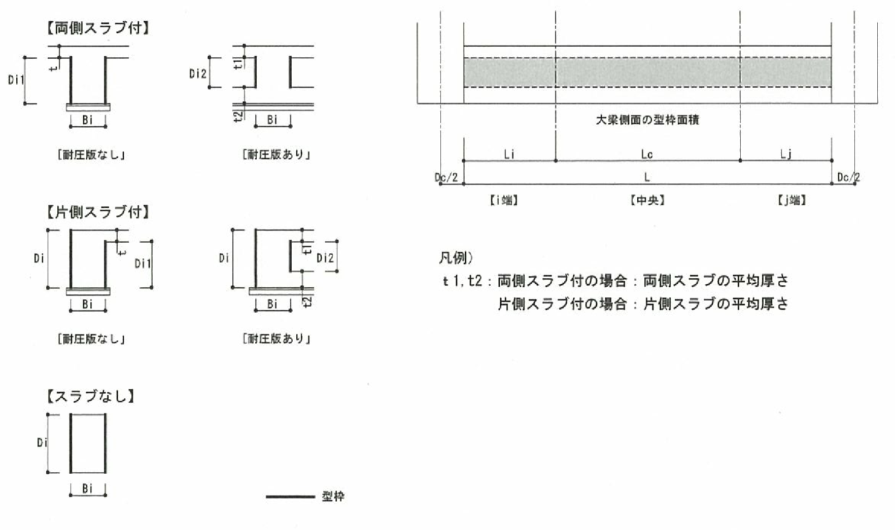
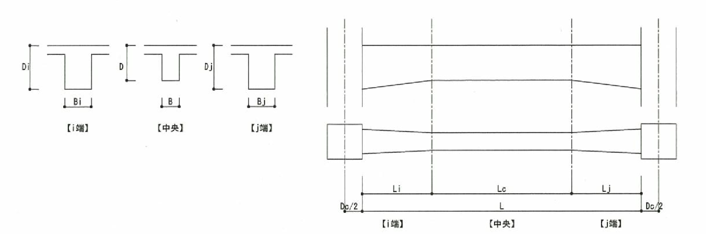
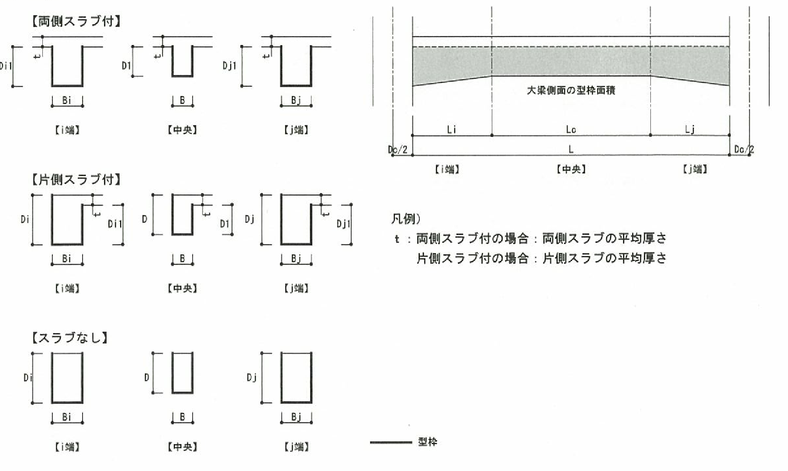
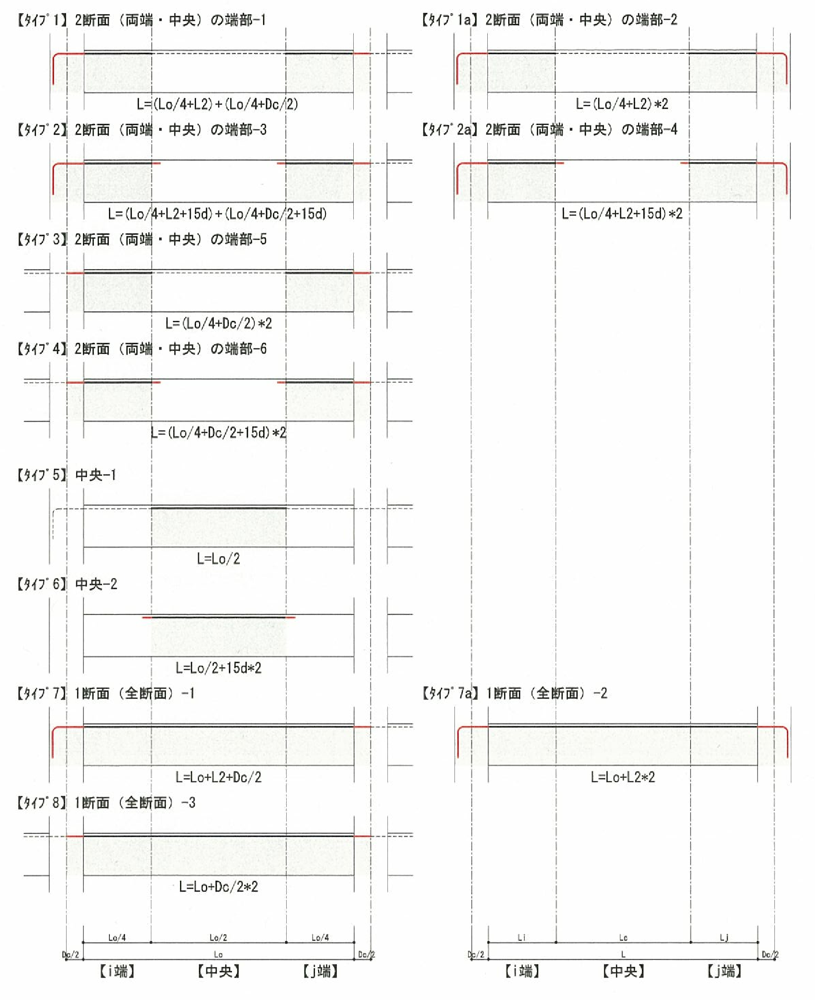
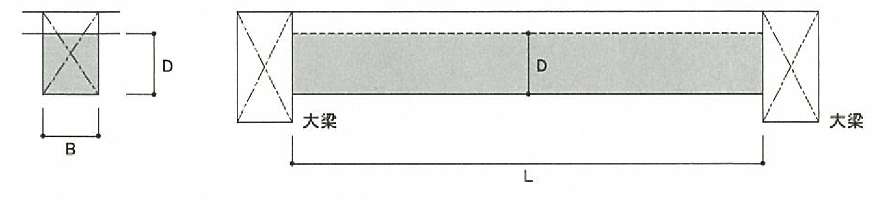
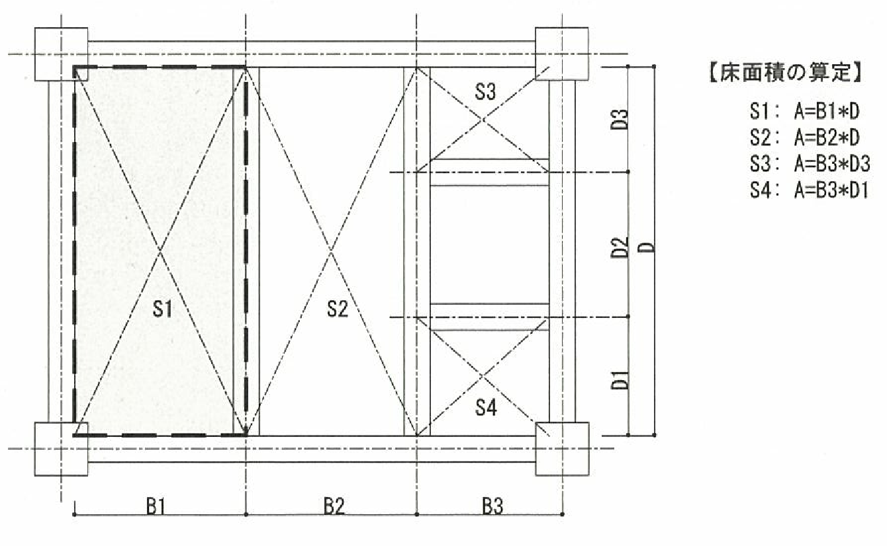
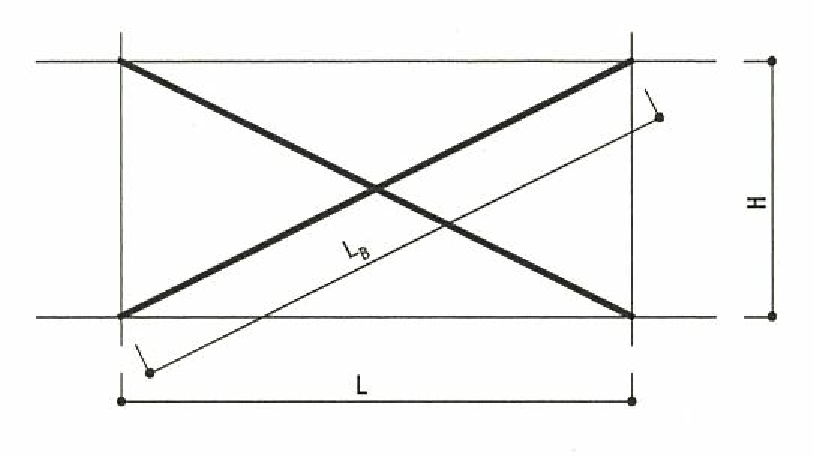

## 各部位共通事項

### 鉄筋コンクリート造

 (1)鉄筋

 鉄筋のフック、余長、重ね継手長さ及び溶接継手長さについては考慮していません。

### 鉄骨造

 (1)鉄骨

 鉄骨重量は次のように計算します。

 ・鉄骨鋼材の場合

$ W=L \times A \times 7.85$

 ここで、$W$：鉄骨重量、$L$：鋼材長さ、$A$：鋼材断面積、$7.85t/m^3$：鉄骨単位重量(固定値)

### 鉄骨鉄筋コンクリート造

 (1)コンクリ―ト

 コンクリート体積は鉄骨体積を差し引かずに計算します。

## 基礎梁・基礎フーチング

 (1)コンクリート

 ・ハンチなしの場合：$B×D×L$

 ・ハンチ付きの場合：$B×D×L+\frac{[(B+B_i)×(D+D_i)]×L_i}{A}+\frac{[(B+B_j)×(D+D_j)]×L_j}{A}$

 ※寸法のとり方は「[大梁](#大梁)」の図を参照のこと。

 (2)型枠

 

 型枠面積：$D×L+\frac{(D_i-D×L_i)}{2}+\frac{(D_i-D×L_i)}{2}+B×L+(B_i-B)×L_i+(B_j-B)×L_j$

 ※$D$,$D_i$,$D_j$については、上図のようにスラブ(2重スラブを指定した場合の耐圧版を含む)の有無により適宜スラブ厚さを控除します。また、片持ちスラブが取り付く場合も一般スラブが取り付く場合と同様に取り扱います。

 (3)鉄筋

 主筋、スターラップは[大梁](#大梁)を参照。

 (4)鉄筋継手

 基礎梁ごとに0.5個所の継手があるものとみなし、基礎梁の長さ$L$が5.0ｍ以上の場合は

 5.0ｍごとに0.5個所の継手を加えて計算します。

 圧接の場合は、継手個所数を集計します。

## 柱

 (1)寸法のとり方

 　柱長さは床上~床上を柱長さとして計算します。

 (2)コンクリート

 　コンクリート体積＝$D_x \times D_y \times H$

 　$H$：柱長さ

 (3)型枠

 　型枠面積＝$2×(D_x+D_y)×H$

 (4)鉄筋

 X,Y方向で鉄筋径が異なる場合には、隅の重なり合う部分は差し引かずに計算します。

 * 主筋

 　すべての柱はHで計算します。

 * フープ

 　フープ筋の長さ ＝ $n_x×D_x+n_y×D_y$

 　　　 　　　　　　 $n_x$：x方向一組のフープ本数

 　　　　 　　　　　 $n_y$：y方向一組のフープ本数

 　柱フープ本数 ＝ 柱内法部分フープ本数

 　 　　　　　　　 柱内法部分フープ本数＝$H/cP$

 (5)鉄筋継手

 柱頭・柱脚とおしの主筋は階ごとに1個所継手があるものとみなし、階高が7.0ｍ以上の場合は7.0ｍごとにさらに1個所の継手を加えます。

 ※柱頭・柱脚通しの主筋の本数＝min(柱頭の本数、柱脚の本数)とします。

 (6)鉄骨

 各節ごと、または各階ごとに種類別の長さと重量を算出します。柱頭と柱脚で鋼材サイズが変わる場合は、継手位置を考慮します。

## 大梁

 (1)寸法のとり方

 端部にハンチがある場合にはこれを考慮して計算します。

 

 (2)コンクリート

 　・ハンチなしの場合：$B×D×L$

 　・ハンチ付きの場合：上記にハンチ部分の体積を加算します。

 (3)型枠

 

 型枠面積：$(D×L+\frac{D_i-D}{2}×L_i+\frac{D_j-D}{2}×L_j)×2+B×L+\frac{B_i-B}{2}×L_i+\frac{B_i-B}{2}×L_j$

 ※上記の式は両側スラブ厚が等しい場合のものです。

 ※$D,D_i,D_j$については、上図のようにスラブ(2重スラブを指定した場合の耐圧版を含む)の有無により適宜スラブ厚さを控除します。また、片持ちスラブが取り付く場合も一般スラブが取り付く場合と同様に取り扱います。

 ※ハンチ部分の型枠は傾斜を無視し、大梁底面または側面に対する投影面積で計算します。

 (4)鉄筋

 * 主筋

 主筋の長さは大梁の断面数に応じて次のように算定します。

 1断面(全断面)　　　　　：大梁の全長について算定

 2断面(両端・中央)　　　：端部と中央部に分けて算定

 3断面(外端・中央・内端)：外端・内端及び中央部に分けて算定

 計算式は下図によります。

 

 * スターラップ

 　スターラップ長さ＝$2×B+n×D$

 　　　　　　　　　　$n$：一組のスターラップ本数

 (5)腹筋

 　段数は入力値、腹筋長さ＝$L$として計算します。

 (6)幅止筋

 　幅止筋長さ＝$B$

 (7)鉄筋継手

 梁ごとに0.5個所の継手があるものとみなし、梁の長さ$L$が5.0ｍ以上の場合は5.0ｍごとに0.5個所の継手を加えて計算します。

## 小梁

 (1)寸法のとり方

 

 　注）2次小梁の長さは大梁(小梁)芯間の距離とします。

 (2)コンクリート

 　コンクリート体積＝$B×D×L$（床荷重表で入力した値）

 　＊デッキスラブの場合デッキ高さ分のコンクリートは拾いません。

 (3)型枠

 　型枠面積＝$(B+2×D)×L$

 (4)鉄筋

 * 主筋

 　主筋重量　　　　：小梁コンクリート体積×0.8(%)

 * スターラップ

 　スターラップ重量：小梁コンクリート体積×0.1(%)

## 床

 (1)寸法のとり方

 床面積は大梁内法で囲まれた範囲のうちで、小梁で区切られた部分ごとに計算し、床が配置されていない部分については計算しません(下図参照)。床と小梁の重なり部分は床に含めて計算します。

 

 (2)コンクリート

 　コンクリート体積＝面積×床厚（床荷重で入力した値）

 　＊デッキスラブの場合、デッキ高さ部のコンクリートは拾いません。

 (3)型枠

 　型枠面積＝面積

 (4)鉄筋

 　鉄筋重量：床コンクリート体積×1.0(%)

## 片持ち床、出隅、入隅

 (1)寸法のとり方

 　片持ち床・出隅は、長方形として計算します。

 　入隅は長方形×２として計算し、面積は、大梁、片持ち梁、小梁、リブ間の内法とし、柱による欠除は考慮しません。

 (2)コンクリート

 　コンクリート体積＝面積×床厚

 (3)型枠

 　型枠面積＝面積

 　片持ち梁については、先端リブ、片持ち床等が何も取り付いていない側面の型枠も計上しています。

 (4)鉄筋

 　鉄筋重量：床コンクリート体積×1.0(%)

## 壁

### 耐震壁及びフレーム内雑壁

 (1)寸法のとり方

 　壁の幅は柱内法距離、壁高さは梁内法高さとし、柱及び大梁による欠除を考慮します。

 　また開口部分の面積を考慮します。

 (2)コンクリート

 　コンクリート体積＝面積×壁厚

 (3)壁枠

 　壁枠面積＝面積×2

 (4)鉄筋

 　横筋　　　　：$(L+2s)・W$

 　縦筋　　　　：$(H+2s)・h$

 　開口部補強筋：考慮していません。

 　$S$　　　　　 ：定着長さ$(35d)$

## ブレース

 各階ごと、部材符号毎に種類別の長さと重量を算出します。

 (1)寸法のとり方

 &emsp; ブレースの長さは節点間距離として計算します。

 &emsp; 

 &emsp;$L_B$ ：ブレース長

 &emsp;$H$ ：階高

 &emsp; $L$：スパン長

 (2)その他    

 &emsp; 接合部のプレート、ボルト等は考慮しません。

