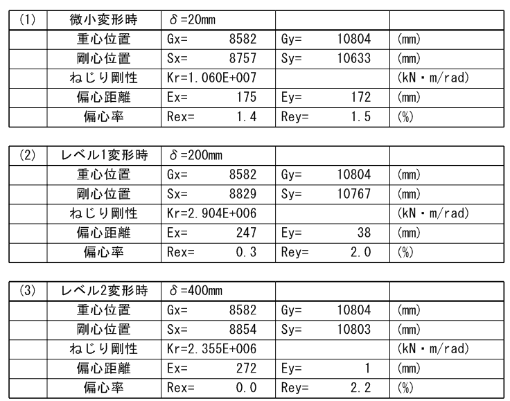
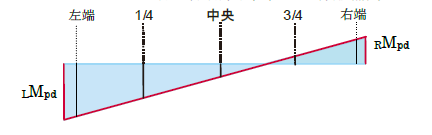
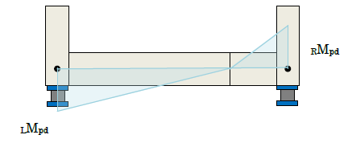
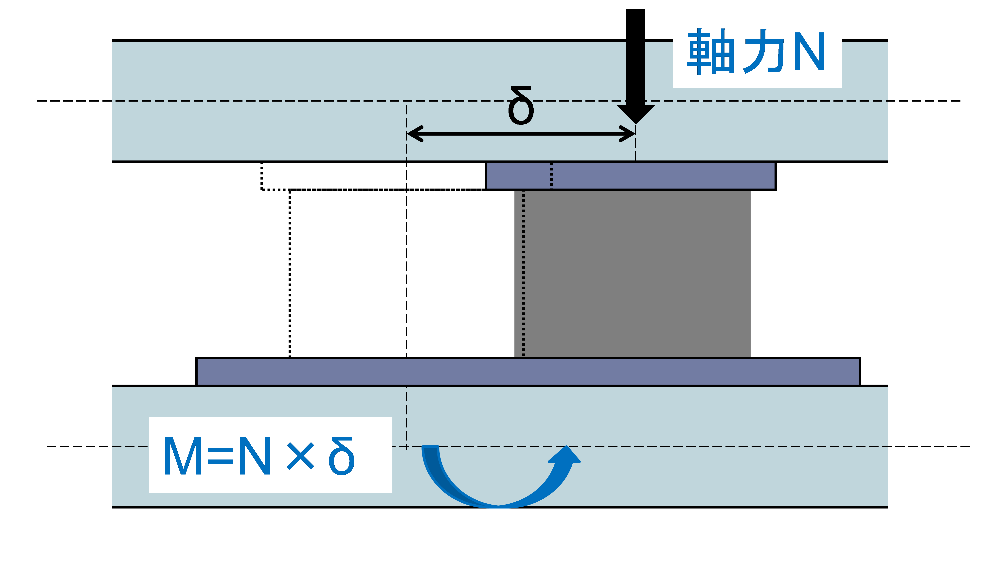
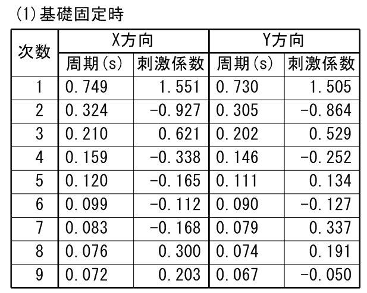
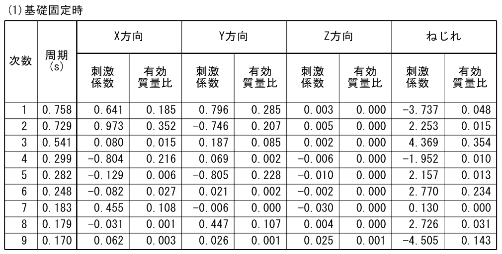
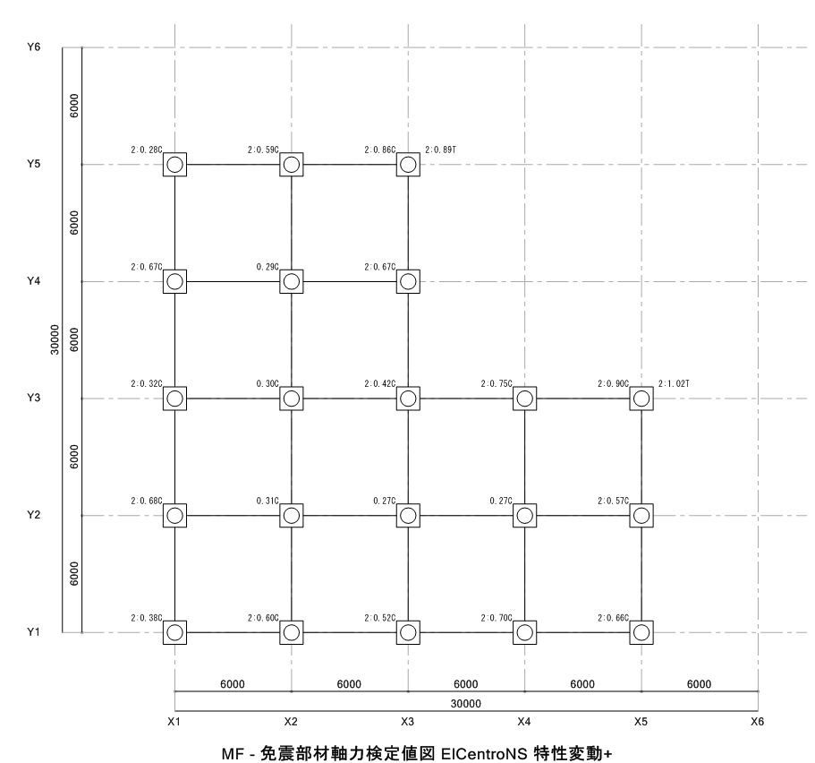
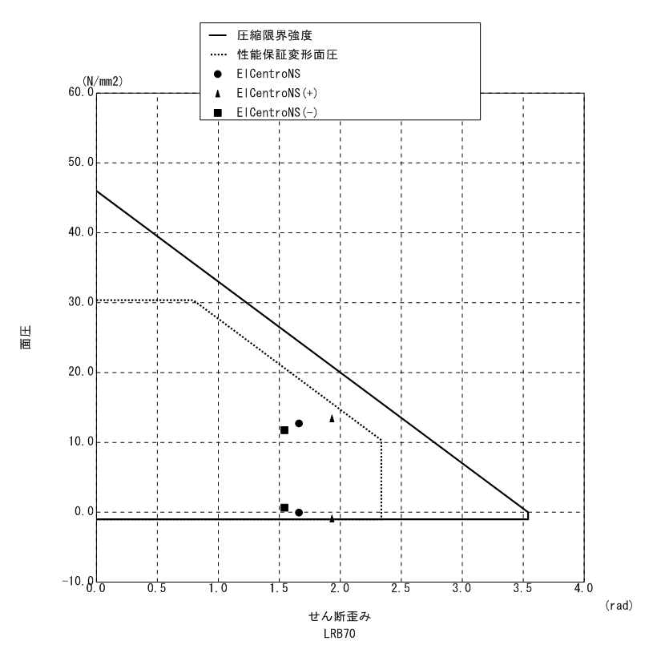

## 免震層偏心率の計算

### 計算方法

 剛心計算用の免震部材の剛性は、「免震層設計条件」で設定された「免震層想定変形」に基づいた等価剛性として計算します。剛性の計算方法は「免震層偏心率計算・固有値解析モデルの剛性」と同様です。

### 出力例

## 免震層上下大梁の検定

### 設計用応力

 大梁の設計用応力は1次設計時の応力を用います。

### 免震部材のせん断力による付加曲げモーメント

 「応力計算条件」-「免震装置のモデル化」において、「せん断力によって発生するモーメントを考慮する」としている場合には1次設計用のモーメントに免震部材のせん断力による付加曲げモーメントが含まれています。「せん断力によって発生するモーメントを考慮しない」としている場合には、免震上下大梁の断面検定時に応力として加算します（免震設計計算書）。このとき、採用する$Q-h$モーメントは、「$P-δ$、$Q-h$付加曲げ計算用層間変位」で入力された変位が発生した際に各支承材に発生するせん断力を用いて計算されます。

### 免震部材のP-δ効果による付加応力

 「免震層設計条件」-「免震層上下大梁設計時のP-δ効果による付加曲げモーメント」の「$P-δ$、$Q-h$付加曲げ計算用層間変位」で入力した層間変位$δ$から付加曲げモーメントを計算します。$P-δ$効果による付加曲げモーメントは支承材タイプにより計算方法が異なります。$P-δ$効果による付加曲げモーメントを計算する際に、上下動係数を考慮するか否かは計算条件により設定可能です。

 ・付加曲げモーメントは免震部材の軸力が引張のときには0とします。

 ・付加曲げモーメントは、左端・右端それぞれにおいて水平荷重時のモーメントと同じ符号としてモーメントを割り増す方向に作用させます。

 ・端部以外のモーメントは左端・右端から線形補間により計算します。

 

 ・支承材がない位置の付加曲げモーメントは0とします。　

 ・付加せん断力は　($M_{pd}+M_pd)/L$により計算します。

 ($_LM _{pd}$：左端付加曲げモーメント、
 $_RM _{pd}$：右端付加曲げモーメント、$L$：材長)

 ・大梁を分割して入力し、支承材が抜ける箇所がある場合には下記のように付加応力が計算されるため注意が必要です。その場合、一本部材指定を行うことで付加応力を適切に評価することが可能です。

 

大梁が分割されて支承材が配置されない箇所がある場合の仮定

 P-δ効果による付加応力は支承材のタイプにより以下のように計算されます。

    

&emsp;&emsp; 積層ゴム支承（すべり、転がり支承以外）    

     

&emsp;&emsp; すべり支承（すべり面が下側の場合)  

 また、<u>大梁ごとに「P-δ付加曲げを無視する」の指定を行うことが可能です</u>。これは配置形状から、$P-δ$による付加曲げを負担すべきでないと判断される大梁がある場合のための機能になります。たとえば、大梁として配置されている片持ち梁などが該当します。この指定をした大梁が$P-δ$付加曲げ計算対象となる節点の周辺に存在する場合、指定された大梁以外の大梁で付加曲げを分配して計算されます。

## 固有値解析

### 計算方法

 「免震層設計条件」で設定された「免震層想定変形」から計算した免震部材の剛性を考慮した固有値解析を行います。また、免震部材を十分に硬くした固有値解析も行います。

### 出力例  

　・質点系固有値　　  

　　
　  

　・立体固有値　　

　　 

### 免震部材の面圧検定

#### 計算方法

各免震部材の許容面圧に応じて、振動解析結果の面圧が許容値を超えていないかどうかをチェックします。各部材の面圧・歪みは以下とします。指定による静的解析結果を採用することも可能です。

a) 立体振動解析結果

* 面圧 ：
  * (静的解析結果を用いる場合)1次設計時軸力による免震部材の面圧
  * (動的解析結果を用いる場合)振動解析結果による免震部材の面圧±上下震度による面圧

 　　　　
 ※水平上下同時入力を行った場合には、上下震度を設定しておくと重複して評価されることに注意が必要です。

* 歪み ：
  * クライテリア変形時
  * (動的解析結果を用いる場合)最大応答変形

b) 質点系振動解析結果

* 面圧 ：
  * 1次設計時軸力による免震部材の面圧±上下震度による面圧

 OTM低減係数を設定した場合、水平荷重時軸力にOTM低減係数を乗じた値を水平荷重軸力として採用します。

* 歪み ：
  * クライテリア変形時
  * (動的解析結果を用いる場合)免震層最大応答変形から計算される歪み

#### 出力例  

　・検定比図　（発生面圧）/（各ひずみによる許容面圧）

　　   

　・部材種類ごとの面圧詳細図

　　   

