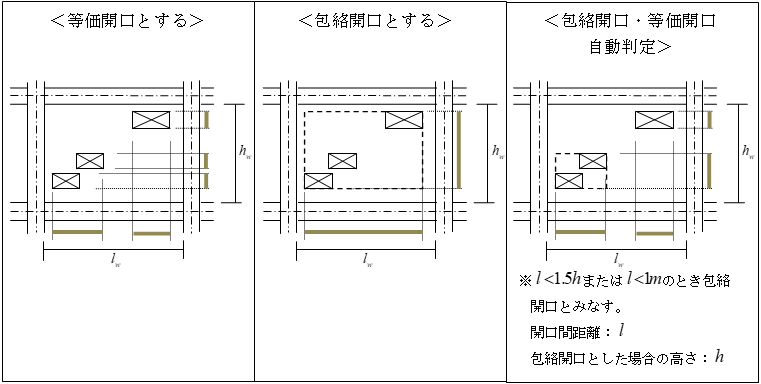

## RC大梁の剛性

### 剛性増大率

#### 軸断面積

梁の断面積は腰壁･垂壁を考慮します。腰壁・垂壁のヤング係数は母材と同じと仮定します。

#### 断面二次モーメント

梁の断面2次モーメントは、柱と同じ算定方法により計算します 注1）。$A～C$を選択した場合は、腰壁・垂壁を評価して断面2次モーメント$I$を求めます。上記の$A$または$B$の評価は腰壁・垂壁のみについて等価断面として考慮し、床は別途計算し加算します。$C$の評価の場合、腰壁・垂壁および床をすべて形状通り評価します。中立軸はいずれの場合も床スラブを考慮した中立軸を採用します。床の厚さは、建物全体で一律に設定できます 注1）。  
床については、$A$.協力幅による自動計算、または$B$.剛性増大率の直接入力により剛性の評価方法を設定できます 注1）。二重スラブとして配置した床は、荷重のみを評価して剛性は考慮しません。また、片持ちスラブを剛性として考慮するかどうかについては「剛性条件」により設定できます。    
※「鉄筋・鉄骨の剛性を考慮する」とした場合には剛性増大率は変化せず、剛性増大率を乗じる元となる断面2次モーメントを増大させます。

 　　

 注1)　メインメニュー「設計・計算条件」→「剛性条件」参照。

##### 協力幅の計算

a) 協力幅による自動計算

協力幅はRC規準8条「構造解析の基本事項」により算定します。床の厚さは建物全体で一律に設定します注1）。

 　　

床組みを構成する大梁のうち以下のすべての条件を満たす大梁群は連続梁と見なしてλを算出します。
  
・方向が同じ大梁  

・直線上に配置されている大梁  

・中間に柱が存在しない  

 　　

* λ算出の例

吹抜けがある場合は、床の長さの比を倍率としてbaにかけて算定します。

　　

$ba' = \frac{l_1+l_3}{l_1+l_2+l_3} \cdot ba$

※床荷重リストで床厚を0[mm]とした床は吹抜けと同様に扱います　　

協力幅の計算例を以下に示します。

下図のような平面において、

(大梁1-2の場合)

 &emsp; $ba = \left( 0.5-0.6\times\frac{2.5}{6.0} \right) \times2.05\times \frac{3.0}{3.0+3.0}=0.313$

 &emsp; $B = 0.5+0.313 = 0.813$

(大梁2-3の場合)

 &emsp; $ba = 0.1\times5.0\times \frac{2.5}{2.5+2.5}=0.250$

 &emsp; $B = 0.5+0.250 = 0.750$

(大梁5-8の場合)
 &emsp; $ba1 = 0.1\times6.0\times \frac{3.0+1.0}{3.0+2.0+1.0}=0.4000$

 &emsp; $ba2 = 0.1\times6.0=0.6000$

 &emsp; $B = 0.5+0.400+0.6000=1.500$

(大梁8-9の場合)
 
 &emsp; $ba = 0.1\times5.0\times \frac{2.5}{2.5+2.5}=0.250$

 &emsp; $B = 0.5+0.250=0.750$
 　　

b) 剛性増大率の直接入力

片側スラブ、両側スラブごとに剛性増大率を用いて算定します。

  
#### 構造スラブ符号指定

床に対して構造スラブ符号を指定した場合、梁上部のコンクリートは梁に指定したコンクリート材料によるヤング係数を採用し、梁の片側もしくは両側に取り付くスラブについては設定した構造スラブのコンクリート材料によるFcを採用します。  

### RC大梁の断面性能

鉄筋コンクリート造梁の断面性能の計算は以下によります。

#### 軸断面積（$A_n$）

梁の軸断面積（$A_n$）は、鉄筋を考慮して次式により算定します。

$A_n=({B \cdot (D-t)+B \cdot t+(n-1) \sum \alpha_i}) \cdot \frac{l_0}{l}$

$n$：ヤング係数比

$l_0$：可撓長さ（剛域を考慮した長さ）（mm）

$l$：節点間長（mm）

異種強度梁の場合、補正したヤング係数$E_{ce}$に、軸断面積$A_n$を乗じて算定します。
補正ヤング係数は以下のように算出します。

$E_{ce}=E_{cu} \cdot T/D + E_{cd} \cdot (D-T)/D$

ここで、    
・$E_{cu}=3.35 \cdot 10^4 \cdot (\gamma_u/24)^2 \cdot (F_{cu}/60)^{1/3}$　（単位:N/mm2）  
・$E_{cd}=3.35 \cdot 10^4 \cdot (\gamma_d/24)^2 \cdot (F_{cd}/60)^{1/3}$　（単位:N/mm2）  
・$\gamma_u$, $\gamma_d$：それぞれ梁上部, 梁下部コンクリートの単位体積重量  
・$F_{cu}$, $F_{cd}$：それぞれ梁上部, 梁下部コンクリート強度  

#### せん断変形用断面積（$A_S$）

$A_s=\frac{B \cdot D}{\kappa}$

$κ$：形状係数（＝1.2）

異種強度梁の場合、補正したせん断弾性係数$G_{ce}$に、せん断断面積$A_s$（RESP-D計算編マニュアルに従います）を乗じて算定します。

&emsp;異種強度梁のせん断弾性係数$G_{ce}$は、補正したヤング係数$E_{ce}$より下式により算定します。

$G_{ce}=E_{ce}/\{2(1+\nu)\}$

#### 断面2次モーメント（$I_e$）

鉄筋コンクリート造梁の断面2次モーメント（$I_e$）は鉄筋を考慮して次式により算定します。

$I_e = \frac{B \cdot D^3}{12}+ \frac{(b-B)t^3}{12}+B \cdot D \cdot (g-D/2)^2+(b-B) \cdot t \cdot (D-t/2-g)^2+(n_r-1) \sum \alpha_i(g-y_i)^2$

$g = \frac{1/2b \cdot D^2+(b-B) \cdot t \cdot (D-t/2)+(n_r-1) \sum \alpha_i \cdot y_i}{B \cdot D+(b-B) \cdot t+(n_r-1) \sum \alpha_i}$

$g$：梁下端から図心位置までの距離（mm）

 

大梁で構造スラブにより異なるFcを指定した場合、以下の計算となります。  

$I_e = \frac{B \cdot D^3}{12}+ \frac{(b-B)t^3}{12} \cdot \frac{E_s}{E_g} +B \cdot D \cdot (g-D/2)^2+(b-B) \cdot t \cdot (D-t/2-g)^2 \cdot \frac{E_s}{E_g} +(n_r-1) \sum \alpha_i(g-y_i)^2$

$E_g$ : 大梁コンクリートヤング係数  
$E_s$: スラブコンクリートヤング係数  

異種強度梁の場合、補正したヤング係数$E_{ce}$を用いて算定します。

#### ねじり断面2次モーメント（$J$）

 指定により、ねじり剛性を考慮することが可能です。壁、床が取付かない元断面に対してねじり剛性を次式で算定します。

矩形 :     

 $J = \frac{B^3 \cdot D}{16} \cdot \left[ \frac{16}{3}-3.36 \cdot \frac{B}{D} \cdot \left( 1-\frac{1}{12} \cdot \left( \frac{B}{D} \right)^4 \right) \right]$

円形 :   
$J = \frac{\pi r^4}{2}$

## RC柱の剛性 

### 剛性増大率 

#### 軸断面積 

柱の軸断面積は袖壁および直交袖壁を考慮し、せん断断面積には直交袖壁は無視し袖壁のみ考慮します。袖壁のヤング係数は母材と同じと仮定します。

 　　

#### 断面2次モーメント

柱の断面2次モーメントの算定方法は、下記のいずれかの選択により設定できます 注1）。$A～C$を選択した場合は、直交壁は無視し、袖壁のみを評価して断面2次モーメントを求めます。求めた断面2次モーメントと元の断面の断面2次モーメントの比率を剛性増大率として設定します。  

※「鉄筋・鉄骨の剛性を考慮する」とした場合には剛性増大率は変化せず、剛性増大率を乗じる元となる断面2次モーメントを増大させます。

### RC柱の断面性能

鉄筋コンクリート造柱の断面性能の計算は以下によります。

#### 軸断面積（An）

 柱の軸断面積（An）は、鉄筋を考慮して次式により算定します。

$A_n = ({B \cdot (D-t)+B \cdot t+(n-1) \sum \alpha_i}) \cdot \frac{l_0}{l}$

$n$：ヤング係数比

$l_0$：可撓長さ（剛域を考慮した長さ）（mm）

$l$：節点間長（mm）

#### せん断変形用断面積（$A_S$）

$A_s = \frac{B \cdot D}{\kappa}$

$κ$：形状係数（＝1.2）

#### 断面2次モーメント（$I_e$）

鉄筋コンクリート造柱の断面2次モーメント（$I_e$）は鉄筋を考慮して次式により算定します。

$I_e = \frac{B \cdot D^3}{12}+ \frac{(b-B)t^3}{12}+B \cdot D \cdot (g-D/2)^2+(b-B) \cdot t \cdot (D-t/2-g)^2+(n_r-1) \sum \alpha_i(g-y_i)^2$

$g = \frac{1/2b \cdot D^2+(b-B) \cdot t \cdot (D-t/2)+(n_r-1) \sum \alpha_i \cdot y_i}{B \cdot D+(b-B) \cdot t+(n_r-1) \sum \alpha_i}$

$g$：梁下端から図心位置までの距離（mm）

 

#### ねじり断面2次モーメント（$J$）

 指定により、ねじり剛性を考慮することが可能です。壁、床が取付かない元断面に対してねじり剛性を次式で算定します。

矩形 :     

 $J = \frac{B^3 \cdot D}{16} \cdot \left[ \frac{16}{3}-3.36 \cdot \frac{B}{D} \cdot \left( 1-\frac{1}{12} \cdot \left( \frac{B}{D} \right)^4 \right) \right]$

円形 :   
$J = \frac{\pi r^4}{2}$

## S梁の剛性

### 断面積

梁の断面積は、角形鋼管のコーナー部分、H形鋼のフィレット部分などを考慮した実断面積とします。

 　　

### 合成梁の断面性能

 梁が合成梁の場合の断面性能を自動計算します。合成梁の剛性は、下式で求められるスラブを考慮した剛性と鉄骨梁のみの剛性の平均とします。

$g = \frac{_cE \cdot B \cdot t \cdot (t/2)+_sE \cdot _sA \cdot (t+Hd+_sH/2)}{_cE \cdot B \cdot t+_sE \cdot _sA}$

$I = \left( \frac{_cE}{_sE} \right) \cdot \left( \frac{B \cdot t^3}{12} +B \cdot t \cdot (g-t/2)^2 \right) +_sI+_sA \cdot (g-t-Hd-_sH/2)^2$

 　　

ここで、

$_cE$ ：コンクリートのヤング係数  
$_sE$ ：鋼材のヤング係数  
$_sA$ ：鋼材の断面積  
$_sI$ ：鋼材の断面2次モーメント  
$t$ ：スラブの厚さ（計算条件の剛性で入力した値）  
$Hd$ ：デッキ高さ（計算条件の剛性で入力した値）  

### 断面欠損の考慮

 （フランジ）

 　継手部の断面欠損を考慮する場合、ユーザー指定の低減値によりフランジ幅を低減します。

 （ウェブ）

 　継手部およびスカラップによる断面欠損を考慮する場合には、ユーザー指定の低減値によりウェブ板厚を一律に低減します。

### S大梁の断面性能

#### 軸断面積（$A_n$）

 柱・梁の軸断面積（$A_n$）は、次式により算定します。
  
$A_n=A$  

$A$：鉄骨全断面積（$mm^2$）

#### せん断変形用断面積（$A_S$）

$A_s=\frac{A_w}{\kappa}$  

$κ$：形状係数（＝1.0）

#### 断面2次モーメント（$I$）

H形 : $I = \frac{BH^3-(B-t_w)(H-2t_f)^3}{12}$

角型鋼管 : $I = \frac{BH^3-(B-2t_w)(H-2t_f)^3}{12}$

円形鋼管 : $I = \frac{\pi (D^4-d^4)}{64}$

$H$ ：鉄骨梁せい (mm)

$B$ ：フランジ幅 (mm)

$t_f$ ：フランジ厚 (mm)

$t_w$ ：ウェブ厚 (mm)

#### ねじり断面2次モーメント（$J$）

 指定により、ねじり剛性を考慮することが可能です。

H形 : $J = \frac{1}{3} \left( 2 \cdot B \cdot t_f^3+(H-2 \cdot t_f) \cdot t_w^3 \right)$

## S柱の剛性

### 断面積の考え方

柱の断面積は、角形鋼管のコーナー部分、H形鋼のフィレット部分などを考慮した実断面積とします。

 　　

### 断面欠損の考慮

 （フランジ）

 　継手部の断面欠損を考慮する場合、ユーザー指定の低減値によりフランジ幅を低減します。

 （ウェブ）

 　継手部およびスカラップによる断面欠損を考慮する場合には、ユーザー指定の低減値によりウェブ板厚を一律に低減します。

### S柱の断面性能

#### 軸断面積（An）

柱の軸断面積（An）は、次式により算定します。

$A_n = A$

$A$：鉄骨全断面積（mm2）

#### せん断変形用断面積（AS）

$A_s = \frac{A_w}{\kappa}$

$κ$：形状係数（＝1.0）

#### 断面2次モーメント（I）

H形 : $I = \frac{BH^3-(B-t_w)(H-2t_f)^3}{12}$

角型鋼管 : $I = \frac{BH^3-(B-2t_w)(H-2t_f)^3}{12}$

円形鋼管 : $I = \frac{\pi (D^4-d^4)}{64}$

$H$ ：鉄骨梁せい (mm)

$B$ ：フランジ幅 (mm)

$t_f$ ：フランジ厚 (mm)

$t_w$ ：ウェブ厚 (mm)

#### ねじり断面2次モーメント（$J$）

 指定により、ねじり剛性を考慮することが可能です。

H形 : $J = \frac{1}{3} \left( 2 \cdot B \cdot t_f^3+(H-2 \cdot t_f) \cdot t_w^3 \right)$

角型鋼管 : $J = \frac{2t_ft_w(B-t_f)^2(H-t_w)^2}{Bt_w+Ht_f-t_f^2-t_w^2}$

円形鋼管 : $J = \frac{ \pi (D^4-d^4)}{32}$ 　　　( $D$ : 外径、$d$ : 内径 )

CFT : $J = \frac{_sG}{_cG} {_s}J+_cJ$　　　　（※コンクリートのせん断弾性係数を乗じて剛性とする）

## SRC造梁の剛性 

 断面性能はＲＣ造梁の剛性とＳ梁の剛性に対し、下記計算式によりヤング係数比およびせん断弾性係数比を考慮して累加した値を用います。

### SRC梁の断面性能

#### 軸断面積（$A_n$）

 梁の軸断面積（$A_n$）は次式により算定します。

 $A_n = _{rc}A_n+_sA_n(n_s-1)$

 　　　$_{rc}A_n$ ：ＲＣ部分の軸断面積

 　　　$_sA_n$ ：Ｓ部分の軸断面積

 　　　$n_s$ ：鉄骨のヤング係数比

#### せん断変形用断面積（$A_S$）

 $A_s$ = ($_{rc}A_s$ + $_sA_s(n _{gs}-1$))

 　　　$_{rc}A_s$ ：ＲＣ部分のせん断断面積

 　　　$_sA_s$ ：Ｓ部分のせん断断面積

 　　　$_ng_s$ ：鉄骨のせん断弾性係数比

#### 断面2次モーメント（$I_e$）

 梁の断面2次モーメント（$I_e$）は次式により算定します。

 $I_n$ = ($_{rc}I_e$ + $_sI_e(n_s-1$))

 　　　$_{rc}I_e$ ：ＲＣ部分の軸断面積

 　　　$_sI_e$ ：Ｓ部分の軸断面積

 　　　$n_s$ ：鉄骨のヤング係数比

#### ねじり断面2次モーメント（$J$）

 指定により、ねじり剛性を考慮することが可能です。

 SRC : $J = \frac{_sG}{_cG} {_s}J+_cJ$　（※コンクリートのせん断弾性係数を乗じて剛性とする）

## SRC柱の剛性 

 断面性能はＲＣ造柱の剛性とＳ柱の剛性に対し、下記計算式によりヤング係数比およびせん断弾性係数比を考慮して累加した値を用います。ＣＦＴもこれに準じます。

### SRC梁の断面性能

#### 軸断面積（An）

 柱の軸断面積（An）は次式により算定します。

 $A_n = _{rc}A_n+_sA_n(n_s-1)$

 　　　$_{rc}A_n$ ：ＲＣ部分の軸断面積

 　　　$_sA_n$ ：Ｓ部分の軸断面積

 　　　$n_s$ ：鉄骨のヤング係数比

#### せん断変形用断面積（$A_S$）

 $A_s$ = ($_{rc}A_s$ + $_sA_s(n _ {gs}-1$))

 　　　$_{rc}A_s$ ：ＲＣ部分のせん断断面積

 　　　$_sA_s$ ：Ｓ部分のせん断断面積

 　　　$_ng_s$ ：鉄骨のせん断弾性係数比

#### 断面2次モーメント（Ie）

 柱の断面2次モーメント（Ie）は次式により算定します。

 $I_n = \(_{rc}I_e+_sI_e(n_s-1)\)$

 　　　$_{rc}I_e$ ：ＲＣ部分の軸断面積

 　　　$_sI_e$ ：Ｓ部分の軸断面積

 　　　$n_s$ ：鉄骨のヤング係数比

#### ねじり断面2次モーメント（$J$）

 指定により、ねじり剛性を考慮することが可能です。

 SRC : $J = \frac{_sG}{_cG} {_s}J+_cJ$　（※コンクリートのせん断弾性係数を乗じて剛性とする）

## 非充腹SRC造柱・梁の剛性 

 断面性能はＲＣ造柱・梁の剛性と非充腹鉄骨弦材の剛性に対し、下記計算式によりヤング係数比を考慮して累加した値を用います。

$A = _rA＋(n-1)×_sA$

$A_s = _rA_s$

$I = _rI＋(n-1)×_sI$

$A$ ：非充腹ＳＲＣ断面積  
$A_s$ ：非充腹ＳＲＣせん断断面積  
$I$ ：非充腹ＳＲＣ断面２次モーメント  
$_rA$ ：ＲＣ断面積  
$_rA_s$ ：ＲＣせん断断面積  
$_rI$ ：ＲＣ断面２次モーメント  
$_sA$ ：非充腹鉄骨弦材断面積  
$_sI$ ：非充腹鉄骨弦材断面２次モーメント    
$n$ ：ヤング係数比  

## 間柱ダンパーの剛性 

 間柱ダンパーは支持部とダンパー部からなる３分割要素としてモデル化されます。支持部、ダンパー部それぞれ異なる剛性として評価します。ダンパー部は製品の特性により、履歴型の非線形特性を有するものとしてモデル化します。支持部の長さは下図のように算出されます。ダンパーの種類により、静的剛性を持つもの、静的剛性を持たないもの、指定により静的剛性を考慮することが可能なものがあります。

 　　

 　　

| 種別         | 種類                          | 静的剛性         |
|:--------------:|:-------------------------------:|:------------------:|
| 履歴型       | 間柱型鋼材ダンパー            | あり             |
|             | JFEシビル制振間柱             | あり             |
| 粘性・粘弾性 | オイレス工業粘性制震壁        | 指定により考慮可 |
|             | 免制振ディバイス粘性制震壁    | なし             |
|             | 日鉄エンジニアリング          | あり             |
|             | ユニットゴムダンパー          |                 |
|             | 住友理工 TRCダンパー          | あり             |
|             | AFTダンパーシステム           | なし             |
|             | JFEシビル間柱型粘弾性ダンパー | 指定により考慮可 |
|             | コンステック CSTダンパー      | なし             |
| 流体         | オイルダンパー                | なし             |

　　

### 日鉄エンジニアリングユニットゴムダンパーの静的弾性剛性
  
 静的弾性解析時の剛性は、以下の式に対しγ=0.1、β=20.0を代入して算出したkuを用います。

**a) 等価剛性 keq（kN/mm）**

 $k_{eq} = G_{eq}\times\frac{s}{d}$

 $G_{eq}$：等価せん断弾性係数（$kN/mm^2$）

 $G_{eq}$＝$0.84×γ^{－0.5}$　　　　（$0.1≦γ≦3.0$）

 $γ$：歪み
 $s$：せん断面積（$mm^2$）
 $d$：厚さ（$mm$）

**b) 一次剛性 ku（kN/mm）**

$k_u = \beta \times k_{eq}$

　　　

### 住友理工　TRCダンパーの静的剛性

 静的弾性解析時の剛性は、以下の式により計算します。

$_0K_2 = 1.57\times\frac{As}{d}\times\beta$

$β$: 温度補正係数　(= $e^{-0.017(T-20)}$)

## 耐震壁(壁エレメントモデル)の剛性 

### 耐震壁(壁エレメントモデル)の断面性能 

耐震壁は壁エレメントモデルでモデル化されます(指定により、平面応力要素、板要素でモデル化することも可能です)。全体としての断面性能は、壁柱の断面性能、側柱の断面性能および上下大梁の断面性能により表現されます。

壁エレメントモデルは、鉛直の梁要素（間柱）を両端ピンの剛梁ではさみ込んでモデル化し、剛梁と間柱は剛接合、剛梁の両端はピン接合となっています。このため、四隅の節点の水平・上下の変形が間柱に伝達されます。なお、剛梁は実際に梁要素が存在するわけではなく、剛域変換によって剛梁の両端の節点の変位が間柱に伝達されます。

#### 壁柱の断面性能

 　軸剛性 ：壁板部分の断面積から計算します（鉄筋剛性を考慮します）

 　曲げ剛性
 ：壁板部分の断面にもモーメントから計算します（鉄筋剛性を考慮します）

 側柱部分のローカル断面2次モーメントは考慮しません。

 　せん断剛性 ：壁板部分の断面および側柱部分の断面から計算します。

 その際、下式による形状係数および開口による低減率rを考慮します。

$\kappa = \frac{3(1+\xi)}{5(1-\xi^3(1-\eta))^2} \left[\eta+\xi(1-\eta) \left( \frac{15}{8}(1-\xi^2)^2-\xi^4\eta \right) \right]$

$r = 1-1.25 \sqrt{ \frac{h_0 \cdot l_0}{h \cdot l}}$

#### 側柱の断面性能

 　軸剛性 ：通常の柱と同様に計算します。

 　曲げ剛性 ：通常の柱と同様に計算します。

 　　　　　　　ただし、耐震壁面内方向は両端ピンのためモーメントを負担しません。

 　せん断剛性 ：通常の柱と同様に計算します。

 　　　　　　　ただし、耐震壁面内方向は両端ピンのためせん断力を負担しません。

 #### 上下大梁の断面性能

通常の大梁に対し、倍率を乗じた剛性を採用します。倍率は剛性計算条件で設定できます。既定値は100倍となります。  

### 耐震壁の判定 

 耐震壁の条件は下記を満たすものとして取り扱います。ただし、下記によらず強制的に耐震壁とみなして壁エレメントモデルとしてモデル化する指定も可能です。  

* スリットがないこと。
* 壁厚が120mm以上であること。
* 開口周比r0≦0.4を満たすこと。

 （指定によりL0/L、H0/Hも条件に含めることが可能です）

### 複数開口の取り扱い 

 複数の開口部については、「等価開口とする」「包絡する」「包絡開口・等価開口自動判定」の３つから選択できます。それぞれ下記のように開口を評価します。なお、３つ以上の開口があり「包絡開口・等価開口自動判定」とした場合、各開口間で包絡開口が作れなくなるまで繰り返し包絡開口を作成し、包絡できなくなった時点の開口状況で「等価開口とする」と同様の判定を行います。

$l_w$：壁内法幅

$h_w$：壁内法高さ

また、等価開口とする場合の開口寸法は以下のように計算します。 

$l'_0\times h'_0=l_1\times h_1+l_2\times h_2$

$l'_0:h'_0=l_w:h_w$

$h_1,h_2$ ：開口部の高さ

$l_1,l_2$ ：開口部の長さ

$h_w$ ：壁の内法高さ

$l_w$ ：壁の内法長さ

$h'_0$  ：置換した開口部の高さ

$l'_0$  ：置換した開口部の長さ

### フレーム内雑壁のモデル化 

 壁が開口により耐震壁にならなかった場合、周辺のＲＣ部材およびＳＲＣ部材の断面性能に壁が考慮されます。複数開口が存在する場合は、包絡開口により壁の長さを考慮します。剛性に用いる壁の長さは構造階高および軸間距離の1/2の位置における包絡開口までの距離を採用します。また、柱の回転により壁が傾斜して部材に取り付いている場合には傾斜を無視し軸上に壁断面があるものとして計算します。

開口の位置は意匠階高を基準として算出します。
上下の梁が鉛直方向に傾き、下層節点または上層節点においてZ座標が異なる場合は、以下のように認識します。

- 上層節点は、Z座標の小さい方を基準にします。
- 下層節点は、Z座標の大きい方を基準にします。

### 耐震壁(平面応力要素、板要素)の断面性能 

指定により、耐震壁を平面応力要素および板要素としてモデル化することが可能です。
面要素は節点位置に対して配置されます。  
面要素でモデル化した場合、付帯柱はピンとなりません。
また、指定により周辺の柱梁および面要素をメッシュ分割することが可能です。  

## ブレースの剛性 

### 一般ブレースの剛性 

一般ブレースの剛性計算は、下式によって求めます。
**引張専用ブレースとした場合、引張となるブレースと圧縮となるブレースが対になって存在すると考え、弾性解析では剛性を1/2としてモデル化します。弾塑性解析の場合は初期剛性は1倍としてモデル化されます。**

　
$K_B = \frac{EA}{L}$

　

ここで、

　　　　$L$：芯々間の長さ

　　　　$A$：降伏部の断面積

### 日鉄エンジニアリングアンボンドブレースの剛性 

アンボンドブレースの1次剛性は下式により計算します。

 　　　$K_1 = \phi_A\times \frac{EA_c}{L}$

 　　　　$φ_A$:等価剛性倍率

 　　　　$L$：芯芯間の長さ

 　　　　$A_c$：塑性化部断面積

 等価剛性倍率の計算例を以下に示します。

 &emsp; $\phi_A = \frac{1}{\alpha+2\beta \frac{A_c}{A_e}+(1-\alpha-2\beta ) \frac{A_c}{A_p}}$

 　ここで、

$α$　　：塑性化部長さの柱・梁芯間長さに対する比(=$L_c/L$)

$β$　　：弾性部長さの柱・梁芯間長さに対する比(=$L_e/L$)

$A_c/A_e$　: 塑性化部断面積の弾性部断面積に対する比

$A_c/A$p$　: 塑性化部断面積のパネルゾーン断面積に対する比

 　

### JFEシビル　KTブレースの剛性 

JFEシビルKTブレースの剛性計算は下式によって求めます。

$K_B = \frac{EA}{L}$
 　
 ここで、

 　　　　$L$：構造心間長さ

 　　　　$A$：軸力管の断面積

### JFEシビル　二重鋼管座屈補剛ブレースの剛性 

JFEシビル二重鋼管座屈補剛ブレースの剛性計算は以下によって求めます。

剛性計算を「自動」とした場合、JFEシビル二重鋼管座屈補剛ブレースの剛性計算は下式によって求めます。

$\frac{1}{K_e} = \frac{1}{K_d}+\frac{1}{K_b}+\frac{1}{K_r}, \quad K_d = \frac{E \cdot A_d}{L_d}, \quad  K_b = \frac{b \cdot E \cdot A_d}{L_b}, \quad  K_r = \frac{E \cdot A_r}{L_r} = \infty$

$K_e$ : ブレース剛性

$K_d$ : ダンパー部剛性

$K_b$ : 取付け部剛性

$K_r$ : 剛域部剛性

$b : 取付け部断面積比(=$A_b/A_d$)

$L_d$ : ダンパー部長さ

$L_b$ : 取付け部長さ

$L_r$ : 剛域部長さ

$A_d$ : ダンパー部

$A_b$ : 取付け部断面積

$A_r$ : 剛域部断面積(=∞)

ダンパー部長さ、取付け部長さを以下のように計算します。

 $L_d = d \cdot L, \quad L_b = (1-d-r) \cdot L, \quad L_r = L-L_d-L_r$

  $d$ : ダンパー部長さ

  $r$ : 剛域部長さ

  $L$ :構造芯間長さ

 ダンパー部長さ比、剛域長さ比は以下のように計算します。

 $d = 1-\frac{\max (L_{x1},L_{y1})+\max (L_{x2},L_{y2}) +2 \cdot G_L}{L}$

 $L_{x1} = S_{x1}/ \cos \theta+0.5 \cdot G_w \cdot \tan \theta$

 $L_{y1} = S_{y1}/ \sin \theta+0.5 \cdot G_w/ \tan \theta$

 $S_{x1} = 0.5 \cdot D_{C1}+x1$

 $S_{y1} = 0.5 \cdot D_{G1}+y1$

 $L_{x2} = S_{x2}/ \cos \theta+0.5 \cdot G_w \cdot \tan \theta$

 $L_{y2} = S_{y2}/ \sin \theta+0.5 \cdot G_w/ \tan \theta$

 $S_{x2} = 0.5 \cdot D_{C1}+x2$

 $S_{y2} = 0.5 \cdot D_{G1}+y2$

 $r = \frac{\max (R_{x1},R_{y1})+\max (R_{x2},R_{y2})}{L}$

 $R_{x1} = 0.5 \cdot D_{C1}/ \cos \theta$

 $R_{y1} = 0.5 \cdot D_{G1}/ \sin \theta$

 $R_{x2} = 0.5 \cdot D_{C2}/ \cos \theta$

 $R_{y2} = 0.5 \cdot D_{G2}/ \sin \theta$

剛性計算を「倍率指定」とした場合、JFEシビル二重鋼管座屈補剛ブレースの剛性計算は下式によって求めます。

 $K_e = \alpha \cdot K_d, \quad K_d = \frac{E \cdot A_d}{L}$

  $L$ : 構造芯間長さ

  $K_e$ : ブレース剛性

  $K_d$ : ダンパー部合成

  $α$ : 指定倍率

## 免震支承材の剛性 

### 静的・動的解析モデルの剛性 

免震部材の剛性は各メーカーカタログスペックによります。

モデル化は「応力計算条件」の「免震部材のモデル化」によって変わります。

「せん断力によって生じるモーメントを伝達する」とした場合、免震部材は下図に示す「剛域付きせん断ばね」でモデル化されます。<u>このモデル化とした場合、免震部材上下の節点は回転に対する抵抗力を有しないと不安定となります。</u>

 

 「せん断ばねによって生じるモーメントを伝達しない」とした場合、免震部材は「せん断ばね」としてモデル化され、免震部材の上下の階にモーメントを伝達しません。

 なお、免震部材の静的解析時剛性は、「剛性条件」「静的解析時の免震部材剛性」の設定により変わります。「静的解析時には免震部材を固定する」とした場合、せん断剛性を剛としてモデル化し、振動解析の時のみ本来のせん断剛性を採用して計算します。

 また、ばねの部分は積層ゴム支承や履歴系減衰材の場合はマルチ・シア・スプリングでモデル化します。すべり支承の場合は動的解析においては方向ごとではなくベクトルによる合力で滑り状態を評価する摩擦ばねでモデル化されますが、静的解析時にはマルチ・シア・スプリングでモデル化します。

 静的解析時の剛性については、デフォルトでは十分に硬い剛性となるような剛性倍率を乗じてモデル化されます。倍率については「剛性計算条件」で指定可能です。

## 免震層偏心率計算・固有値解析モデルの剛性

免震構造では、免震層の変形を仮定した割線剛性によるせん断剛性から偏心率計算および固有値解析を行うことができます。仮定する変形は、「免震層設計条件」により設定します。なお、免震構造として認識させるためには「基本事項」→「階・軸の追加・削除」→「階名称の変更・免震層指定」により免震層を設定する必要があります。

 鉛プラグ挿入型積層ゴム、錫プラグ挿入型積層ゴム、

 Ｕ型ダンパー e.t.c.

 （バイリニアもしくは歪み依存バイリニアとなる部材）

 高減衰積層ゴム e.t.c.

 （曲線的な挙動となる部材）

 弾性すべり支承、転がり支承 e.t.c.

 （完全バイリニアとなる部材）

## 剛域の計算

### RC造・SRC造の剛域（自動計算） 

柱・梁の剛域は、壁が取り合わない場合と取り合う場合、また壁が取り合わない場合については梁にハンチがある場合とない場合を考慮します。耐震壁周辺の柱・梁の剛域は考慮しません。剛域長さは柱・梁毎に個別に指定することができます。

**1. 壁が取り合わない場合（梁ハンチなし）**

 柱・梁フェイスからそれぞれの部材せいの1/4だけ内側に入った位置（指定により変更可）を剛域とします。

**2. 壁が取り合わない場合（梁ハンチあり）**

 材が軸に対し25°以上の傾斜をするハンチを持つ場合には、材のせいが1.5倍の点を持って剛域を
 定めます。ただし、ハンチの傾斜が60°以上のときは、ハンチの基点より材せいの1/4入った点
 （指定により変更可）で 定めます。左右のハンチの差異、その他によって 上に定めた点が２点以上同時に存在する場合には 剛とみなせる部分が大きい方によります。

**3. 腰壁・垂壁・袖壁が取りつく場合（梁ハンチなし）**

腰壁・垂壁・袖壁が取りつく場合、下記のように剛域を設定します。入り長さ計算用のせいはフレーム内雑壁を含んだせいとします。

**4. 腰壁・垂壁・袖壁が取りつく場合（梁ハンチあり）**

2、3による剛域のいずれか大きい方を取ります。

### S造の剛域（自動計算）

* 剛域長さは0とします（指定により入り長さを設定することも可能）。

* 危険断面位置はフェイスとします。

### 混合構造の剛域（自動計算）

混合構造の場合の剛域は下記のルールで設定します。

**ＲＣ・ＳＲＣ柱の場合**

* 仕口部に接続する大梁にＲＣ・ＳＲＣ大梁が存在する場合、ＲＣ・ＳＲＣ大梁のうち最大せいの梁フェイスからD/4内側（指定によります）までの長さを剛域長さとします。

* 仕口部に接続する大梁がすべてＳ大梁の場合、剛域長さは0とします（入り長さで剛域を指定した場合には指定した入り長さから計算されます）。

**Ｓ柱の場合**

* 仕口部に接続する大梁にＲＣ・ＳＲＣ大梁が存在する場合、ＲＣ・ＳＲＣ大梁のうち最大せいの梁フェイスまでの長さを剛域長さとします。

* 仕口部に接続する大梁がすべてＳ大梁の場合、剛域長さは0とします（入り長さで剛域を指定した場合には指定した入り長さから計算されます）。

**ＲＣ・ＳＲＣ大梁の場合**

* 仕口部に接続する柱にＲＣ柱が存在する場合、ＲＣ・ＳＲＣ柱のうち最大せいの柱フェイスからD/4内側（指定によります）までの長さを剛域長さとします。

* 仕口部に接続する柱がすべてＳ柱の場合、剛域長さは0とします（入り長さで剛域を指定した場合には指定した入り長さから計算されます）。

**Ｓ大梁の場合**

* 仕口部に接続する柱にＲＣ・ＳＲＣ柱が存在する場合、ＲＣ・ＳＲＣ造柱のうち最大せいの柱フェイスまでの長さを剛域長さとします。

* 仕口部に接続する大梁がすべてＳ柱の場合、剛域長さは0とします（入り長さで剛域を指定した場合には指定した入り長さから計算されます）。

## 仕口パネルの計算 

### 剛域・材端ばねとの関連性

仕口パネルと剛域を同時に設定した場合には、パネルからはみ出した部分を剛域として計算します。ＲＣおよびＳＲＣの場合には剛性条件で仕口パネルを指定した場合、仕口パネルと剛域が自動的に設けられます。また、Ｓで仕口パネルを指定した場合でも、剛域を直接入力した場合には仕口パネルと剛域が設けられます。

また、材端ばね、材端ピンを設定した場合、ピン位置は仕口パネルまたは剛域の長い方の端部に接続します。  

### RC造・SRC造の仕口パネル

ＲＣあるいはＳＲＣパネルゾーン（接合部）の大きさは下記のように設定されます。

　幅 ：下層階柱の最大端主筋間距離  

せい ：取りつく最大せい梁の最外端主筋間距離

　

### S造の仕口パネル

Ｓパネルゾーン（接合部）の大きさは下記のように設定されます。

 

 　幅 ：下層階柱の鉄骨形状幅

 せい ：取りつく最大せい梁の鉄骨形状せい

　　　

 また、パネルゾーンの厚さは柱のウェブ厚とします。ただし、ＢＯＸ柱の場合にはウェブ厚の２倍とします。ＣＦＴの場合、コンクリート断面と鉄骨断面を等価なせん断剛性を持つコンクリート断面として置換して用います。

### 混合接合部

柱RC,大梁Sのような混合接合部の場合、仕口パネルは考慮せず剛域が考慮されます。  

### 仕口パネルのサイズと諸元

仕口パネルのサイズは以下のように計算されます。

|                  | ＲＣ     | ＳＲＣ   | Ｓ         | ＣＦＴ                     |
|:------------------:|:----------:|:----------:|:------------:|:----------------------------:|
| せん断パネル幅   | B－2×dt | B－2×dt | ウェブ厚さ | ＲＣ断面とした場合の等価幅 |
| せん断パネル長さ | D－2×dt | D－2×dt | ウェブ長さ | ウェブ長さ                 |
| 材料定数         | ＲＣ     | ＲＣ     | Ｓ         | ＲＣ                       |

## その他 

### 雑壁の剛性

フレーム内雑壁の剛性は柱の剛性として考慮します。フレーム外雑壁の剛性は、長期、水平荷重時、荷重増分解析時および立体振動解析時には考慮しません。ただし、偏心率の計算において剛性を考慮した結果も算出します。

