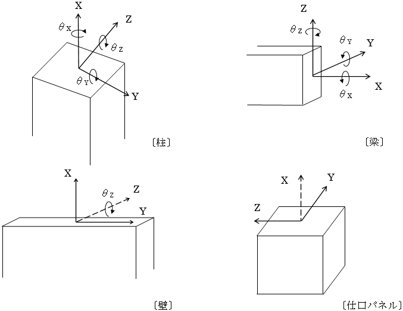
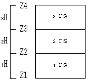
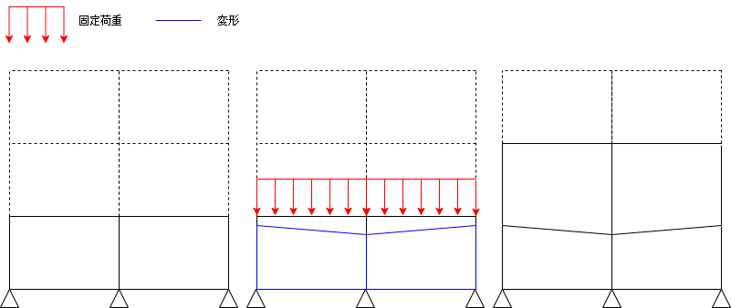
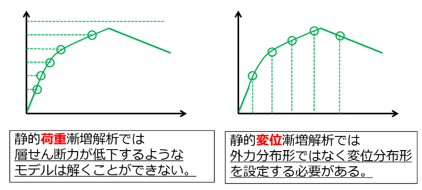
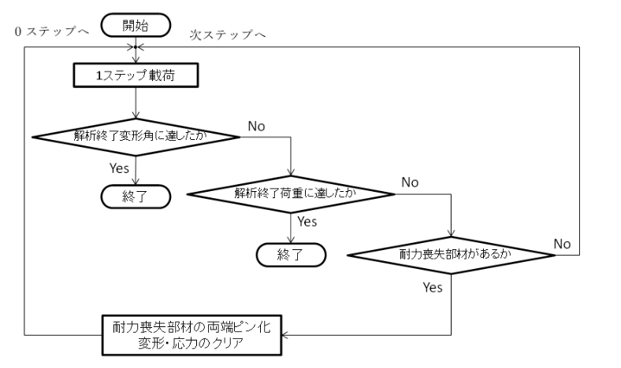
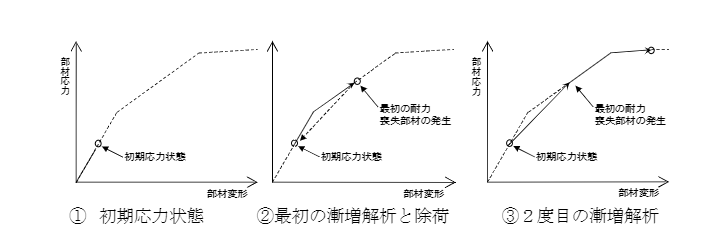
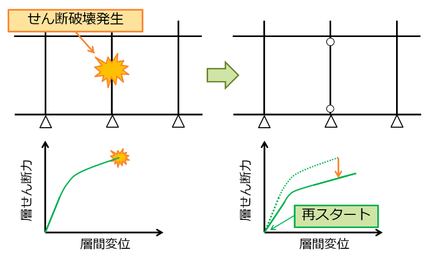

## 応力解析モデル

### 解析モデルの概要

応力及び変位は、各荷重ケースについて、３次元立体解析モデルによる応力解析を行うことにより算出します。なお、長期応力解析においては、計算条件の指定により以下の部材について長期軸力を負担させないことも可能です。

* ブレース
* 柱、制振間柱

### 応力解析の変形の考慮

各部材の変形は、下表に示す成分について考慮します。

部材の変形と自由度

| 部位・部材 |         曲げ変形      |||    せん断    ||  軸   |
|:------------:|:---------:|:-------:|:-------:|:-------:|:-------:|:-------:|
|           |  θX  | θY | θZ | γY | γZ | δX |
| 柱         | ○＊1 |   ○  |   ○  |   ○  |   ○  |   ○  |
| 梁         | ○＊1 |   ○  |   ○  |   ○  |   ○  |   ○  |
| 壁         |    ―   |   ―  |   ○  |   ○  |   ―  |   ○  |
| ブレース   |    ―   |   ―  |   ―  |   ―  |   ―  |   ○  |
| 節点バネ   |    ―   |   ○  |   ―  |   ○  |   ○  |   ―  |

 ＊1　指定による。

部材の変形と自由度

## 層間変形角、剛性率

立体として応力解析を行うため、層間変形角は位置ごとに異なります。層間変形角は、その階の柱の層間変形角の最大値を用いて確認します。ただし、斜め柱の変形角は除外します。

$\frac{1}{irs} = \frac{ \max (i \delta 1, \quad i \delta 2, \cdots i \delta n)}{iH} < \frac{1}{120}$

 $δ$ ：柱頭の変位－柱脚の変位（地震力の方向の水平変位）

 $n$ ：柱本数

 $H$ ：階高

 $rs$ ：層間変形角の逆数

 $i$ ：階を示す添字

 剛性率Rsの計算式を以下に示します。ただし、剛性率算出時の層間変形角$irs$は、下式で行います。

$\frac{1}{irs} = \frac{i \delta g}{iH}$  

$iRs = \frac{irs}{rs} \verb|≧| 0.6$  

$iδg$：重心位置の層間変位

$rs$：irsの相加平均（$\frac{\Sigma irs}{N}$）　 

$N$：階数
  

 

 層間変形角・剛性率（階数分計算）

## 偏心率

 偏心率Reの計算式を以下に示します。

 $Re$ = $e/re$ ≦ 0.15

 $e$ ：偏心距離（mm）

 $re$：弾力半径（mm）

 偏心率を計算するために、階ごとに重心、剛心を求めます。

(1) 重心

 各階の重心は、鉛直荷重を支持する柱の長期荷重による軸力Nおよびその部材の平面座標から計算します。

$gx = \frac{\sum(Ni \cdot xi)}{\sum Ni}$

$gy = \frac{\sum(Ni \cdot yi)}{\sum Ni}$

 （i：柱番号）

(2) 剛心

 剛心は、その階の柱の水平方向剛性の中心として求めます。各柱の水平剛性は、地震時応力解析結果のせん断力と層間変位により計算します。

 水平方向に対する剛性は、水平荷重時の応力と変位を用いて計算します。

$ki = \frac{Qi}{\delta i}$

$lx = \frac{\sum(k_{Yi} \cdot xi)}{\sum k_{Yi}}$

$ly = \frac{\sum(k_{Xi} \cdot yi)}{\sum k_{Xi}}$

 （i：柱番号）

(3) 偏心距離（e）

 偏心距離は、重心及び剛心の座標から次式のように計算されます。

$ex = |lx-gx|$

$ey = |ly-gy|$

\(4) ねじり剛性

 剛心周りのねじり剛性を各階毎に１つ求めます。剛心周りに計算を行うので、座標の平行移動により剛心を座標原点とします。新しい座標系を $\overline{Xi}-\overline{Yi}$ とすれば、各柱の座標は、

$\overline{Xi} = X_i-lx$

$\overline{Yi} = Y_i-ly$

 となります。各柱の剛性は、座標変換による変更はしません。剛心周りのねじり剛性ＫＲは、

 $K_R=Σ(K_{Xi} \cdot \overline{Yi}^2)+Σ(K_{Yi} \cdot \overline{Xi}^2)$

 

 により求めます。Σは、X方向及びY方向それぞれについての耐震要素の和をとります。

\(5) 弾力半径（re）

 reは弾力半径です。X，Y方向検討時のものをそれぞれrex，reyとすると、

$rex = \sqrt{K_R}/ \sum K_{Xi}$

$rey = \sqrt{K_R}/ \sum K_{Yi}$

 となります。

\(6) Reの計算

 Ｘ，Ｙ各方向に対する偏心率をそれぞれ$R_{ex}$、$Ｒ_{ey}$とすると、

$Rex = ey/rex$

$Rey = ex/rey$

 となります。

\(7) 雑壁の剛性評価

 剛性率・偏心率を求める際、雑壁の剛性Ｋｗは、ｎ倍法にて計算されます。
 次式により雑壁の剛性をＫｗ'求めます。

$Kw' = n \cdot Aw' \cdot \frac{\sum Kc}{\sum Ac}$

 ここで　 $Ａ_ｗ'$：雑壁の断面積

 $∑Ａ_C$：当該階の柱の断面積の和

 $∑Ｋ_C$：当該階の柱の剛性の和

 $ｎ$　 　 ：雑壁の剛性を柱の剛性から求める場合の係数で、入力した値

 ただし、$∑Ａ_C$が０の場合は、$∑Ｋw$'を０とします。

 　偏心率の計算は常に弾性解析結果から計算されます。<u>応力解析条件で「許容応力度計算時の応力解析方法」を「弾塑性解析結果」とした場合にも弾性解析の結果を採用します</u>。

## 主軸の計算

 指定された荷重条件で弾性応力解析を行う。

 $P$：各節点へ作用する水平力のベクトル

 $u_x(u_y)$：X(Y)方向加力時のX方向節点移動量のベクトル

 $v_x(v_y)$：X(Y)方向加力時のY方向節点移動量のベクトル

 と定義すると、水平力がX軸と角度Θで系に作用する場合、水平力がなす仕事Wは次式で表わされる。

 $W$ = $\frac{1}{2}P^t(u_xcos^2Θ+(u_y+v_x)sinΘcosΘ+v_ysin^2Θ)$

 $W$が極値を取る場合のΘを求める。

 $W$ = $\frac{1}{2}P^t(u_x \frac{1+cos2Θ}{2}+(u_x+v_y) \frac{1}{2}sinΘ+v_y \frac{1-cos2Θ}{2}$

 $ \frac{dW}{dΘ}$ =  $\frac{1}{2}P^t((v_y-u_x)sin2Θ+(u_y+v_x)cos2Θ)$

 $ \frac{dW}{dΘ}$ = 0   より

 $tan2Θ$ = $- \frac{P^t(u_y+v_x)}{P^t(v_y-u_x)}$

## 施工時解析

指定により、長期応力解析を施工段階解析とすることが可能です。
施工時解析は以下のような解析を行います。

* 下層から順に1層ずつ部材を生成します。
* 1層部材を生成するごとに、上層の固定荷重を載荷します。
* 部材生成時には、これから生成される層の節点は初期座標に存在するものとして部材生成します。
* すべての部材生成および固定荷重を載荷した後、積載荷重を載荷します。

## 段階的耐力喪失解析

荷重漸増解析において、擬似的に耐力劣化を考慮する解析です。
通常の荷重漸増解析では、荷重が減少するような層として耐力劣化を生じる計算を行うことはできません。

段階的耐力喪失解析では、以下のように擬似的に耐力劣化を考慮します。

* 耐力喪失変形角を設定します。
* せん断降伏後耐力喪失変形角に達する部材が発生するまで荷重漸増を行います。
* 耐力喪失変形角に達した部材が発生した場合、当該部材を両端ピンとしてせん断力を負担しない部材に変更したのち荷重を0から再載荷します。
* これを繰り返し、得られた荷重変形関係を包絡することで耐力劣化を考慮した曲線を得ます。

### 耐力喪失変形角直接指定の場合

耐力喪失開始変形角と終了変形角を指定します。

せん断降伏後、終了変形角を超えた部材が発生した際に、開始変形角を超える部材はまとめて両端ピンとして再載荷を行います。

### FEMAによる非線形特性設定の場合

#### 大梁

FEMAを用いた段階的耐力喪失解析を行う場合、以下のように計算されます。

各範囲内における塑性回転角は線形補間により算出します。

$b$: 梁幅  
$D$: 梁せい
$\rho$ : 引張側鉄筋比   
$\rho'$ : 圧縮側鉄筋比   
$\rho_{bal}'$ : 釣り合い鉄筋比    
$s$: せん断補強筋間隔  
$V_s$: せん断耐力   
$V$: 両端降伏時せん断力    
$f_c'$: コンクリート強度(N/mm2)    

"C", "NC" は以下のように判定します。
"C" : $s <= D / 3 $ かつ $ Vs >= 0.75 * V $ 

塑性回転角は以下のように算出されます。
塑性回転角に達した梁は耐力喪失部材として除去されます。

|$\frac{\rho-\rho'}{\rho_{bal}} $|C/NC|$\frac{V}{bd\sqrt{f_c'}}$|塑性変形角a(rad)|
|-|-|-|-|
|≦0.0|C|≦0.25|0.025|
|≦0.0|C|≧0.5|0.02|
|≧0.5|C|≦0.25|0.02|
|≧0.5|C|≧0.5|0.015|
|≦0.0|NC|≦0.25|0.02|
|≦0.0|NC|≧0.5|0.01|
|≧0.5|NC|≦0.25|0.01|
|≧0.5|NC|≧0.5|0.005|

#### 柱

柱については現状未対応となります。

