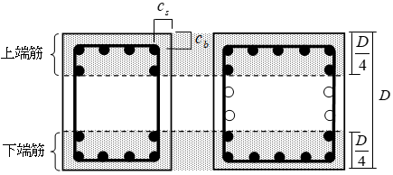
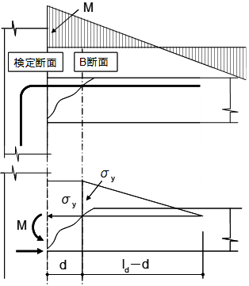
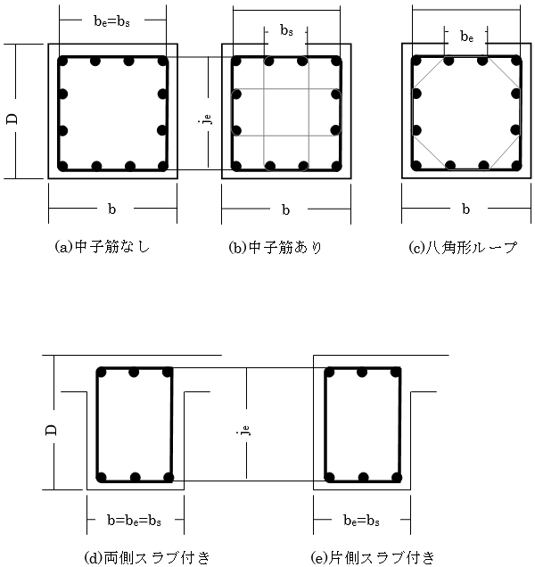
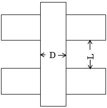
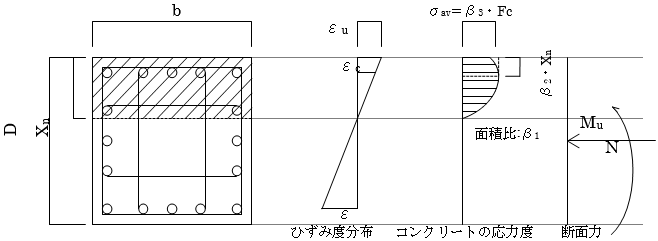
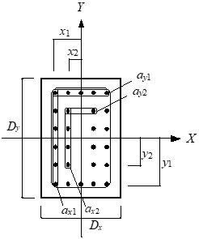
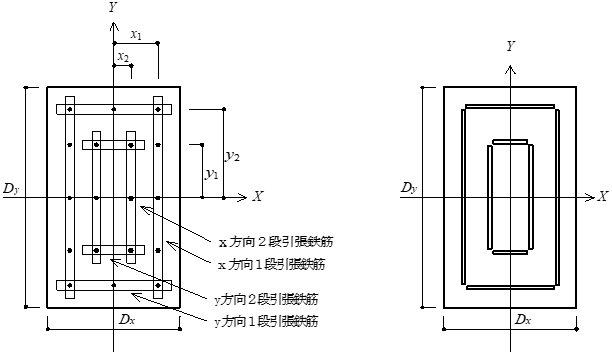

## 採用応力

採用応力は"断面算定-採用応力"に準じます。

柱の曲げ余裕度は2軸曲げとして、以下の様に計算しています。

&emsp;$ \frac{1}{((M_{mx}/M_{ux})^{\alpha_x}+(M_{my}/M_{uy})^{\alpha_y})^{1/\alpha}}$

|断面|αx|αy|α|備考|
|-|-|-|-|-|
|RC|2.0 ※|2.0 ※|2.0 ※||
|SRC|2.0|2.0|2.0||
|CFT|2.0|2.0|2.0||
|S(H型)|2.0|1.0|2.0|強軸をXとする|
|S(H型以外)|2.0|2.0|2.0||

※ RCのαは終局検定条件で変更可能。

柱のせん断余裕度は、RCのみ指定により2軸せん断として、以下の様に計算しています。

&emsp;$ \frac{1}{((Q_{mx}/Q_{ux})^{\alpha_x}+(Q_{my}/Q_{uy})^{\alpha_y})^{1/\alpha}}$

|断面|αx|αy|α|備考|
|-|-|-|-|-|
|RC|2.0 ※|2.0 ※|2.0 ※||
|SRC|/|/|/||
|CFT|/|/|/||
|S(H型)|/|/|/||
|S(H型以外)|/|/|/||

※ RCのαは終局検定条件で変更可能。

## 鉄筋コンクリート部材の終局耐力

### 共通事項

#### 軽量コンクリート使用時のせん断耐力低減

 軽量コンクリートを使用している部材のせん断終局耐力は、以降の式による計算で求められた耐力に対して0.9を乗じた数値を採用します。

### 鉄筋コンクリート造梁の終局耐力

#### 大梁検定表の符号一覧

鉄筋コンクリート造の大梁終局検定表の符号一覧を以下に示します。

&emsp;\[塑性理論式\]

&emsp;$B$：梁幅（mm）

&emsp;$D$：梁せい（mm）

&emsp;$_t$：引張縁から引張鉄筋重心までの距離（mm）

&emsp;$L$ : 部材長，内法長さ（mm）

&emsp;$a_t$：引張鉄筋の断面積（mm2）

&emsp;$j_t$ : 応力中心間距離

&emsp;$p_t$：引張鉄筋比（\%）

&emsp;$p_w$：せん断補強筋比（\%）

&emsp;$M_u$：終局曲げ強度（kN・m）

&emsp;$Q_mu$：両端ヒンジを仮定した場合の終局せん断応力（kN）

&emsp;$（＝(M_{u上}＋M_{u下}$)×上限強度倍率／部材長(内法)）

&emsp;$Q_L$：長期せん断応力（kN）

&emsp;$Q_E$：水平荷重時せん断応力（kN）

&emsp;$α$：せん断力割増率、ユーザー指定によります注1）。

&emsp;$Q_{su}$：せん断破壊によって決定するせん断耐力（kN）

&emsp;$α_{su}$：せん断に対する検定値（＝$Q_{su}／Q_D$）

&emsp;$Q_{bu}$：付着割裂破壊によって決定するせん断耐力（N）

&emsp;$α_{bu}$：付着に対する検定値（＝$Q_{bu}／Q_D$）

&emsp;$τ_{bu}$：1段目主筋の付着信頼強度（N/mm2）

&emsp;$τ_f$：設計用付着応力度（N/mm2）

&emsp;$α_t$：梁の上端筋に対する付着強度低減係数

&emsp;$b_{si2}$：2段目の割裂長さ比

&emsp;$k_{st2}$：2段目主筋に対する横補強筋効果

&emsp;$τ_{bu2}$：2段目主筋の付着信頼強度（N/mm2）

&emsp;$L_d$：必要付着長さ（mm）

&emsp;注1)　「設計・計算条件」→「増分解析条件」→「部材耐力式・終局検定設定」参照。

&emsp;\[靭性指針式\]

&emsp;$B$：梁幅（mm）

&emsp;$D$：梁せい（mm）

&emsp;$d_t$：引張縁から引張鉄筋重心までの距離（mm）

&emsp;$L$ : 部材長，内法（mm）

&emsp;$σ_y$：主筋の信頼強度算定用強度（N/mm2）, 鉄筋材料強度×信頼強度倍率

&emsp;$σ_{yu}$：主筋の上限強度算定用強度（N/mm2）, 鉄筋材料強度×上限強度倍率

&emsp;$j_e$：トラス機構に関与する断面の有効せい（mm）

&emsp;$b_e$：トラス機構に関与する断面の有効幅（mm）

&emsp;$μ$：トラス機構の角度を表す係数（＝$2－20R_p$）

&emsp;$R_p$：終局限界状態でのヒンジ領域の回転角（rad）

&emsp;$ν$：コンクリート圧縮強度の有効係数（＝$(1－20R_p)ν_0$）

&emsp;$ν_0$：降伏ヒンジ・潜在ヒンジを計画しない時の有効係数（＝$0.7－σ_B<／200$）

&emsp;$σ_B$：コンクリートの圧縮強度（N/mm2）

&emsp;$p_{we}$：有効横補強筋比(%)（＝$a_w$ ／ $b_{es}$）

&emsp;$a_w$：1組の横補強筋の断面積（mm2）

&emsp;$s$：横補強筋の間隔（mm）

&emsp;$tanθ$：アーチ機構の圧縮束の角度のタンジェント

&emsp;$Q_L$：長期せん断応力（kN）

&emsp;$Q$：両端ヒンジ時せん断力もしくは長期を除いた設計用せん断力

&emsp;$V_{u1}$：鉄筋コンクリート造建物の靭性保証型耐震設計指針 (6.4.1)の値（kN）

&emsp;$V_{u2}$：鉄筋コンクリート造建物の靭性保証型耐震設計指針 (6.4.2)の値（kN）

&emsp;$V_{u3}$：鉄筋コンクリート造建物の靭性保証型耐震設計指針 (6.4.3)の値（kN）

&emsp;$Vu$：せん断信頼強度（＝$min(V_u1, V_u2, V_u3）$)

&emsp;$V_{bu}$：付着破壊の影響を考慮したせん断信頼強度（kN）

&emsp;$k_{st}$：1段目主筋に対する横補強筋効果

&emsp;$k_{st2}$：2段目主筋に対する横補強筋効果

&emsp;$Δσ$：1段目主筋の終局限界状態における部材両端部の応力度の差（N/mm2）

&emsp;$Δσ2$：2段目主筋の終局限界状態における部材両端部の応力度の差（N/mm2）

&emsp;$τ_{bu}$：1段目主筋の付着信頼強度（N/mm2）

&emsp;$τ_f$：1段目主筋の設計用付着応力度（N/mm2）

&emsp;$τ_{bu2}$：2段目主筋の付着信頼強度（N/mm2）

&emsp;$τ_{f2}$：2段目主筋の設計用付着応力度（N/mm2）

#### 鉄筋コンクリート造梁の終局耐力

 終局検定においては、非線形解析モデルによる荷重増分解析結果に対し、以降に示す終局耐力を用いて検定を行います。

a)  梁の曲げひび割れ強度（$M_c$）、曲げ終局強度（$M_u$）

 鉄筋コンクリート造梁の曲げひび割れ強度（$M_c$）および曲げ終局強度（$M_u$）については、非線形解析モデル("曲げひび割れ強度"、"曲げ終局強度")を参照してください。

b)  梁の塑性理論式による終局せん断強度（$Q_u$）

 「終局耐力条件」で「終局強度型設計指針」を選択した場合、鉄筋コンクリート造梁の終局せん断強度（$Q_u$）は、塑性理論式により算定します。

 付着に対する設計では、付着強度の確保（付着信頼強度（$τ_{bu}$）＞設計用付着応力度
 （$τ_f$））が原則ですが、部材の耐力、変形性能が損なわれない範囲であれば付着ひび割れの発生、付着すべりの増大あるいは付着応力度の低下は許容することができるとされています1)。

 本プログラムでは、終局時のせん断力に対してせん断強度、変形性能が損なわれないことの確認として以下の検定を行い、付着に関する数値（$τ_{bu}，τ_f$）は参考として表示します。

&emsp;$(Q_{su}-Q_L)/a \cdot Q_E \geq 1.0 \quad or \quad (Q_{su}-Q_L)/Q_{mu} \geq 1.0 $ せん断に対する余裕率

&emsp;$(Q_{bu}-Q_L)/a \cdot Q_E \geq 1.0 \quad or \quad (Q_{bu}-Q_L)/Q_{mu} \geq 1.0 $ 付着に対する余裕率

　　　　　※MK785, SPR785,
SPR685を使用した場合、$Q_L=Q_0$と読み替えて計算します。

&emsp;$Q_{su} = b \cdot j_t \cdot p_w \cdot \sigma_{wy} \cdot \cot \phi+k_1 \cdot (1-k_2) \cdot b \cdot D \cdot \nu \cdot F_c$

&emsp;$k_1 = \frac{\sqrt{(L/D)^2+1}-(L/D)}{2}$

&emsp;$k_2 = \frac{2 \cdot p_w \cdot \sigma_{wy}}{\nu \cdot F_c}$

&emsp;$ν = (1.0-15 \cdot R_p) \cdot \nu_0 \quad ; \quad 0 < Rp \leq 0.05$

&emsp;$ν = 0.25 \cdot \nu_0 \quad ; \quad 0.05 < Rp$

&emsp;$ν_0 = 0.7- \frac{F_c}{200}$

&emsp;$\cot \phi = 2.0-50 \cdot Rp \quad ; \quad 0 < Rp \leq 0.02$

&emsp;$= 1.0 \quad ; \quad 0.02 < Rp$

&emsp;$Q_{su}$：せん断破壊によって決定するせん断耐力（N）

&emsp;$b$：部材幅（mm）

&emsp;$j_t$：主筋の重心間距離（mm）

&emsp;$p_w$：せん断補強筋比（小数）

&emsp;$σ_{wy}$：せん断補強筋の降伏強度算定用強度（N/mm2）

&emsp;$L$：内法長さ（mm）

&emsp;$D$：部材せい（mm）

&emsp;$F_c$：コンクリートの設計基準強度（N/mm2）

&emsp;※　$k_2≦1.0$とします。

&emsp;※　$p_w・σ_{wy}≦ν・F_c／2$とします。

&emsp;※　$ν，p_w，σ_{wy}$は次項の表によります。$p_w$で上限を超える場合は上限値とします。

1)
(社)日本建築学会：鉄筋コンクリート造建物の靭性保証型耐震設計指針・同解説；P.177，1997.7

| 製品名                           | &emsp;σwy(N/mm2)&emsp;| Pw| ν                 |
|----------------------------------|--------------------------|----------------------|--------------------|
| ウルボン【SBPD1275/1420】        | min(25・Fc,1275)         | ～1.2% (～0.8%\*1) | 0.7(1.0－Fc/140) |
| リバーボン1275【SBPDN1275/1420】 |                         | ～1.2%               |                   |
| ウルボン785【UB785】             | min(25・Fc,785)          |                     | 0.7(0.7－Fc/200) |
| リバーボン785【KW785】           |                         |                     |                   |
| スミフープ、ストロングフープ、 デーフープ【KSS785】 |   |                     |                   |
| UHYフープ【SHD685】              | min(25・Fc,685)          |                     |                   |
| エヌエスハイデック685H【HDC685】 | 685                      |                     |                   |
| スーパーフープ【KH785】          | 25・Fc...(Fc＜27.4) 785...(27.4≦Fc)  |                     |                   |
| パワーリング785【SPR785】        | 25・Fc...(Fc＜32.0) 785...(32.0≦Fc)  |                     |                   |
| パワーリング685【SPR685】        | min(25・Fc,685)                                                           |                     |                   |
| エムケーフープ785【MK785】       | 25・Fc...(Fc＜31.4) 785...(31.4≦Fc)  |                     |                   |

\*1:柱においてFc27(N/mm2)未満の場合。

&emsp;$Q_{bu}$：付着割裂破壊によって決定するせん断耐力（N）

&emsp;$Q_{bu} = j_t \cdot \tau_{bu} \cdot \sum \phi+k_1 \cdot (1-k_3) \cdot b \cdot D \cdot \nu \cdot F_c$

&emsp;$k_3 = \frac{2 \cdot \tau_b \cdot \sum \phi}{b \cdot \nu \cdot F_c}$

&emsp;$τ_{bu}$：1段目主筋の付着信頼強度（N/mm2）

| 商品名                                                   | 計算式 |
|----------------------------------------------------------|--------|
| リバーボン785【KW785】                                   |$τ_{bu} = k_0 \cdot 0.313 \left( 0.307b_1+0.427+ \frac{24.9a_w \cdot h}{x \cdot N \cdot d_b} \right) \cdot \sqrt{F_c}$ |
| スミフープ、ストロングフープ、 デーフープ【KSS785】   |        |
| UHYフープ【SHD685】                                      |        |
| エヌエスハイデック685H【HDC685】                         |        |
| ウルボン【SBPD1275/1420】                                |$τ_{bu} = k_0 \cdot \left( 0.0961b_1+0.134+ \frac{7.8a_w \cdot h}{x \cdot N \cdot d_b} \right) \cdot \sqrt{F_c}$ |
| リバーボン1275【SBPDN1275/1420】                         |        |
| ウルボン785【UB785】                                     |        |
| スーパーフープ【KH785】                                  |        |
| パワーリング785【SPR785】                                |        |
| パワーリング685【SPR685】                                |        |
| エムケーフープ785【MK785】                               |        |
| 異径鉄筋                                                 |$τ_{bu} = a_t \cdot \left( (0.085b_1+0.10) \cdot \sqrt{F_c}+k_{st} \right)$  $at = 0.75+F_c/400$　（梁の上端主筋）  $at = 1.0$　　　（上記以外）  $k_{st} = (54+45N_w/N_1)(b_{si}+1)p_w \quad (b_{ci} \geq b_{si})$  $k_{st} = 140A_w/(d_bs) \quad (b_{ci} < b_{si})$ |

&emsp;$Σφ$：引張鉄筋の周長和（2段筋，寄筋を含める）（mm）

&emsp;$k_0$：1.0（梁）、1.22（柱）

&emsp;$a_w$：せん断補強筋の断面積（mm2）

&emsp;$b_i$：割裂線長さ比（$(= \min (b_{vi},b_{ci},b_{si})$）

&emsp;$b_{vi} = \sqrt{3} \cdot \left( \frac{2 \cdot C_{\min}}{d_{b1}}+1 \right)$

&emsp;$b_{ci} = \sqrt{2} \cdot \left( \frac{C_S+C_b}{d_{b1}}-1 \right)$

&emsp;$b_{si} = \frac{b}{N \cdot d_{b1}}-1$

&emsp;$C_{min}$：主筋のかぶり厚（＝$min(C_s,C_b$)）（mm）

&emsp;$C_s$：主筋の側面から側面までのかぶり厚さ（mm）

&emsp;$C_b$：主筋の側面から底面までのかぶり厚さ（mm）

&emsp;$d_{b1}$：1段目の主筋径（呼び名）（mm）

&emsp;$h：b_i＝b_{vi}$のとき　　$h = 0$

&emsp;$b_i＝b_{ci}$のとき　　$h = \sqrt{2}$

&emsp;$b_i＝b_{si}$のとき　　$h = 1.0+0.85 \cdot (n-2)/N$

&emsp;$n$：1組のせん断補強筋の本数で、n＞4の場合は4とします。
 
&emsp;$x$：せん断補強筋ピッチ（mm）

&emsp;$N$：外側一列の引張鉄筋の本数

2)　(社)日本建築学会：鉄筋コンクリート造建物の靭性保証型耐震設計指針・同解説；P.175-181，1997.7

 設計用付着応力度（$τ_f$）、および2段目主筋の信頼強度（$τ_{bu2}$）は、靭性指針2)に基づき算定します。

&emsp;$\tau_f = d_b \cdot \Delta \sigma/(4 \cdot (L-d))$

&emsp;$τ_f$：設計用付着応力度（N/mm2）

&emsp;$⊿σ$：部材両端部の主筋の応力度の差。以下の計算により算出する。

&emsp;$⊿σ= 2・σ_{yu}$ （両端ヒンジが発生している場合）

&emsp;$⊿σ= σ_{yu}+σ_y$ （片端ヒンジが発生している場合）

&emsp;$⊿σ= 2・σ_y$ （ヒンジが発生していない場合）

&emsp;$d$：部材有効せい（圧縮縁から引張鉄筋重心位置までの距離）（mm）

&emsp;$\tau_{bu2} = a_2 \cdot a_1 \cdot \left( (0.085 \cdot b_{si2}+0.10) \cdot \sqrt{F_c}+k_{st2} \right)$

&emsp;$τ_{bu2}$：2段目主筋の付着信頼強度（N/mm2）

&emsp;$α_2$：2段目主筋に対する強度低減係数（＝0.6）

&emsp;$α_t$：梁の上端筋に対する付着強度低減係数

&emsp;&emsp;&emsp;0.75+Fc/400 （梁の上端主筋の場合）

&emsp;&emsp;&emsp;1 （上記以外の場合）

&emsp;$b_{si2}$：2段目主筋の割裂長さ比

&emsp;$b_{si2} = (b-N_2 \cdot d_{b2})/(N_2 \cdot d_{b2})$

&emsp;$N_2$：2段目の主筋本数

&emsp;$b_2$：2段目の主筋径（呼び名）（mm）

&emsp;$k_{st2}$：2段目主筋に対する横補強筋効果

&emsp;$k_{st2} = 99 \cdot (b_{si2}+1) \cdot p_w$

 付着設計における2段目主筋は、断面最外縁から部材せい（D）の1/4の範囲に配筋された主筋で、1段目主筋以外の主筋と定義します。

 2段筋の必要付着長さ（$L_d$）は、RC規準による平均付着応力度の算定式を用いて求めます3）。下図に示すように、設計用付着応力度（$τ_f$）は、検定断面の鉄筋の応力度（$σ_y$）が検定断面から部材の有効せい（$d$）だけ離れた断面まで一定と見なし、B断面より一様な付着作用によって定着されるものと仮定します。よって、必要付着長さ（$L_d$）は検定断面を起点とする付着長さ（$l_d$）となります。

&emsp;$L_d = \frac{\sigma_y \cdot a}{\tau_f \cdot \phi}+d$

&emsp;$L_d$：必要付着長さ（mm）

&emsp;$σ_y$：鉄筋の降伏強度（N/mm2）

&emsp;$a$：鉄筋の断面積（mm2）

&emsp;$τ_f$：設計用付着応力度（N/mm2）

&emsp;$φ$：鉄筋の周長（mm）

3)　社)日本建築学会：鉄筋コンクリート構造計算規準・同解説；P.212-213，2010.2

c)  梁の靭性指針式による終局せん断信頼強度

 「終局耐力条件」で「靭性保証型設計指針」を選択した場合、鉄筋コンクリート造梁の終局せん断信頼強度（$V_u$）、付着破壊の影響を考慮したせん断信頼強度（$τ_{bu}$）については、靭性指針4)により算定します。

 また、設計用付着応力度($τ_f$)および2段目主筋の信頼強度（$τ_{bu2}$）は、b)で前述した付着に対する設計と同様とします。

&emsp;$V_u$：せん断信頼強度（N/mm2）

&emsp;$V_u$＝min($V_{u1}$, $V_{u2}$, $V_{u3}$）

&emsp;$V_{u1} = \mu p_{we}\sigma_{wy}b_ej_e+ \left( \nu \sigma_B- \frac{5p_{we}\sigma_{wy}}{\lambda} \right) \frac{bD}{2} \tan \theta$　　　(6.4.1)

&emsp;$V_{u2} = \frac{\lambda \nu \sigma_B+p_{we}\sigma_{wy}}{3}b_ej_e$　　　(6.4.2)

&emsp;$V_{u3} = \frac{\lambda \nu \sigma_B}{2}b_ej_e$　　　(6.4.3)

&emsp;$μ$：トラス機構の角度を表す係数（＝$2－20R_p$）

&emsp;$R_p$:終局限界状態でのヒンジ領域の回転角（rad）

&emsp;$p_w$：有効横補強筋比(%)（＝$a_w／b_e$）

&emsp;$a_w$：1組の横補強筋の断面積（mm2）

&emsp;$s$：横補強筋の間隔（mm）

&emsp;$σ_{wy}$：横補強筋の信頼強度（N/mm2）

&emsp;$b_e$:トラス機構に関与する断面の有効幅（mm）

&emsp;$j_e$:トラス機構に関与する断面の有効せい（mm）

&emsp;$ν$：コンクリート圧縮強度の有効係数（＝$(1－20R_p)ν0）

&emsp;$ν_0$:降伏ヒンジ・潜在ヒンジを計画しない時の有効係数（＝$0.7－σ_B／200$）

&emsp;$σ_B$:コンクリートの圧縮強度（N/mm2）

&emsp;$λ$：トラス機構の有効係数

&emsp;$b$：梁幅（mm）

&emsp;$D$：梁せい（mm）

&emsp;$θ$：アーチ機構の圧縮束の角度

4)　(社)日本建築学会：鉄筋コンクリート造建物の靭性保証型耐震設計指針・同解説；P.142-162，1997.7

 ※$b_e$は下記によります。

 柱およびスラブ付きでない梁の場合は、図6.4.1(a)(b)(c)に示すように、外側の横補強筋のせん断力直交方向への芯々間隔とします。

 両側スラブ付きの梁の場合は、図6.4.1(d)に示すように、$b_e=b$とします。

 片側スラブ付きの梁の場合は、図6.4.1(e)に示すように、スラブのない側の横補強筋からスラブのある側のコンクリート表面までを$b_e$とします。

 ※λは下記(6.4.8)によります。

&emsp;$\lambda = 1- \frac{s}{2j_e}- \frac{b_s}{4j_e}$　　　(6.4.8)

 ここで、bsは次式で算定します。

&emsp;$b_s = \frac{b_e}{N_s+1}$　　　(6.4.9)

&emsp;$N_s$：中子筋の本数（本）

 ※θは下記によります。

引張軸力を受ける柱ではtanθ=0とします。

それ以外の柱・梁で、L/D≧1.5の部材では、次式で算定します。

&emsp;$\tan \theta =0.9 \times \frac{D}{2L}$　　　(6.4.10)

&emsp;$L$：クリアスパン長さ（mm）(図6.4.2参照)

$L/D\<1.5$の部材では次式で算定します。

&emsp;$\tan \theta =\frac{\sqrt{L^2-D^2}-L}{D}$　　　(6.4.11)

&emsp;&emsp;&emsp;&emsp;図6.4.2 柱のクリアスパン長さ

&emsp;$V_{bu}$： 付着破壊の影響を考慮したせん断信頼強度（N/mm2）

&emsp;$Vb_u$＝min($V_{bu1}, V_{bu2}$）

&emsp;$V_{bu1} = T_xj_e+ \left( \nu \sigma_B- \frac{2.5T_x}{\lambda b_e} \right) \frac{bD}{2} \tan \theta$　　　(6.8.14)

&emsp;$V_{bu2} = \frac{\lambda \nu \sigma_B}{2}b_ej_e$　　　(6.8.15)

 $T_x$：部材単位長さあたりに負担できる付着力

&emsp;降伏ヒンジを計画しない部材： $T_x = \tau _{bu} \sum \phi _1+\tau _{bu2} \sum \phi_2$　　　(6.8.16a)

&emsp;降伏ヒンジを計画する部材： $T_x = (1-10R_p)(\tau _{bu} \sum \phi_1+\tau _{bu2} \sum \phi_2)$　　　(6.8.16b)

&emsp;$\sum \phi_1$：1段目主筋の周長の合計

&emsp;$\sum \phi_2$：2段目主筋の周長の合計

&emsp;$ν$：コンクリートの有効圧縮強度 係数終局せん断信頼強度によります

### 鉄筋コンクリート造柱の終局耐力

#### 柱検定表の符号一覧

鉄筋コンクリート造柱の終局検定表の符号一覧を以下に示します。

&emsp;\[塑性理論式\]

&emsp;$B$：柱幅（mm）

&emsp;$D$：柱せい（mm）

&emsp;$d_t$：引張縁から引張鉄筋重心までの距離（mm）

&emsp;$a_t$：引張鉄筋の断面積（mm2）

&emsp;$L$ : 部材長、内法（mm）

&emsp;$p_t$：引張鉄筋比（\%）

&emsp;$p_w$：せん断補強筋比（\%）

&emsp;$p_g$：主筋全断面積のコンクリート全断面積に対する比（\%）

&emsp;$M_{m1}$：正加力時の終局曲げ応力（kN・m）

&emsp;$M_{m2}$：負加力時の終局曲げ応力（kN・m）

&emsp;$M_{u1}$：正加力時の終局曲げ強度（kN・m）

&emsp;$M_{u2}$：負加力時の終局曲げ強度（kN・m）

&emsp;$Q_{m1}$：正加力時の終局せん断応力（kN）

&emsp;$Q_{m2}$：負加力時の終局せん断応力（kN）

&emsp;$Q_{su}$：せん断破壊によって決定するせん断耐力（kN）

&emsp;$Q_{bu}$：付着割裂破壊によって決定するせん断耐力（kN）

&emsp;$N_L$:長期柱軸力（kN）

&emsp;$N_{m1}$：正加力時の終局時柱軸力（kN）

&emsp;$N_{m2}$：負加力時の終局時柱軸力（kN）

&emsp;$N_{ut}$：軸圧縮強度（kN）

&emsp;$N_{uc}$：軸引張強度（kN）

&emsp;\[靭性指針式\]

&emsp;$B$：柱幅（mm）

&emsp;$D$：柱せい（mm）

&emsp;$d_t$：引張縁から引張鉄筋重心までの距離（mm）

&emsp;$a_t$：引張鉄筋の断面積（mm2）

&emsp;$p_t$：引張鉄筋比（\%）

&emsp;$p_g$：主筋全断面積のコンクリート全断面積に対する比（\%）

&emsp;内法（mm）

&emsp;$j_e$：トラス機構に関与する断面の有効せい（mm）

&emsp;$b_e$：トラス機構に関与する断面の有効幅（mm）

&emsp;$μ$：トラス機構の角度を表す係数（＝$2－20R_p$）

&emsp;$R_p$：終局限界状態でのヒンジ領域の回転角（rad）

&emsp;$ν$：コンクリート圧縮強度の有効係数（＝($1－20R_p)ν_0$）

&emsp;$ν_0$：降伏ヒンジ・潜在ヒンジを計画しない時の有効係数（＝$0.7－σ_B/200$）

&emsp;$σ_B$：コンクリートの圧縮強度（N/mm2）

&emsp;$p_{we}$：有効横補強筋比(%)（＝$a_w/b_{es}$）

&emsp;$a_w$：1組の横補強筋の断面積（mm2）

&emsp;$s$：横補強筋の間隔（mm）

&emsp;$M_{m1}$：正加力時の終局曲げ応力（kN・m）

&emsp;$M_{m2}$：負加力時の終局曲げ応力（kN・m）

&emsp;$M_{u1}$：正加力時の終局曲げ強度（kN・m）

&emsp;$M_{u2}$：負加力時の終局曲げ強度（kN・m）

&emsp;$Q_L$:長期せん断応力（kN）

&emsp;$Q$：両端ヒンジ時せん断力もしくは長期を除いた設計用せん断力

&emsp;$V_{u1}$：鉄筋コンクリート造建物の靭性保証型耐震設計指針 (6.4.1)の値（kN）

&emsp;$V_{u2}$：鉄筋コンクリート造建物の靭性保証型耐震設計指針 (6.4.2)の値（kN）

&emsp;$V_{u3}$：鉄筋コンクリート造建物の靭性保証型耐震設計指針 (6.4.3)の値（kN）

&emsp;$V_{u<}$せん断信頼強度（＝min(Vu1, Vu2, Vu3）) （kN）

&emsp;$τ_{bu}$：1段目主筋の付着信頼強度（N/mm2）

&emsp;$τ_f$:1段目主筋の設計用付着応力度（N/mm2）

&emsp;$τ_{bu}$：2段目主筋の付着信頼強度（N/mm2）

&emsp;$τ_{f2}$：2段目主筋の設計用付着応力度（N/mm2）

&emsp;$V_{bu}$：付着破壊の影響を考慮したせん断信頼強度（kN）

&emsp;$N_L$:長期柱軸力（kN）

&emsp;$N_{m1}$：正加力時の終局時柱軸力（kN）

&emsp;$N_{m2}$：負加力時の終局時柱軸力（kN）

&emsp;$N_{ut}$：軸圧縮強度（kN）

&emsp;$N_{uc}$：軸引張強度（kN）

&emsp;OTM低減：応答転倒モーメントの低減係数
  
&emsp;上下動係数：上下動を考慮した軸力の割増係数

 鉄筋コンクリート造柱の終局検定においては、5章の非線形解析モデルによる荷重増分解析結果に対し、以降に示す終局耐力を用いて検定を行います。<u>実際の解析時における曲げ復元力特性は5章の非線形解析モデルによるモデル化が採用され、下記の終局曲げ強度と必ずしも一致しないことにご注意ください。</u>

a)  終局曲げ強度（$M_u$）

 鉄筋コンクリート造柱の終局曲げ強度（$M_u$）は、引張側と圧縮側に各1段の主筋を配筋した略算式である、構造規定式（at式）1)またはＡＣＩ規準による平面保持解析にて算定します。寄筋がある場合、寄筋もatに含んで計算します。

・構造規定式（at式）

&emsp;$M_u = 0.8 \cdot a_t \cdot \sigma_y \cdot D+0.4 \cdot N \cdot D$

&emsp;$M_u = 0.8 \cdot a_t \cdot \sigma_y \cdot D+0.5 \cdot N \cdot D \left( 1-\frac{N}{b \cdot D \cdot F_c} \right)$

&emsp;$M_u = (0.8 \cdot a_t \cdot \sigma_y \cdot D+0.12 \cdot b \cdot D^2 \cdot F_c) \cdot \left( \frac{N_{\max}-N}{N_{\max}-0.4 \cdot b \cdot D \cdot F_c} \right)$

&emsp;$N_{max}$：中心圧縮時終局強度（＝$b・D・F_c＋a_g・σ_y$）（N）

&emsp;$N_{min}$：中心引張時終局強度（＝$－a_g・σ_y$）（N）

&emsp;$a_g$：主筋全断面積（mm2）

&emsp;$N$：軸方向力（N）

&emsp;$a_t$：引張主筋断面積（mm2）

&emsp;$b$：柱幅（mm）

&emsp;$D$：柱せい（mm）

&emsp;$σ_y$：主筋降伏強度（N/mm2）

&emsp;$F_c$：コンクリートの設計基準強度（N/mm2）

・ACI規準（平面保持仮定）

 降伏曲げモーメントは、圧縮側コンクリートの応力分布を「ACI318-95規準」による等価応力度ブロック法を用いて、下記の①～⑥の仮定に基づいて算出します。

 ① 降伏曲げモーメントは圧縮縁のコンクリートのひずみ度が終局ひずみ$ε_u＝0.3%$に達するときの曲げモーメントとする。

 ② 断面内各点のひずみ度は、中立軸からの距離に比例する。（平面保持の仮定）

 ③ 鉄筋の応力－ひずみ度関係は、降伏ひずみ度以下では弾性とする。降伏ひずみ度以上では材料強度とする。

 ④ コンクリートは引張応力度を負担しない。

 ⑤ コンクリートの圧縮応力度とひずみ度の関係は下図による。

 ⑥ 各係数は以下による

 　　$β_1=0.85$ (Fc≦4000 psi)

 　　$β_1=0.85-0.05・(Fc-4000)/1000$ (4000psi＜Fc＜8000psi)

 　　$β_1=0.65$ (8000psi≦Fc)

 　　$β_2=β1/2$

 　　$β_3=0.85$

 ※ 1 N/mm2 =\> 145.04 psi

 矩形柱の主筋の配置は次のように認識します。

&emsp;$x_i, y_i$：図心からの各鉄筋重心位置

&emsp;$a_{xi}, a_{yi}$：各鉄筋断面積

&emsp;$i＝1$ ：1段引張主筋

&emsp;$i＝2$ ：2段引張主筋

1)　国土交通省：2007年版建築物の構造関係技術基準解説書；P.626-627,　2007.8

■隅部の鉄筋本数（$_{ck}N_i$）

&emsp;$_c$$_kN_i = ( 2 \cdot ($$_x$$_kn_i+ _y$$_kn_i)- _g$$_kN_i) )/4$

■引張鉄筋断面積（$_{jk}A$）

&emsp;$_j$$_kA = _j$$_ka_1 \cdot _j$$_kn_1+_j$$_ka_2 \cdot _j$$_kn_2 $

■鉄筋強度（$_{jk}Y$）

&emsp;$_j$$_kY = ( _j$$_k\sigma_y$$_1 \cdot _j$$_ka_1 \cdot _j$$_kn_1+_j$$_k\sigma_y$$_2 \cdot _j$$_ka_2 \cdot _j$$_kn_2 )/_j$$_kA$

&emsp;$_{gk}N_i$:全鉄筋本数

&emsp;$_{jk}a_i$:1本あたりの鉄筋断面積（mm2）

&emsp;$_{jk}n_i$:鉄筋本数

&emsp;$_{jk}σ_y$:鉄筋の降伏強度（N/mm2）

&emsp;$i$：鉄筋径種類（i＝1,2）

&emsp;$j$：配置方向（j＝X,Y）

&emsp;$k$：1段筋または2段筋

b)  終局せん断強度（Qu）

 鉄筋コンクリート造柱の終局せん断強度（Qu）は、鉄筋コンクリート造梁と同様に算定します("採用応力"参照)。

 鉄筋コンクリート造柱の余裕度は以下の様に計算しています。

&emsp;$Q_{su}/Q_{mu} = \min (Q_{su}/Q_{mu1},Q_{su}/Q_{mu2})$

&emsp;$Q_{bu}/Q_{mu} = \min (Q_{bu}/Q_{mu1},Q_{bu}/Q_{mu2})$

 また、$Q_D$と$Q_{mu}$については下記の違いがあります。

&emsp;$Q_D = Q_L+a \times Q_E$

 両端ヒンジを選択している場合:$Q_{mu}$=(上限強度倍率)×$0(M_{iu}+M_{ju})/L$

 存在応力を選択している場合:$Q_{mu}=Q_{L}+α×Q_{E}$

&emsp;$M_{iu}$: 始端終局モーメント

&emsp;$M_{ju}$: 終端終局モーメント

&emsp;$Q_{mu}$: 両端ヒンジのせん断力

&emsp;$L$: 危険断面位置間距離

c)  軸引張強度（$N_{ut}$），軸圧縮強度（$N_{uc}$）

 鉄筋コンクリート造柱の軸圧縮強度（$N_{uc}$）、軸引張強度（$N_{ut}$）は構造規定2）に準じて算定します。本プログラムでは、圧縮軸力を正、引張軸力を負と表します。

&emsp;$N_{uc} = b \cdot D \cdot F_c$

&emsp;$N_{ut} = -a_g \cdot \sigma_y$

&emsp;$N_{uc}$：軸圧縮強度（kN）

&emsp;$N_{ut}$：軸引張強度（kN）

軸力に対する検定値は、以下のとおり算定します。OTM低減係数、上下動係数はユーザー指定によります。

スラブ筋断面積は「設計・計算条件」→「部材復元力特性条件」→「RC造大梁曲げ耐力計算方法」の設定を採用し、材料は「使用材料」→「その他」→「スラブ筋」の情報を採用します。

■長期軸力に対する検定

&emsp;$N_L = N_{uc}$

■終局時軸力に対する検定

・min（$N_{m1}$，$N_{m2}$）＜0またはmax（$N_{m1}$，$N_{m2}$）＜0の場合

&emsp;$N_m / N_{ut}$

&emsp;$N_m$：設計用柱軸力（＝min（$N_{m1}$，$N_{m2}$）またはmax（$N_{m1}$，$N_{m2}$））（kN）

・min（$N_{m1}$，$N_{m2}$）≧0またはmax（$N_{m1}$，$N_{m2}$）≧0の場合

&emsp;$N_m / N_{uc}$

&emsp;$N_m$：設計用柱軸力（＝min（$N_{m1}$，$N_{m2}$）またはmax（$N_{m1}$，$N_{m2}$））（kN）

&emsp;$N_m = N_L+|N_E| \cdot OTM \mbox{低減}+N_L \cdot  \mbox{上下動係数}$

&emsp;$N_L$：長期柱軸力（kN）

&emsp;$N_{m1}$：正加力時の設計用柱軸力（kN）

&emsp;$N_{m2}$：負加力時の設計用柱軸力（kN）

&emsp;$N_E$：終局時柱軸力（kN）

2)
国土交通省：2007年版建築物の構造関係技術基準解説書；P.626-627,629-630,
2007.8

注1)
「設計・計算条件」→「増分解析条件」→「部材耐力式・終局検定設定」参照。

### 鉄筋コンクリート造接合部の終局耐力

#### 接合部検定表の符号一覧

鉄筋コンクリート造接合部の終局検定表の符号一覧を以下に示します。

&emsp;$κ$ ：接合部の形状による係数

&emsp;&emsp;$κ=1.0$ 十字形接合部

&emsp;&emsp;$κ=0.7$ ト形およびＴ形接合部

&emsp;&emsp;$κ=0.4$ Ｌ形接合部

&emsp;$φ$ ：直交梁の有無による補正係数

&emsp;&emsp;$φ=1.0$ 両側直交梁付き接合部

&emsp;&emsp;$φ=0.85$ 上記外の場合

&emsp;$b_b$ ：梁幅（大きい方）

&emsp;$b_1$ ：梁面から平行する柱側までの距離（左）

&emsp;$b_2$ ：梁面から平行する柱側までの距離（右）

&emsp;$b_{a1}$ ：$b_1$/2またはD/4の小さい方

&emsp;$b_{a2}$ ：$b_2$/2またはD/4の小さい方

&emsp;$D_j$ ：下側柱せい

&emsp;$h_c$ ：上階階高

&emsp;$h_c$' ：下階階高

&emsp;$T$ ：上端鉄筋引張力（スラブ筋注1）含む）

&emsp;$T'$ ：下端鉄筋引張力

&emsp;$M_{b}$：上端引張降伏モーメント

&emsp;$M_{b'}$ ：下端引張降伏モーメント

&emsp;$Q_{cu}$ ：上下柱の存在せん断力の平均

&emsp;$Q_{du}$：梁降伏時の鉄筋引張降伏力 - 柱せん断力

&emsp;$α$ ：接合部せん断力の割増率（=1.0）

&emsp;$V_{ju}$ ：形状から計算される終局せん断耐力

#### 鉄筋コンクリート造接合部の終局耐力

終局検定においては、5章の非線形解析モデルによる荷重増分解析結果に対し、以降に示す終局耐力を用いて検定を行います。ここで、TおよびT'は計算条件の指定により、両端ヒンジ時応力もしくは存在応力から選択できます。

&emsp;$V_{ju} = \kappa \cdot \phi \cdot F_j \cdot b_j \cdot D_j$

&emsp;$Q_{du} = a \cdot (T+T'-Q_{cu})$(柱せん断力:存在応力の場合)

&emsp;$Q_{cu} = \frac{Q_{c1}+Q_{c2}}{2}$(柱せん断力:存在応力の場合)

$Q_{c1}$:上側柱せん断力

$Q_{c2}$:下側柱せん断力

&emsp;$Q_{cu} = 2 \frac{M_b+M_b'}{h_c+h_c'}$(柱せん断力:大梁両端ヒンジの場合)

&emsp;余裕率　：　$V_{ju}/Q_{du}$

## コンクリート充填鋼管（CFT）柱の終局耐力

 CFT柱の終局検定用耐力は「コンクリート充填鋼管構造設計指針（以下、CFT指針）」に基づき算定します。なお、CFT指針において角型鋼管CFTは正方形のみを対象としていますが、本プログラムにおいては計算式を準用して長方形断面に対しても適用します。

 \(1) 共通事項

 　終局耐力を計算する際、各柱の寸法により柱を以下のように分類します。

 　A. 座屈長さが断面せいの4倍以下の場合&emsp;&emsp;&emsp;&emsp;&emsp;&emsp;&thinsp; ：　短柱

 　B. 座屈長さが断面せいの12倍を超える場合&emsp;&emsp;&emsp;&emsp;&ensp; ：　長柱

 　C. 座屈長さが断面せいの4倍を超え、12倍以下の場合 ：　中柱

 　

 \(2) 軸方向力を受ける部材の終局耐力

 A.短柱

 座屈長さが断面せいの４倍以下の終局耐力Ncu1は以下の式より算定します。

&emsp;$N_{cu1} = {_c}N_c+(1+\xi){_s}N_c$

$\xi$=0.27:円形断面

&emsp;&emsp;0&emsp;:角型断面

&emsp;${_c}N_c = {_c}A \cdot F_c$

&emsp;${_s}N_c = {_s}A \cdot F_y$

&emsp;$_cA$：コンクリートの断面積

&emsp;$_sA$：鋼管の断面積

&emsp;$F_c$：コンクリートの設計基準強度

&emsp;$F_y$：鋼管の降伏強度強さ

 B.長柱

 座屈長さが断面せいの12倍を超える柱の終局圧縮耐力$N_{cu3}$は以下の式より算定します。

&emsp;$N_{cu3} = _{c}N_{cr}+_{s}N_{cr}$

 $_cN_{cr}$はコンクリート柱の座屈耐力で、以下の式により算定します。すなわち、座屈応力度$_cσ_{cr}$にコンクリート部分の断面積$_cA$を乗ずることにより算定します。

&emsp;$_cN_c$$_r = _c\sigma_c$$_r \cdot _cA$

 座屈応力度$_cσ_{cr}$は以下の２式より算定します。

 ・$_c\lambda_1 \leq 1.0$ のとき、

&emsp;$\frac{_c\sigma_cr}{F_c} = \frac{2}{1+ \sqrt{_c\lambda_1^4+1}}$

 ・${_c}\lambda_1 \geq 1.0$ のとき、

&emsp;$\frac{_c\sigma_cr}{F_c} = 2 (\sqrt{2}-1) \exp ( C_c(1-_c\lambda_1 )$

&emsp;$F_c$：コンクリートの設計基準強度

  $_cλ_1$：規準化細長比で、以下の式より算定します。

&emsp;${_c}\lambda_1 = \frac{{_c}\lambda}{\pi} \sqrt{\varepsilon_u}$

&emsp;$_cλ$：コンクリート柱の細長比

&emsp;$C_c$：$0.568+0.00612F_c$

  $ε_u$：圧縮強度時ひずみで、以下の式より算定します。

&emsp;&emsp;$\varepsilon_u = 0.93 \cdot (Fc)^{\frac{1}{4}} \cdot 10^{-3}$

$_sN _{cr}$は鋼管柱の座屈耐力で、「鋼構造塑性設計指針」の以下の式に算定します。

&emsp;・$_c\lambda_1 < 0.3$ のとき、　　　　$_sN_c$$_r = _sN_y$

&emsp;・$0.3 \leq _c\lambda_1 < 1.3$ のとき、　　$_sN_c$$_r = ( 1-0.545(_s\lambda_1-0.3) ) _sN_y$

&emsp;・$_c\lambda_1 \geq 1.3$ のとき、　　　　$_sN_c$$_r = _sN_E/1.3$

ここに、

&emsp;$_sN _{cr}$：降伏軸力(=$_sA・F_y)$

&emsp;$_sλ_1$：規準化細長比で、以下の式より算定します。

 　　　${_s}\lambda_1 = \frac{{_s}\lambda}{\pi} \sqrt{\frac{F_y}{{_s}E}}$

&emsp;$_sN _{cr}$：オイラー荷重で、以下の式より算定します。

${_s}N_E = \pi^2 \cdot {_s}E \cdot {_s}I/l_k^2$

 　　　　$_sE$：鋼管のヤング係数

 　　　　$l_k$ ：座屈長さ

 　　　　$_sI$ ：鋼管の断面２次モーメント

 　　　　$_sλ$：鋼管柱の細長比

 C.中柱

 座屈長さが断面せいの4倍を超え、12倍以下の柱の終局耐力$N_{cu2}$はA.短柱で算定した$N_{cu1}$及び、B.長柱において$l_{k}/D$=12として算定した$N_{cu3}$を用い、以下の式より算定します。

&emsp;$N_{cu2} = N_{cu1}-0.125(N_{cu1}-N_{cu3}) \cdot (l_k/D-4)$

 また、軸方向引張力を受ける柱の終局軸耐力Ncu2は、短柱、中柱、長柱を問わず、以下の式より算定します。

&emsp;$N_{tu} = {_s}N_t$

 ここで、${_s}N_t = {_s}A \cdot \beta_2 \cdot F_y$

 \(3) 軸方向力および曲げモーメントを受ける部材の終局耐力

 A.短柱の終局曲げ耐力

 軸方向力と曲げモーメントを受ける座屈長さが断面せいの４倍以下の柱の終局耐力は、以下の式によって算定します。

&emsp;$N_u = {_c}N_u+{_s}N_u$

&emsp;$M_u = {_c}M_u+{_s}M_u$

（円形断面の場合）

&emsp;$_cN_u = r_1^2(\theta- \sin \theta \cos \theta)_c\sigma_c$$_B$

&emsp;$_cM_u = \frac{2}{3}r_1^3 \sin^3\theta \cdot _c\sigma_c$$_B$

&emsp;$_sN_u = 2r_2t ( \beta_1\theta-\beta_2(\theta-\pi) ) F_y$

&emsp;$_sM_u = 2r_2^2t(\beta_1-\beta_2) \sin \theta \cdot F_y$

&emsp;$_c\sigma_c$$_B = F_c+0.78 \cdot \frac{2t}{D-2t} \cdot F_y$

&emsp;$r_1 = \frac{_cD}{2}$ 、$r_2 = \frac{D-t}{2}$ 、$\theta = \cos^{-1} (1-2x_n/_cD)$

&emsp;$\beta_1 = 0.89$  、$\beta_2 = -1.08$ 、
  
 　　$D$：鋼管のせい

 　　$_cD$：コンクリートのせい

 　　$F_c$：コンクリートの設計基準強度

 　　$F_y$：鋼管の降伏強さ

 　　$t$ ：鋼管の板厚

 　　$x_n$：コンクリートの圧縮縁から中立軸までの距離

（角形断面の場合）

&emsp;$_cN_u = x_n \cdot _cD \cdot F_c$

&emsp;$_cM_u = \frac{1}{2}(_cD-x_n)_cD \cdot x_n \cdot F_c$

&emsp;$_sN_u = 2t(2x_n-_cD)F_y$

&emsp;$_sM_u = Dt(D-t)F_y+2t(_cD-x_n) x_n \cdot F_c$

 なお、中立軸がコンクリート断面外の場合の終局曲げ耐力は、上記の方法で得られる軸方向力と曲げモーメントの耐力曲線と、(2)「軸方向力を受ける部材の終局耐力」の終局軸圧縮耐力$N_{cu1}$および終局軸引張耐力$N_{tu}$を直線で補間することで算定します。

 B.長柱の終局曲げ耐力

 軸方向力と曲げモーメントを同時に受ける座屈長さが断面せいの12倍を超える柱を超える柱の終局耐力は以下の式より算定します。

&emsp;・$N_u \leq _cN_c$$_u$ または、$M_u \geq _sM_u$$_0 \left( 1- \frac{_cN_cu}{N_k} \right) \frac{1}{C_M}$ のとき、

&emsp;&emsp;$N_u = _cN_u$

 &emsp;&emsp;$M_u = \left( _cM_u+_sM_u0 \left( 1- \frac{_cN_cu}{N_k} \right) \frac{1}{C_M} \right)$　　　　　　　&emsp;&emsp;&emsp;&emsp;(1)　　　　　　　

&emsp;・$N_u > _cN_cu$ または、$M_u < _sM_u0 \left( 1- \frac{_cN_cu}{N_k} \right) \frac{1}{C_M}$ のとき、

 &emsp;&emsp;$N_u = _cN_cu+_sN_u$ 

 &emsp;&emsp;$M_u = _sM_u \left( 1- \frac{_cN_cu}{N_k} \right) \frac{1}{C_M}$　　　　　　　　　　　　　　　&ensp;(2)　　　　　

 ここに、

&emsp;$_ｓM _{u0}$：鋼管部分が曲げモーメントのみを受ける場合の終局曲げ耐力

&emsp;$_ｓN_u,_ｓM_u$ ：鋼管長柱の終局耐力で以下によります。

&emsp;$_sN_u = 2r_2t(2\theta- \pi)F_y$

&emsp;$_sM_u = 4r_2^2t \sin \theta \cdot F_y$

上記式中の$_cN _{cu}$ は(2)「軸方向力を受ける部材の終局耐力」の$_cN _{cr}$あるいは$0.9_cN _{cr}$により、以下の式で算定します。$_cM _u$が負になる場合には0として扱います。

&emsp;$_cM_u = \frac{4_cN_u}{0.9_cN_cr} \left( 1 - \frac{_cN_u}{0.9_cN_cr} \right) _cM_m$$_a$$_x$

&emsp;$_cM _{max}$：細長比$_cλ_1$の
 充填コンクリート長柱の最大曲げ耐力で、以下の式より算出します。

&emsp;$_cM_m$$_a$$_x = \frac{C_b}{C_b+_c\lambda_1^2}$ $_cM_m$$_a$$_x$$_0$

&emsp;$C_b=0.923-0.0045F_c$

 $_cM _{max0}$は以下の式より算出します。

  角型断面の場合：$_cM_m$$_a$$_x = \frac{F_c \cdot D^3}{8}$

  円形断面の場合：$_cM_m$$_a$$_x = \frac{F_c \cdot D^3}{12}$

$N_k$は以下の式より算定します。

&emsp;$N_k = \frac{\pi^2 \left( \frac{_cE' \cdot _cI}{5} +_sE \cdot _sI \right)}{l_k^2}$

 ここに、$_cE'$はコンクリートのヤング係数で以下の式を適用します。

&emsp;$_cE' = (3.32 \sqrt{F_c}+6.90) \times 10^3$

&emsp;$C_M$は節点移動がある場合の計算式として1.0とします。

C.中柱の終局曲げ耐力

 軸方向力と曲げモーメントを同時に受ける座屈長さが断面せいの4倍を超え、12倍以下の柱の終局耐力は以下の式より算定します。

&emsp;・$N_u \leq _cN_cu$ または、$M_u \geq _sM_u0 \left( 1- \frac{_cN_cu}{N_k} \right) \frac{1}{C_M}$ のとき、

&emsp;&emsp;$N_u = _cN_cu$

&emsp;&emsp;$M_u = \left( _cM_u+_sM_u0 \left( 1- \frac{_cN_cu}{N_k} \right) \frac{1}{C_M} \right)$

&emsp;・$N_u > _cN_cu$ または、$M_u < _sM_u0 \left( 1- \frac{_cN_cu}{N_k} \right) \frac{1}{C_M}$ のとき、

&emsp;&emsp;$M_u = _sM_u0 \left( 1- \frac{N_u-_cN_cu}{N_cu2-_cN_cu} \right) \left( 1- \frac{_cN_cu}{N_k} \right) \frac{1}{C_M}$

 \(4) せん断を受ける部材の終局耐力

 通常のせん断スパン比を有するCFT柱は材端に塑性ヒンジを形成する破壊状況を示すため、せん断の検定は行いません。

